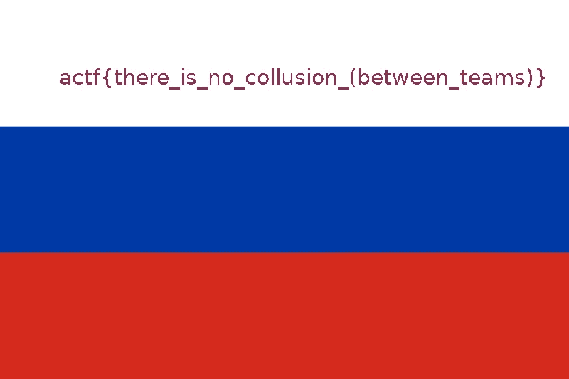
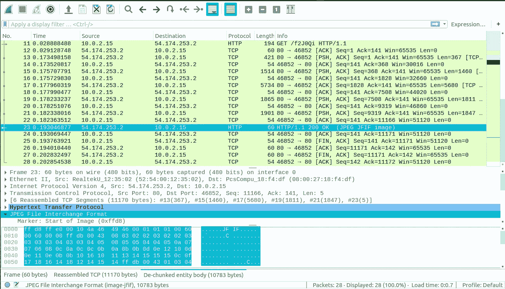
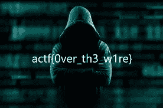
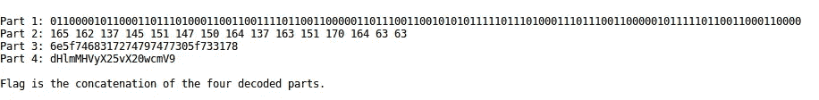
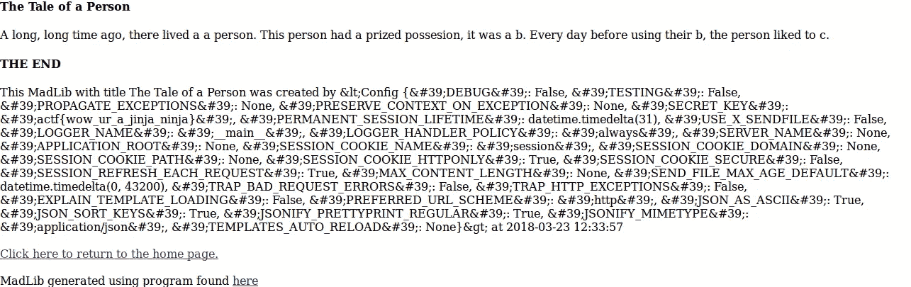
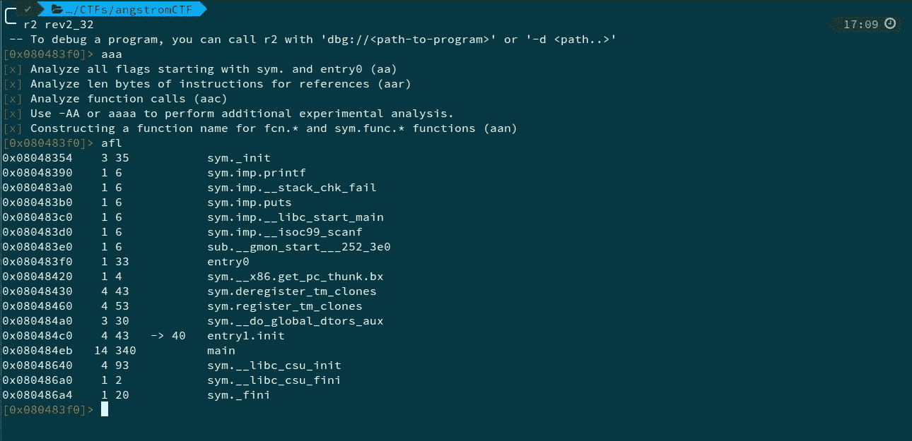
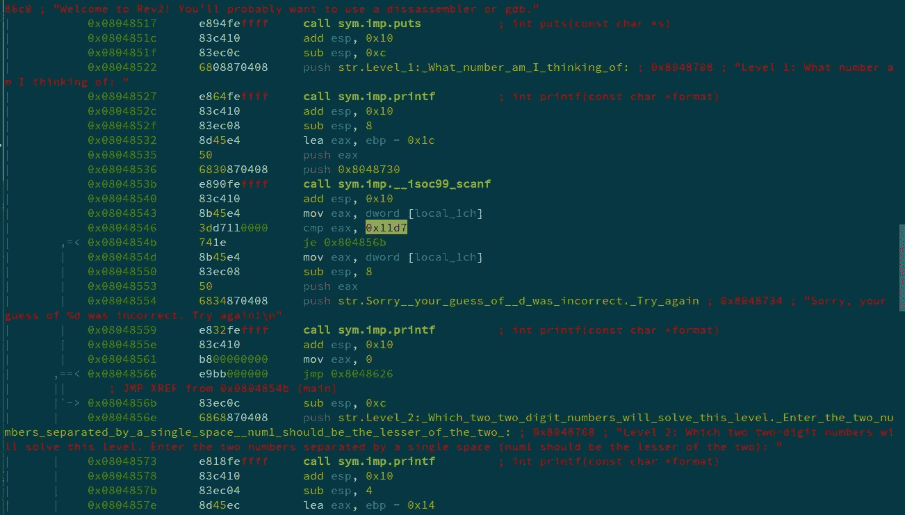
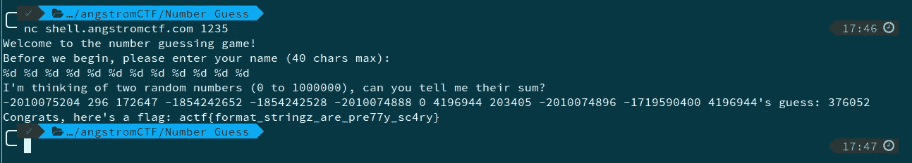
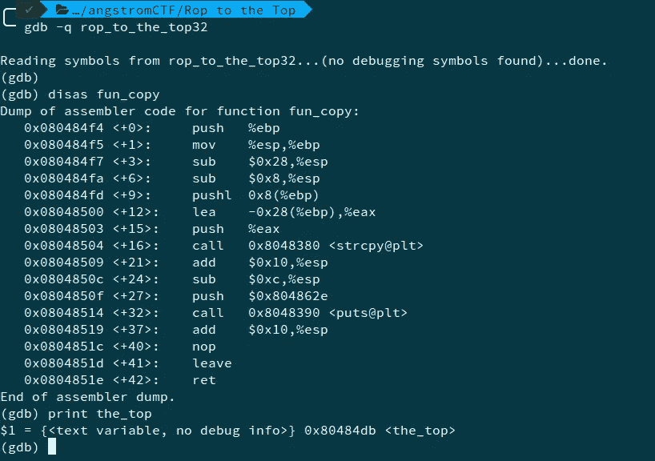

# AngstromCTF 评论

> 原文：<https://infosecwriteups.com/angstromctf-writeups-4e3d51c3dc42?source=collection_archive---------1----------------------->

这些是我在焦虑中解决的问题的记录。

AngstromCTF

# **杂项**

1.  **瓦尔多 1**

我们得到了一个 zip 文件——flags . zip，其中包含各国的国旗。flag5.png 的文件，我们看到阿开亚人有这面旗帜。

旗帜-瓦尔多 1

**2。瓦尔多 2**

在这个问题中，我们在一个文件夹中有多个旗帜图像。从问题来看，好像一个形象不一样。我们看到了几个相同文件的 MD5 hash-**9f6e 902 c 233020026 caf 0 ebb B1 cf 0 ff 5**。所以我们写了下面的脚本-

所以，我们得到的文件名是 waldo339.jpg。对文件运行`strings`，我们得到的标志为—**actf { r3d _ 4nd _ wh1t 3 _ str 1 p3s }**。

**3。那不是我的名字**

我们得到了一个 pdf 文件——gettysburg.pdf，但在试图打开它时，它打不开，给出了不正确的文件格式错误。我们在文件上运行`binwalk`,看到它实际上是一个`docx`文件。我们将扩展名更改为`.docx` anf，打开时我们得到的标志为—**actf { thanks _ Mr _ Lincoln _ but _ who _ even _ uses _ word _ more }**。

**4。文件传输**

捕获

突出显示的数据包显示了 JPEG 图像捕获。我们将 JPEG 导出为字节来获取图像。

标志—文件传输

**5。GIF**

在给定的图像上运行`binwalk`，我们看到它实际上是许多图像的集合。

所以，我们运行命令`binwalk -D 'png image:png' jiggs.gif.png`。在检查提取的文件时，我们看到一个带有标志的图像。

标志 Gif

# 秘密党员

1.  **热身**

从术语 ***精*** 密码中，我们得到暗示，它可能是一个**仿射密码**。我们使用一个在线仿射密码[解算器](https://www.dcode.fr/affine-cipher)来获得标记为— **actf{it_begins}** 。

**2。返回基地-ics**

我们得到了下面的密码文本-

密文

现在我们可以很容易地看到，第一部分是二进制(基数 2)，第三部分是十六进制(基数 16)。使用任何在线转换器对它们进行解码，我们得到

第一部分: **actf{0ne_tw0_f0**

第三部分: **n_th1rtytw0_s1x**

同样从题目来看，我们可以说所有的密码都以 2 的某个幂为基数。我们猜测第二部分可能是基数 8(八进制)。使用在线八进制到文本的转换器，

第二部分: **ur_eight_sixt33**

最后一个看起来像 base64。解密后，我们得到

第四部分:**tyf our _ no _ m0re }**

所以，标志是—**actf { 0ne _ tw0 _ f0ur _ eight _ sixt 33n _ th1rtytw 0 _ S1 xty f0ur _ no _ m0re }**

**3。异或**

这看起来像是 singlebyteXOR 问题。我们使用下面的脚本

在看到所有的纯文本后，我们得到的标志为—**actf { hope _ you _ used _ a _ script }**。

**4。RSA 简介**

这是一个经典的 RSA 问题，我们用下面的脚本来解密

RSA 代码

所以旗是—**actf { RSA _ is _ reallly _ fun！！！！！！}** 。

# 网

1.  **源 Me 1**

在这里，我们看到了一个登录页面。在检查源代码时，我们在注释中找到了密码— **f7s0jkl** 。所以，我们用用户名`admin`和密码`f7s0jkl`登录。

这为我们提供了标志-**actf { source _ aint _ secure }**。

**2。给我接**

最初，我们所有的是一个按钮，只有授权用户才允许通过的消息。单击该按钮时，我们会收到一条消息，提示我们未被授权。然而在地址栏中我们看到 get 参数是`auth=false`。我们将其更改为`auth=true`并按回车键。

然后我们得到标志—**actf { why _ did _ you _ get _ me }**。

**3。续集**

这是 SQL 注入(SQLi)的经典案例。这里的提示是问题的名称，也就是 SQL 的发音。

我们输入用户名和密码作为`'or''='`。

这给了我们一个标志—**actf { SQL _ injection _ more _ like _ prequel _ injection }**。

**4。来源我 2**

我们给出了另一个登录页面。这里也是，用户名是`admin`。在检查源代码时，我们找到了将我们输入的密码转换为 md5 的脚本，并将其与哈希**BDC 87 b 9 c 894 da 5168059 e 00 ebffb 9077**进行比较。我们使用一个[在线 md5 解密器来](http://www.md5online.org/)得到密码为`password1234`。输入这个会给出标志—**actf { MD5 _ hash _ browns _ and _ pasta _ sauce }**。

**5。马德里布斯**

这里，从 Flask 代码中我们看到有一个变量 app.secret_key，它基本上是一个配置变量。因此，我们前往“一个人的故事”部分，输入`{{config}}`作为作者姓名，并在其他选项中输入任意随机字符串。

这里我们看到分配给标志**的 SECRET_KEY 变量，actf{wow_ur_a_jinja_ninja}**

# 倒车(再)

1.  **版本 1**

首先，我们在给定的 ELF 可执行文件上运行`strings`。我们看到了字符串， **s3cret_pa55word** 。这可能是程序正在寻找的秘密密码。在运行可执行文件并给出上面的字符串作为键时，我们得到了标志。这将在 shell 服务器上完成。

**2。版本 2**

ELF 在执行时要求猜测一个数字。我们用 radare2 反汇编代码。

突出显示的十六进制，0x11d7 是十进制的 **4567** 。输入后，程序会要求我们给出两个两位数的数字。我们再次分析反汇编代码。

这告诉我们两个数的乘积应该是 0xd67，即 **3431** 。从[这个环节，](http://www.mathwarehouse.com/arithmetic/numbers/prime-number/prime-factorization.php?number=3431)我们发现数字是 **47** 和 **73** 。我们按升序排列，即 47，然后是 73。

我们得到的标志为— **actf{4567_47_73}** 。

# 二进制的

1.  **蓄能器**

这里的想法是不断地将整数加到变量上，而不需要显式地输入负值，我们必须使结果为负。这可以通过整数溢出来实现。

在 shell 服务器上运行这些输入会给我们一个标志。

**2。饼干罐**

这是一个缓冲区溢出问题。虽然我们从来没有明确地给 numCookie 赋值，但是我们可以溢出缓冲区，让它得到一个值。我把下面的输入——aaaaaaaaaaaaaaaaaaaaaaaaaaaaaaaaaaaaaaaaaaaaaaaaaaaaaaaaaaaaaaaaaaaaaaaaaaaaaaaaaaaaaaaa99999998 发送给程序，我们得到了这个标志。

标志是—**actf { eat _ cookies _ get _ buffer }**。

**3。数字猜测**

我们借助于所给的暗示。printf 函数最常见的漏洞是使用(或不使用)格式字符串。

在代码中，就在`printf(buf)`之前，两个随机整数被初始化。所以，当我们被询问姓名时，如果我们给出以下输入，**% d % d % d % d % d % d % d % d % d % d % d % d % d % d**。这将为我们提供堆栈中的其他数字。运行时，我们将第 3 个和第 9 个值作为 rand1 和 rand2。我们将它们相加，给出结果作为我们的猜测。

所以标志是-**actf { format _ string z _ are _ pre 77y _ sc4ry }**。

**4。Rop 到顶部**

这是一个面向返回的编程(ROP)漏洞的例子，它基本上是访问不可执行堆栈的缓冲区溢出。为了利用它，我们可以使用下面的命令集-

我们发现 _top 函数的地址**是 **0x8048db** 。缓冲区大小也是 **0x28** 。**

所以，下面的命令对我们有用-

**。/ROP _ to _ the _ top 32 " $(python-c ' print " A " * 0x 28+" BBBB "+" \ xdb \ x84 \ x04 \ x08 " ')"**

我们输入字符“A”来填充缓冲区的大小，输入“BBBB”来替换当前的堆栈指针(%ebx)，后跟我们希望指向的地址，这里是函数**_ top**的地址。

在 shell 服务器上运行上面的命令会给我们一个标志。

*想了解更多文章，可以关注我的*[*Github*](https://github.com/wr47h)*。*