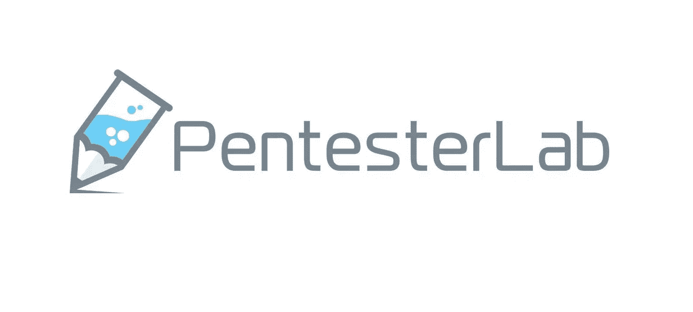

# 宣布 Pentester Lab Pro 订阅赠品的获奖者—2020 年 11 月

> 原文：<https://infosecwriteups.com/announcing-the-winners-of-pentester-lab-pro-subscription-giveaway-november-2020-2141fbefa873?source=collection_archive---------1----------------------->

## 一场激动人心的新比赛将持续到 2020 年 12 月

[https://pentesterlab.com/](https://pentesterlab.com/)

大家好！

这是多么美好的一个月啊。最后，我们与 PentesterLab 合作举办的比赛中有三位获胜者。

获胜者是(鼓声):

1.  [Pedro Oliveira](https://medium.com/u/a659a81fff46?source=post_page-----2141fbefa873--------------------------------)for—[**Firefox:一个网站如何能窃取你所有的 cookie**](https://medium.com/bugbountywriteup/firefox-and-how-a-website-could-steal-all-of-your-cookies-581fe4648e8d)**基于最高的浏览量。**
2.  **[குகன்ராஜா的古汉·拉贾](https://medium.com/u/724a50acc7aa?source=post_page-----2141fbefa873--------------------------------)对于 [**我是如何发现 Facebook Messenger 泄露百万用户访问令牌**](https://medium.com/bugbountywriteup/how-i-found-the-facebook-messenger-leaking-access-token-of-million-users-8ee4b3f1e5e3)**——**基于最高鼓掌数。**
3.  **[Neha Tariq](https://medium.com/u/78688de1686b?source=post_page-----2141fbefa873--------------------------------) 为 [**攻击 JSON 的 Web 令牌【JWTs】**](https://medium.com/bugbountywriteup/attacking-json-web-tokens-jwts-d1d51a1e17cb)**—**基于最高阅读量。**

**获胜者将获得**为期 1 个月的 PentesterLab Pro Lab 优惠券，**使用优惠券，他们可以访问所有的 Pro 实验室，并了解从基本错误到高级漏洞的一切。**

**获奖者请在此留下评论，我们会与您联系。你也可以通过[我们的不和谐服务器](https://medium.com/bugbountywriteup/new-discord-channel-for-infosec-enthusiasts-3d7ff11abb55?source=post_page-----4a902a4097ca--------------------------------)联系我们的编辑[赛克里希纳·科塔帕里](https://medium.com/u/be0f09f27ea3?source=post_page-----ffce7746e4d4--------------------------------)。我们也会在这些文章上留下个人的笔记。**

**对于所有这次没有成功的人，我们也将在 11 月举办这个比赛。任何在 Infosec 上发表的文章都有资格参与。要参加竞赛，您应该:**

1.  **成为 [Infosec 报道](https://medium.com/bugbountywriteup)的撰稿人**
2.  **在 [PentesterLab](https://pentesterlab.com/) 拥有账户**
3.  **在推特上关注[的信息安全报道](https://twitter.com/InfoSecComm)和[的 PentesterLab](https://twitter.com/pentesterlab?lang=en)**
4.  **从 2020 年 12 月 1 日至 25 日提交一篇高质量的文章(仅限未发表的草稿)。**

**获奖者将根据**掌声、观点、文章质量和所讨论技术的新颖性等**来决定。将有**三名获奖者。****

**来自世界各地的任何人都可以参加。年龄、职业等都不重要。**

# **注意事项:**

*   **在它的一生中，不应该在中等收费墙后面写文章。这意味着即使没有中级会员资格，每个人都可以访问它。**
*   **这篇文章不应该从 InfoSec 的文章中删除(如果删除，作者下次将被取消资格)**

**这都是我们这边的。我们迫不及待地想看看你能写出什么样的精彩文章。**

**继续黑，继续写，继续牛逼。**

**问候，**

**[Sai](https://medium.com/u/be0f09f27ea3?source=post_page-----4a902a4097ca--------------------------------) 和 [Anangsha](https://medium.com/u/6e2475a6e38a?source=post_page-----4a902a4097ca--------------------------------) 和
编辑， [InfoSec 报道](https://medium.com/bugbountywriteup)**