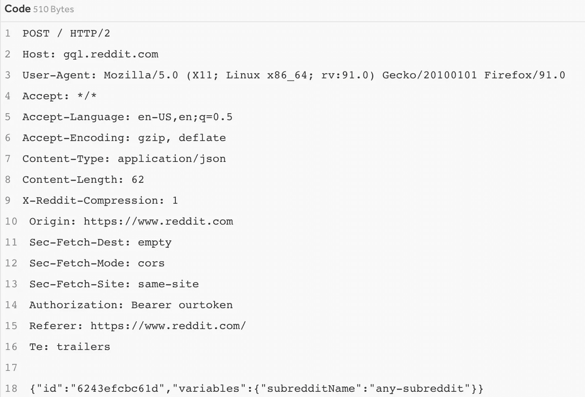

# 另一天，另一个 IDOR 漏洞——5000 美元 Reddit Bug 赏金

> 原文：<https://infosecwriteups.com/another-day-another-idor-vulnerability-5000-reddit-bug-bounty-22a75003d999?source=collection_archive---------0----------------------->

## 获得对 Reddit 版主日志的非特权访问


Susan Q Yin 在 [Unsplash](https://unsplash.com/search/photos/typing?utm_source=unsplash&utm_medium=referral&utm_content=creditCopyText) 上拍摄的照片

开始了。*又是*。

IDOR，或不安全的直接对象引用，是一种常见但不安全的引用对象的实践。对于“不安全”，这仅仅意味着很容易找出对象如何命名的模式。例如，IDORs 的典型情况是数字 id 加 1，比如这个系统的前三个用户 id 是`user_10001`、`user_10002`和`user_10003`。如果有 5000 个用户，我们可以假设有一个`user_12352`和一个`user_14999`。我们可能不知道这些随机用户到底是谁，但我们现在已经知道如何以可预测的方式直接引用对象。

它本身不会导致漏洞，但是它允许攻击者获得关于应用程序如何运行和引用它自己的对象的有价值的洞察力。这成为应用程序的弱点，因为任何忘记检查授权的端点都很容易被滥用。找到这些目标并不特别复杂，也不需要花费太多精力去攻击。以前针对这种漏洞类型的漏洞奖励包括 GitLa 的 20，000 美元漏洞奖励和 Shopify 的 2500 美元漏洞奖励。

我将看到最近披露的一个 IDOR HackerOne 用户`high_ping_ninja`在 Reddit 端点上获得了 5000 美元的 bug 奖金。

# 利用


由 [CHUTTERSNAP](https://unsplash.com/@chuttersnap?utm_source=medium&utm_medium=referral) 在 [Unsplash](https://unsplash.com?utm_source=medium&utm_medium=referral) 上拍摄

我将回顾一下 HackerOne 用户`high_ping_ninja`在社交媒体网站 Reddit 上发现的一个最近披露并修复的错误。最初的报告可以在 H1 找到[，所有的功劳归于`high_ping_ninja`找到这个 bug。](https://hackerone.com/reports/1658418)

在 Reddit 中，社区可以在 subredditss 上聚集和联系，subreddit 是一个独立的论坛，有自己的一套允许内容的准则。子编辑通常由版主巡视，版主作为管理员确保子编辑的所有成员都遵守他们的指导方针。他们可以根据自己的判断采取行动，如禁止成员或删除帖子和消息。所有“仲裁者”行为都存储在每个子编辑的[审核日志](https://mods.reddithelp.com/hc/en-us/articles/360022402312-Moderation-Log)中。

`high_ping_ninja`发现获取 mod 日志的请求没有检查请求值的用户是否确实是特定子编辑的版主。这基本上意味着任何帐户都可以访问敏感信息和任何**子编辑的其他版主操作。通过发送以下 POST 请求，用户可以通过更改子编辑的名称来访问任何 mod 日志。**



来自 [HackerOne](https://hackerone.com/reports/1658418) 的 high_ping_ninja 的原始 PoC 发布请求

对这个请求的响应[有一些更细微的差别，你可以在这里读到](https://hackerone.com/reports/1658418)，但是基本上，它成功地返回了版主日志。这不是一个数字的 IDOR，而是 IDOR 只是 API 通过名称引用子编辑的事实。由于知道了 subreddit 的名称，您也就知道 reddit 后端如何将它作为一个对象来引用。

根据 Reddit 工作人员`goku_reddit`的推理，这被授予了 5000 美元的高严重性级别的 bug 奖金:

> 能够将任意用户指定为现有子编辑的版主，或者在没有适当权限的情况下执行版主操作。(来源:[哈克松](https://hackerone.com/reports/1658418))

bug 不一定要复杂才有巨大价值！

```
**Want to Connect?**Please consider contacting me at roberto.cyberkid@gmail.com following me on Medium, [buying me a coffee](https://www.buymeacoffee.com/robertocyberkid), following me on [twitter](https://twitter.com/CyberKidLama), or connecting with me on [LinkedIn](https://www.linkedin.com/in/roberto-lama-9a126a123/)!
```

来自 Infosec 的报道:Infosec 上每天都会出现很多难以跟上的内容。 [***加入我们的每周简讯***](https://weekly.infosecwriteups.com/) *以 5 篇文章、4 个线程、3 个视频、2 个 Github Repos 和工具以及 1 个工作提醒的形式免费获取所有最新的 Infosec 趋势！*