# 防逆转技术(一)

> 原文：<https://infosecwriteups.com/anti-reversing-techniques-part-1-3200db42f1e3?source=collection_archive---------0----------------------->

## 介绍

防逆转技术对于保护您的代码非常有用，特别是如果您的业务依赖于该代码，或者无论出于什么原因您可能必须保护它不被逆转或破解，但在其他情况下，恶意软件作者往往会使用防逆转技术来使分析恶意软件或逆转它的过程更加困难。本文中提到的技术并不是唯一使用的技术，它也可以从非常简单的调用 Windows API 到复杂的技术，如编写 VM 混淆器来隐藏代码流，在这一系列文章中，我们将重点关注 Windows x86 二进制文件。

让我们开始吧…

# 调试器检测

恶意软件分析师和逆向工程师使用的主要工具之一是调试器，那么什么是调试器呢？

调试器是一种用于测试和控制其他软件的软件，换句话说，它让你看到正在发生的事情，比如在一个点上停止软件的执行，查看堆栈和寄存器等...。

恶意软件作者在恶意软件中倾向于做的是检测它是否在调试器下，最简单的反调试技术之一是:

## **IsDebuggerPresent():**

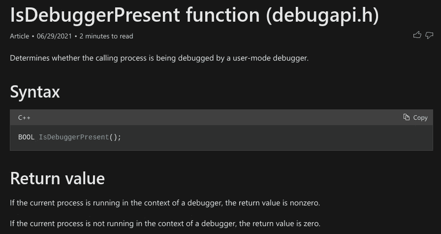

[https://docs . Microsoft . com/en-us/windows/win32/API/debug API/nf-debug API-isdebuggerpresent](https://docs.microsoft.com/en-us/windows/win32/api/debugapi/nf-debugapi-isdebuggerpresent)

从函数名来看，它显然是检查调用进程是否被调试，要使用这个函数，我们不需要任何参数:

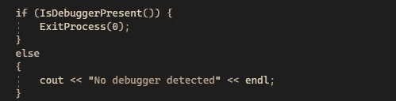

密码

如果我们在没有调试器的情况下运行可执行文件，它将继续显示消息“未检测到调试器”:

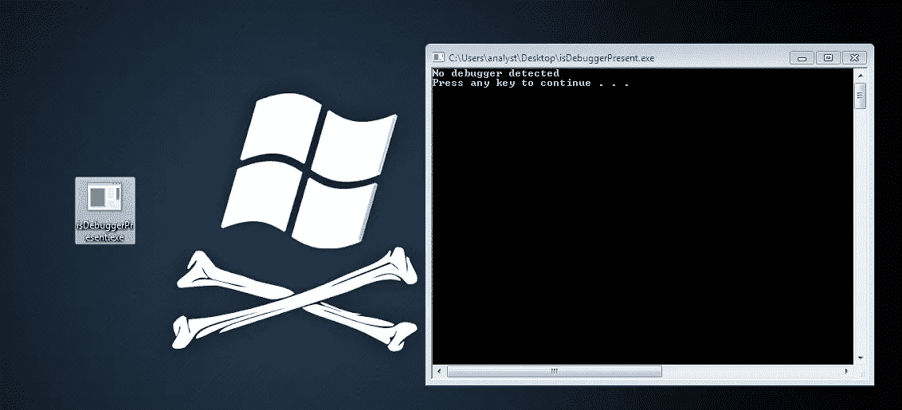

但是在调试器下，它将检测到它正在被调试，并继续执行 ExitProcess()函数并终止——顺便说一下，不是任何调试检测都会导致软件终止，恶意软件作者可以改变工作流程来欺骗分析师:

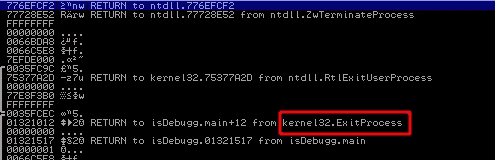

那么检测是怎么发生的！？要回答这个问题，我们首先需要了解什么是(TEB)和(PEB):

*   **线程环境块(TEB):** 是一个数据结构，存储进程中当前运行线程的信息，每个线程都有自己的 TEB 结构，在 Win32 环境中 **FS** 寄存器总是指向 TEB，而在 Win64 环境中是 **GS** 寄存器。
*   **流程环境块(PEB):**PEB 是一个包含流程相关数据的结构，当查看 **TEB** 时，我们会发现一个指向 **PEB** 结构的指针。

关于这个话题的更多信息，这篇博客文章值得一读:

[进程环境块剖析(PEB) (Windows 内部)](https://ntopcode.wordpress.com/2018/02/26/anatomy-of-the-process-environment-block-peb-windows-internals/)

[https://docs . Microsoft . com/en-us/windows/win32/API/winternl/ns-winternl-teb](https://docs.microsoft.com/en-us/windows/win32/api/winternl/ns-winternl-teb)

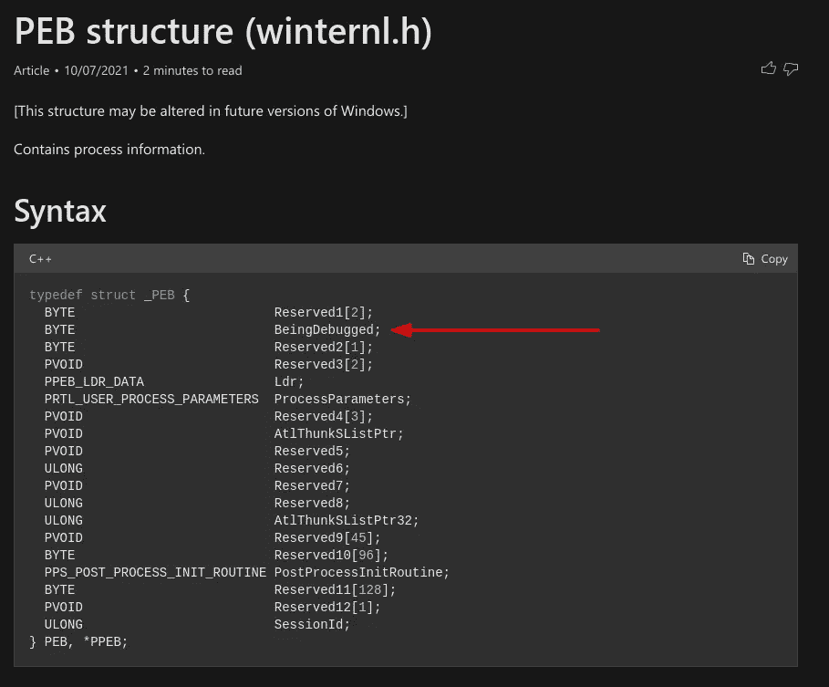

[https://docs . Microsoft . com/en-us/windows/win32/API/winternl/ns-winternl-peb](https://docs.microsoft.com/en-us/windows/win32/api/winternl/ns-winternl-peb)

从 **PEB** 结构中我们可以看到，第二个字节是正在调试的**成员**，这是函数 **IsDebuggerPresent** 检查的，以确定进程是否正在调试中。如果是，则值为 1，否则为 0。如果我们跟踪对函数 **IsDebuggerPresent** 的调用，我们会发现:

*   第 1 行:将 **TEB** 结构的地址移动到 **eax** 寄存器中。
*   第二行:将 **PEB** 结构的地址移动到 **eax** 寄存器，即 **TEB** 地址+ 30 = **PEB** 地址。
*   第 3 行:将正在调试的**成员值移动到 **eax** 寄存器。**
*   第 4 行:返回要测试的 eax 值。

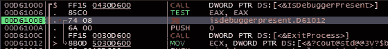

测试完寄存器 **eax** 后，根据结果，我们将进入**退出进程**或跳转并继续执行软件。现在，为了绕过这种反调试技术，我们在返回后将 **eax** 寄存器的值从 **0x1** 更改为 **0x0** ，或者我们可以更改 **PEB** 结构中被调试的**成员的值，这是最好的方法， 我们可以转到**内存映射**并寻找 **PEB** 的地址，即 **7EFDE000** 并右键单击，然后**跟随转储，**或者在软件的入口点，您总是会发现 **ebx** 寄存器指向 **PEB** 结构，也**跟随转储，**之后我们右键单击值>二进制**

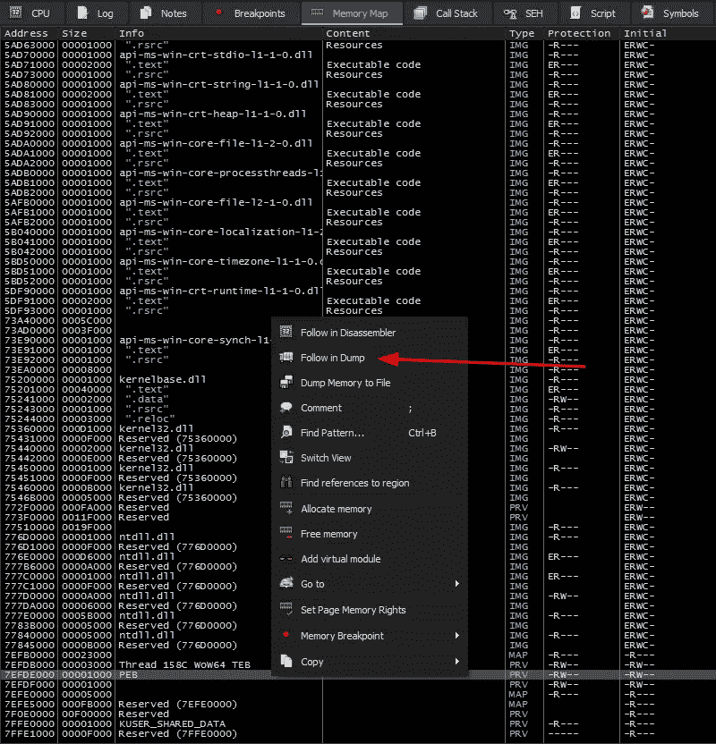

x64dbg:跟随 PEB 转储

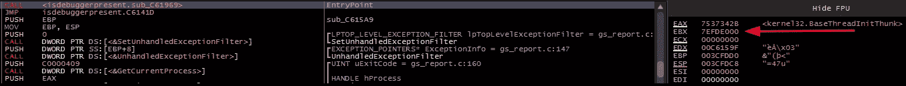

入口点的 x64dbg: ebx 寄存器

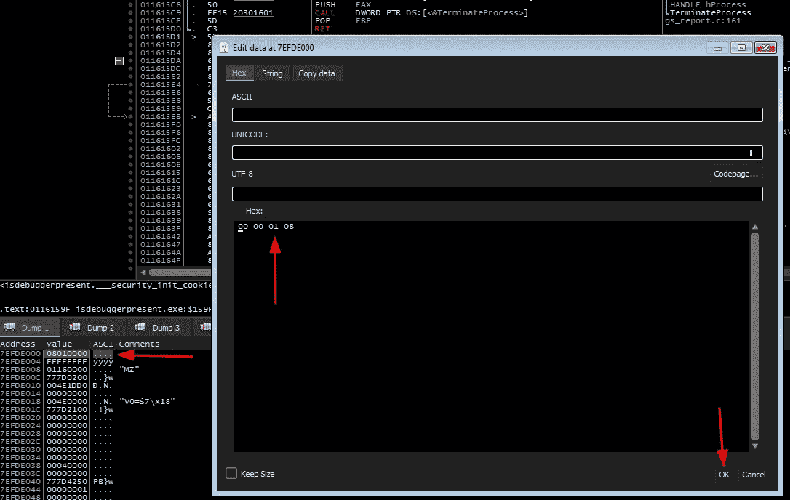

x64dbg:编辑被调试成员的值

但是调用 **IsDebuggerPresent** API 对于分析师来说是非常明显的，这就是为什么有时恶意软件作者会手动进行这种检查，例如:

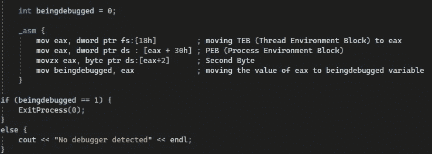

密码

在调试器下，我们的代码看起来像这样:

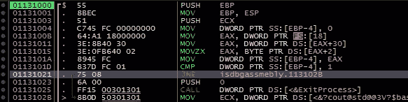

这里也使用了相同的旁路技术。

## **NtGlobalFlag:**

在 win32 环境中，PEB 结构在(偏移量 x68)处有一个名为 NtGlobalFlag 的成员或字段，如果正在调试进程，则该进程将具有值 **0x70** 和 **0x0** ，否则将具有值【】0x0 。

要绕过这种反调试技术，您必须像过去的技术一样将值更改为 **0x0** :

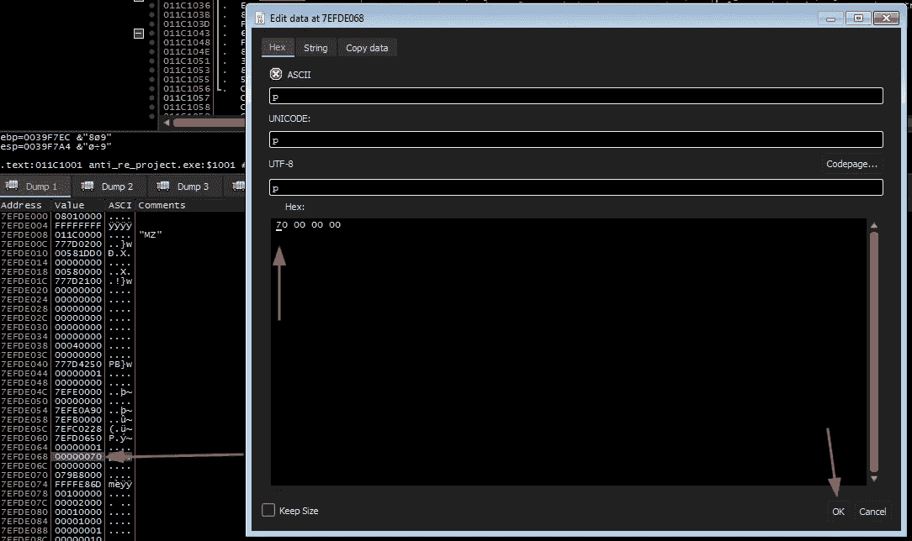

x64dbg:编辑 NtGlobalFlag 成员的值

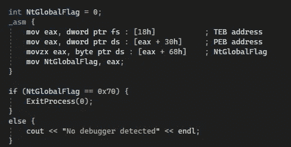

检查 NtGlobalFlag 的实现

**注意**:当调试器附加到进程时，该成员的值不变

## **checkremotebuggerpresent:**

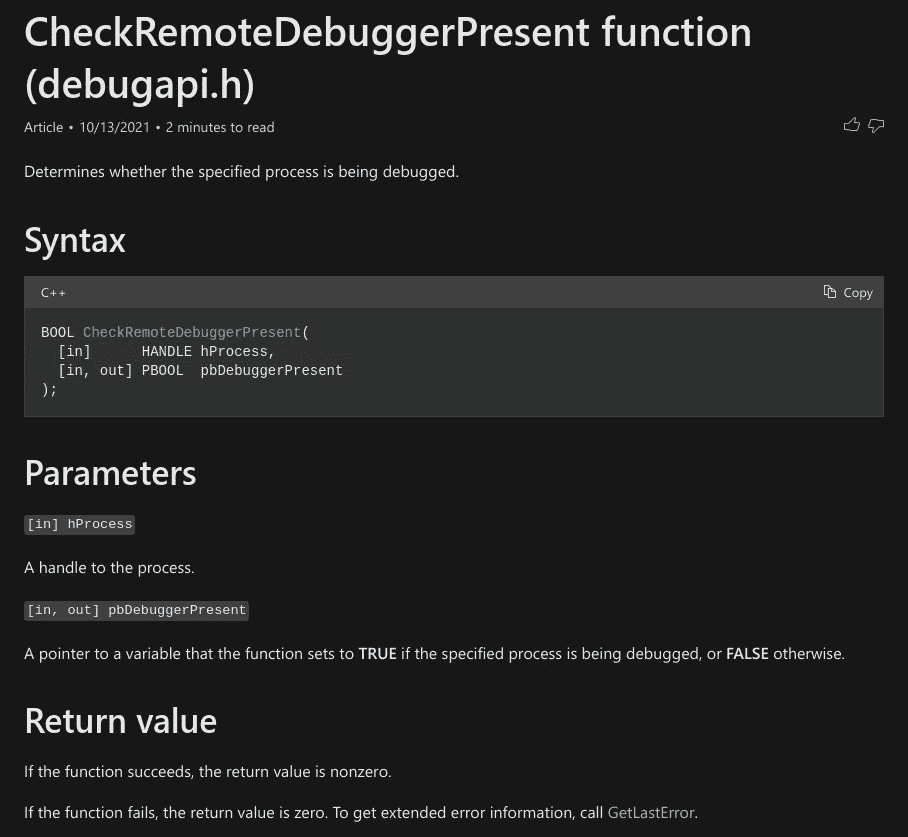

该函数检查该进程是否正在被另一个进程调试，它有两个参数，如上图所示，重要的是它是**ZwQueryInformationProcess**的包装器:

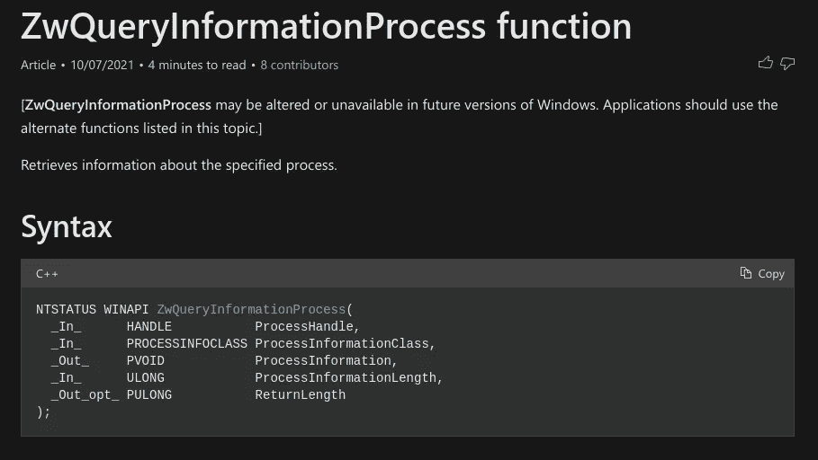

一个许可证告诉[https://docs . Microsoft . com/en-us/windows/win32/proc thread/zwqueryinformationprocess](https://docs.microsoft.com/en-us/windows/win32/procthread/zwqueryinformationprocess)

该函数将通过指定 **ProcessDebugPort** 的第二个参数来检索关于进程是否在调试器下的信息:

[https://docs . Microsoft . com/en-us/windows/win32/proc thread/zwqueryinformationprocess](https://docs.microsoft.com/en-us/windows/win32/procthread/zwqueryinformationprocess)

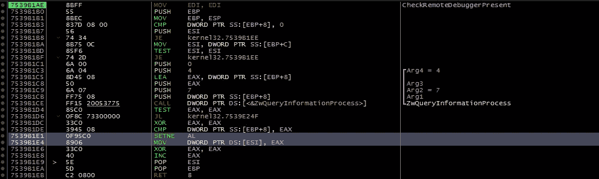

x64dbg:在 CheckRemoteDebuggerPresent 函数内部

如上图所示，传递给**ZwQueryInformationProcess**的第二个参数是 7，它将检索关于进程的信息，看它是否在调试器下。为了绕过该技术，我们需要 **NOP** 上图中突出显示的两条指令，原因是 **eax** 寄存器将被设置为 1，指令 **SETNE** -如果零标志被清除，则将操作数中的字节设置为 1，否则将操作数设置为 0 -然后将 **eax** 中的值移动到 **ESI** 寄存器在从该例程返回后指向要比较的位置:

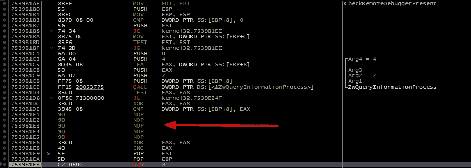

x64dbg:在 CheckRemoteDebuggerPresent 函数内部

从例程返回后，我们看到值 0 与 **ESP** 指向的位置之间的比较，在右下角出现了 **NOP** 后的值，指令是 **0** ，正常情况下是 **1，**，所以在继续执行后，我们将得到消息“未检测到调试器”:

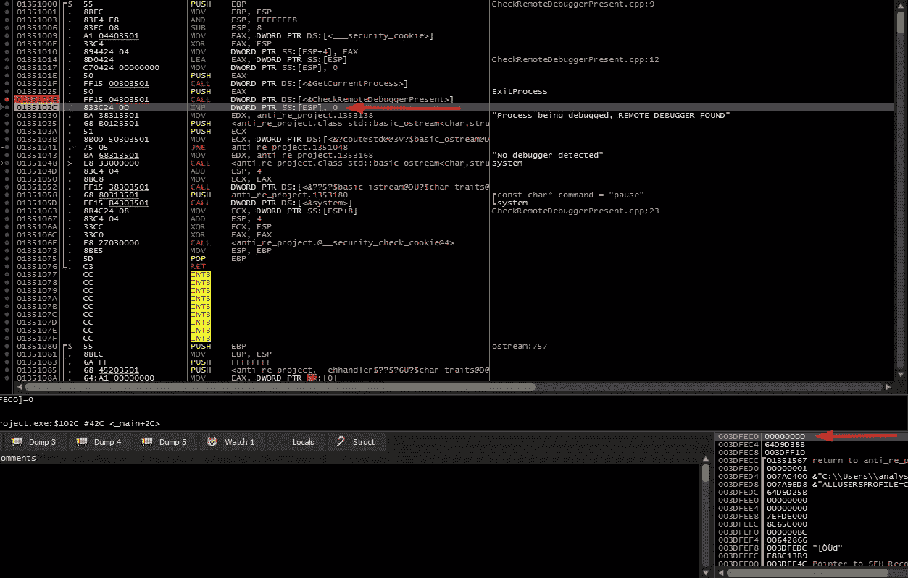

x64dbg:比较从 CheckRemoteDebuggerPresent 返回后的结果

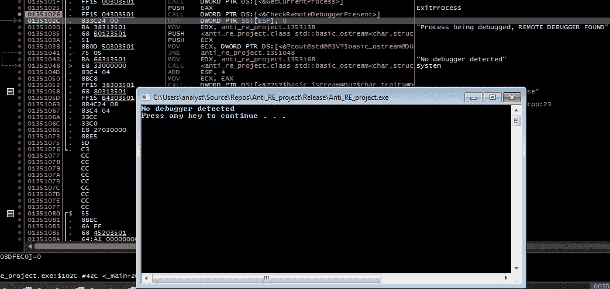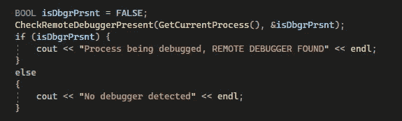

感谢您的阅读，并希望它是有益的，尽快看到你(第二部分)🙂。

## 来自 Infosec 的报道:Infosec 每天都有很多内容，很难跟上。[加入我们的每周简讯](https://weekly.infosecwriteups.com/)以 5 篇文章、4 个线程、3 个视频、2 个 Github Repos 和工具以及 1 个工作提醒的形式免费获取所有最新的 Infosec 趋势！