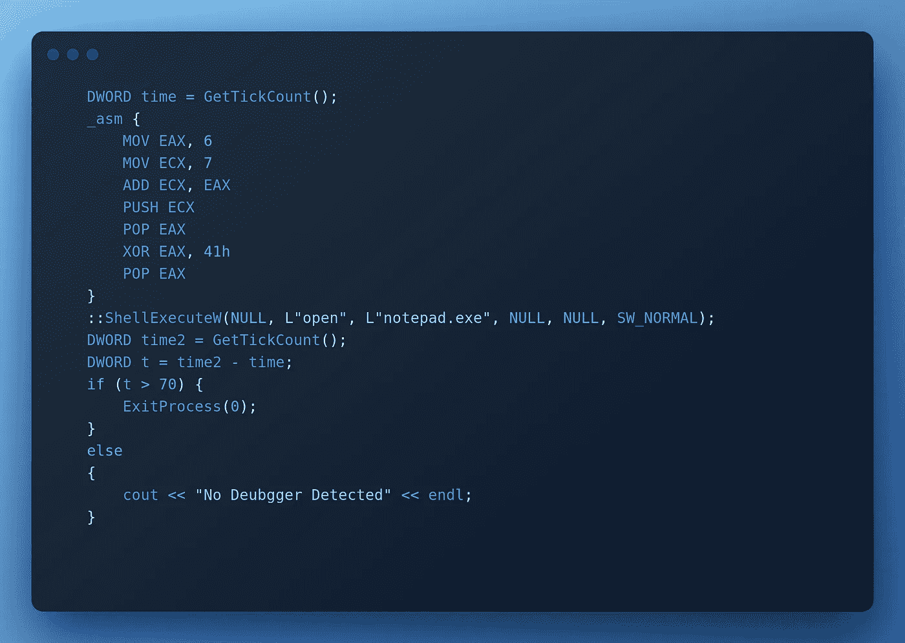
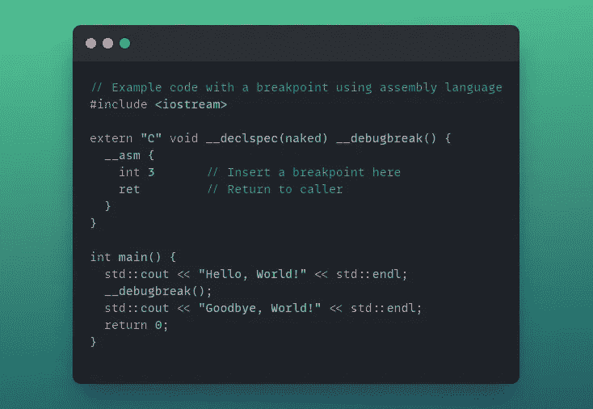
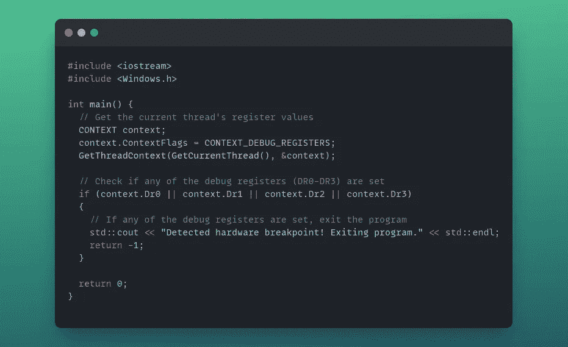
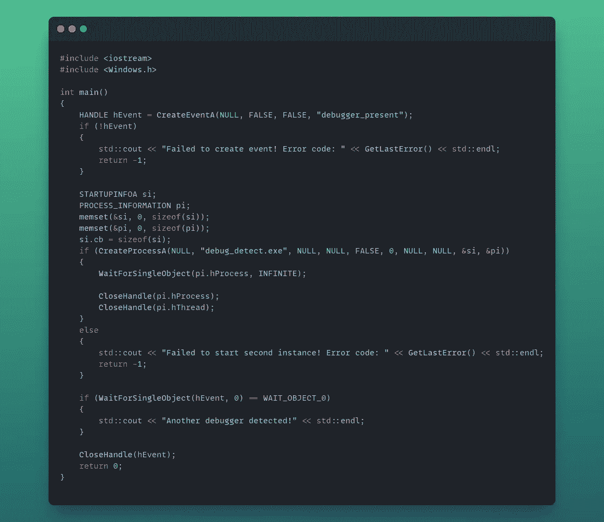
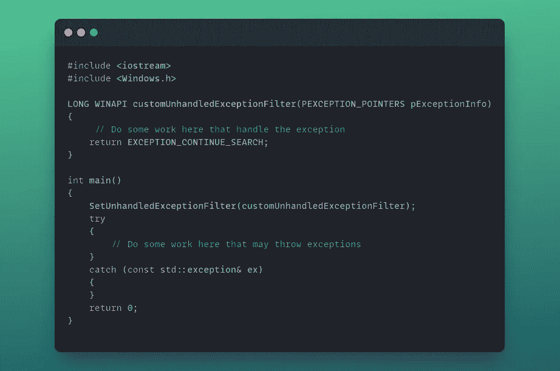

# 防逆转技术(二)

> 原文：<https://infosecwriteups.com/anti-reversing-techniques-part-2-bd5e0d3cd7aa?source=collection_archive---------6----------------------->

在第一部分中，我们讨论了恶意软件作者用来保护他们的应用程序免受逆向工程的一些常用技术。在第二部分中，我们将会看到更多用于检测和防止逆向工程的方法和技术。

## 调试器检测:

## **代码执行计时技术:**

当使用调试器分析可执行文件时，有时我们使用单步执行来遍历一些汇编指令，执行的时间会比正常执行长得多，让我们以这段代码为例:

在代码的开头，我们有一个对“ **GetTickCount** ”函数的调用，该函数返回自系统启动以来经过的毫秒数。根据我在机器上的测量，执行“ **ShellExecuteW** ”函数之前的代码需要 30 到 47 毫秒。之后我们再次调用" **GetTickCount** "函数来获取时间，然后获取两个调用值之间的差值，如果超过 70 毫秒则退出进程，否则打印消息。

还有其他 Windows APIs 可用于获取时间，例如:

*   GetLocalTime()。
*   GetSystemTime()。
*   QueryPerformanceCounter()。

## 软件断点:

软件断点是一种常见的反调试技术，被恶意行为者用来增加对他们的恶意软件进行逆向工程的难度。这种技术包括在程序的特定位置插入特定的代码指令，称为断点。当程序执行时，断点会导致程序停止运行，使得调试器很难分析程序的行为。

使用汇编语言实现断点的一种方法是使用`int 3`指令。这个指令是一个软件中断，它导致程序停止运行，并将控制权转移给调试器。下面是一个如何在 C++中使用`int 3`指令的例子:

## 硬件断点:

硬件断点是一种反调试技术，它使用 CPU 的专用硬件功能来检测和防止程序调试。这项技术包括在特定的内存地址或寄存器上设置断点，然后指示 CPU 在程序访问或修改指定的地址或寄存器时触发中断。

下面是如何检查是否设置了硬件断点的示例:

"检查硬件断点"

任何调试寄存器中的非零值都可能表示该进程正在设置了硬件断点的调试器下运行。

## 自调试:

是恶意软件作者使用的一种技术，用于防止调试器附加到进程或检查进程是否在调试器下。它包括使用调试器来调试程序本身，以便检测和防止其他调试器附加到程序上。

下面是一个实例示例，它创建流程的第二个实例，并创建一个名为“debugger_present”的命名事件。进程的第二个实例将尝试将调试器附加到父进程，如果失败，它将设置事件，该事件将向父进程指示另一个调试器已附加到它:

父进程

子进程

## UnhandledExceptionFilter()

如果程序遇到任何已注册的异常处理程序都无法处理的异常，则 kernel32！将调用 UnhandledExceptionFilter()函数。可以使用 **kernel32 注册一个定制的未处理异常过滤器！SetUnhandledExceptionFilter()。**但是，如果正在调试程序，则不会调用自定义过滤器，而是将异常传递给调试器。因此，如果将控制传递给未处理的异常筛选器，则可以推断程序没有在调试器下运行:

谢谢你花时间阅读这篇文章，直到下次。

## 来自 Infosec 的报道:Infosec 每天都有很多内容，很难跟上。[加入我们的每周简讯](https://weekly.infosecwriteups.com/)以 5 篇文章、4 个线程、3 个视频、2 个 GitHub Repos 和工具以及 1 个工作提醒的形式免费获取所有最新的 Infosec 趋势！