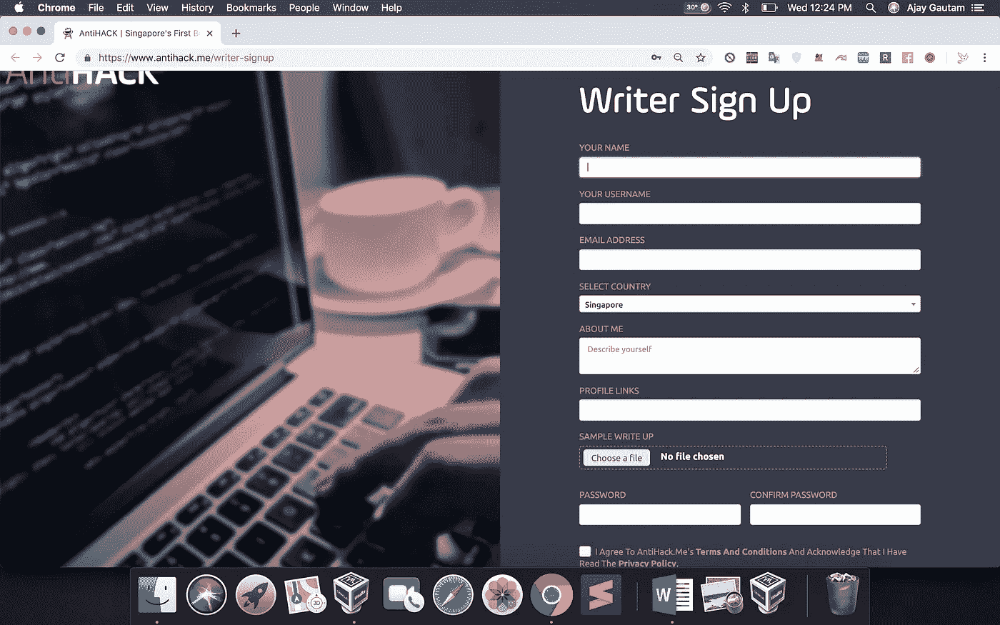
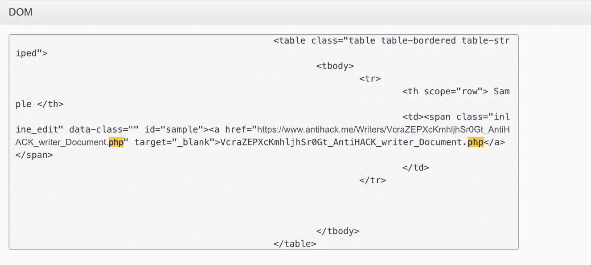

# Antihack.me 盲 XSS 到 PHP 文件上传漏洞

> 原文：<https://infosecwriteups.com/antihack-me-blind-xss-to-php-file-upload-vulnerability-f29cf8b24ccb?source=collection_archive---------1----------------------->

嘿，谢谢你再次来到这里😃。如果你还没有读过我之前的 facebook bug，那就点击这里*，它真的很棒。今天我将分享我在 antihack.me 的一个很酷的发现。*

*什么是盲人 XSS？*

*这是一种存储 XSS，攻击者的输入保存在服务器的某个地方，但可能不会在用户添加有效负载的用户仪表板中执行，也可能在其他地方执行，但也可能在管理面板中执行。*

*漏洞描述:*

*我在 antihack 博客上挖掘，发现了一个从[这里](https://www.antihack.me/writer-signup)注册成为作家的端点。页面是这样的*

**

*Antihack.me 博客作者注册*

*我注册了一个用户，但它应该由管理员批准。看到这个之后，我简单地想到了通过添加一个 XSS·亨特的有效载荷来创建一个新账户(想想 XSS 是否会在管理面板中被执行)😝)提取执行点的 DOM、执行点的截图、带有浏览器细节的 IP 地址和 Cookie👌。*

**思考:当管理员打开他的帐户时，我们在注册帐户时输入的恶意 JS 代码将被存储在管理面板中，当管理员打开他的帐户时，他/她将成为 JS 注入的受害者。**

*一个小时后，我收到一封邮件，说我的 XSS 有效载荷在 antihack.me 管理面板上被发射了，我很高兴看到这一点。因此，我检查了管理员的所有细节，主要是 DOM，同时我看到了我上传的文件的 url，因为这是必要的。*

*当我上传了一张图片，我无法获得文件的网址，但通过盲人 XSS，我能够看到并打开文件的位置。因此，在注册时，我很快上传了一个 php 文件，在“关于我”栏中用 XSS·亨特的有效载荷写了一篇文章。*

*几个小时后，我又收到一封邮件，说我的 XSS 有效载荷被解雇了，在 DOM 我收到了这个😝*

**

*PHP 代码文件位置*

*看了之后。php 文件网址，我在 rush 中打开网址，php 文件成功上传。因此，我们也可以执行操作系统命令。我报告了这两个漏洞，他们尽快修补了问题。*

*继续访问 SayCure 的博客，我的新发现也会在这里发表。*

*联系我:*

*ajay@nassec.io*

*[https://n](https://saycure.io/evilboyajay) assec.io*