# Apache 示例 Servlet 导致$$$$

> 原文：<https://infosecwriteups.com/apache-example-servlet-leads-to-61a2720cac20?source=collection_archive---------0----------------------->

嘿，朋友们，希望你们在隔离期间一切都好！我已经很久没有写博客了。

所以，最近我发现了一个有趣的漏洞，想和大家分享一下！

但是首先，让我们了解一下什么是 Apache 示例！

Apache Tomcat 示例是默认 Tomcat 安装页面的一部分，当您第一次安装应用程序时，该页面就会出现。为了安全起见，建议尽快删除此页面。

路径:site.com/examples

或者 site.com/tomcat-dir/examples

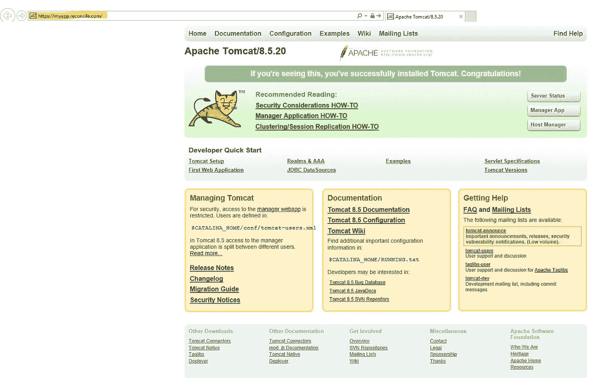

首先，我想引用 Rapid7 的另一篇博文:

 [## Apache Tomcat 示例脚本信息泄漏

### 描述以下是 Apache Tomcat v4.x - v7.x 附带的示例脚本，攻击者可以利用这些脚本获得…

www.rapid7.com](https://www.rapid7.com/db/vulnerabilities/apache-tomcat-example-leaks) 

这有一个潜在易受 XSS 问题攻击的页面列表。虽然我没有这么幸运:/

我:)

无论如何，有 3 个 servlets 可用:

*   Servlet 示例
*   JSP 示例
*   Websocket 示例

首先，我去找 Websocket 的例子。

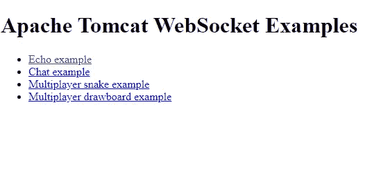

有一个如下所述的功能，允许连接到外部 WSS(WebSocket)服务器，并可能在这里显示消息。但是由于这是在一个隐蔽的子域上，远离主应用程序，CSWSH(跨站点 Websocket 劫持)在这里不会有太大的影响。尽管如此，这里还是启动了一个外部连接(可以通过连接到您自己的 WSS 服务器来利用)

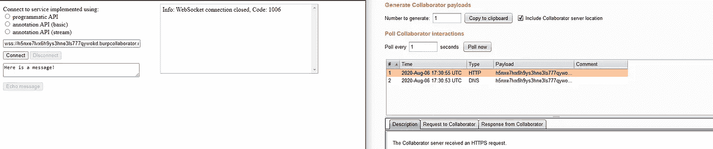

我和 hakluke 简单聊了一下影响，他也说了同样的话，用他的一些问题消除了我的疑虑，并分享了他在:D 的一些宝贵经验。

继续前进。我查看了 JSP Servlet，想找到 XSS 之外的东西

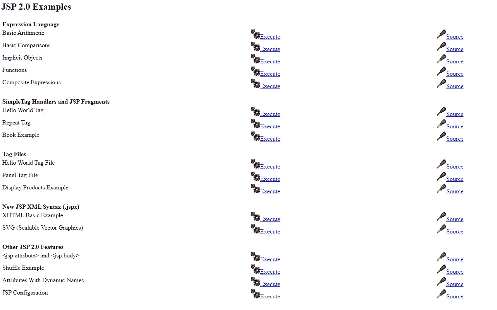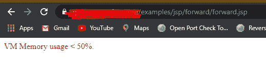

:)

嗯 mpph！有趣，但没有这么有影响力。这个 JSP Servlet 中很可能存在漏洞，但是我没有找到任何响应的输入字段。哦，垃圾！

然后，我最终转向了 Servlets 示例。

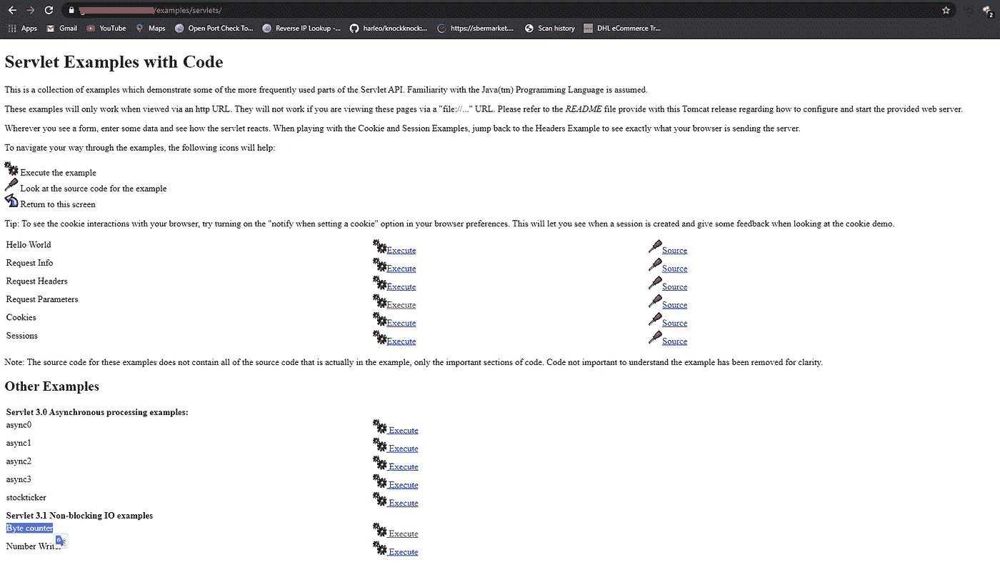

首先，我尝试了字节计数器的例子，因为它有上传功能。但是但是但是但是但是运气不好:(这里也没有成功。如果你们在野外发现了这个，请随意使用你们的想法，尝试在这里得到一个漏洞，也许还可以 ping 我)

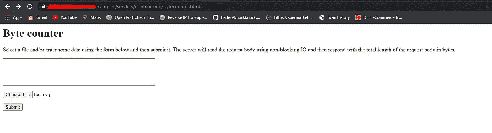

最后，针对会话实例和 Cookie 实例进行了分析。

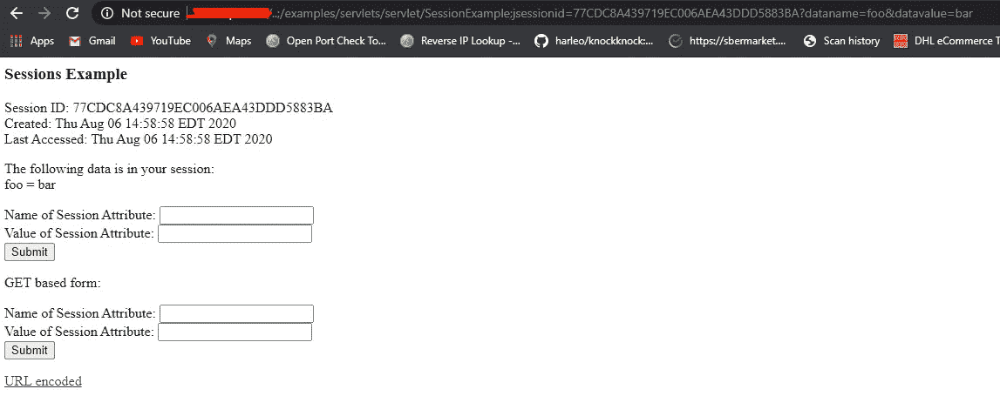

会话示例

有意思！但是因为它在一个隐蔽的潜艇上，所以影响不大。

然后，我检查了饼干的例子，它是黄金！

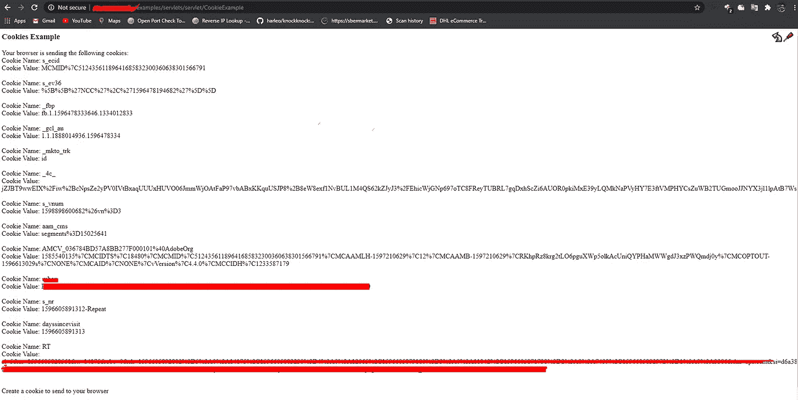

主网站上的 Cookies 在这里得到了反映！我很快想到了一个如何利用这一点的场景。我想到了偷拍。我很快前往[安全部门的负责人](https://securityheaders.com/)和 dddd :D

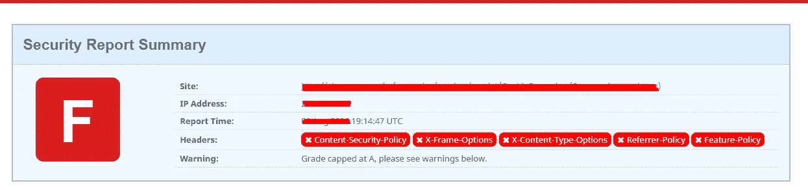

总结我的心情:P

写了一段仓促的代码(显然可以进一步改进，哈哈)

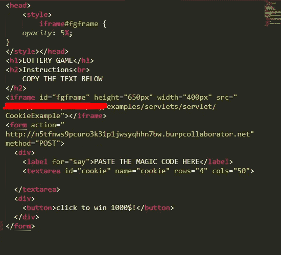

足以证明影响；)

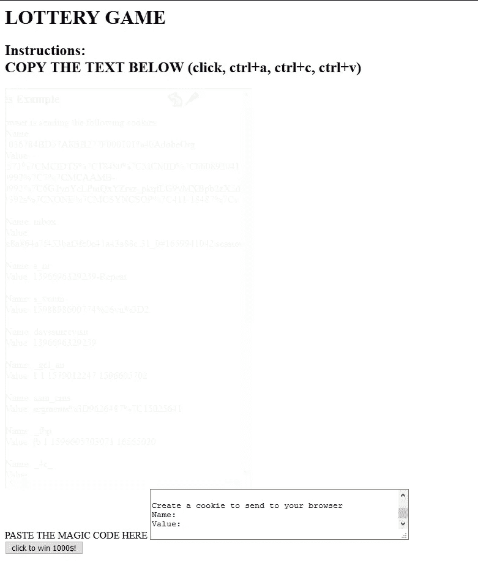

平常的彩票哈哈

[注意:您可以将不透明度降低到最小，并添加一个叠加元素，使其更具说服力。由于时间限制，我没有做/我只是太懒了？]

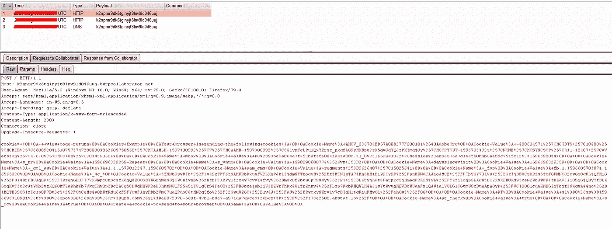

它来了！！！现在，只需将 url 编码的 cookie 粘贴到解码器中，就大功告成了！

COOKIES = =被盗

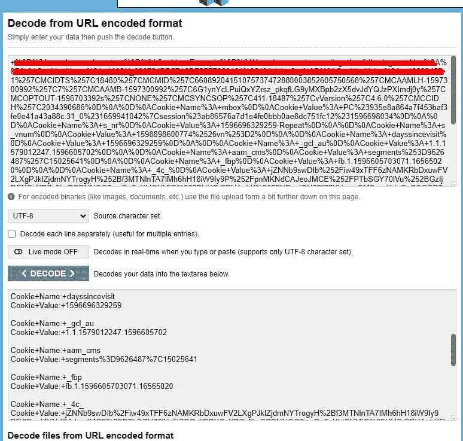

谢谢你们一直读到最后！希望你喜欢它！

在[https://twitter.com/debangshu_kundu](https://twitter.com/debangshu_kundu)见我

时间线:

报告日期:2020 年 6 月 29 日

奖励时间:2020 年 7 月 17 日

要点:始终保持对废弃/很少使用的子域名的警惕。特别是如果网站说“此 Web 应用已被禁用”！

保重伙计们。保持安全。

。/logout.sh