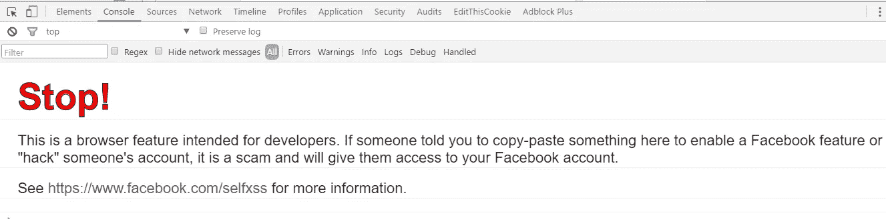
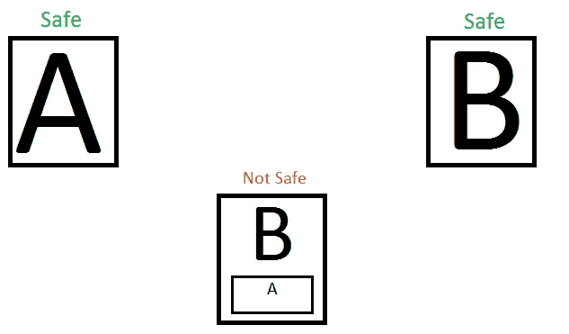
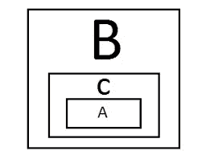

# API —潜在威胁

> 原文：<https://infosecwriteups.com/api-a-p-otentially-i-diotic-threat-de19b7f3687e?source=collection_archive---------0----------------------->

*注:以下文章发表于 2016 年 12 月 25 日 https://FogMarks.com*

**

*祝大家光明节快乐，圣诞快乐！*

*年底总是总结事情并为下一年设定目标的好时机。当然，也是为了喝个大醉。*

*在今天的假日特别案例研究中，我们将研究一个案例，攻击者可以从一个网站影响整个其他网站，而根本不用访问第二个网站。但在此之前，我们需要谈谈赛尔夫·XSS。*

*基本上，自我 XSS 是一个愚蠢的弱点。通常，要受到攻击，受害者需要将“恶意”JS 代码粘贴到他们浏览器的开发人员控制台(F12)中，这将导致代码在开发人员控制台所在页面的上下文中执行。
当自我 XSS 攻击开始时，用户被劝说粘贴 JS 代码，以便在网站上获得某种“黑客攻击”。为了解决这个问题，直到今天，脸书还会在每个页面的开发者控制台上打印一个警告，以警告用户:*

**

*因为网站无法避免用户向 DC(开发者控制台)粘贴恶意 JS 代码，所以 Self XSS (SXSS)漏洞不被认为是高危漏洞。*

## *但是今天我们将从一个不同的角度来探讨 SXSS*

*我们将看到网站如何无辜地误导受害者粘贴攻击者植入的“恶意”JS 代码。一些网站允许用户在自己的网站或个人博客中植入 HTML 或其他类型的代码。这种 HTML 代码通常由网站自己生成，并在文本框中按原样交给用户。用户所要做的就是简单地复制代码并粘贴到他们想要的位置。
现在，我知道这不是 API 的准确定义，但在这个案例研究中，这是我对它的解释——一个第三方网站向另一个网站提供提供某种服务的代码。*

## *所以，*

*一些非常有名的公司还不允许我透露它的名字，但已经允许用户从一个用户所属或参与的团体获取包含数据的 HTML 代码。
当粘贴到网站中时，HTML 表示该组中最后的热门消息——它们的标题和消息正文的介绍。*

*当“恶意”代码被放在标题中时，比如:`"/>` -公司网站上什么也没发生-他们正确地清理并逃脱了整个恶意有效载荷。*

***但是！**当 HTML 表示最后的消息时，根本没有逃脱的余地，突然之间，攻击者可以将恶意 JS 代码从网站 A 运行到网站 B 的上下文中，只需将代码植入他们创建的组消息主题的标题中。*

**

## ***该怪谁？***

*好吧，这两个网站应该得到一个禁忌的谈话。
网站 A 提供了一个“API”——HTML 代码，该代码显示了来自其自身托管的群组的最后消息，但该 API 无法正确逃脱恶意有效载荷。但是网站 B 违反了第一条规则——永远不要相信第三方网站来做你的工作。网站 B 添加了一个未知的代码(不是作为 iframe，而是作为一个脚本),并且没有说明任何基本规则——它盲目地执行给它的代码。*

## *那么我们怎么能相信不可信的人呢？*

*几周前，某个客户问我这个问题。
她说:*

> *"**我必须使用不是 iframe 的第三方代码，我该怎么做才能保证我的网站安全？"***

*在你的网站上执行第三方 JS 代码总是一种不好的做法(当然，我不是在谈论像 jQuery 或 javascript 依赖这样的代码，尽管我最近正在写一篇非常有趣的文章来解决这个问题。敬请期待)。我建议的解决方案是:简单地将这段代码植入沙盒页面，然后打开该页面的 iframe。就这么简单！*

**

*这样，即使网站 A 不会像预期的那样逃脱它的内容，沙箱，网站 C 将是受到打击的一方。
当然，这并不适用于网站 B 的上下文对于网站 A 来说是必须的场景，但是它在 95%的情况下都是有效的。*

## *那么，为什么我把这个案例研究的弱点归类为自我 XSS 呢？*

*仅仅因为我相信当你在你的网站上放一个第三方代码的时候，你就是在自我欺骗你自己和你所有的用户。在我看来，自我 XSS 不仅仅是一个愚蠢的“控制台粘贴”漏洞，它还在自己的环境中使用了未知的第三方 JS 代码。*

*这篇文章是 2016 年的最后一篇。我要感谢大家，感谢你们让我度过了美好的一年。请不要喝得太多，如果你喝得太多的话— **不要喝酒和打虫子！(虽然，说实话，那个** [**10 分钟 XSS 我在 Soundcloud**](https://fogmarks.com/2016/02/13/json-escaping-out-in-the-wild/) **上发现是在一个晚上出来之后。哎呀。)***

*节日快乐，当然还有——新年快乐成功！*