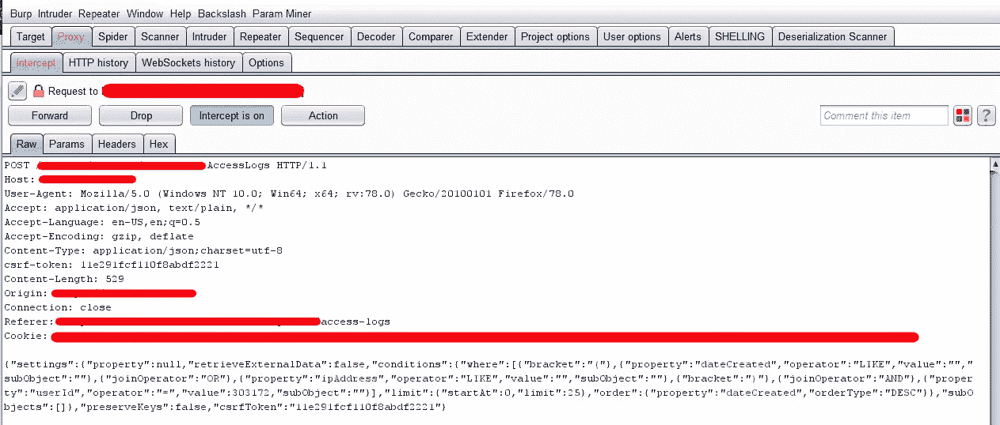
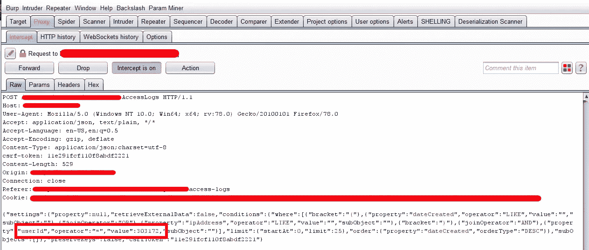

# 基于 API 的 IDOR 泄露 6000 家企业的私有 IP 地址

> 原文：<https://infosecwriteups.com/api-based-idor-to-leaking-private-ip-address-of-6000-businesses-6bc085ac6a6f?source=collection_archive---------0----------------------->

各位研究员大家好，

我自己，**拉菲阿哈迈德**。我是来自孟加拉国的网络安全研究员。我喜欢破坏安全。无论如何，事不宜迟，让我们进入今天的主题。

在开始之前，我想感谢 [**凯蒂·帕克斯顿**](https://twitter.com/InsiderPhD) 的视频。我从她的视频中学到了很多关于 IDORs 的东西。事实上，我一整年的赏金目标都是从她的视频中学来的。

# IDOR 是什么？

> *不安全的直接对象引用(IDOR)是一种访问控制漏洞，当应用程序使用用户提供的输入直接访问对象时会出现这种漏洞。*

# 什么是 API？

> API 是应用程序编程接口的首字母缩写，它是一个软件中介，允许两个应用程序相互通信。每次你使用脸书这样的应用程序，发送即时消息，或者在手机上查看天气，你都在使用 API。

因此，我测试了一个 **NDA ( *保密协议* )** 程序，我注意到 Web 应用程序有一个查看用户访问日志的选项。看起来很简单，对吗？

我有一个坏习惯，就是在浏览一个 web 应用的时候打开**拦截**，看到浏览器发给服务器的每一个请求。当我再次访问同一个页面时，我注意到**我的** **访问日志**没有显示，尽管页面的其他内容已经加载。然后我注意到我的拦截打开了，有一个 API 请求被拦截，它试图获取用户的访问日志。

被拦截的请求

如果你仔细看看帖子数据，你会发现它有一个用户 ID 。

用户 ID 请求

然后，我向入侵者发送请求，并使用**暴力破解**用户 ID ，我获得了 6000 家企业的 ***访问日志*** 。

开发人员的反应

我很快报告了这个漏洞，公司在 48 小时内修复了这个漏洞。我得到了一笔不错的 4 位数赏金。

希望你们喜欢这个。PM 我在**[**、LinkedIn**](https://www.linkedin.com/in/rafi-ahamed) 或 [**Twitter**](https://twitter.com/L3onid1s) 如果你有任何问题。**