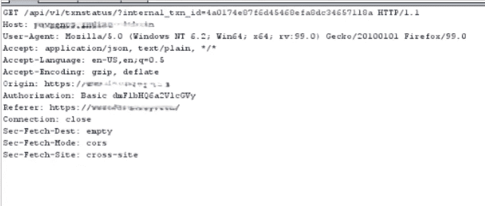
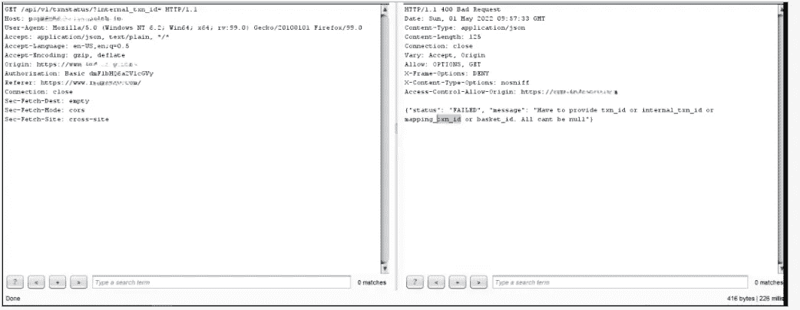
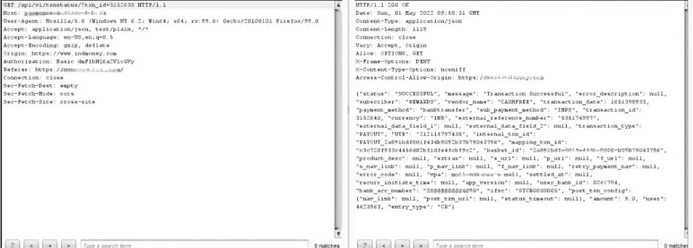

# Api 端点-泄露了大约数百万用户的事务细节

> 原文：<https://infosecwriteups.com/api-endpoint-revealed-transaction-details-of-about-millions-of-users-9d5a5324547f?source=collection_archive---------0----------------------->

今天我将谈论我的一个发现，它揭示了数百万用户的交易细节…..

让我们开始…了解什么是 api？

Api 是应用程序编程接口的缩写，它用于与另一个应用程序通信，而不与其他应用程序共享任何系统密码…简而言之

所以我在测试应用支付系统，当然，我喜欢测试他们..在测试过程中，我注意到当我通过 burp 取消交易并拦截请求时，有 api 进入请求，处理内部存储数据库和普通 webapp 之间的所有事情，我注意到即使我取消或完成了交易，他们也在为每个支付请求创建交易 id...

我是如何变得脆弱的？

1.  我刷新了我的取消事务页面，看到 api 请求在打嗝，这个端点正在通过

2.那么接下来呢？是的，我删除了编码部分，并发送了空值，收到了 400 错误请求，但回应中有一些提示{必须提供 txn_id，这让我想起}

3.之后我改了 GET /api/v1/txnstatus/？internal _ txn _ id = 4a 0174 e 87 f6d 45468 EFA 8 DC 34657118 a**{ To GET/API/v1/txn status/？txn_id=randomdigit}**

我得到的只是用户银行账户的详细信息，他们的手机号码以及其他一些非有益的信息😁

影响:
他们使用了事务 id 的数值，并在另一个名为 **{api/v1/txnstatus/？txn_id** 因为没有认证持有人，我可以检索数百万的用户交易细节

他们采取的缓解措施:
在与支付相关的 api 端点上实现了 Jwt 身份验证载体。

谢谢:)
我希望你喜欢边喝咖啡边阅读

让我们在推特上联系我:
[https://mobile.twitter.com/aadesh_namdevv](https://mobile.twitter.com/aadesh_namdevv)