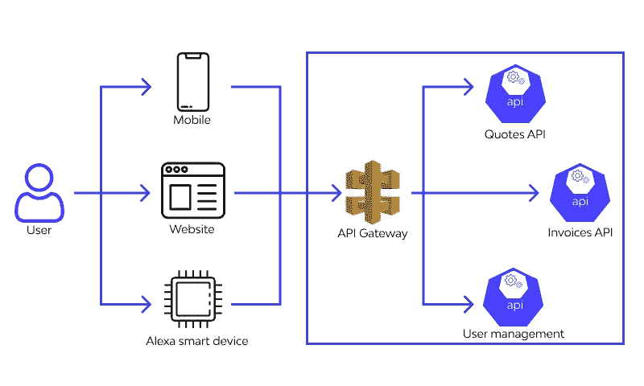

# 2021 年 API 安全📋—十大最佳实践

> 原文：<https://infosecwriteups.com/api-securing-in-2021-top-10-best-practices-d23993c78a5b?source=collection_archive---------5----------------------->

我喜欢从现实生活中汲取灵感，今天的文章也不例外。我经常被问到如何破解 API 的问题，但一些人没有意识到的是，如今几乎所有东西都与 API 相连，甚至我们家中的智能冰箱也必须将数据传递到某个地方。今天，我想花一点时间向你展示我的 API 测试的 10 大最佳实践。然而要做到这一点，我们首先需要知道 API 到底是什么。

‍

# 什么是 API？

人们经常听说有多少无形的波已经覆盖了我们，如 WiFi 和微波，但这些故事往往忽略了随着互联网的出现，工程师们需要一种方法来让我们的冰箱播放 flappybird，并将 highscore 传递到服务器，以便每个人都可以看到我们的生活有多么少。

玩笑归玩笑，API 在我们身边无处不在。API 代表应用程序编程接口，现在我不知道你怎么想，但是这些词需要对我进行一些分析。在核心中，API 似乎是允许两个应用程序相互对话的东西，如果我们这样定义它，我们就能明白为什么 API 分布如此广泛。现在不仅我们所有的网站都与 API 对话，而且几乎所有连接到互联网的东西都是动态的，因此都需要与 API 对话。

# 肥皂 vs 休息

了解 SOAP 和 REST 之间的区别很重要，因为两者都需要一种稍微不同的安全方法。SOAP 代表简单对象访问协议，而 REST 代表代表性状态传输。SOAP 首先被设计出来，然后是 REST，我们可以说 SOAP 是一种协议，而 REST 是一种架构模式。架构模式是给定上下文中软件架构中常见问题的通用、可重用解决方案，而协议是一组确定数据如何在不同设备和 API 之间传输的既定规则。

这是一个非常技术性的解释，可以归结为这样一个事实:SOAP 只能处理 XML 格式，而 REST 可以处理纯文本、XML、HTML 和 JSON。我们还可以调用众所周知的 HTTP 动词 GET、POST、PUT 和 DELETE 来处理所需的组件。在 SOAP 中，我们有一个 WSDL 文档，它将包含我们与 API 对话所需的所有规范，而 REST 将依赖 URL 来找到正确的数据。

REST 的一个很大的优点是它通常使用较少的带宽，因为它通常使用 JSON，其中 SOAP 是 XML 的约束，XML 包含大量描述文档的额外内容。

> *{ "姓名":"演员"，"国家":"比利时" }*
> 
> *T14？xml version="1.0 "？>*
> 
> *SOAP-ENV:Envelope*
> 
> xmlns:SOAP-ENV
> 
> *=<http://www.w3.org/2001/12/soap-envelope>*
> 
> *SOAP-ENV:encodingStyle*
> 
> *=<http://www.w3.org/2001/12/soap-encoding>>*
> 
> *<肥皂:身体>*
> 
> 【Demo.thexssrat.com】T24**
> 
> 【http://thexssrat.org/】>*>*
> 
> *<姓名>演员</姓名>*
> 
> *<国家>比利时</国家>*
> 
> *</demo . thexssrat . com>*
> 
> *< /soap:Body >*
> 
> *</SOAP-ENV:Envelope>*

值得注意的是，REST 是一个无状态的架构解决方案，这意味着没有合适的信息从一个函数流向另一个函数。如果我们需要，我们需要使用 SOAP 协议。

‍

## 当今组织面临的关键 API 安全问题

近年来，企业在保护基础设施方面已经取得了长足的进步，但它们仍有很长的路要走。如今，组织面临的一个关键威胁是缺乏信息本身。一个程序通常由许多相互通信的微型 api 组成，安全性经常被推到后面或者完全被忽略。公司必须做出选择，这可能是他们必须走的一条细线。

我们必须确保在我们的安全基础设施上花费足够的时间，但同时，如果我们不能妥善管理这一点，它可能会成为一个真正的大负担。我们需要保持对我们的完整 API 结构和所有可能的攻击途径的当前概述，同时还要确保我们不会对系统及其组件施加超出其处理能力的任何压力。我们需要知道哪些 API 是活动的，它们暴露了哪些端点，这样我们就可以对进入我们系统的可能攻击媒介有一个总体的了解。这不是一项简单的任务，如果我们需要手动完成，它会很容易压倒我们。

‍

## 针对 Web APIs 的常见攻击

1.  **注射**

针对 API 的一种常见攻击是注入。这可以是从命令注入到 [SQL 注入](https://www.wallarm.com/what/structured-query-language-injection-sqli-part-1)的任何事情，影响范围可以从微不足道到严重。几种不同类型的注入攻击对服务器非常有害，虽然 API 通常不是执行攻击的弱点，而是将它传递给执行攻击的其他系统，但它通常是抵御外部攻击的第一道防线。我们必须注意的一些事情是:

*   SQL 注入
*   HTML 注入
*   代码注入
*   命令注入
*   内容注入

**2。跨站点脚本(XSS)**

虽然 XSS 确实经常在客户的计算机上执行，但 API 通常是存储的 XSS 攻击的第一道防线，这可能是非常有害的。这些攻击允许坏人执行恶意(通常是 javascript)代码，过滤掉这些恶意值是 API 的工作，但我们都知道忘记一个值是多么容易，坏人只需要一次攻击机会。

**3。分布式拒绝服务(DDoS)**

DDoS 攻击可能是毁灭性的，因为它们会削弱您的应用程序、系统甚至整个网络。一个 [DDoS 攻击](https://www.wallarm.com/what/types-of-ddos-attack-and-measures-protection)是通过向系统发送超出其处理能力的请求来执行的，通常由许多不同的“僵尸”执行，我们称之为“僵尸”。僵尸是被攻击者控制的受感染的计算机，它将与所有其他“僵尸”一起向我们的系统发送请求。如果产生足够的流量，这甚至可以轻易地淹没最健壮的系统。

**4。缺乏资源&速率限制**

这与我们之前的例子类似，如果不实施适当的速率限制，情况会变得更糟。这将允许攻击者通过在非常短的时间内请求不合理数量的数据，以比以前更快的速度削弱我们的系统。

**5。资产管理不当**

一些最大的威胁来自未知。许多组织会非常重视系统中可见组件的安全性，但是完全忽略了影子 API。影子 API 是生产中的 API，但不为任何人所知。这些 API 可能会造成巨大的损害，因为它们没有得到积极维护，并且在创建新功能时经常被忽略，这可能会导致未经授权的数据访问，甚至更糟的是远程代码执行。

‍

# 十大最佳实践

因此，在了解了所有这些之后，你可能会有点担心，但是有了这些最佳实践，你可以确信你的安全性将会因多种因素而提高。

1.  **使用强认证和授权解决方案**

经常发生的情况是，被破坏的 API 没有正确地检查用户是否被授权执行他们想要采取的动作，或者甚至根本没有被认证。这可能会导致重大问题，如 IDOR 和 BAC 的数据泄漏。由于 API 通常是通向公司数据的大门，而公司数据可以说是 it 最有价值的资产之一，我们需要格外小心，不要将任何东西暴露给错误的人。

**2。优先考虑安全性**

我经常听到有人说当前的预算中没有预见到安全性，但这让我想知道对于真正的数据泄露，预算是多少。适当攻击的成本可以达到适当安全措施成本的许多倍，我们还必须考虑安全性，甚至在设计系统要求或构建代码时将安全性放在首位，这一点很重要。

**3。清点和管理您的 API**

正如我们之前所说的，影子 API 可能是一个真正的问题。为了解决这个问题，确保你有一个适当的 API 清单，并且定期更新。这最好由自动工具来完成，这些工具可以检查流量并执行枚举扫描来发现未授权的 API。

**4。实践最小特权原则**

最小特权原则规定，我们应该只给我们的 API 它所需要的那么多的访问权限，不能更多。这确保了即使我们的 API 被黑客攻击，损害也将被限制在该 API 的范围内，而不会扩散到我们系统的其他部分。

**5。使用 TLS 加密流量**

TLS 代表传输层安全性，是您可能更熟悉的 SSL 的继任者。它允许我们以非常安全的方式加密流量，不会给中间人攻击留下任何空间，在中间人攻击中，坏人会试图读取我们前端系统和后端 API 之间的流量。

**6。删除不打算共享的信息**

当 API 被开发出来的时候，我们必须特别注意这样一个事实，即它们可能包含黑客们梦寐以求的秘密。API 密钥、用户名和密码之类的东西应该始终放在环境变量之类的安全存储解决方案中。这一步经常被忽视，这就是为什么自动化这一过程是值得的。除了在将项目上传到代码共享解决方案(如存储库)之前扫描它们之外，我们还可以定期扫描这些存储库，以确保没有任何值从我们的监视下泄露出去。

**7。不要暴露不必要的数据**

开发人员通常会在测试环境中暴露比调试严格需要的更多的数据，但我们必须确保在进入生产环境之前删除所有这些额外的值。作为一名有道德的黑客，我可以向你保证，信息在我们的世界中是一种非常有价值的商品，暴露的数据越少，我们留给坏人的攻击面就越小。

**8。验证输入**

生产环境中发生漏洞的最大原因之一是因为开发人员忘记验证和清理输入。我们应该总是有冗余的验证系统，永远不要依赖前端系统来阻止无效的输入。作为一名有道德的黑客，我不太关心前端系统，除非它涉及到 XSS 或 CSTI。当我做黑客的时候，我在和一个 API 对话，我总是说前端验证只是用来保护用户免受他们自己错误输入的影响。

**9。使用速率限制**

到目前为止，这种问题类型是 bug 奖金中报告最多的问题类型之一，这意味着它在渗透测试中经常被遗漏。不适当的速率限制或根本没有速率限制会导致我们的应用程序离线，因为不良行为者可能会请求太多的数据，或者他们可能会通过让我们的 API 处理太多的信息而使它们过载。如果我们使用第三方服务，这甚至会导致不良行为者试图向第三方系统执行尽可能多的请求，从而产生极高的账单，第三方系统可能会根据 x 个请求进行计费。

**10。使用网络应用防火墙**

阻止坏演员的最有效的方法之一是一个 [WAF](https://www.wallarm.com/product/cloud-waf) 。这是一种只专注于检查 web 流量的防火墙，它们通常基于过滤掉不允许的流量的规则集。例如，这可能是带有攻击媒介的请求。虽然 WAF 是阻止不良行为者的一种非常有效的技术，但我们不应该完全依赖它，我们仍然应该考虑我们已经谈到的所有事情。

# 2021 年最佳实践

**保护后端数据和前端数据**

组织在保护其前端数据上花费了大量资源，但他们经常忽视其后端数据。我们需要确保我们的冗余检查到位，不仅保护我们的应用程序的可见部分，而且我们还需要确保我们的后端系统是安全的，因为坏人可能会完全绕过我们的前端，直接与 API 对话。

**通过验证保护请求-响应生命周期**

攻击者通常会针对请求和响应之间的差异。例如，响应可能包含请求不包含的字段，攻击者可能能够将该字段复制到请求中并操纵其值。通过这样做，当操纵高影响值时(例如 isAdmin:false > isAdmin:true)，不良参与者可能会导致严重的损害。出于这个原因，我们必须拒绝任何不包含我们在 API 上期望的确切主体和头的请求，我们必须对此非常严格。

**哈希密码**

当攻击者确实获得了对您系统的访问权限时，您需要尽您所能确保他们不会知道用户的真实密码。避免这种情况的最好方法是散列密码，更好的方法是在散列密码之前加入盐。salt 是一个简单的字符串，它将确保攻击者无法将我们的哈希与现有的彩虹表进行比较。这项技术是在很大程度上帮助保存 API 上的数据的技术之一。

‍

*最初发表于*[*【https://www.wallarm.com】*](https://www.wallarm.com/what/api-securing-in-2021-top-10-best-practices)*。*