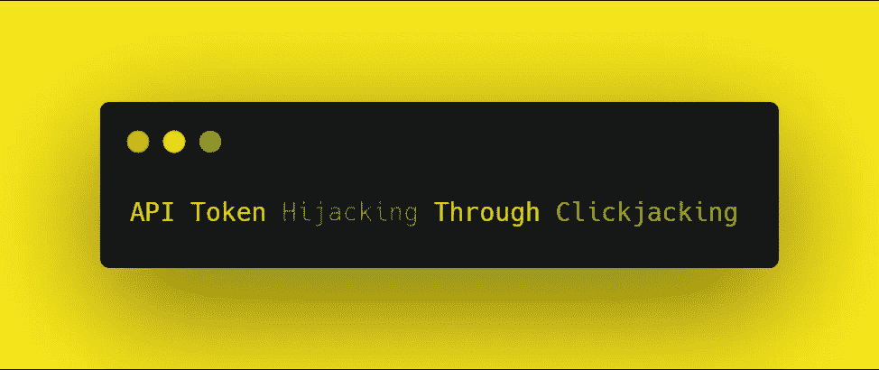
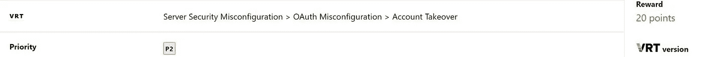
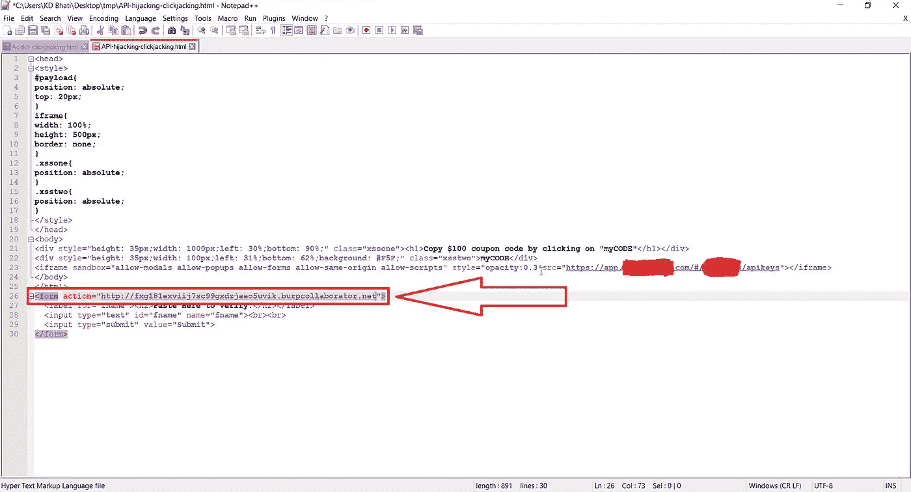
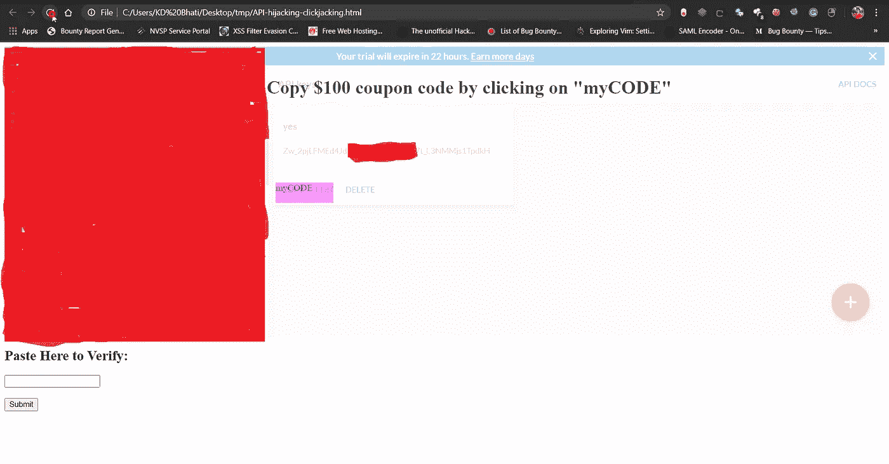
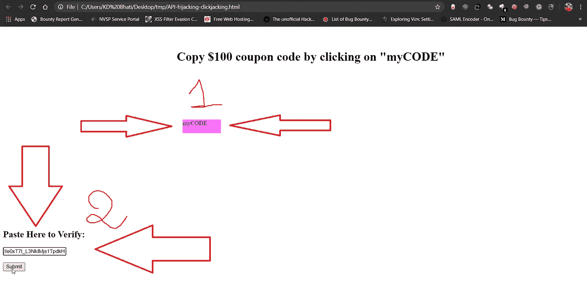
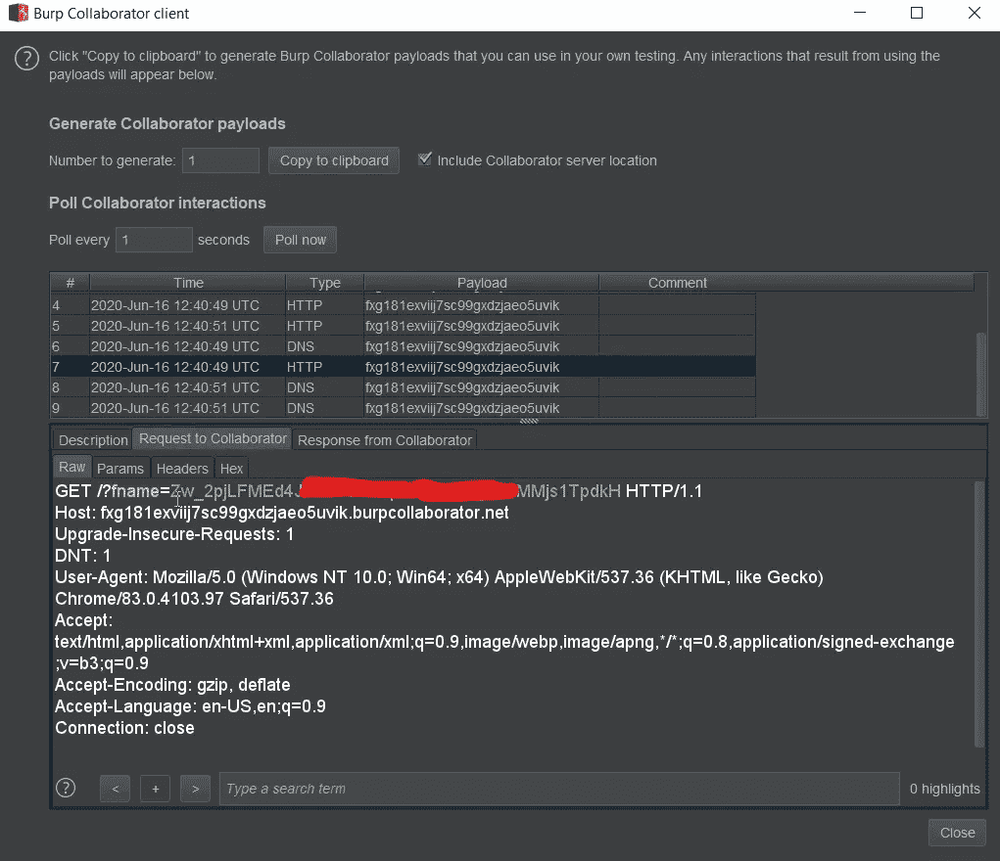
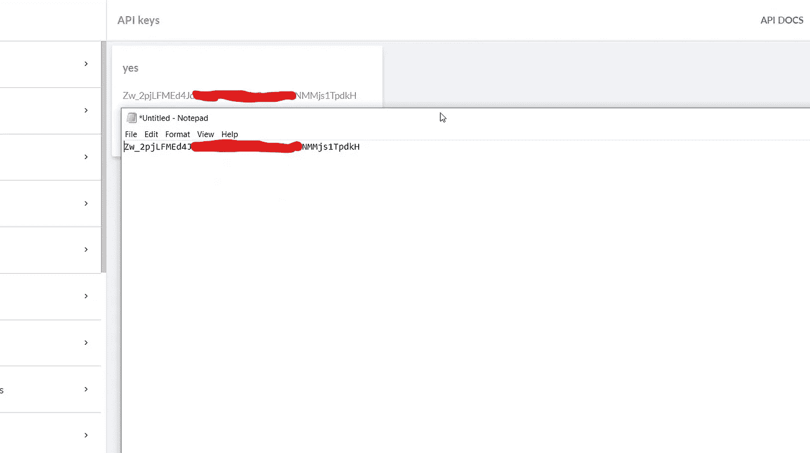

# 通过点击劫持的 API 令牌劫持

> 原文：<https://infosecwriteups.com/api-token-hijacking-through-clickjacking-2e36c02e6c48?source=collection_archive---------1----------------------->

嘿伙计们！我希望你们都平安无事。非常感谢你对我的 [**以前的**](https://medium.com/bugbountywriteup/weak-cryptography-leads-to-open-redirect-3fe052c12995) 博客感兴趣。

正如标题所言，我将向你展示我在 Bugcrowd 网站 P2 栏目下的一个“文学”发现。您也可以使用它来接管帐户，通过改变受害者的电子邮件与攻击者的电子邮件，禁用 2FA 等等。

# 我们开始吧！

**截图 1:** 这是 clickjacking 的 HTML 代码(DM on [**twitter**](https://twitter.com/darklotuskdb) 如果你想要这个代码的话)。在这里，您必须插入您的 burp collaborator URL 或您控制的任何其他服务器来获取令牌。

**截图 2:** 正如你在上面看到的，在后台我们有一个易受攻击的站点在运行，在它的上面，是我们恶意的点击劫持代码，在“ **myCODE** ”后面有一个我们要劫持的“复制”按钮。

**截图三:**现在我已经把“不透明度”设置为零，让受害者可以看到易受攻击的网站，这里受害者要做的是:
1。点击“我的代码”。(这会自动将令牌复制到剪贴板)
2 .将其粘贴到验证框中，然后单击提交。

**截图 4:** 我们就大功告成了！现在只需查看您的 burp 合作者日志，您将获得受害者令牌。

**截图 5:** 现在我们已经通过点击劫持成功劫持了受害者的令牌。

关注我的 [**推特**](https://twitter.com/darklotuskdb) 获取惊人的 bug 赏金提示。

**谢谢**