# 在 Android Studio 上设置 Android 测试实验室

> 原文：<https://infosecwriteups.com/apk-testing-on-an-android-studio-c0addb12550?source=collection_archive---------2----------------------->

## 在 Android 设备模拟器上运行 APK 文件并分析 DEX/Smali 代码。

*本文指导您如何在 Android Studio 上构建 Android 测试实验室，以逆向工程和测试 Android 应用程序。它强调了 Android 应用程序测试所需的一些有用工具的使用。*

照片由 [Rami Al-zayat](https://unsplash.com/@rami_alzayat?utm_source=medium&utm_medium=referral) 在 [Unsplash](https://unsplash.com?utm_source=medium&utm_medium=referral) 上拍摄

# 使用的工具:

*   从 APK 文件中获取小代码。
*   `adb` - Android Debug Bridge 是一个命令行，允许你与设备进行交互。
*   `Jadx` 或`jadx-gui`——从 APK 文件中获取 Java 源代码。
*   Android Studio - Android 开发和测试软件。( *GenyMotion 是另一款软件，是 android 应用测试的专用平台。)*

# 什么是 APK？

一个安卓的 app 是用 Java 写的。一旦编码完成，android 应用开发者使用 Android Studio 上的 **java2smali** 插件将 java 代码转换成 smali 语言。所有的文件和文件夹然后被打包成一个 APK 文件，签名并准备好用于安装和运行应用程序。

# 对 APK 文件进行逆向工程

调试 APK 文件时，它会提取为构建此应用程序而创建的所有文件/文件夹。

> Java 源代码------->。斯马利。DEXEDRINE 的简称

## 使用 Android Studio 进行调试

在 android studio 中，点击**文件>配置文件或调试 APK** 并选择您想要分析的 APK 文件。

*APK 的例子取自 hackerone ctf。*

## 使用`apktool`工具进行调试

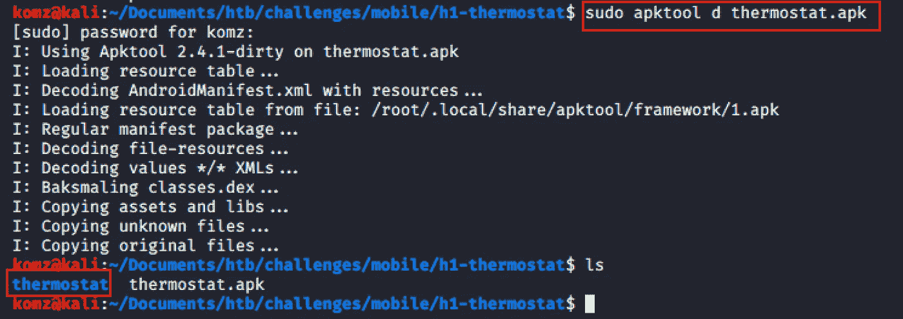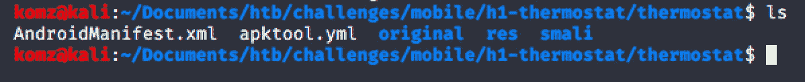

# 将 DEX/Smali 代码转换成 Java 源代码。

如果您想阅读 java 代码，那么在您的操作系统上安装`jadx`将 dex/smali 代码转换成 Java。在这里，我已经在 MacOS 中安装了我的。

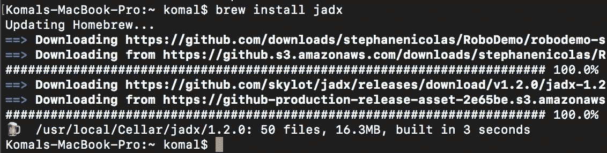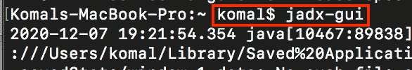

使用 jadx-gui，我现在能够阅读 Java 源代码了。

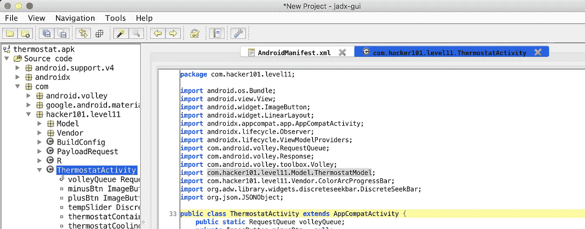

# 运行 Android 虚拟设备(AVD)

**我现在想看看这个应用程序是做什么的，以及它在虚拟手机上是如何工作的。**

在 Android Studio 上，导入 APK 文件后，打开 AVD 管理器创建一个 Android 模拟器并安装您选择的系统映像。

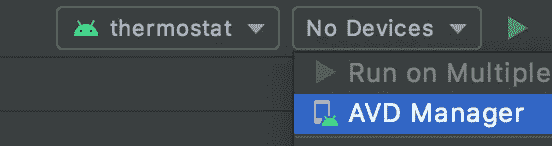

> **根设备** —如果设备是开发版本，那么它是根设备。注意:根设备上的一些应用程序可能会检测到这一点，并将拒绝工作。
> 
> **非根设备** —如果设备是生产版本，那么它是非根设备。24 级及以上的系统映像 API 都是非根的。

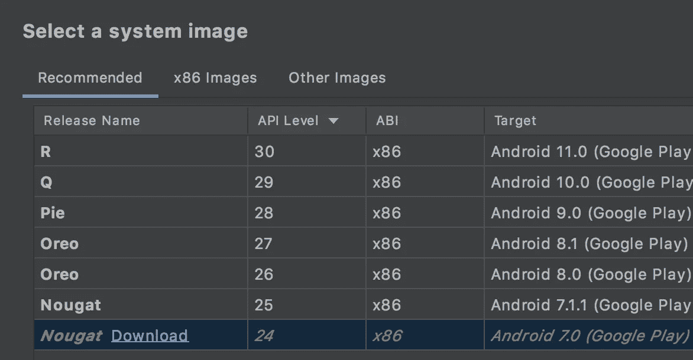

推荐部分的 Android Studio 非根系统映像。

**解除虚拟手机设备根的方法:**

*   使用 [**SuperSU**](http://www.supersu.com/download) app 移除 root 权限。
*   使用 ES 文件管理器取消根。
*   通过安装 OTA 更新来解除 root。
*   通过安装库存固件来解除引导。

**Android studio 中所有这些推荐的系统镜像都是非根的**

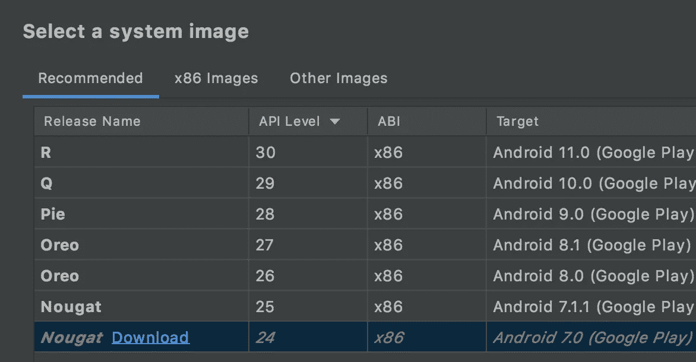

N **ext，选择您的 AVD(根或非根)后，点击绿色箭头运行 AVD。**

# 在 Mac Android Studio 上使用 ADB 命令行

如果你想使用命令行，那么 ADB 是一个用来连接 AVD 的工具，允许你运行有用的命令。

要使用命令行，请首先遵循以下步骤:

## 启用 USB 调试模式

启用 AVD 中的**开发者选项**，然后启用 **USB 调试模式**:

转到**系统设置>关于仿真设备>内部版本号**(点击 5 次)访问“开发者选项”。

现在，进入**设置>系统>高级>开发者选项**打开 USB 调试。

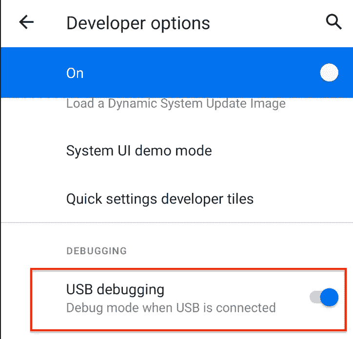

# 仿真器外壳

在 USB 调试模式下启动设备仿真器后，在 Android Studio 终端的 MAC 终端上点击以下命令，并访问`adb`路径:

`cd ~/Library/Android/sdk/platform-tools`

> 在 windows its 上:`*%USERPROFILE%\AppData\Local\Android\sdk\platform-tools\*`

`./adb reboot bootloader` -重启安卓设备。 ***注意:*** *如果设备/仿真器没有运行，这将不起作用。*

`./adb devices` - *如果 USB 调试被禁用，仿真器设备将显示为离线。*

`./adb shell` -一旦你进入 shell，你可以做`su root`来提升权限。

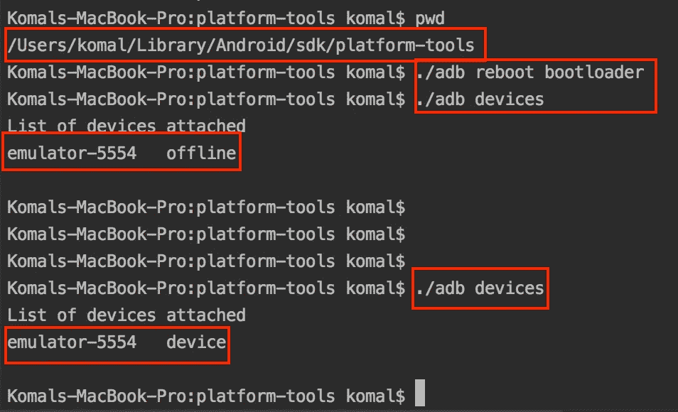

**Apps 文件位置路径:** `/data/app` & `/data/data`

# 将 AVD 连接到 Burpsuite 以拦截流量

**现在，我希望我的虚拟电话被 Burpsuite 拦截，以进一步分析入站/出站流量。**

## 在 AVD 中安装 Burp 的 CA 证书

在 Burpsuite 上，设置代理设置。

转到此[端口触发器](https://portswigger.net/support/installing-burp-suites-ca-certificate-in-an-android-device)安装证书的步骤。

在你的设备模拟器上，点击**三点>设置>代理**并应用设置。

你现在可以开始拦截 AVD 的流量了。

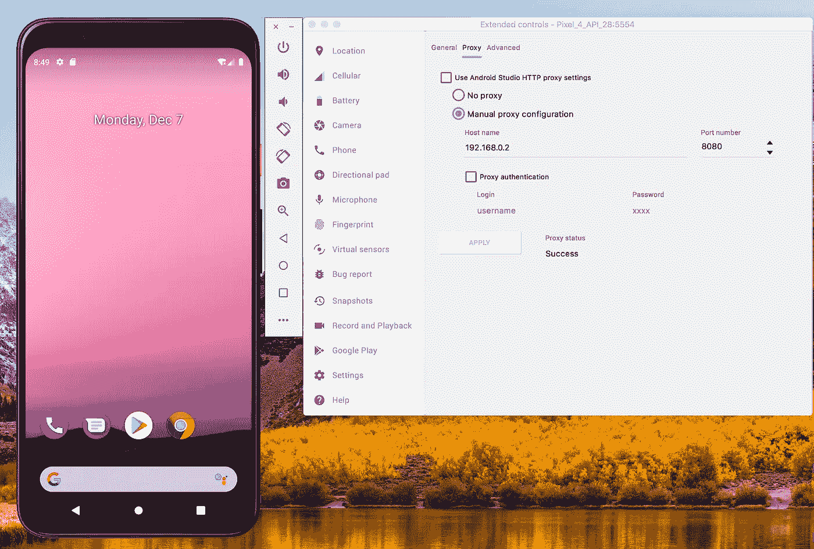

# APK 签名者

修改应用程序源代码并重新构建 APK 文件后，需要对其进行签名。要做到这一点，下载优步 APK 签名[这里](https://github.com/patrickfav/uber-apk-signer)。

`java -jar uber-apk-signer.jar -a /path/to/apk`

您现在可以运行修改后的应用程序了。

*感谢阅读！感谢您的反馈:-)*