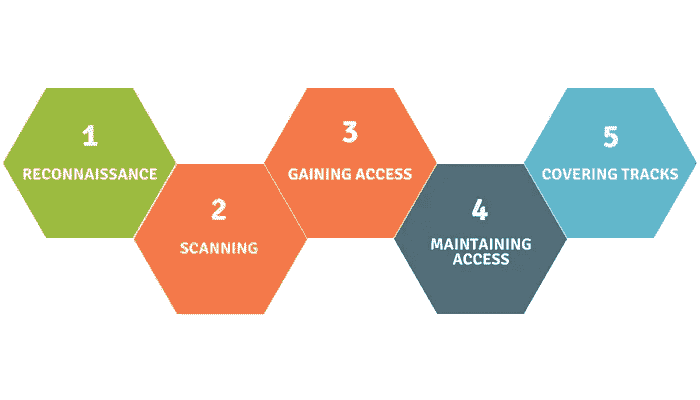
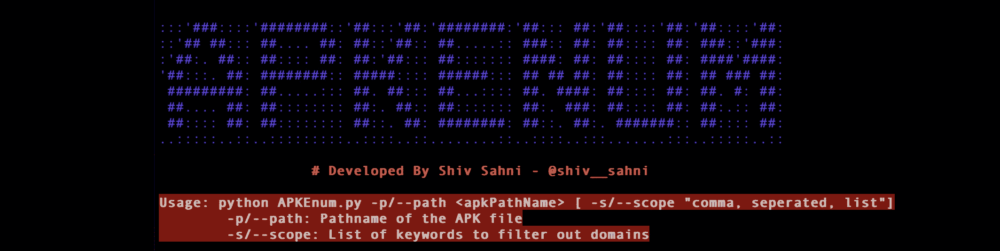
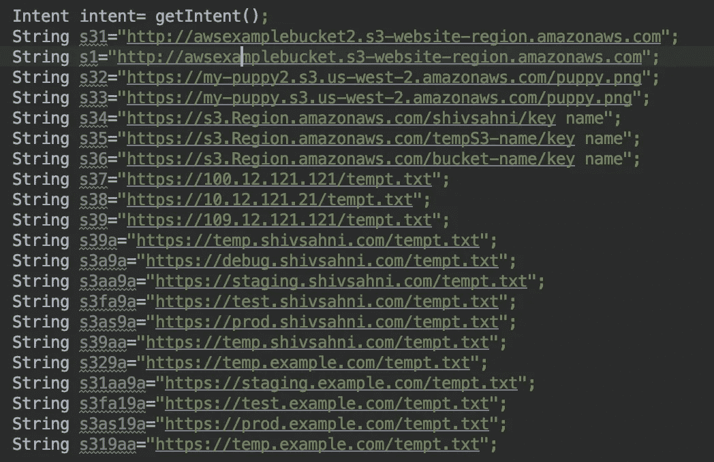
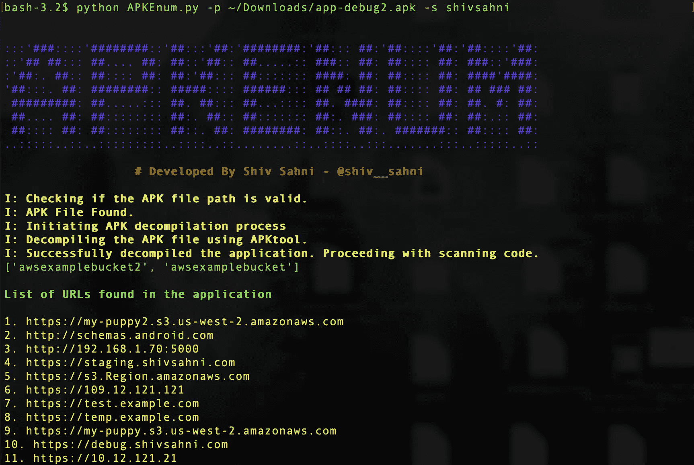
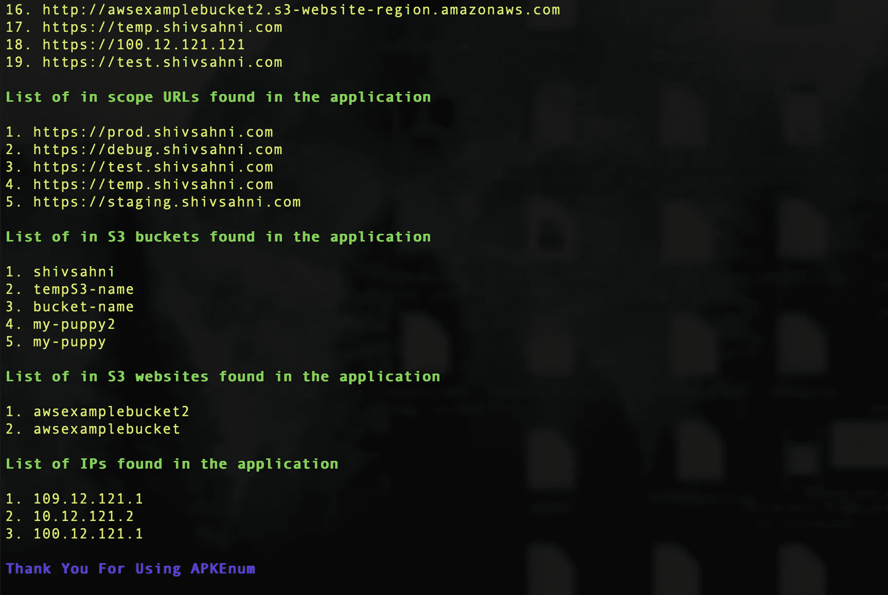

# APKEnum:用于 APK 枚举的 Python 实用程序

> 原文：<https://infosecwriteups.com/apkenum-a-python-utility-for-apk-enumeration-69509d11c032?source=collection_archive---------3----------------------->

## 一个简单的 Python 实用程序，用于对 Android 二进制文件执行被动枚举



R **经济的诞生**的确是渗透测试中最关键也是最耗时的阶段。在这个阶段，我们收集尽可能多的目标信息。我们掌握的信息越多，成功利用的机会就越大。

在过去的几年里，我有过许多这样的经历:移动应用程序的前端缺少基本的安全实践，而相应的 web 应用程序却要健壮得多。对于红队队员、渗透测试人员和 bug 赏金猎人来说，这绝对是一个充满机会的领域，他们可以从中发现一些很酷的安全问题。

考虑到这一切和新冠肺炎的封锁，我想到重温我的脚本技能，为 Android 应用程序开发一个**被动枚举实用程序**。该脚本将 APK 文件作为输入，执行逆向工程，并从反编译的二进制文件中收集信息。到目前为止，该脚本通过搜索反编译代码提供了以下信息:

*   应用程序中的域列表
*   代码中引用的 S3 存储桶列表
*   准则中引用的 S3 网站列表
*   中引用的 IP 地址列表。密码

我写这个故事是为了让你了解剧本。它是开源的，可以很容易地从[这里](https://github.com/shivsahni/APKEnum)下载。

# APKEnum

该脚本是开源的，可以在 Github 上获得。你可以从[这里](https://github.com/shivsahni/APKEnum)下载。

## 先决条件

*   支持 Python 2.7
*   APKTool 罐

**注意:**最新的 APKTool(v2.4.1) JAR 文件已经随软件包一起提供了。如果你面临反编译的问题，你可以从[这里](https://bitbucket.org/iBotPeaches/apktool/downloads/)下载最新版本，并把它放在依赖目录中，名为 *apktool.jar*

## 使用

下载完成后，我们只需要提供 APK 文件的路径名。可选地，我们还可以提供与目标相关的关键字列表，然后脚本将通过执行字符串匹配，基于输入关键字列表创建除上述列表之外的范围内域的附加列表。



为了测试这一点，我用下面的测试数据创建了一个示例应用程序，并在示例应用程序上执行 APKEnum。



下面的截图显示了示例应用程序的结果



```
Note: In case you observe any bug, please feel free to raise an issue, we can **together** fix it!
```

> 将感谢您的建议，错误报告，拉请求和其他合作！**让我们从黑客手中拯救世界！**

如果你和我一样，也是一个云安全爱好者，看看我最近制作的用于自动检测和利用 AWS NS 接管问题的 [**NSDetect**](https://github.com/shivsahni/NSDetect) 和 [**NSBrute**](https://github.com/shivsahni/NSBrute) 实用程序:)

[](https://medium.com/@shivsahni2/nsdetect-a-tool-to-discover-potential-aws-domain-takeovers-fd0ff1a8b68a) [## NSDetect:发现潜在 AWS 领域接管的工具

### 可能帮你赚/省几十万美元的实用工具！🤑

medium.com](https://medium.com/@shivsahni2/nsdetect-a-tool-to-discover-potential-aws-domain-takeovers-fd0ff1a8b68a) 

请继续关注一些即将到来的关于应用程序和云安全的很酷的东西。欢迎随时关注我的[媒体](https://medium.com/@shivsahni2)和[推特](https://twitter.com/shiv__sahni)。