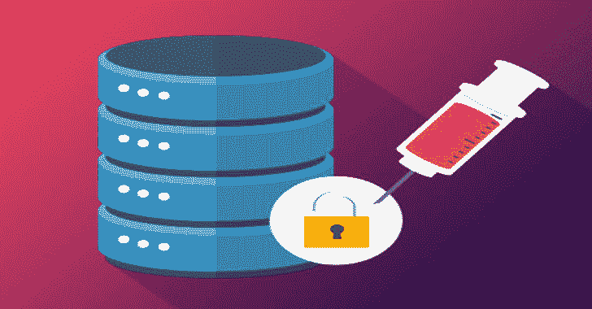
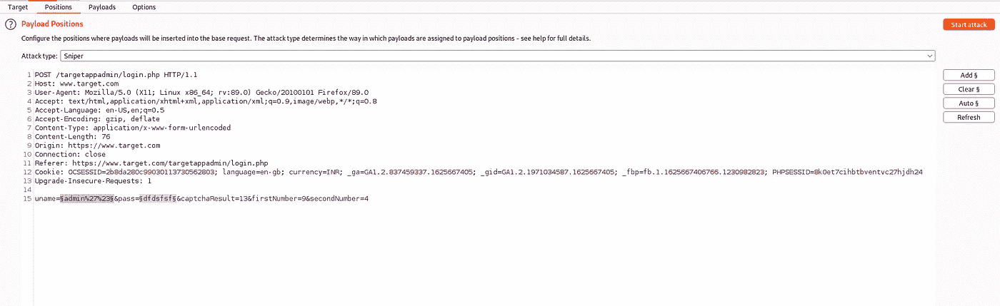
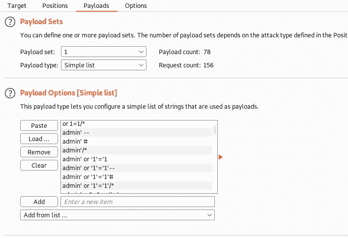
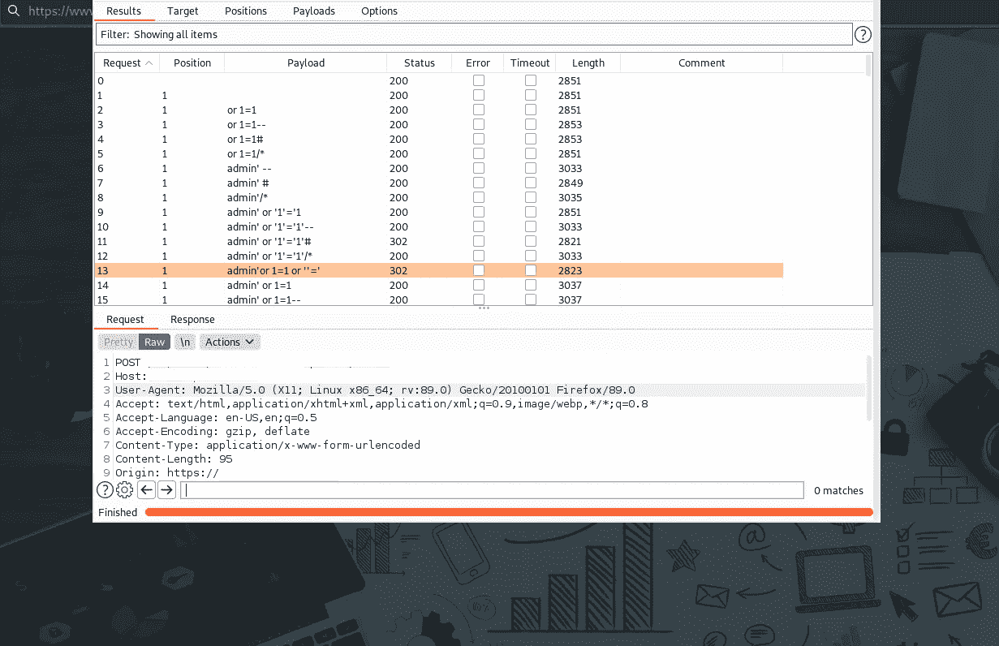
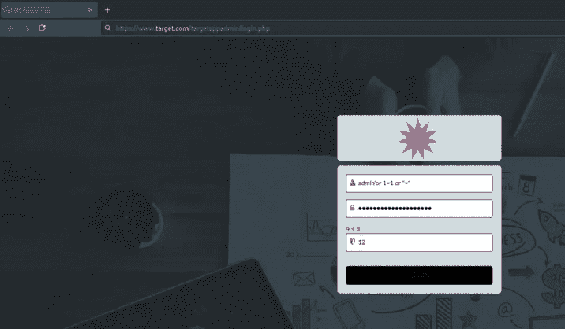

# 应用程序安全吗？让我们用 SQL 注入来检查一下😈

> 原文：<https://infosecwriteups.com/application-secured-lets-check-it-with-sql-injections-841ee318ed4b?source=collection_archive---------3----------------------->

大家好，我又带着一个有趣的博客回来了。看一看！！😍

# **~#目录:**

🔹**SQLI 是什么**

**🔹我使用的工具**

**🔹我感染的病毒**

# ****~#现在，什么是 SQL 注入或者结构化查询语言注入**💉**？🤔****

**基本上，web 应用程序上有一个 sql 查询(从数据库表或表的组合中请求数据或信息),该查询被发送到数据库，然后在数据库上执行该查询，相关信息返回到 Web 应用程序…**

**在 SQL 注入中，我们通过注入恶意负载(以字符串或编码字符串的形式)来操纵数据库查询，以便使应用程序执行理想情况下不应该执行的任务。因此，攻击者可以绕过身份验证，窃取数据，修改数据，删除数据，运行任意代码，还可以获得根用户访问权限…**

**现在，当用户登录 web 应用程序时，API 请求被发送到数据库。如果凭据与数据库中该特定用户的现有数据匹配，则该用户成功登录。另一方面，如果凭证与表中的记录不匹配，身份验证就会失败…**

# ****~#使用的工具:****

**🔹带有子查找器的 Httpx**

**🔹打嗝组曲**

# ****~#现在让我们来挖掘一下我发现的 bug…**🐞**

**目前，让我们考虑目标网站为[**https://www.target.com。**](https://www.target.com.)**

**首先要做的事🤓。我使用以下命令执行了带有**子查找器**的工具 **httpx** :**

**👉**子 finder-d**[**target.com**](https://www.target.com.)**| httpx-title-tech-detect-status-code-follow-redirects****

**我有大量的子域和它们的状态码。**

**接下来的事情是在网站上创建一个帐户(这里是:target.com)。我从我得到的子域列表中发现了一个子域，即**https://www.target.com/targetappadmin/login.php****

****

**我尝试了几个 sql 有效负载，但无法登录。之后我就想着暴力破解出**用户名**和**密码**。我放了一些随机的字符串并在 Burp suite 中捕获了代理，然后将其发送到入侵者选项卡。**

****

**我已经在列表中加载了一些有效载荷，然后点击了**开始攻击**按钮**

****

**我在 **admin '或 1=1 或' ' ='** 中得到 302 状态代码**

****

**现在，我在**用户名**和**密码**中注入了相同的有效载荷:**

****

**然后 BOOOOOOOOM💥它被执行了，我可以登录到**https://www.target.com/targetappadmin/branchList.php**🎉🎉**

**登录后，我发现了**用户的数据**(包括电话号码，用户 id，电子邮件和更多管理面板可以拥有的信息)**

**这很容易也很有趣😃。不需要努力工作。**

**保持安全，闪耀光芒，保持安全！！**

****快乐黑客！！**🎆**