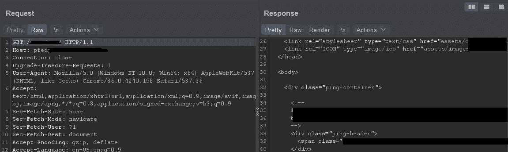
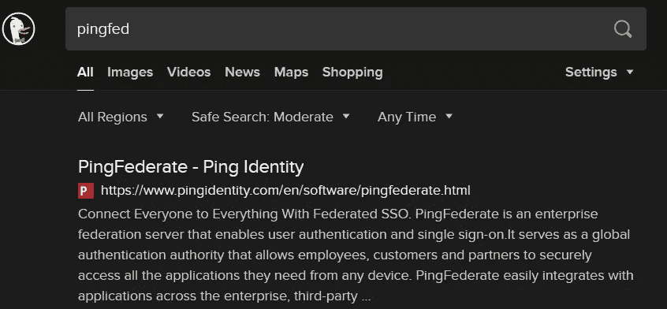
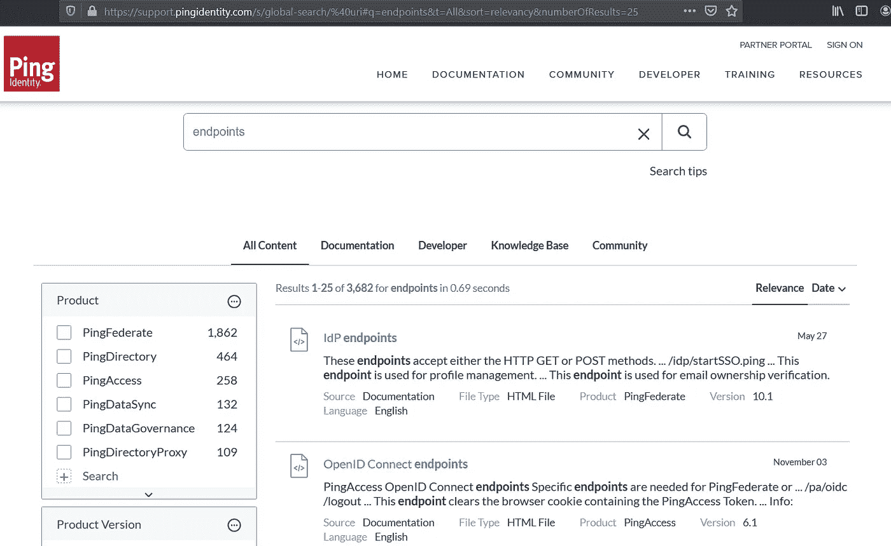
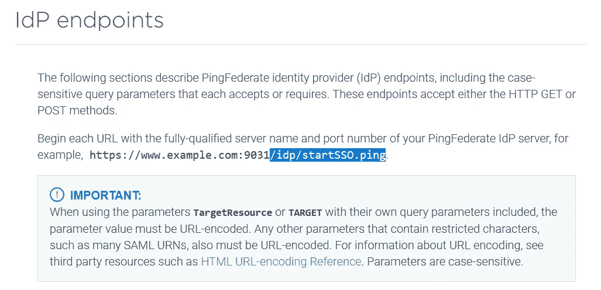

# 将老式黑客技术应用于 bug 搜索

> 原文：<https://infosecwriteups.com/applying-the-old-school-hacking-to-bug-hunting-78223e245e4e?source=collection_archive---------2----------------------->

## 或者说，文档+源代码=知识，利润(？)

我非常喜欢老式的黑客方法。核心思想是:了解目标的一切。以前，这是通过有时翻垃圾，而其他时候“借用”关于您想要入侵的系统的硬拷贝文档来完成的。幸运的是，今天，大部分信息都在网上，而且在大多数情况下，可以免费获取。但是，不幸的是，Wappalyzer 不能检测所有的系统。这时你必须运用一点逻辑，大量的直觉，以及你能在 html 源代码中找到的任何注释。

**了解你的目标:** 当你确定网站正在运行一些你和 Wappalyzer 都不知道的东西后，是时候用老派黑客曾经用过的方法来了解它了:获取源代码。
对于像 jira 这样的东西，非常简单——下载 jira zip 文件并从中制作一个单词表。现在，我知道，已经有 jira，django，wordpress 等的词汇表了。，但 jira 只是一个例子。
现实世界的场景是在一个碰巧有[https://website.com/pf](https://website.com/pf)或/pfed 等的网站上磕磕绊绊。但是，这还不够。这时，甚至像 html 源代码这样的东西也能有所帮助:

注意类名

**深入挖掘:**

如果您能找到列出端点、它们的参数、头文件等的文档，这也很有用。，以及它是如何工作的:

具有 pfed 和类名 ping = pingfed 的网站路径

**数量与质量:** 对于文件/文件夹或子域，找到真正关键/有用的东西的最大机会是使用最大的单词表。但是，单词列表越大，获得结果所需的时间就越长。当然，如果这个庞大的词汇表碰巧有一个特定的端点，目标网站也有，并且这个端点是实现 RCE 或者不盲目 SSRF 的一种方式，那么等待是值得的。但是，使用不包含无关端点的单词表要好得多，也更有效。没有必要对没有 jira 的网站使用 jira 端点。这并不是说你应该跳过庞大的单词表测试。双管齐下。如果没有其他事情，你可能会在等待巨大的单词表完成时，对那些肯定会出现的端点有一些兴趣。

> 重要提示:您可能需要调整单词列表和/或 ffuf/dirsearch/类似工具，使其不包含额外的“/”。虽然许多网站会将相同的结果提供给:/userinfo，//userinfo，但也有一些网站会重定向到主页或 404 页面。
> 快速解决这个问题的方法(针对 ffuf):
> sed " s/^\///g " with-slashes-at-start-wordlist . txt>no-slashes-at-start-wordlist . txt

虽然不太知名的平台可能没有(已知的/公开的)错误，但这并不意味着安装它的人严格按照说明操作。我说的是错误地让有趣的端点不受保护，或者干脆不更改默认凭证。
虽然这应该是众所周知的，应该更频繁地使用，但我不介意重复一遍——阅读文档。此外，使用找到的单词作为搜索关键字。它可能会在某个论坛上引发相关的讨论，这将有助于确定其他功能/特性/缺陷。