# 应对 CTF 面临的挑战——通过实例学习

> 原文：<https://infosecwriteups.com/approaching-ctf-osint-challenges-learn-by-example-b92be1dddc8d?source=collection_archive---------0----------------------->

## 不熟悉新的挑战？基于最近 2022 年 CTF naham con 的例子，我将尝试提供一些关于如何应对 CTF 竞赛中的新挑战的一般性建议。


照片由克里斯蒂娜·亚历山大森(互联网基金会)拍摄

我最近参加了令人敬畏的 2022 年 CTF naham con，这是由 [STOK](https://twitter.com/STOKFredrik) 、[约翰哈蒙德](https://twitter.com/_johnhammond)和 [NahamSec](https://twitter.com/NahamSec) 主办的 NahamCon **免费**虚拟安全会议的一部分。

在这篇博文中，我将分享我对该竞赛(Keeber 1–8)中的 8 个开源智能(OSINT)挑战的解决方案，并尝试描述我的思维过程，希望它能在您处理 CTF 竞赛中的其他 OSINT 挑战时对您有所帮助。

这是我分享的第二篇关于 2022 年 CTF naham con 的文章。你可以在这里找到第一篇文章👇

[](/nahamcon-2022-ctf-write-up-no-space-between-us-challenge-887965280f77) [## NahamCon 2022 CTF 报道:“我们之间没有空间”挑战

### 我解决 2022 年 CTF naham con“我们之间没有空间”挑战的方法和经验(由 62 个团队解决……

infosecwriteups.com](/nahamcon-2022-ctf-write-up-no-space-between-us-challenge-887965280f77) 

**注:** OSINT 是一个巨大的领域。这些挑战，尤其是我解决这些挑战的方式，只是触及了表面。如果你想更深入地了解 OSINT，我推荐你从 Petro Cherkasets 写的这篇[博客文章](https://medium.com/the-first-digit/osint-how-to-find-information-on-anyone-5029a3c7fd56)开始，这篇文章提供了这个领域的一个很好的概述。

# 什么是 OSINT？

根据[维基百科](https://en.wikipedia.org/wiki/Open-source_intelligence):

> *“开源情报(OSINT)是指收集和分析从公开来源(公开和可公开获得的来源)收集的数据，以产生可操作的情报。*
> 
> OSINT 与 research 的区别在于，它应用了智能的 [*过程*](https://en.wikipedia.org/wiki/Process_of_intelligence) *来创建定制的知识，以支持特定个人或群体的特定决策。”*

在这张由 [@jnordine](https://twitter.com/jnordine) 制作的[思维导图](https://osintframework.com/)中可以看到，在犯罪调查过程中可以使用大量的工具，每组工具都适用于特定的目的或用例。

我喜欢新挑战的一点是，通常有不止一种方法来解决特定的挑战。它让你有创造力，跳出框框思考，从不同的角度解决同一个问题。

这篇博文并不打算涵盖所有可用于解决 Keeber 挑战的工具和方法，而只是反映了我着手解决它们的方式。

请在评论中告诉我还有哪些方法对你有效。

# 基伯 1 号

> “你一直在申请专注于侦察和开源情报(OSINT)的入门级网络安全工作。好消息！你得到了一家小型网络安全公司的面试机会；基伯安全小组。在面试之前，他们想通过围绕调查 Keeber 安全小组的一系列挑战来测试你的技能。
> 
> 你调查的第一步是找到更多关于公司本身的信息。我们只知道这家公司名叫 Keeber Security Group，他们是一家网络安全初创公司。首先，请帮助我们找到注册他们域名的人。"

## 解决方案:

一个简单的谷歌搜索:***Keeber Security Group***让我们进入该公司的网站:***keebersecuritygroup.com***

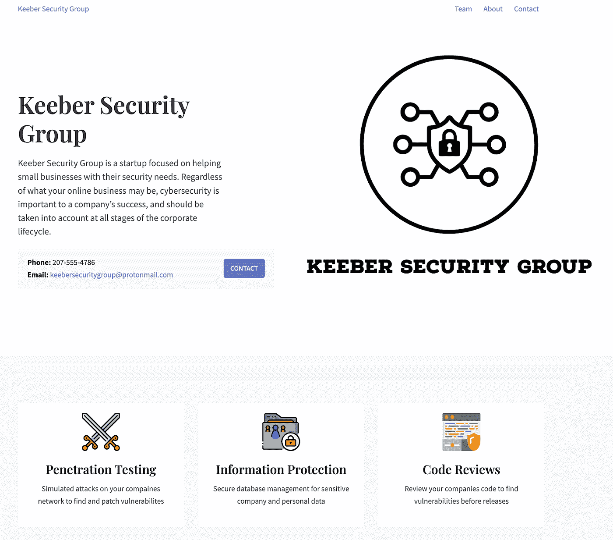

作者照片

为了识别是谁注册了这个站点，我使用了 *whois* Linux 命令来检索关于给定域的各种元数据。

通过运行:`*whois keebersecuritygroup.com*`，我们得到了这个标志:


作者照片

`*flag{ef67b2243b195eba43c7dc797b75d75b}*`

# 基伯 2 号

> “Keeber Security Group 是一家刚刚起步的新公司。团队总是在变化，有些人已经离开了公司。Keeber Security Group 很快改变了他们的网站，以反映这些变化，但肯定有一些方法可以找到前雇员。通过集团网站找一个前员工。”

## 解决方案:

对于这个挑战，我在挑战描述中用粗体标出的句子是找到旗帜的关键。

浏览 *Keeber Security Group* 公司网站上的*团队*部分，发现有 6 名员工:


作者照片

这是意料之中的，因为描述清楚地表明，该集团一直在快速更新他们的网站。

那么，我们如何访问网站的前一个版本，希望它仍然包含有关该前雇员的信息呢？

为此，我们可以使用[返程机](https://web.archive.org/)。Wayback Machine 是万维网的一个数字存档库，存储过时网页的存档副本。

在查找团队页面时，我们看到最早的副本出现在 4 月 19 日:

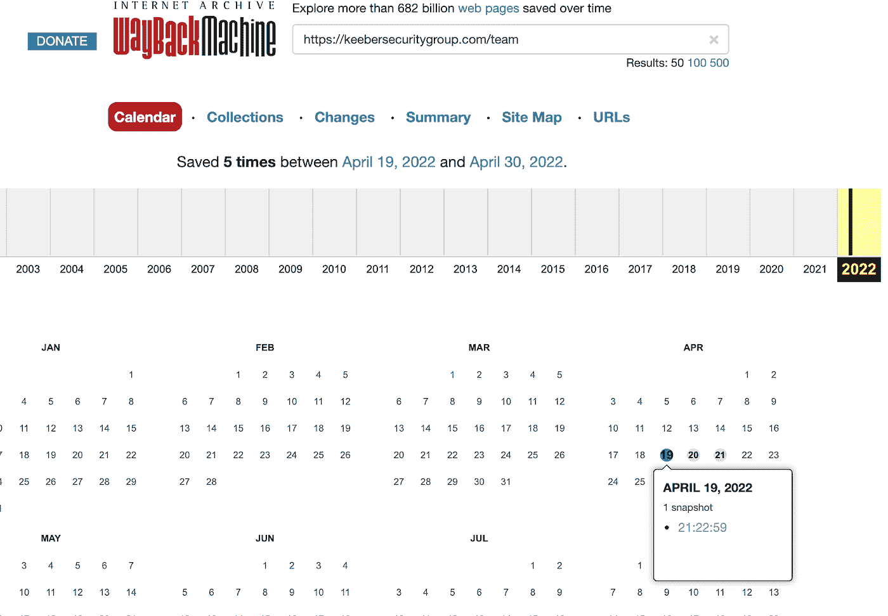

作者照片

点击页面的存档版本并向下滚动，我们将看到前雇员*蒂芙尼·道格拉斯*以及想要的旗帜:


作者照片

`flag{cddb59d78a6d50905340a62852e315c9}`

# 基伯 3 号

> “你找到的那名前雇员因“向公共 GitHub 库泄露秘密”而被解雇。找到承诺的秘密，并利用它找到公司的机密信息。”

Keeber Security Group 网站上有一个他们 Github 账户的链接。通过检查 ***安全评估工作流*** 存储库的提交历史，我们可以看到一条可疑的提交消息，声明*“已从存储库移除机密”*:

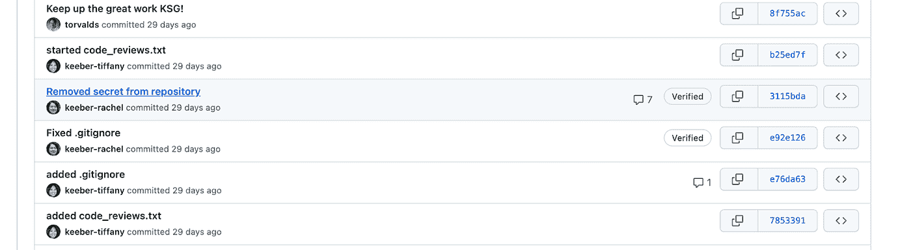

作者照片

通过点击上述 commit 并查看 diff，我们可以看到名为***asana _ secret . txt***的文件中的实际秘密。

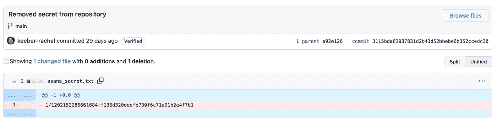

作者照片

乍一看，它没有说太多，所以我想我会做一些谷歌搜索，找出什么是体式，以及如何使用这个字符串。在对 [Asana 文档](https://developers.asana.com/docs/using-terminal)进行了一番挖掘之后，我发现了这个方便的文本框，它描述了如何使用 Curl 来查询 Asana API:

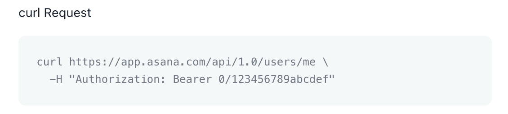

作者照片

正如☝️所看到的，curl 命令中的最后一个参数类似于我们在 Git 中发现的秘密。这必须是 API 令牌。

我们现在需要做的就是运行下面的 curl 命令:

```
curl https://app.asana.com/api/1.0/users/me -H “Authorization: Bearer 1/1202152286661684:f136d320deefe730f6c71a91b2e4f7b1”
```

我们得到以下响应:

```
{“data”:{“gid”:”1202152286661684",”email”:”keebersecuritygroup@protonmail.com”,”name”:”**flag{49305a2a9dcc503cb2b1fdeef8a7ac04}**”,”photo”:null,”resource_type”:”user”,”workspaces”:[{“gid”:”1202152372710256",”name”:”IT”,”resource_type”:”workspace”},{“gid”:”1146735861536945",”name”:”My Company”,”resource_type”:”workspace”},{“gid”:”1202202099837958",”name”:”Marketing”,”resource_type”:”workspace”},{“gid”:”1202201989074836",”name”:”Informatique”,”resource_type”:”workspace”},{“gid”:”1202203933473664",”name”:”Engineering”,”resource_type”:”workspace”},{“gid”:”1202205585474112",”name”:”Design”,”resource_type”:”workspace”},{“gid”:”1202206423101119",”name”:”IT”,”resource_type”:”workspace”},{“gid”:”1202166412558403",”name”:”richdn.com”,”resource_type”:”workspace”},{“gid”:”1202206546743807",”name”:”IT”,”resource_type”:”workspace”}]}}
```

其中包含我们的旗帜:`flag{49305a2a9dcc503cb2b1fdeef8a7ac04}`

# 基伯 4 号

> “这位前雇员还通过 GitHub 将公司密码数据库公开。由于密码在整个公司内共享，因此员工必须很容易记住。用于加密数据库的密码是一个与公司有关的小写单词。使用 Keeber 安全组面向公众的信息创建一个自定义单词列表，并使用它来打开密码数据库。”
> 
> (提示:开膛手约翰可能支持破解**。kdbx** 密码哈希！)

您可能已经猜到，提示在解决这个挑战中起着重要的作用。

但首先，我们需要找到密码数据库。我们返回到公司的 Github 页面，专门检查[密码管理器](https://github.com/keebersecuritygroup/password-manager)存储库，以找到所需的数据库文件:

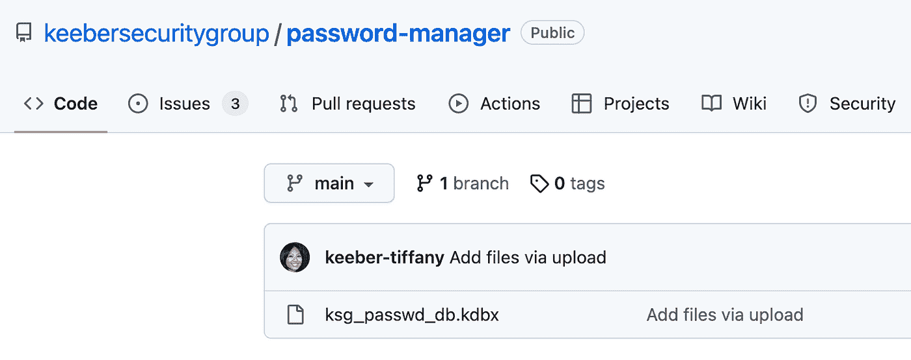

作者照片

你问的`.kdbx`文件是什么？

我问了 Google 同样的问题，了解到这个扩展通常与 **KeePass 密码安全**应用创建的数据文件有关。

下一个想到的问题是，我们如何破解这样一个`.kdbx`文件？

由于我从未遇到过这种格式，更不用说破解这样的文件，我再次转向谷歌寻找答案。搜索结果中的第一个链接是[这个伟大的指南](https://www.thedutchhacker.com/how-to-crack-a-keepass-database-file/)提供了如何使用[开膛手约翰](https://www.openwall.com/john/)或[哈希卡特](https://hashcat.net/hashcat/)破解`.kdbx`文件的详细演练。

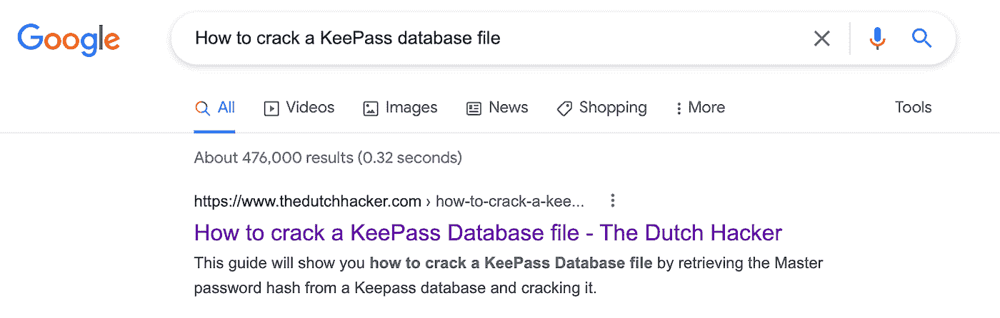

作者照片

根据指南(和挑战描述)，破解数据库文件需要经过 3 个阶段:

1.  从数据库文件中提取密码哈希
2.  生成自定义单词表
3.  使用 john-the-ripper 使用生成的单词列表来破解密码哈希

为了提取散列，我们运行以下命令:

`keepass2john ksg_passwd_db.kdbx > Keepasshash.txt`

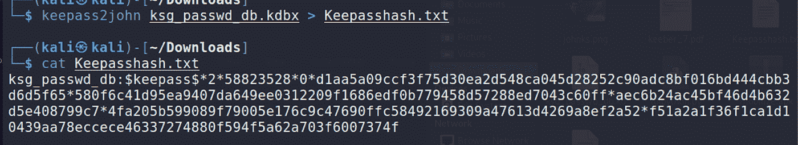

作者照片

现在我们有了密码散列，为了生成单词列表，我们将使用[自定义单词列表生成器](https://digi.ninja/projects/cewl.php) (CeWL)并将其提供给公司的 Github 页面:

```
cewl [https://github.com/keebersecuritygroup/security-evaluation-workflow](https://github.com/keebersecuritygroup/security-evaluation-workflow) -w word_list.txt — lowercase -d 1
```

最后，我们将使用生成的单词列表运行 john-the-ripper，以破解密码哈希:

`זדאגjohn --wordlist=word_list.txt Keepasshash.txt`

剩下的就是耐心等待结果，我们得到我们的密码:

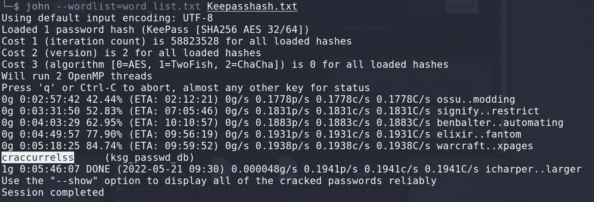

作者照片

```
**craccurrelss**
```

为了拿到旗子，我使用了一个名为 [app.keeweb.info](https://app.keeweb.info/) 的在线服务:

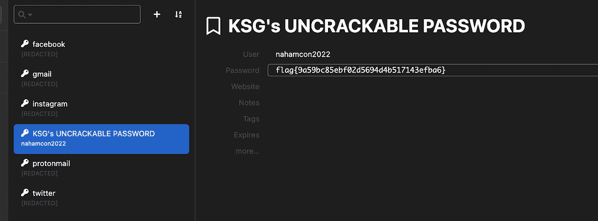

作者照片

或者，我后来发现，还有一个名为[***keepassx***](https://www.keepassx.org/)的实用程序，可以用来打开数据库文件并获取标志。

`flag{9a59bc85ebf02d5694d4b517143efba6}`

# 基伯 5 号

> “这位前员工在使用公司的 GitHub 时还犯了其他错误。所有员工都应该使用分配给他们的 keeber-@protonmail.com 电子邮件提交代码。他们犯了一些没有遵循这个惯例的错误。通过 GitHub 找到这个员工的个人邮箱。”

这个挑战实际上非常简单。因为描述中说前雇员使用个人电子邮件提交了代码，所以我简单地下载了存储库并运行了下面的 git 命令，以便获得所有向 repo 提交代码的用户和电子邮件地址:`git shortlog -sne --all`并找到了标记:

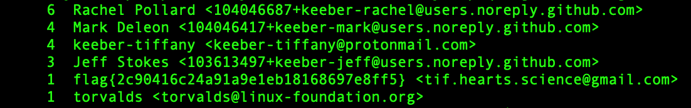

作者照片

`flag{2c90416c24a91a9e1eb18168697e8ff5}`

**注意**:从`git shortlog`命令[文档](https://git-scm.com/docs/git-shortlog)中可以看出,`-s '标志抑制提交描述，而`-e '标志添加作者的电子邮件地址。

# 基伯 6 号

> “在这位前雇员的错误给公司造成了所有的损失之后，Keeber 安全集团起诉他们玩忽职守！为了提起适当的诉讼，我们需要知道他们在哪里，以便有人可以去为他们服务。你能找到前员工的新工作场所吗？旗帜是常规格式，可以在 Yelp 最近对他们新工作场所的评论中找到。
> 
> (提示:您需要从过去的挑战中找到的电子邮件中转移出来！)"

对我来说，这是整个 CTF 最具挑战性和最愉快的挑战。由于我缺乏任何有意义的经验，我没有用非常有条理的方法去解决它，但是我在这个过程中学到了很多。

我开始尝试用谷歌搜索 tif.hearts.science@gmail.com 的电子邮件地址，但没有成功。

然后，我在她的 Github 页面上发现，当她为 Keeber Security Group 工作时，她住在缅因州:

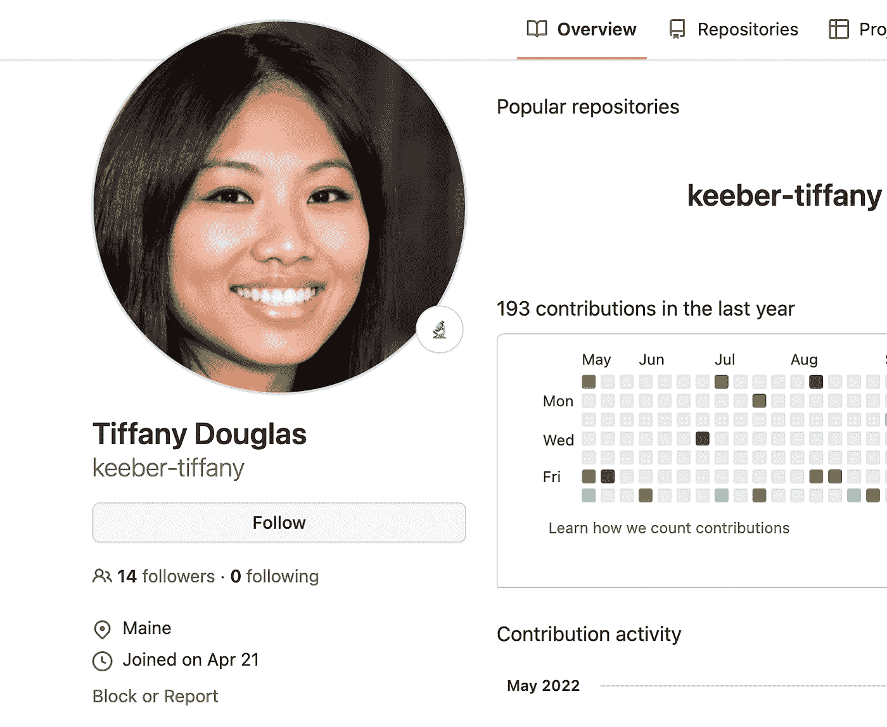

作者照片

这让我认为她的新工作地点也在同一地区。

不幸的是，试图在 Yelp 上搜索电子邮件地址也是一个死胡同，缅因州地区有太多的企业，更不用说评论了，一个一个地检查它们是现实的。我们需要找到更多的信息来帮助我们缩小搜索范围。

在几个小时没有太大进展后，我意识到这个挑战可能需要一个更有方法的方法。

经过一番探索，我了解到有专门的工具可以完成这样的任务。其中一个工具是[夏洛克](https://github.com/sherlock-project/sherlock)，它允许通过用户名查找社交媒体账户:

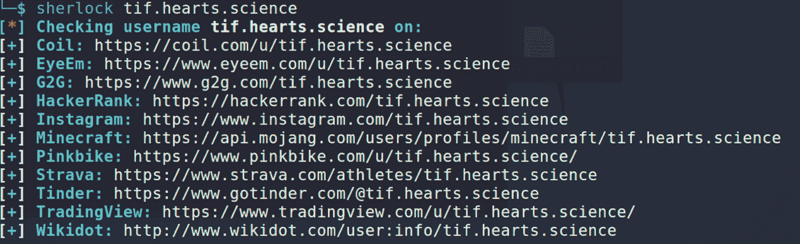

作者照片

有一些误报，但这个挑战的相关账户竟然是[蒂芙尼的 Instagram 账户](https://www.instagram.com/tif.hearts.science/)。

她的 Instagram 账户只有 6 个帖子，却包含了大量有用的信息。

例如:


作者照片

这两张图片清楚地表明，蒂芙尼已经放弃了她的软件工程抱负，并在一家酒店找到了一份新工作。

我们越来越近了…

现在剩下的就是找到确切的酒店。我们得到的另一个提示是下面的图片，它告诉我们有问题的酒店有一个室内游泳池:


作者照片

在这一点上，我觉得我有足够的信息来尝试和确定确切的酒店。

我去了猫途鹰，开始查看缅因州地区有室内游泳池的酒店，直到我发现了 Residence Inn，或者更具体地说，这些图片:


作者照片


作者照片

火坑立刻吸引了我的目光，因为它与我在蒂芙尼 Instagram 帖子中看到的火坑相似:


作者照片

叫喊住宅旅馆确实让我们得到了蒂芙尼的评论和想要的旗帜:

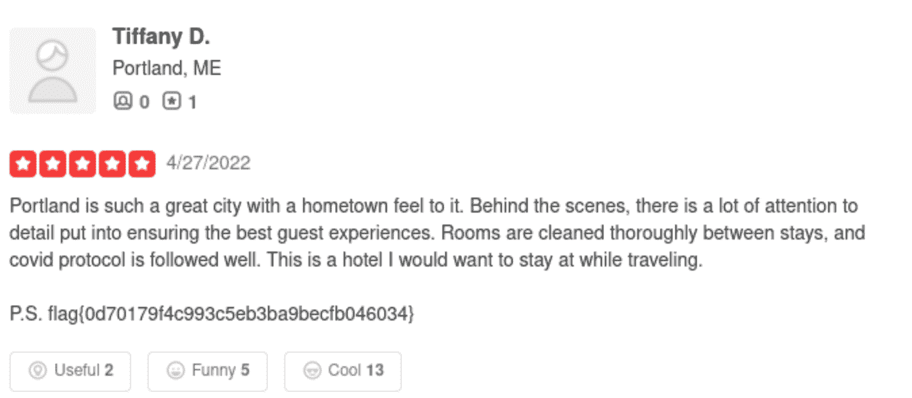

作者照片

`flag{0d70179f4c993c5eb3ba9becfb046034}`

## 🌐关于地理定位的一些话🌐

这个挑战主要是地理定位的挑战。基于地理定位的 OSINT 可能应该有一个自己的帖子。如果你想了解基于地理定位的调查的复杂程度和独创性，我推荐你看看这篇[文章](https://exposingtheinvisible.org/en/guides/geolocating-images-suncalc/)。要获得一些实践地理定位挑战的实践经验，请查看:

1.  geoguesrr，一款地理游戏，在这个游戏中，你被丢到世界上某个地方的街景全景中，你的任务是找到线索并在世界地图上猜测你的位置。
2.  [**Verif！阳离子问答机器人**](https://twitter.com/quiztime) ，一个定期发布简短地理位置挑战的 Twitter 账户。

你可以找到很好的地理定位方法来解决这个挑战👇此处为线索[的附加图像，此处](https://bytebreach.com/nahamcon-2022-ctf-writeup/#20-keeber-osint)[为](https://github.com/piyagehi/CTF-Writeups/blob/main/2022-NahamCon-CTF/Keeber.md#description-5)。


**注:** *挑战 7 和挑战 8 在比赛结束后解决。为了完整起见，我在这里提供了他们的解决方案。*

# 基伯 7 号

> “多名员工收到了来自同一个网络钓鱼方案的奇怪的网络钓鱼邮件。利用钓鱼邮件对应的邮件，找到骗子的真实身份。该标志采用常规格式。
> 
> (注:这个挑战不用花钱就能解决！)"

查看网络钓鱼电子邮件内容时，我们发现欺诈者提供了 cheerios.fanatic1941@gmail.com*作为联系电子邮件地址:*

**

*作者照片*

*在这种情况下，试图通过夏洛克追踪用户名没有帮助。*

*比赛结束后，我了解到有一个名为 [Maltego](https://www.maltego.com/) 的强大工具，可以使用它的社区添加功能来识别与用户 ***麦片 _ 爱人 1990*** 下的上述电子邮件地址相关联的 Myspace 帐户:*

*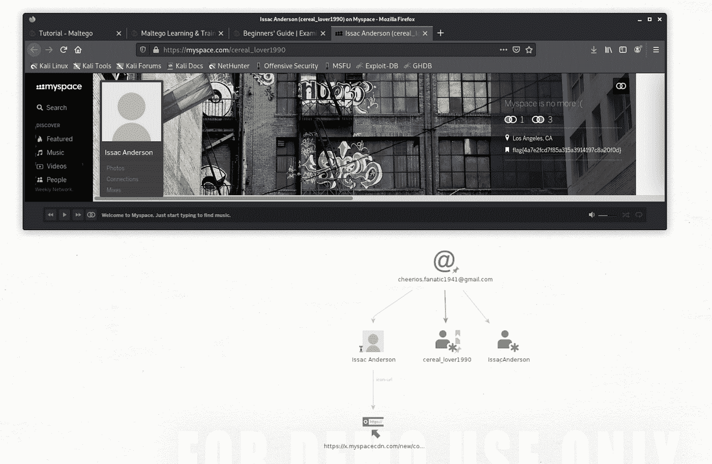*

*作者照片*

*在 [Myspace 页面](https://myspace.com/cereal_lover1990)中，我们找到了 f lag: `*flag{4a7e2fcd7f85a315a3914197c8a20f0d}*`*

***注意:** Maltego 使用起来不太直观，或许应该有一篇自己的博文，但在这种情况下，所需要的只是:*

1.  *创建新图表*
2.  *将电子邮件调色板拖到上面并编辑它以反映出***cheerios.fanatic1941@gmail.com***的电子邮件地址*

*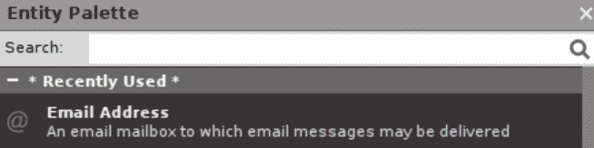*

*作者照片*

*3.右键单击电子邮件图标，运行一些可用的转换器。在本例中，相关的转换程序是: ***转换为 Myspace 账户*** 。*

*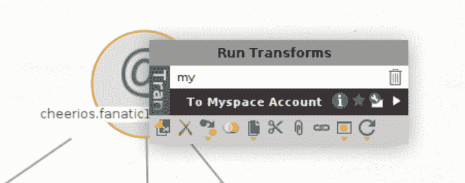*

*作者照片*

# *基伯 8 号*

> *“尽管我们花了这么多时间教人们网络钓鱼，但 Keeber 的某个人却上当了！玛丽亚回复了邮件，并发送了一些她的个人信息。根据您在上一个挑战中的发现，找出 Maria 的个人信息发布的位置。”*

*现在我们有了另一个用户名 ***麦片 _ 爱人 1990*** ，我们可以回到夏洛克，看看会出现什么:*

*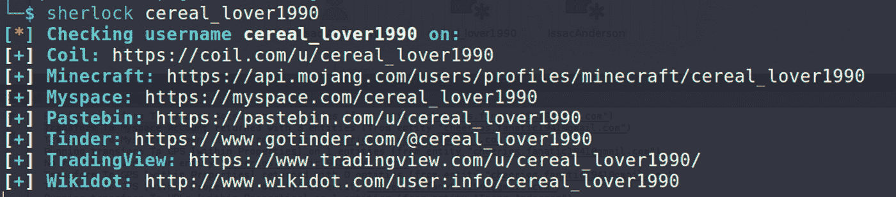*

*作者照片*

*这一次，相关链接是指向 [Pastebin](https://pastebin.com/u/cereal_lover1990) 的链接，其中我们找到了 Maria 的个人信息以及我们的旗帜:*

*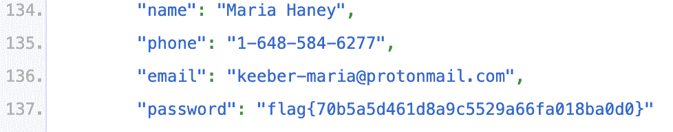*

*作者照片*

*`flag{70b5a5d461d8a9c5529a66fa018ba0d0}`*

# *最后的想法*

*这就结束了纳哈姆孔 CTF 系列的 OSINT 挑战。*

*在解决这些挑战的过程中，我学到了很多东西，我不禁感激可能是为了建立这些挑战而付出的巨大努力(向 **@matlac#2291** 和 **@Gary#4657** 致敬)。*

*我希望我能够传达我的思考过程和学习。*

*如果您有任何问题，请在评论中留下您的想法，或者直接通过 [Twitter](https://twitter.com/pyotam2) 联系我们。*