# APU 黑客之战 2019 决赛记起

> 原文：<https://infosecwriteups.com/apu-battle-of-hackers-final-2019-write-up-e4141f21b0a4?source=collection_archive---------0----------------------->

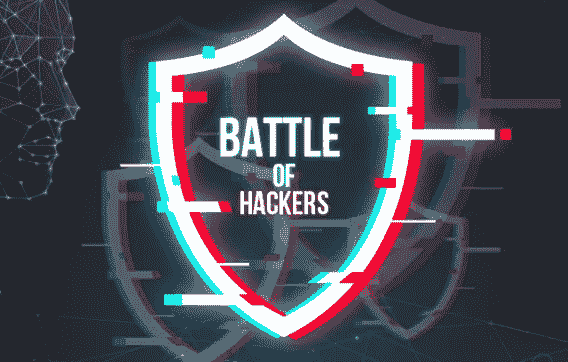

这是一篇关于我的团队如何解决 APU 黑客之战 2019 (APUBoH)在最后一轮捕捉旗帜中的挑战的文章。在 CTF 结束时，我们排名第 9，并设法解决了 3 个问题，2 个法医问题和 1 个隐写术。

对于那些不熟悉《夺旗》(CTF)的人来说，你可能想看看我之前的文章，在那里我解释了一点关于 CTF 的情况。

 [## 我的第一篇 CTF 报道:毕马威 2019 年网络安全挑战

### CTF:学习黑客的有趣方式

medium.com](https://medium.com/@mfrashad/my-first-ctf-writeup-kpmg-cyber-security-challenge-2019-a42a64db04d8) 

继续，这篇文章的挑战可以在 github 上下载:
【https://github.com/mfrashad/apuboh19 

好了，继续写文章。

# 密写

# 尼亚尼亚尼亚

当我们下载挑战赛的附件时，我们得到了一个名为 All_Star_-_Smash_Mouth.mp3 的 mp3 文件。打开该文件，它是一首歌，但奇怪的是它有一张封面图片。

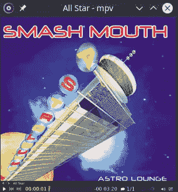

后来，我们尝试了一些常见的技巧，如字符串命令，并查看文件的频谱图，但它并没有给我们带来任何线索。

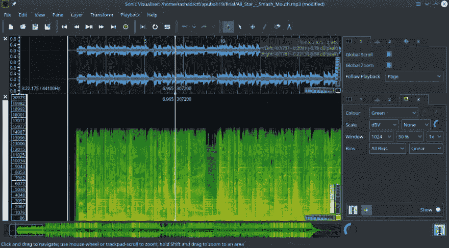

文件的光谱图

但是，我们在使用 binwalk 雕琢文件时发现，文件中嵌入了一个 png 文件。

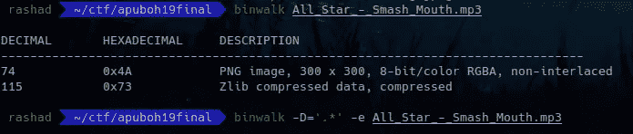

接下来，我们继续提取图像，打开它，不出所料，我们会看到与之前看到的相同的封面图像。

但现在，由于我们有一个 png 文件要处理，我们可以尝试各种图像隐写程序。因此，我们做的第一件事是在 Stegsolve.jar 中打开图像，这是一个 java 程序，将对图像应用各种操作，如求逆、异或或噪声等。令人惊讶的是，它立刻为我们展示了红色飞机 1 上的旗帜。

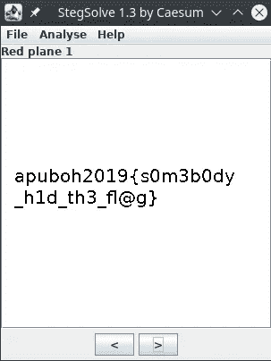

Stegsolve.jar

标志为***apuboh 2019 { s 0 m3 b 0 dy _ h1d _ th3 _ fl @ g }***。

# 辩论术

# 邻居

对于这个挑战，我们得到了一个 pcapng 文件`neighbors.pcapng`。由于这是一个 pcap 文件，我们继续在 wireshark 中打开它。接下来，我们开始在 flag 格式中搜索一些关键字，在本例中是“apu ”,幸运的是，它马上就给了我们这个标志。

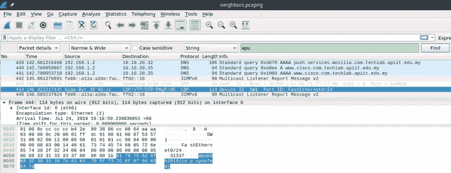

标志为***apuboh 2019 { CDP _ spoofed }***。

# 闭嘴

下一个挑战也是网络取证挑战，我们又得到了`zipit.pcapng`，一个 pcapng 文件。然而，这一次，搜索字符串不会给我们带来任何东西。经过四处寻找，我们发现了一些可疑的 HTTP 数据包，这可能是线索。因此，我们使用 wiresharks 中的导出对象功能。

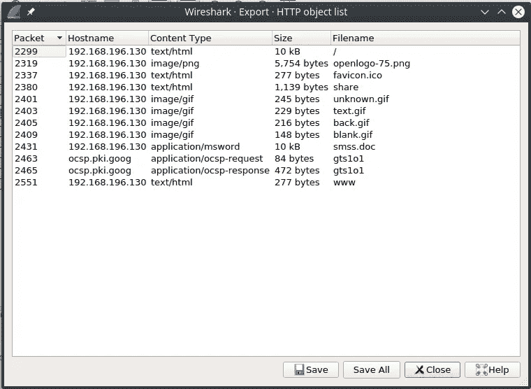

导出文件后。我们运行`file`命令来检查文件。

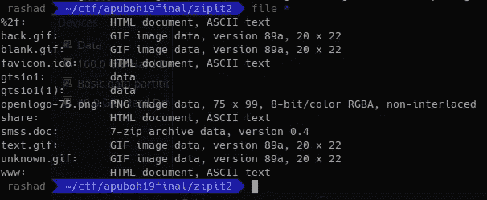

根据输出，`smss.doc`文件很突出，因为它是一个 zip 文件，与标题相关。因此，我们试图提取`smss.doc`文件，但是它要求输入密码。到这个时候，我们知道我们在正确的轨道上，这可能是有标志的文件。接下来，我们开始搜索密码，我们在一个导出的文件中找到了线索，`share`。

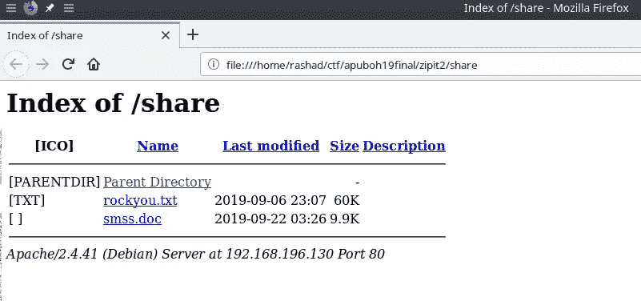

我们发现了一个关于`rockyou.txt`的文本，这是一个非常有名的用于破解的密码列表。因此，我们尝试使用压缩文件破解工具`fcrackzip`和`rockyou.txt`字典来破解这个压缩文件。

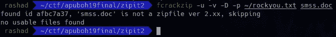

然而，它给了我们一个错误，即它不是一个 zip 文件。经过一番搜索后，我们发现这个文件不是通常的 PKzip 文件，而是 7zip 和 fcrackzip 无法与 7zip 文件一起工作(我花了很长时间才弄明白这一点，我以为我只需要使用不同的版本)。因此，我们寻找其他破解工具，找到了 7 个 zip-crack。
[https://github.com/Goron/7zip-crack](https://github.com/Goron/7zip-crack)

然后，我们开始用 7zip-crack 的`rockyou.txt`字典破解文件。过了一会儿它终于给了我们密码`godisgood`，耶！。

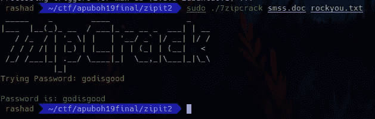

用密码解压 zip 文件会给我们一个 PE32 Windows 可执行文件`smss`。我们首先尝试的总是`strings`，但遗憾的是它没有给出任何结果。

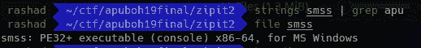

由于这是一个可执行文件，我们认为这将是一个逆向工程的挑战，并试图运行和逆向工程。但是我们甚至没能在 dos 模式下运行这个程序，因为它出现了一些错误。试图在 IDA pro 中对程序进行逆向工程只会让我们更加困惑，因为我们只能进行静态分析，而不能调试程序。

幸运的是，我们在`hexedit`中打开了该文件，在这里您可以读取该文件的二进制格式和十六进制格式。

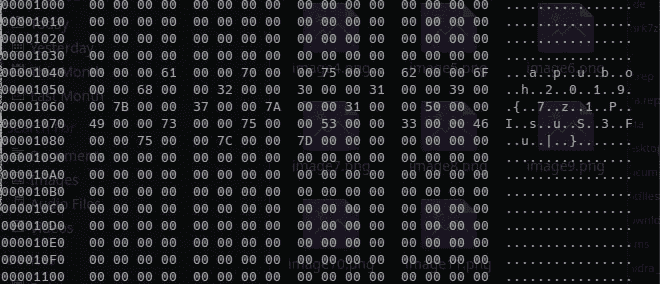

hexedit 中的 smss 文件

耶，我们找到旗子了！我们怀疑`strings`命令没有选择标志的原因是因为标志不是一串字符，而是由 0 位或空格分隔。这个挑战真的花了我们相当长的时间，也相当令人沮丧。我们真的很幸运能在 hexeditor 中打开这个文件，否则我们就会错过这个标志。

标志为***apuboh 2019 { 7z 1 pisus 3 fu | }***

# 结论

上面的挑战可能看起来很简单，但是我们在解决它的时候确实有点困难。然而，我们的大部分时间都花在试图解决我们没有解决的其他挑战上，尽管我们确实取得了一些进展。当我有时间的时候，我可能会编辑这个帖子来添加其他挑战的文章，但是请随意在评论中发布您的解决方案或链接到您的文章！

我的一个遗憾是，在参加比赛之前，我没有更彻底地研究二进制剥削问题。我期待基本的逆向工程挑战，但给了二进制开发挑战，如基本堆栈或缓冲区溢出。如果我事先研究了这些，我们的排名会提高很多。

总的来说，这是一次很棒的经历，我们从比赛中学到了很多。此外，我要感谢我的队友法里斯·罗斯利和谭力·童的出色表现，感谢他们花时间为比赛进行练习。也感谢 APU(亚太大学)举办此次活动！这里应该有更多的反恐部队！

对于 APU BoH 2019 的其他参与者，请随意在评论中发布您的解决方案或发布您的书面报告的链接！

*原载于 2019 年 11 月 24 日*[*https://dev . to*](https://dev.to/mfrashad/apu-battle-of-hackers-final-2019-write-ups-19ad)*。*