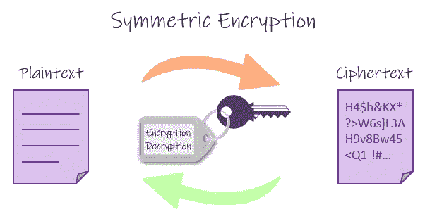
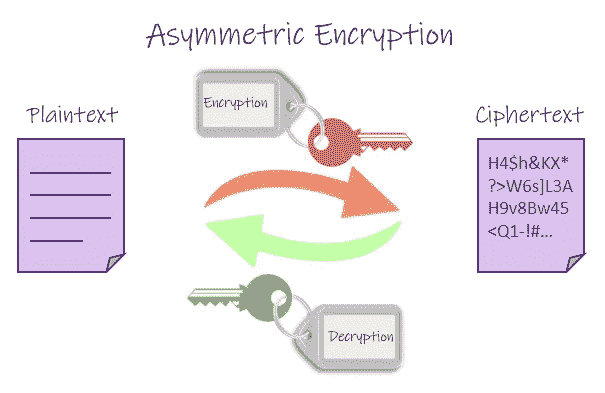
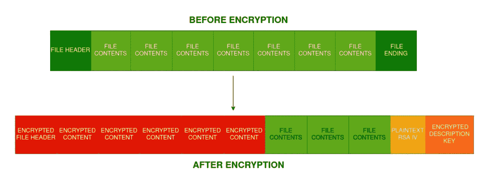
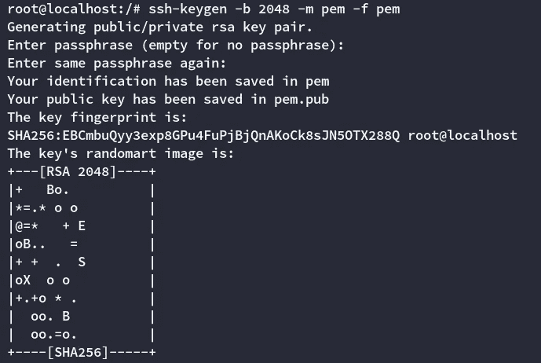
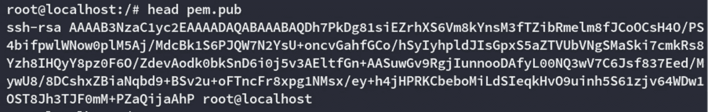
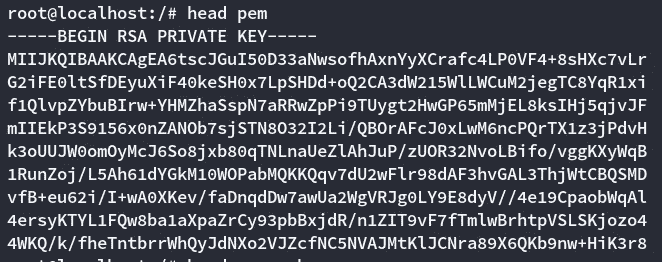

# 勒索软件的架构(1/2)

> 原文：<https://infosecwriteups.com/architecture-of-a-ransomware-1-2-1b9fee757fcb?source=collection_archive---------3----------------------->

第二部分链接:[https://securityshenanigans . medium . com/architecture-of-a-ransomware-2-2-e 22 D8 EB 11 CEE](https://securityshenaningans.medium.com/architecture-of-a-ransomware-2-2-e22d8eb11cee)

在过去的几个月里，我们看到了勒索软件相关事件的增加，主要是由于新冠肺炎病毒导致远程工作的增加。尽管如此，并非所有勒索软件都以相同的方式工作，为了在攻击成功时有更好的事件响应，我们应该很好地了解其内部工作方式。这有望帮助您逆转勒索软件的加密机制，或者至少防止进一步感染。

了解一个东西如何真正工作的最好方法之一是尝试自己去构建它(这就是我所做的)。所以在这两部分的写作中，我们将花第一部分解释你需要理解的原则和概念。在第二部分中，我们将应用这些原则编写自己的勒索软件。

> 注意:一些比我更有常识的朋友指出，发布勒索软件的完整代码可能不是最好的主意，所以我们将只编写一些部分来说明关键点。

## 基本原则

谈到勒索软件，你需要知道的最重要的概念是所使用的加密类型。有两种主要的方法，这两种方法都可以用于你在野外可能遇到的任何像样的勒索软件。我们将简要解释它们，并为您自己学习这些概念提供参考。

## 对称加密



每个过程使用相同的密钥([来源](https://www.101computing.net/symmetric-vs-asymmetric-encryption/)

对称加密是大多数人熟悉的一种加密方式。您有一个秘密或密钥，您使用这个秘密来加密和解密数据。你用同一个钥匙做两个操作。这是一种加密技术，你可以用它来加密 zip 文件或 Office 文档。用来加密文件的密码就是用来解密文件的密码。

## 不对称加密



每个过程不同的键([源](https://www.101computing.net/symmetric-vs-asymmetric-encryption/))

不对称加密是另一个让大多数人感到困惑的概念。但是如果你把它从具体的实现中分离出来，这是可以理解的。

基本上，非对称加密使用两个密钥而不是一个。您可以使用任何密钥来加密文件，但是您需要使用另一个密钥来解密它。就是这样。

现在，您可能已经听说过秘密密钥和公开密钥。这些是简单保存的密钥，就像它们的名字一样，公开的或秘密的。因此，任何人都可以访问您的公钥，用它来加密某些东西，只有您能够解密它(因为它需要您的密钥来解密)。你可以用你的秘密密钥来加密任何信息，每个人都可以阅读它，因为它需要你的公开密钥来解密。这个动作也被称为签名，因为它的目的不是保密，而是证明你是发送消息的人(就像真实生活中的签名一样)。

## 勒索软件相关应用

让我们想一想常规感染的流程。勒索病毒的有效载荷通过多种途径(网络钓鱼、易受攻击的软件等)中的一种传递，并在计算机上运行。所有文件都被加密了。之后会出现一张纸条，要求以某种形式的付款来换取解密文件的方法。如何才能实现这一点？

我们的第一直觉可能是对文件使用对称加密。这是错误的，任何像样的勒索软件都会避免这样做，原因很重要。当勒索软件加密我们受害者的文件时，加密密钥需要存在于某个地方。如果您使用对称加密，用于加密的加密密钥也可以用于解密。这意味着有能力的法医分析师可以恢复在感染期间用于加密的密钥，然后用它来解密文件。当您使用非对称加密时，您使用不同的密钥进行加密和解密，因此在受害者的计算机中拥有加密密钥并不是什么大问题，只要您保持解密密钥的安全。

我们需要考虑的另一件重要事情是，作为攻击者，我们需要拥有那把钥匙，以防受害者决定支付赎金。当使用对称加密时，我们需要将密钥硬编码在二进制代码中(坏主意，有多种方法可以逆转这一点)，或者在运行中生成密钥，并找到一些方法将其传输到我们的攻击服务器(这也是一个坏主意，因为它可能在传输过程中被拦截，如果计算机失去连接，我们将无法帮助受害者，因为我们没有密钥)。像这样的方案被第一批加密防御使用，允许受害者解密他们的文件，因为密钥在生成后被传输到服务器，并且意外地留在了本地文件系统中。

这无疑意味着我们需要使用非对称加密来加密受害者的文件，对吗？我们可以生成一个密钥对，在代码中硬编码公共密钥对，然后用那个密钥对所有东西进行加密(保持私有密钥对的完整性……秘密性)？不，我们不能。

你看，非对称加密比对称加密慢几个数量级。当你加密受害者的硬盘驱动器时，你需要尽可能快地加密所有内容。如果完全加密需要几分钟以上的时间，受害者可能会注意到他们的文件被加密了，并简单地关闭计算机。这将允许他从硬盘上取回剩余的文件。

那么我们应该用什么呢？

## 混合方法。


为了解决这个问题，我们可以使用混合方法。当我们生成有效负载时，我们还生成一组与该有效负载相关联的公钥/私钥。我们将公钥硬编码在有效负载中，每当感染发生时，有效负载都会生成一个用于对称加密的密钥。加密之后，我们用硬编码的公钥加密对称密钥(当然，明文对称密钥会从内存/磁盘中销毁)。这个加密的对称密钥保存在机器的某个地方，我们在勒索信中向受害者索要这个密钥。但是我们还有另一个问题。

## 密钥环利用/选择明文攻击

[选择明文攻击](https://simple.wikipedia.org/wiki/Chosen-plaintext_attack)是一种密码攻击，攻击者在加密前知道明文，给定足够大的加密文件样本，理论上可以从加密结果中导出密钥。大多数文件的文件头都会发生这种情况，因为它们的格式是已知的。如果我们对所有文件使用相同的密钥，在一定条件下，理论上是可以恢复的。[这其实就是地穴](https://blog.checkpoint.com/2014/08/27/hacking-the-hacker/)发生的事情。由于糟糕的加密实现和密钥重用的结合，加密被逆转。
这个问题可以通过为每个文件使用不同的密钥来解决。我们可以为每个文件生成对称密钥，加密文件，用有效载荷中的公钥加密密钥，在某个地方写入加密的对称密钥并删除明文对称密钥。

许多勒索软件使用这种方法，它们生成一个文本文件，其中包含每个加密的文件名+与之相关的加密公钥。使用解密工具时，它会读取文本文件，用私钥解密每个密钥，然后用解密后的密钥解密文本文件。但是我们将使用不同的东西。

> 技术说明:这种类型的攻击实际上不会影响我们将使用的对称加密密码(AES-256 ),因为默认情况下，它对每个文件流使用不同的随机化初始化向量(IV ),但我想解释一下适用于所有勒索软件的一般概念。如果恶意软件开发者犯了一个错误，这可能有助于您恢复数据…
> 
> [这种攻击实际上可能会影响 RSA 加密，因为在其最基本的形式中，它不是随机化的](https://stackoverflow.com/a/7933071)。这在我们的例子中不成问题，因为:
> a)我们将使用 RSA 加密的唯一内容是 AES 加密密钥，这些密钥既不构成大样本也不构成同质样本来分析，并且
> b)我们将结合使用 RSA 和[最优非对称加密填充](https://en.wikipedia.org/wiki/Optimal_asymmetric_encryption_padding)，这增加了加密的随机性。

为每个文件使用不同密钥的另一个优点是，加密密钥可以在加密每个文件后删除，因此如果任何分析师试图恢复密钥，他将只能恢复用于最后一个文件的密钥。如果我们对所有文件使用同一个密钥，该密钥可以在加密过程的任何部分被恢复，并且所有文件都是可恢复的。

## 速度考虑

在编写我的勒索软件时，最初的版本使用了我到目前为止解释的所有功能，但结果有些令人失望。当使用 32 位密钥(AES-256)时，我的初始基准测试显示加密速度约为每分钟 1GB。当然，这个速度很大程度上取决于受害者的硬件，当然我使用的是虚拟机，因为我不想意外加密我的开发计算机，但仍然，花 16 分钟加密一个简单的 1TB 硬盘驱动器是不可取的。
那么，现代勒索软件如何在几秒钟内加密几千兆字节的信息呢？答案在文件结构中。

你看，你实际上不需要加密整个文件使其不可用。根据文件格式，加密文件头和大部分初始字节足以使文件不可读。我们或许可以对每个文件的前 5 兆字节进行加密。我知道你在想什么，是的，像 txt/ascii 文件这样的简单文件使用类似 [strings、](https://linux.die.net/man/1/strings)的东西仍然是可读的，但是大多数时候这些文件的重量不会超过几 kb 的内存。此外，受害者最珍贵的文件通常是文件、图片和视频。您仍然可以尝试对文件进行取证分析并恢复一些内容，但这是一种需要对每个单独的文件进行手动分析的方法，根本不切实际。

改变文件的结尾也是理想的，我们可以通过在结尾添加两个结构来利用这一点。

1.  初始化向量:当用 AES 加密文件时，你需要一个叫做初始化向量的东西。这是在加密过程开始时生成的。
2.  加密的解密密钥:我们也可以将加密的解密密钥附加到每个文件的末尾。这将消除存储每个文件解密密钥的文本文件的必要性。

加密的文件结构最终会变成这样:



解密后文件结构的粗略模型


(以防有人想批评我的颜色选择)

“加密文件的一部分”方法的另一个优点是，它允许我们处理同一个文件，而不是生成一个新的加密文件并删除旧的文件。这在我们有权限写入现有文件但没有权限创建新文件的边界情况下会很有帮助。它还允许我们快速处理非常大的文件(比如 500gb 的 MySQL 数据库)。

## 最终考虑

在为每个进程选择了适当的加密之后，我们需要设计我们的框架来分发这个恶意软件。这将涉及为每个有效载荷创建一组密钥的自动化过程，因为我们不希望所有受害者共享同一个密钥(如果有人支付赎金，它可以分发密钥，每个人都可以解密他们的信息)。我们还需要保存每个受害者相关钥匙的数据库。

由于这个过程的这一部分根本没有教育意义，只能用于恶意目的，所以我没有编写代码，也不会解释它是如何实现的。写这篇文章的目的是向蓝队队员展示以前的勒索软件是错误的，这可以阻止感染的发生/传播。

要为单个有效负载生成非对称密钥，我将使用以下 ssh-keygen 命令:

```
ssh-keygen -b 2048 -m pem -f pem
```

这将生成 pem 格式的公钥(pem.pub)和私钥(pem)。我们将把 pem.pub 与生成的可执行文件捆绑在一起，以测试我们的概念恶意软件。



生成两个密钥



公开密钥



私人密钥

这是第一部分。在第二部分中，我们将对恶意软件(的某些部分)进行编码，并对其执行进行基准测试，以展示恶意软件加密文件的速度有多快。