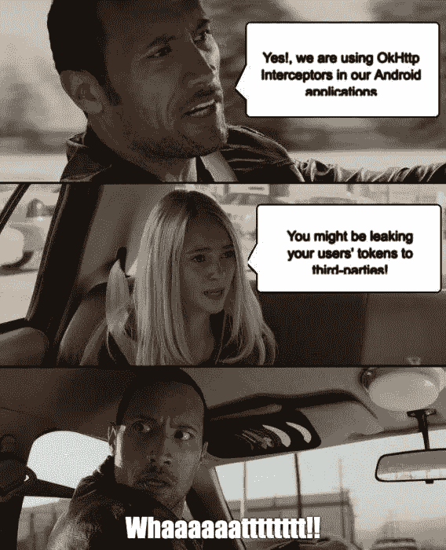
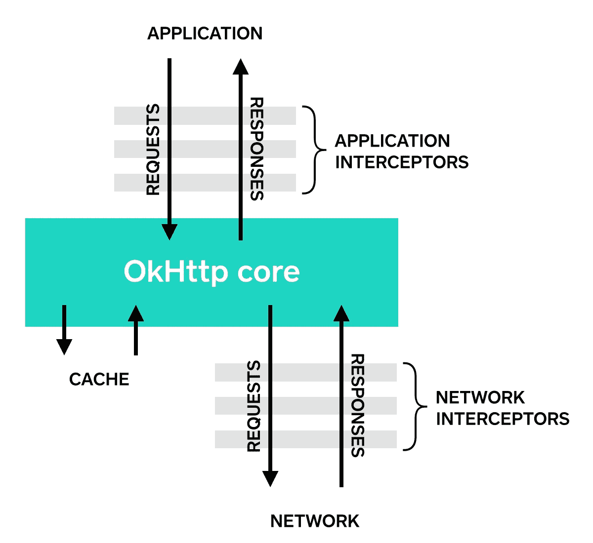

# 您确定您没有向第三方泄露用户的身份验证令牌吗？

> 原文：<https://infosecwriteups.com/are-you-sure-that-youre-not-leaking-user-s-access-tokens-to-third-parties-da16d63faaf4?source=collection_archive---------0----------------------->

## OkHttp 在重定向期间保留 Auth 头的行为



你是一个倾向于安全性的 Android 开发人员，还是一个热衷于将多个点连接起来以识别一个很酷的安全漏洞的应用程序安全人员？你忘了 Android 开发者的朋友 OkHttp 在重定向期间保留了 auth 头吗？如果**是**，那么这个故事对你来说会很有趣。它讨论了 OkHttp 在重定向到第三方域期间保留 auth 头的行为。

为了更好地理解这一点，让我们首先回顾一下围绕这个问题的一些基本情况。如果你已经知道 OkHttp 和应用程序和网络拦截器的概念，你可以跳过下面的章节，直接从**这个问题开始！**

# OkHttp 是什么？

[OkHttp](https://square.github.io/okhttp/) 是一个 Http 客户端，它是由 [Square](https://square.github.io/) 开发的第三方库，用于发送和接收基于 HTTP 的网络请求。它也是另一个广泛使用的 HTTP 客户端[改进](https://square.github.io/retrofit/)的底层库。

# OkHttp 拦截器

拦截器是一种强大的机制，可以监控、重写和重试网络调用。对于大规模的应用程序，我们有许多 API 与我们的后端进行通信，编写常见的逻辑(如加密请求体、解密响应体、将访问令牌附加到请求、处理特定的响应(例如 HTTP-401-未授权/HTTP-403-禁止)等)可能会非常繁琐和重复。对于每一个 API 调用，这就是拦截器帮助我们拯救的地方。

我们在后端使用 API 网关作为后端的入口点，我们可以将拦截器视为前端发出的所有请求的网关。

# 应用程序与网络拦截器

OkHttp 拦截器可以注册为一个应用程序或网络拦截器，如下所示:



参考:[方形](https://square.github.io/okhttp/interceptors/)

## 应用拦截器

```
client = new OkHttpClient.Builder()
        .addInterceptor(new SessionTokenInterceptor())
```

**网络拦截器**

```
client = new OkHttpClient.Builder()
        .addNetworkInterceptor(new LoggingInterceptor())
```

当我们附加一个拦截器作为网络拦截器时，拦截逻辑也应用于中间请求和响应，例如重定向和重试。然而，在应用程序拦截器的情况下，逻辑只应用于重定向情况下的第一个请求和最后一个响应。

让我们通过[官方文档](https://square.github.io/okhttp/interceptors/)中引用的例子来理解它，其中我们编写了一个*日志拦截器*，它记录请求和响应，我们对 URL `[http://www.publicobject.com/helloworld.txt](http://www.publicobject.com/helloworld.txtwhich)` [进行网络调用，然后](http://www.publicobject.com/helloworld.txtwhich)通过返回一个 HTTP-3XX 响应重定向到`[https://publicobject.com/helloworld.txt](https://publicobject.com/helloworld.txt)`。

在将 *LoggingInterceptor* 作为应用程序拦截器附加的情况下，我们在日志中得到以下内容:

```
INFO: Sending request http://www.publicobject.com/helloworld.txt on null
User-Agent: OkHttp Example

INFO: Received response for https://publicobject.com/helloworld.txt in 1179.7ms
Server: nginx/1.4.6 (Ubuntu)
Content-Type: text/plain
Content-Length: 1759
Connection: keep-alive
```

当它作为网络拦截器附加时，以下内容将被推送到日志中:

```
INFO: Sending request http://www.publicobject.com/helloworld.txt on Connection{www.publicobject.com:80, proxy=DIRECT hostAddress=54.187.32.157 cipherSuite=none protocol=http/1.1}
User-Agent: OkHttp Example
Host: www.publicobject.com
Connection: Keep-Alive
Accept-Encoding: gzip

INFO: Received response for http://www.publicobject.com/helloworld.txt in 115.6ms
Server: nginx/1.4.6 (Ubuntu)
Content-Type: text/html
Content-Length: 193
Connection: keep-alive
Location: https://publicobject.com/helloworld.txt

INFO: Sending request https://publicobject.com/helloworld.txt on Connection{publicobject.com:443, proxy=DIRECT hostAddress=54.187.32.157 cipherSuite=TLS_ECDHE_RSA_WITH_AES_256_CBC_SHA protocol=http/1.1}
User-Agent: OkHttp Example
Host: publicobject.com
Connection: Keep-Alive
Accept-Encoding: gzip

INFO: Received response for https://publicobject.com/helloworld.txt in 80.9ms
Server: nginx/1.4.6 (Ubuntu)
Content-Type: text/plain
Content-Length: 1759
Connection: keep-alive
```

我认为您应该对基础知识有足够的了解，以便正确理解和识别安全问题。

# 问题！

当我们使用一个拦截器将访问令牌附加到 HTTP 请求上，并将这个拦截器作为应用程序拦截器添加到 OkHttp 客户端时，就会出现安全问题。

如果满足以下任一条件，则应用程序是安全的:

*   您没有使用拦截器来添加访问令牌
*   您使用名为 *Authorization* 的 HTTP 头将访问令牌传递给后端
*   你正在使用拦截器，但是你的后端从来没有重定向用户到任何第三方域

因为如果使用除了*授权*之外的任何名称传递访问令牌，即使重定向到外部域，OkHttp 应用程序拦截器也会自动将报头附加到重定向。我在 OkHttp v3.5 上测试了这种行为

# 演示时间


出于演示的目的，我创建了一个示例 Android 应用程序，它使用 OkHttp 对后端进行 API 调用，并获得重定向响应。你可以在这里找到源代码[。](https://github.com/shivsahni/WhatTheRedirect)

我还使用了两个拦截器，即。*session token interceptor*和 *LoggingInterceptor* 。前者用于将会话令牌附加到 HTTP 请求，后者用于记录所有请求和响应，以便确定意外的第三方数据泄漏。以下是来自应用程序代码的代码片段

**session token interceptor**

```
public Response intercept(Chain chain) throws IOException {

    Request request = chain.request();
    Request newRequest=request.newBuilder().addHeader("Auth", sessionToken)
            .build();
    return chain.proceed(newRequest);

}
```

**日志拦截器**

```
@Override public Response intercept(Interceptor.Chain chain) throws IOException {
    Request request = chain.request();
    long t1 = System.*nanoTime*();
    Log.*i*("Logging Interceptor",String.*format*("Sending request %s on %s%n%s",
            request.url(), chain.connection(), request.headers()));
    Response response = chain.proceed(request);
    long t2 = System.*nanoTime*();
    Log.*i*("Logging Interceptor",String.*format*("Received response for %s in %.1fms%n%s",
            response.request().url(), (t2 - t1) / 1e6d, response.headers()));
    return response;
}
```

由于显而易见的原因， *SessionTokenInterceptor* 被添加为应用程序拦截器， *LoggingInterceptor* 被添加为网络拦截器。下面提到的代码片段描述了同样的情况。

```
client = new OkHttpClient.Builder()
        .addInterceptor(new SessionTokenInterceptor())
        .addNetworkInterceptor(new LoggingInterceptor())
        .build();
```

您将观察到通过 *SessionTokenInterceptor* (作为应用程序拦截器添加)附加的访问令牌被发送到下面提到的日志中的重定向，这就是您可能将用户的访问令牌泄露给第三方的方式。

```
2020-02-27 16:35:17.143 9877-9953/com.example.okhttpinterceptorissue I/Logging Interceptor: Sending request [http://192.168.1.70:5000/redirect](http://192.168.1.70:5000/redirect) on Connection{192.168.1.70:5000, proxy=DIRECT hostAddress=/192.168.1.70:5000 cipherSuite=none protocol=http/1.1}
    User-Agent: OkHttp Example
    **Auth: ThisIsASampleSecretSessionToken**
    Host: 192.168.1.70:5000
    Connection: Keep-Alive
    Accept-Encoding: gzip
2020-02-27 16:35:17.152 9877-9953/com.example.okhttpinterceptorissue I/Logging Interceptor: Received response for [http://192.168.1.70:5000/redirect](http://192.168.1.70:5000/redirect) in 8.2ms
    Content-Type: text/html; charset=utf-8
    Content-Length: 279
    Location: [http://goidirectory.nic.in/index.php](http://goidirectory.nic.in/index.php)
    Server: Werkzeug/0.15.6 Python/2.7.16
    Date: Thu, 27 Feb 2020 08:35:18 GMT
2020-02-27 16:35:17.163 9877-9953/com.example.okhttpinterceptorissue I/Logging Interceptor: Sending request [http://goidirectory.nic.in/index.php](http://goidirectory.nic.in/index.php) on Connection{goidirectory.nic.in:80, proxy=DIRECT hostAddress=goidirectory.nic.in/164.100.58.217:80 cipherSuite=none protocol=http/1.1}
    User-Agent: OkHttp Example
    **Auth: ThisIsASampleSecretSessionToken**
    Host: goidirectory.nic.in
    Connection: Keep-Alive
    Accept-Encoding: gzip
2020-02-27 16:35:17.367 9877-9953/com.example.okhttpinterceptorissue I/Logging Interceptor: Received response for [http://goidirectory.nic.in/index.php](http://goidirectory.nic.in/index.php) in 202.6ms
    Date: Thu, 27 Feb 2020 08:34:42 GMT
    Server: Apache
    X-Frame-Options: SAMEORIGIN
    Referrer-Policy: same-origin
    Feature-Policy: microphone 'none'; payment 'none'; sync-xhr 'self'
    Expires: Thu, 19 Nov 1981 08:52:00 GMT
    Pragma: no-cache
    Cache-Control: no-store, no-cache, must-revalidate, post-check=0, pre-check=0
    Set-Cookie: PHPSESSID=hdddiq459djqfadibfgjmattg6; path=/
    X-XSS-Protection: 1; mode=block
    X-Content-Type-Options: nosniff
    Keep-Alive: timeout=5, max=100
    Connection: Keep-Alive
    Transfer-Encoding: chunked
    Content-Type: text/html; charset=UTF-8
```

> 注意:这听起来好像不能直接利用攻击，因为后端应该将重定向发送到外部域(第三方)，这通常是不期望的。但是，这可能与其他攻击媒介结合在一起，例如 HTTP 请求走私，其中攻击者已经毒害了请求队列，后端服务器将重定向发送到攻击者的域。

# 减轻

我一发现这一点，就通知了 OkHttp 团队，根据 OkHttp 安全团队的说法，这种行为是有意的，风险很低。

> 我认为我们的下一步应该是鼓励开发人员在使用包含秘密的 HTTP 头时使用 Authorization 头，防止后端重定向到不受信任的服务器。

因此，我想到写这篇博文，让开发者了解安全团队批准后的当前行为。

他们建议开发人员应该使用标准的头(授权和 Cookies)来发送会话标识符，而不是非标准的头名称

如果很难更改 auth header 的名称，而重定向是预期的，我建议使用`followRedirects(**false**)`禁用自动重定向，并使用一个附加的应用程序拦截器来检查响应是否是重定向响应，当且仅当重定向响应中的域是预期的响应时，才继续重定向。