# 启用释放后使用()

> 原文：<https://infosecwriteups.com/arming-the-use-after-free-bc174a26c5f4?source=collection_archive---------1----------------------->

你好黑客们，

让我们继续我们的堆利用系列。如果你对此不熟悉，请阅读上一篇文章。

[https://medium . com/@ ad 2001/heap-exploitation-for-homo-sapiens-f 166 CD 6a 59 Fe](https://medium.com/@ad2001/heap-exploitation-for-homo-sapiens-f166cd6a59fe)

如果你已经熟悉了一些堆的基础知识，那么可以跳过它。所以今天我们就来看看**免后使用()**。这是一个常见的堆错误，甚至在今天仍然存在。

你们大多数人可能都知道这个 bug。其实很常见，也很好理解。所以让我们深入研究一下。

# 揭示分配和取消分配

让我们看看当我们执行 malloc()时，堆管理器是如何分配内存的。

因此，最初，堆管理器检查是否有与分配的块大小相同的其他空闲块。如果有，它会将该块返回给用户。那么什么是自由块呢？

它只是一个由 free()函数释放的块(内存块)。当我们释放一个块时，它将被添加到一个叫做“bin”的特殊链表中。

所以基本上 bin 是一个自由块的链表。当内存块空闲时，它被存储在列表中。它们根据块的大小进行排序。

主要有两种类型的箱子。

1.  快速箱
2.  常规箱

**常规仓**又分为未分拣仓、小仓、大仓。我们将主要处理快速箱。所以现在让我们忽略常规的垃圾箱。

快速箱存储小尺寸的自由块。正如我上面所说的，这些快速容器的列表存储在一个单链表中。添加和删除从列表的前面开始(LIFO 方式)。有 10 个容器，每个容器具有相同大小的块。例如，用于保存 16 字节大小的块的 bin 应该只有 16 字节大小的块，它不应该包含任何其他大小的块。所以尺码有 16、24、32、40、48、56、64、72、80 和 88。

在本文中，我们将只关注对 **fastbin 块**的利用。

我说到哪里了？

是的，所以如果在容器中有任何请求大小的空闲块，它由堆管理器返回。

如果没有空闲块。堆管理器将检查堆顶部(顶部块)是否有足够的可用空间。如果有，堆管理器将从可用空间中分配一个新的块并使用它。

顶层块是一个大的堆块，用于保存未分配的空间。如果没有空闲的块，堆管理器将从中创建一个新的块。这将随着每次分配而变得越来越小(如果没有空闲块)

让你看看最上面的那块。

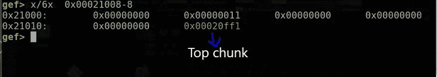

如果顶部块中没有空间，那么堆管理器将请求内核向堆的末尾添加新的内存，然后从这个分配的空间中分配一个新的块。

如果这都失败了，那么这意味着堆管理器分配内存失败，它将返回 null。

现在让我们来看看被释放的块的结构。

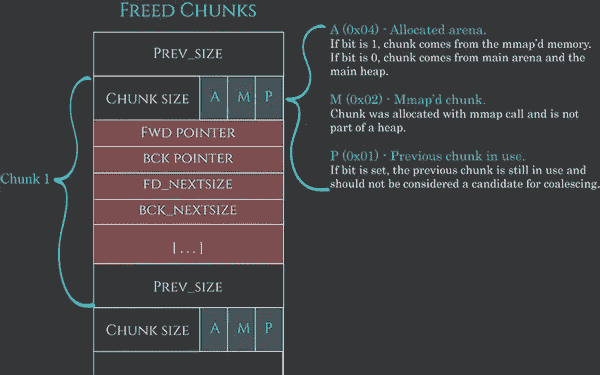

取自 azerialabs.com

**前进**指针:指向列表中下一个块的前进指针。
BCK 指针:返回指针指向列表中的前一个块。

让我们检查一下这个 **C 程序**来理解其行为，并看看一些自由程序块的运行情况。

> # include <stdio.h># include<stdlib . h></stdio.h>
> 
> void main(){
> int * a = malloc(2)；
> int * b = malloc(3)；
> int * c = malloc(10)；
> 
> 免费(a)；
> 免费(b)；
> 免费(c)；
> 
> }

编译这个并在 gdb 中运行它。

反汇编主函数，在函数末尾放一个断点(pop{r11，pc})。

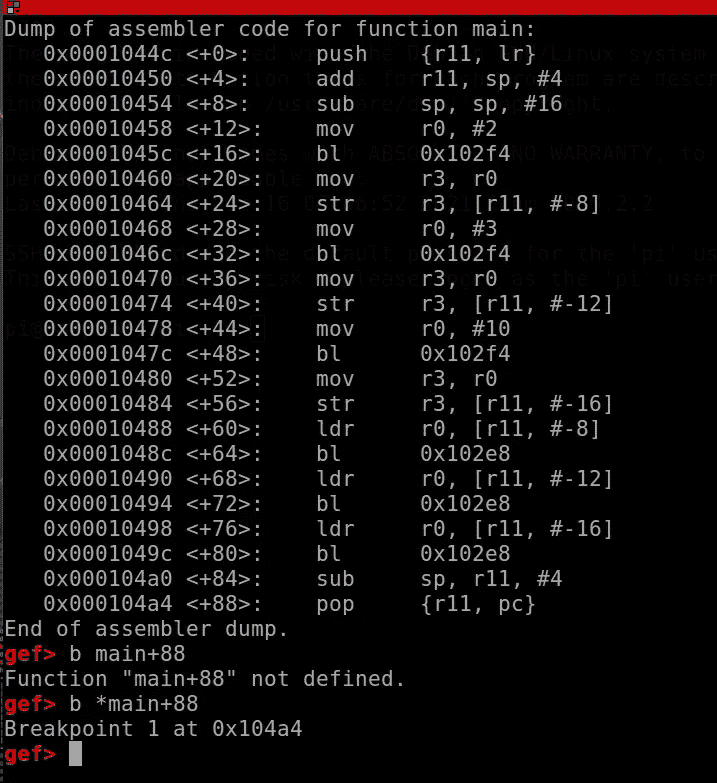

运行程序。

当它到达我们的断点时，使用 heap bins 命令来检查堆。我们知道我们释放了()三个块，所以将有 3 个空闲的()d 个块。

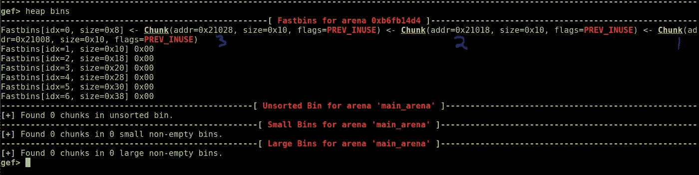

这就是我们讲过的链表。头部指向新添加的块。这里我们可以看到头指向最后一个 free()d chunk ie，0x21028。

这些空闲()d 块被添加到 0x10 (16 字节)大小的容器中。但是当我们查看 free()d 块所在的快速 bin 的大小时，它显示 size=0x8。这是 gef 的一个 bug，在最新版本中已经修复。所以不用担心。它应该被添加到 0x10(16 字节)大小的 bin 中。没有 bin 存储 0x8 大小的块，因为我们已经知道最小大小的块是 16 字节大小。如果我们再次尝试 malloc()，它将返回相应大小的 fast bin 开头的块。

例如，我们尝试 malloc 一个大小为 16 的块(最小大小的块:16 字节)，堆管理器将查看存储 16 字节大小的块的 fast bin，如果有可用的块，它将由堆管理器返回给用户。

让我们编辑源代码并添加一个 malloc()调用，验证我们的理论是否正确。

> # include<stdio.h># include<stdlib . h></stdio.h>
> 
> void main(){
> int * a = malloc(2)；
> int * b = malloc(3)；
> int * c = malloc(10)；
> 
> 免费(a)；
> 免费(b)；
> 游离(c)；
> 
> int * d = malloc(2)；
> 
> }

让我们在这里应用我们的理论。下面经过编辑的代码包含一个对 malloc 的新调用，它将分配一个 16 字节大小的新块，并将在**指针‘d’**中返回。因此，根据我们的理论，将返回到**指针‘d’**的新块将是我们释放()d 的最后一个相同大小的块。该块将被添加到相应大小的 bin 的头部。我们只分配和释放了()d 个 16 字节大小的块，所以只有一个快速 bin (16 字节大小)。因此，新添加的 malloc()调用将返回我们释放的最后一个 16 字节大小的块()d，它由**‘c’**指向**指针‘d’**。

让我们用调试器来检查我们的论文。

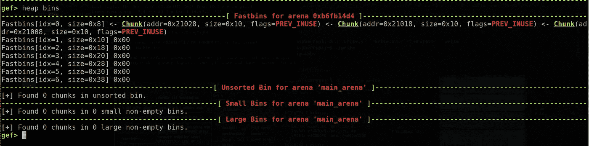

这是在我们最后一次调用 malloc()之前。我们可以在 fast bin 中看到我们所有的空闲()d 块。如果您查看快速 bin 的头部，它包含地址为“0x21028”的块。这是将返回给下一个 malloc 调用()的块。

让我们跳过 malloc 调用()来看看。

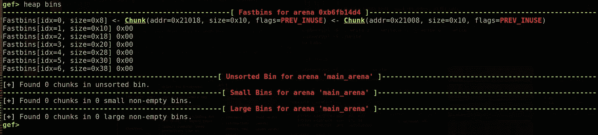

如果我们现在看，指向地址“0x21028”的块从快速箱中丢失。

让我们也检查一下 r0。(r0 将包含分配给我们 malloc 的块的地址)

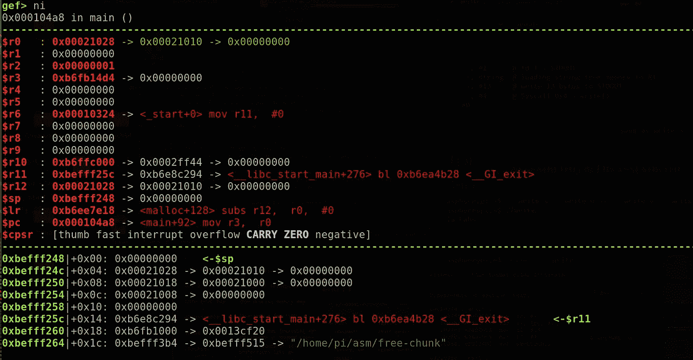

正如所料，它包含的地址与我们的 fast bin 中最后一个 free()d 块的地址相同。这证实了我们的理论。

这就是如何利用容器来存储空闲的()块。现在我们来看看释放后使用漏洞。

# 免费后使用

我已经在前一篇文章中简要地写了这个。所以要释放()一个块，我们使用 free()函数，对吗？。但是即使我们释放了()这个，我们仍然需要将指针赋值为“NULL ”,因为即使释放了指针，它仍然会指向那个特定的位置。所以在释放后仍然使用内存()d 叫做**释放后使用。**这就是我们 bug starts 的由来。

如果你看看 [cve mitre](https://cve.mitre.org/cgi-bin/cvekey.cgi?keyword=use+after+free) ，我们可以看到它今天仍然是相关和常见的。

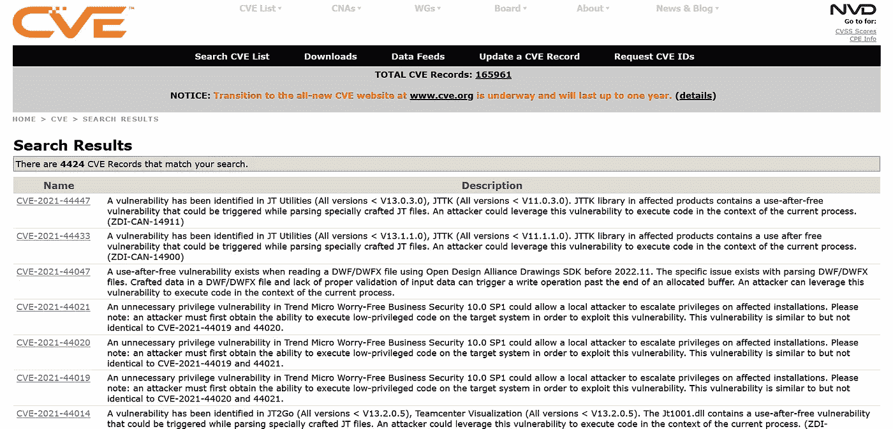

如果你想了解更多，可以看看下面的文章。

 [## 释放漏洞后的使用介绍

### 释放后使用(UAF)漏洞是一类在世界上非常成功的内存损坏错误…

纯粹。安全](https://pure.security/introduction-to-use-after-free-vulnerabilities/) 

[www . black hat . com % 2f docs % 2Feu-16% 2f materials % 2Feu-16-Wen-Use-After-Use-After-Free-Exploit-UAF-By-Generating-Your-Own-WP . pdf&usg = aovvaw 01 dzazqa 91 zqsvkebkr 13v](https://www.google.com/url?sa=t&rct=j&q=&esrc=s&source=web&cd=&cad=rja&uact=8&ved=2ahUKEwjemd3Ng-30AhVCSWwGHfoZBl8QFnoECAgQAw&url=https%3A%2F%2Fwww.blackhat.com%2Fdocs%2Feu-16%2Fmaterials%2Feu-16-Wen-Use-After-Use-After-Free-Exploit-UAF-By-Generating-Your-Own-wp.pdf&usg=AOvVaw01DzaZqA91ZqSVKeBkR13V)

让我们使用下面的示例程序来理解这一点，以便更加清楚。

> # include <malloc.h># include<stdio . h></malloc.h>
> 
> typedef 结构函数{
> void(* funct _ ptr)()；
> } ptr；
> 
> void one(){
> printf("这是函数一\ n ")；
> }
> 
> void two(){
> printf("这是函数二\ n ")；
> }
> 
> void main(){
> ptr * malloc 1 = malloc(sizeof(ptr))；//First malloc
> malloc 1->funct _ ptr = one；
> printf("调用 malloc 1->funct _ ptr \ n ")；
> malloc 1->funct _ ptr()；
> printf("释放 malloc 1 \ n ")；
> 免费(malloc 1)；
> ptr * malloc 2 = malloc(sizeof(ptr))；//第二个 malloc
> malloc 2->funct _ ptr = two；
> printf("调用 malloc 2->funct _ ptr \ n ")；
> malloc 2->funct _ ptr()；
> printf("尝试调用 malloc 1 \ n ")；
> malloc 1->funct _ ptr()；
> 
> }

这里有两个函数和一个名为“function”的结构，其中包含一个**函数指针**。我们将使用这些函数指针来存储程序中的两个函数(函数‘一’和函数‘二’)。

正如您在源代码中看到的，我们使用 malloc()并保留空间来存储结构中的函数指针。这将分配一个块用于存储函数“一”的地址。后来 *malloc1* 被赋予*功能一*并被调用。

> malloc 1-> funct _ ptr = one；//分配函数一
> 
> printf("调用 malloc 1-> funct _ ptr \ n ")；
> 
> malloc 1-> funct _ ptr()；//调用函数

调用该函数后，它使用 free()释放这个块。

> 免费(malloc 1)；

但问题是，即使在释放这个块之后，指针“malloc1”仍然指向从第一个 malloc 返回的块。更糟糕的是，它仍在被使用，这是它成为实际漏洞的地方。释放后使用，对吗？

那么我们能做些什么来解决这个问题呢？

我们应该简单地将“NULL”赋给这个指针，这样它就不会指向任何地方。

但问题是，即使在释放这个块之后，指针“malloc1”仍然指向从第一个 malloc 返回的块。更糟糕的是，它在被释放后仍在被使用。(源代码的最后一行)

> malloc 1-> funct _ ptr()；

这就是它成为实际漏洞的地方。释放后使用，对吗？

在这之后，还有另一个函数指针，它有第二个函数“two”的地址。所以“malloc2”包含了第二个函数的地址，函数二稍后被调用。

> ptr * malloc 2 = malloc(sizeof(ptr))；//Second malloc
> malloc 2->funct _ ptr = two；
> malloc 2->funct _ ptr()；

让我们编译并运行这个程序，看看漏洞在起什么作用。

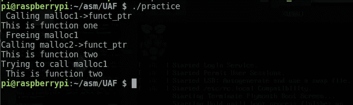

让我们来分解输出。

首先，它的调用函数 one 使用了函数指针“malloc1”。我们可以从函数一“这是函数一”看到 printf 函数的输出。之后，用于保存函数一的函数指针的块被释放()。正如我们所知，这个空闲的()块将被放入垃圾箱。
即使它是空闲的()，指针仍然指向包含函数一的函数指针的第一个块。

接下来，它使用函数指针“malloc2”调用第二个函数。我们也可以在这个函数中看到 printf 函数的输出“这是函数二”。

之后，我们使用函数指针“malloc1”调用函数 1。但是如果你看看输出，它是函数 2 的 printf()函数的输出。但是我们从来没有把函数二赋给“malloc1”。那这是怎么发生的？？

所以当我们释放第一个块(malloc1)时。它将被添加到与其大小相对应的媒体夹的头部。因此，当我们尝试分配下一个块时，它会查看这些块中是否有确切大小的空闲()d 块。如果有这样大小的块，堆管理器将返回它。这里我们的第二个 malloc 分配了相同的大小，所以它将返回我们释放的第一个块，这个块用于存储函数一的函数指针。

当这个被返回时，我们用这个来存储“函数二”的函数指针。当我们将“函数二”赋给返回的块时，块内的内容，即指向“函数一”的指针，将被函数二的指针替换。不要忘记“malloc1”仍然指向这个块，即使在它被释放之后也是如此。现在在块内部，*函数一*的函数指针被函数二所取代。所以当我们试图使用 *malloc1* 来执行函数指针内的函数时。它将执行第二个函数，因为它现在有了指向“函数二”的指针，因为使用“malloc2”存储“函数二”的函数指针的是同一个块。

ptr * malloc 2 = malloc(sizeof(ptr))；//第二个 malloc

malloc 2-> funct _ ptr = two；

malloc 2-> funct _ ptr()；

这就是为什么我们看到函数二被执行，而不是函数一被首先分配给 *malloc1* 。

让我们做一个简单的挑战来更好地理解这一点。

## 挑战 UAF

编译下面的源代码。

> # include <stdio.h># include<stdlib . h>
> # include<string . h>
> int main()
> {
> char * name = 0；
> char * pass = 0；
> while(1)
> {
> if(name)printf(" name address:% x \ n name:% s \ n "，name，name)；
> if(pass) printf("pass 地址:%x\npass: %s\n "，pass，pass)；
> printf("1:用户名\ n ")；
> printf(" 2:Password \ n ")；
> printf(" 3:Reset \ n ")；
> printf(" 4:log in \ n ")；
> printf(" 5:Exit \ n ")；
> printf("选择？");
> int num = 0；
> scanf("%d "，&num)；
> switch(num)
> {
> case 1:
> name = malloc(20 * sizeof(char))；
> printf("插入用户名:")；
> scanf("%254s "，名称)；
> if(strcmp(name，" root") == 0)
> {
> printf("不允许 root。\ n ")；
> strcpy(名称，“”)；
> }
> 破；
> 案例二:
> pass = malloc(20 * sizeof(char))；
> printf("插入密码:")；
> scanf("%254s "，通过)；
> 破；
> 案例三:
> 免费(通过)；
> 自由(名字)；
> 破；
> 案例四:
> if(strcmp(name，" root") == 0)
> {
> printf("免费后你随便用！\ n ")；
> 系统("/bin/sh ")；
> 退出(0)；</stdio.h>
> 
> }
> 破；
> 情况五:
> 出口(0)；
> }
> }
> 
> }

链接:[https://pastebin.com/LKfaUK6v](https://pastebin.com/LKfaUK6v)

我从一个浆糊里得到这个消息。所以一切归功于原主人。我只是编辑了一下，添加了对系统函数的调用

所以不管怎样，我们的任务是拿到贝壳。我们只有作为 root 用户才能获得 shell。但是我们不能将用户名设置为“root”。我们可以输入除 root 之外的任何其他名称。

因此，让我们来分解程序选项

1 →将分配一些块用于存储用户名
2 →将分配一些块用于存储密码(与用户名大小相同)
3 →使用自由函数
释放用户名和密码 4 →如果用户是根用户，则尝试生成一个 shell。

好了，现在让我们检查一下漏洞在哪里。

试着看看第三个选项。它用于使用免费功能重置用户名和密码。但问题是，即使在这些指针被释放后，它们仍然指向同一个位置，因为它们没有失效。

由于尺寸相同，它们将进入相同的**快速箱。**

那么我们将如何利用它呢？试着想一个方法，通过利用这个漏洞，我们可以将用户名指向包含文本“root”的位置。

我强烈建议你自己尝试一段时间。

让我们讨论一下解决这个问题的简单方法。

首先，我们可以使用选项 1 分配一个块来存储用户名。然后，让我们使用选项 2 来分配一个块用于存储密码。这将分配两个大小相同的区块。

让我们通过使用选项 3 重置用户名和密码来触发漏洞。这将解放他们两个。因为它们的大小相同，所以它们将进入相同大小的**垃圾箱。**

如果查看选项 3 的代码，首先释放用于保存密码的“pass”指针()，然后释放用于保存名称的“name”指针。因此，用于密码的块将首先进入 bin，然后是用于保存用户名的块。所以 fastbin 的头将指向用于保存用户名的块。

让我们来看看实际情况。

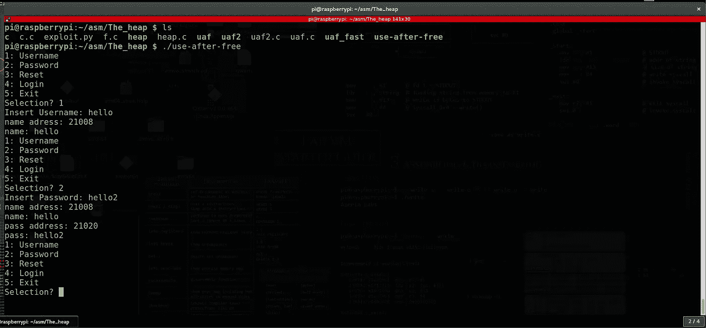

这些块大小相同，我们可以在输出中看到地址。接下来，我们可以使用 reset 选项释放()用户名和密码。

因为它们具有相同的大小，所以它们将属于相同大小的容器。

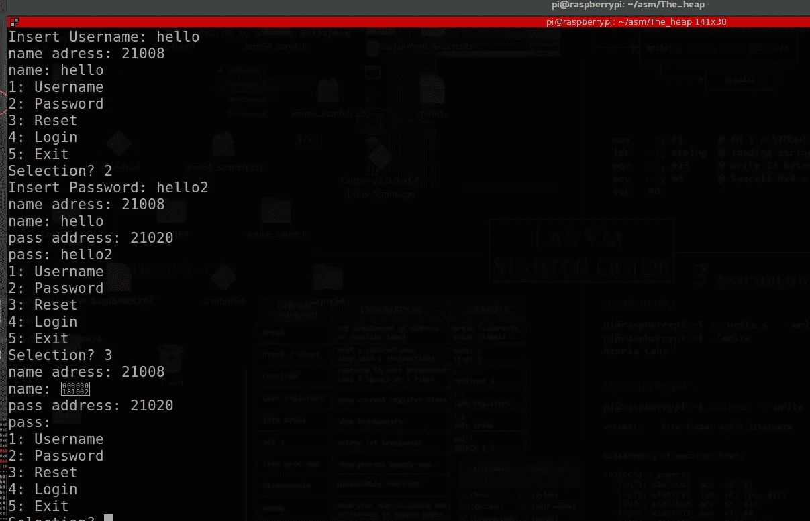

我们可以看到，即使这是免费的()d，它仍然指向同一个位置。
我们还在那个位置看到一些乱码字符，这是因为当块是空闲的()d 时，包含了额外的元数据。此元数据将覆盖区块中的数据。你不需要介意那个。

让我们使用 gdb 确认它们是否在同一个 bin 中。

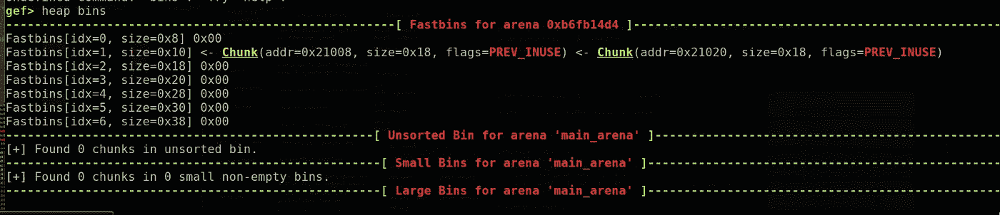

(你不需要担心垃圾箱中显示的块大小是错误的。这主要是由于 gdb 中的 bug)

正如我们所看到的，bin 的头包含指向最后一个空闲()d 块的*“用户块”*，后面是“*密码块*”。

现在，如果我们尝试分配任何块来存储密码和用户名，将返回位于 bin 头部的 free()d 块(先前用于用户名的块)。

我想现在你有了利用这一点的想法。

所以我们现在要做的是使用选项 2 请求一个块来存储密码。这将返回 bin 开头的 free()d 块，它仍然指向用户名。

因此，我们试图在这个块中添加新内容，之前空闲的()d 用户名指针将指向这个，因为有相同的块。正如我们现在已经知道的，如果我们是根用户，我们只能得到 shell，我们不能直接设置用户名为根，程序不会接受。这里的技巧是，如果我们将新请求的密码块的内容设置为“root ”,那么之前空闲的()d 用户名块将指向该内容，因为有相同的块。

因此，先前空闲的()d 用户名块的内容将被替换，并指向新设置的密码。

所以我们如果设置新密码为“root”。那么用户名也会指向“root”。

然后，如果我们尝试登录，我们将很容易获得外壳，因为我们是根用户。

我们就这么做吧，战胜这个挑战。

让我最后一次总结一下利用这一点的步骤。

1→使用选项 1 分配一个块用于存储用户名。
2→使用选项 2 分配一个块用于存储密码。
3→使用选项 3 释放块。
4→使用选项 2 分配一个密码块，以便它可以重写先前分配的用户名块的内容。
5→使用选项 4 登录获取外壳。

让我们这样做是为了得到外壳

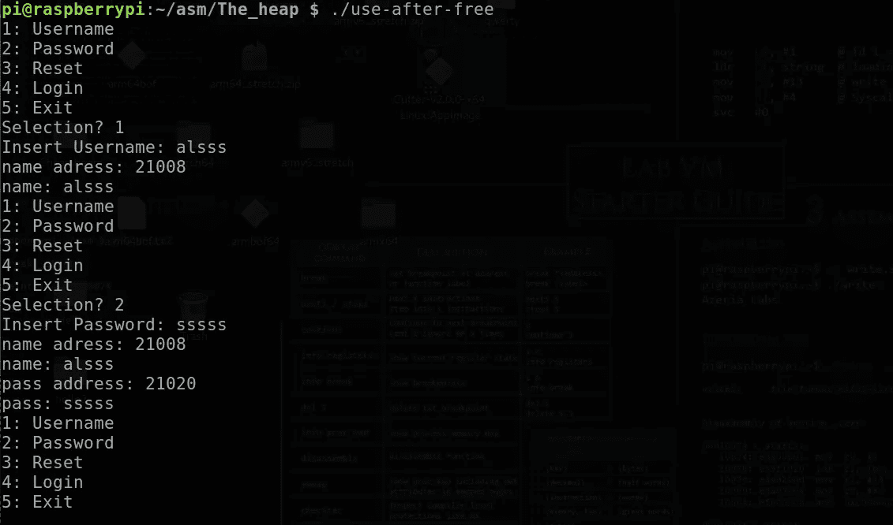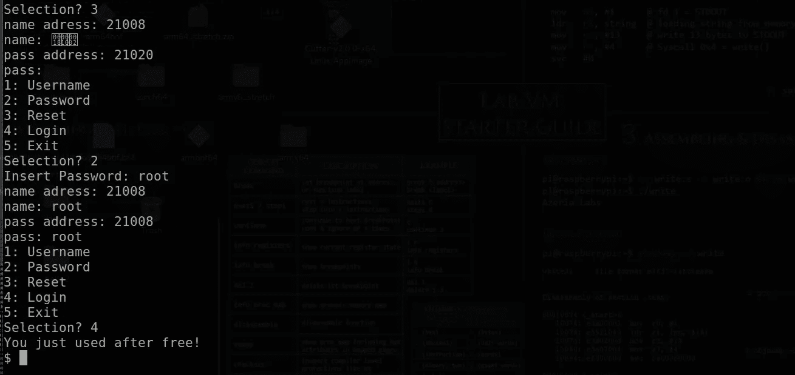

**最后，我们得到了我们美丽的外壳:)**

所以我想是时候收工了。我希望您对释放后使用漏洞有所了解。

尝试做其他的“免费后使用”CTF 挑战，并尝试自己利用它们。

祝您愉快:)

提到的文章和链接:[https://azeria-labs.com/](https://azeria-labs.com/)

如有任何疑问，您可以联系我

https://www.facebook.com/i.am.ultralegend 脸书

insta gram:[https://www.instagram.com/hagane_no_rekinjutsushi/](https://www.instagram.com/hagane_no_rekinjutsushi/)

如果你想支持我或者学习 **ARM 开发**请查看我的课程:[https://www . udemy . com/course/reverse-engineering-and-binary-exploitation-in-ARM/？referral code = 8c 725d 513 e 77420 a0cb](https://www.udemy.com/course/reverse-engineering-and-binary-exploitation-in-arm/?referralCode=8C725D513E77420A0CBF)