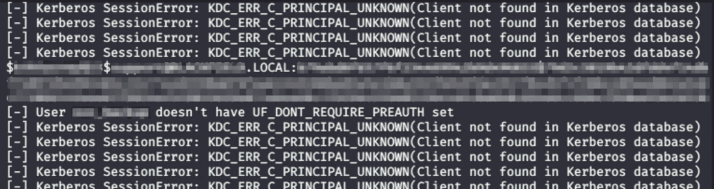

# 活动目录错误配置和攻击

> 原文：<https://infosecwriteups.com/as-rep-roast-attack-for-disabled-kerberos-pre-authentication-accounts-92b402ee492b?source=collection_archive---------3----------------------->

## 威胁追踪

照片由[米卡·鲍梅斯特](https://unsplash.com/@mbaumi?utm_source=medium&utm_medium=referral)在 [Unsplash](https://unsplash.com?utm_source=medium&utm_medium=referral) 上拍摄

# 对禁用的“Kerberos 预身份验证”帐户的 AS-REP 烘焙攻击

AS-REP 过程是 Kerberos 预认证阶段的一部分。当 **Kerberos 预认证**启用时，它提供了针对暴力密码猜测攻击的保护。

*更多关于它如何工作的信息可以在* [*这里*](https://ldapwiki.com/wiki/Kerberos%20Pre-Authentication) 找到

AS-REP 烘烤允许攻击者为已禁用其帐户上的 **kerberos 预认证**的用户检索密码哈希(Kerberos AS-REP (krb5asrep) *又名*加密 TGT)。这使得它容易受到 AS-REP 烘烤攻击。

来自 [**的命令工具`GetNPUsers.py`插入**](https://github.com/SecureAuthCorp/impacket/blob/master/examples/GetNPUsers.py) 库，运行该命令不需要凭证。只有域名和用户文件。这种攻击被称为**重发**。该攻击将在中搜索设置了“DONT _ 要求 _ 预验证”的用户。

## **威胁搜寻场景**

下面是一个简单的命令，我用它来识别非预认证帐户和检索密码散列。

`python3 /usr/local/bin/GetNPUsers.py domainName.local/ -usersfile users.txt`

该命令将向 kerberos KDC(密钥分发中心)发送一个请求，以验证给定域帐户的用户列表。然后，KDC 将返回一个加密的 TGT(Kerberos AS-REP (krb5asrep))，攻击者可以离线强行破解它。

下图显示了以下内容:

*   用户名和密码哈希
*   另一个用户名没有“DONT _ 要求 _ 预验证”设置，但没有密码哈希

## 破解杂凑

一旦获取了散列值，就可以用`John`或`hashcat`来破解密码。

您也可以使用以下命令来搜索密码哈希，并且只使用一个命令强制执行:

`python GetNPUsers.py <domain_name>/ -usersfile <users_file> -format <AS_REP_responses_format [hashcat | john]> -outputfile <output_AS_REP_responses_file>`