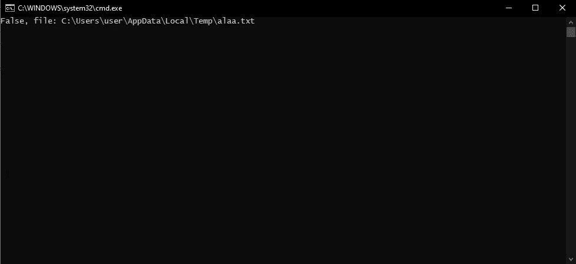
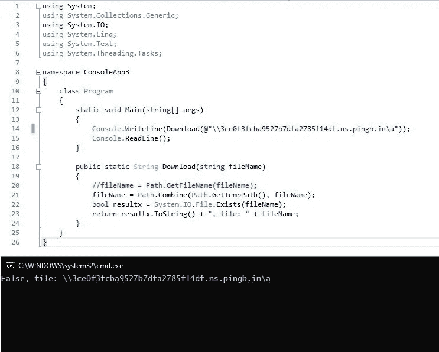
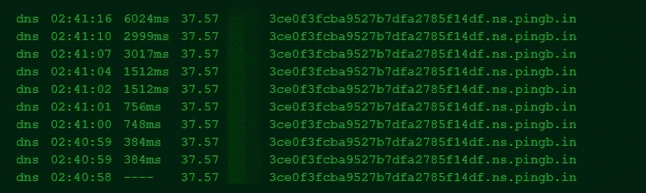

# ASP.NET 核心路径遍历

> 原文：<https://infosecwriteups.com/asp-net-core-path-traversal-e2bed792d171?source=collection_archive---------0----------------------->


# 路径遍历:

路径遍历攻击(也称为目录遍历)旨在访问存储在 webroot 文件夹之外的文件和目录。通过使用“点-点-斜线(../)"序列及其变体或使用绝对文件路径，就有可能访问存储在文件系统上的任意文件和目录，包括应用程序源代码或配置和关键系统文件。应当注意，对文件的访问受到系统操作访问控制的限制(例如在 Microsoft Windows 操作系统上锁定或使用文件的情况下)。

# 描述:

在这篇文章中，我将解释在 ASP.NET 核心中发现的路径遍历漏洞，即`Path.combine`函数的不正确使用。

什么是`Path.combine` ？

此方法旨在将单个字符串连接成表示文件路径的单个字符串。

# 组合(String[]):

将字符串数组组合成一个路径。

`public static string Combine (params string[] paths);`

此方法假定第一个参数是绝对路径，后面的一个或多个参数是相对路径。

# 深入:

关于在互联网上随处可见的技术细节已经说得够多了，让我们进入你想要的有趣信息吧。
无论何时，当你进行代码审查或者甚至是黑盒方法时，你发现一个端点，例如`https://alaa.blog/file.aspx?file=alaa.jpg`，在这种情况下，你必须假设，这个端点可能正在使用`Path.combine`。

如果只是使用`Path.combine`而没有其他规则或保护，那么我们可以轻松地逃离目录并访问系统上的任何其他文件。

让我们看一个例子。

```
using System;
using System.Collections.Generic;
using System.IO;
using System.Linq;
using System.Text;
using System.Threading.Tasks;namespace ConsoleApp3
{
    class Program
    {
        static void Main(string[] args)
        {
            Console.WriteLine(Download(@"alaa.txt"));
            Console.ReadLine();
        } public static String Download(string fileName)
        {
            //fileName = Path.GetFileName(fileName);
            fileName = Path.Combine(Path.GetTempPath(), fileName);
            bool resultx = System.IO.File.Exists(fileName);
            return resultx.ToString() + ", file: " + fileName;
        }
    }
}
```

这只是我用 C#做的一个小的控制台应用程序，用来模拟易受攻击的代码。

在第 21 行，我们可以看到该函数将临时路径与来自第 14 行的参数(alaa.txt)的条目相结合。

因此，在这种情况下，完整的目录将是`file: C:\Users\user\AppData\Local\Temp\alaa.txt`



第 22 行是布尔型的，用于检查文件是否存在以便进一步测试，您可以忽略它。

现在我们假设`alaa.txt`是参数值，让我们改变它并尝试利用它。

让我们输入`C:\alaa.txt`并检查它是否会绕过目录。


我们也可以使用`../../../../`，但是让我们用 DNS [SSRF](https://portswigger.net/web-security/ssrf) 来测试它，它也会容易受到攻击。

我们现在将尝试访问

```
\\3ce0f3fcba9527b7dfa2785f14df.ns.pingb.in\a
```

这只是概念的另一个证明，如果我们得到一个命中，那么它也是脆弱的，如果我们的路径遍历是盲目的，这可以被使用。



结果将是:



# 补救

有很多方法可以解决这个问题，但是我只说一种方法，在第 20 行，如果你取消注释，漏洞将很容易被修补。

函数`Path.GetFileName(fileName);`将清理`fileName`参数，并防止逸出路径。

我相信这可能是最好的解决方案之一，在这种情况下，我已经尝试了很多次来绕过它，但没有运气。

# 参考

[https://docs . Microsoft . com/en-us/dot net/API/system . io . path . combine？view=net-5.0](https://docs.microsoft.com/en-us/dotnet/api/system.io.path.combine?view=net-5.0)

感谢你阅读这篇快速的文章，如果你做到了这一点，你可以在 Twitter 上关注我以获得更多的文章和技巧 [@alaa0x2](https://twitter.com/alaa0x2) 。

上面使用的原始代码可以在 GitHub [path.combine.poc](https://github.com/Alaa-abdulridha/path.combine.poc) 上找到