# 关联规则挖掘

> 原文：<https://infosecwriteups.com/association-rule-mining-6443a0cffb55?source=collection_archive---------2----------------------->

## 在日益增长网络攻击世界中武装起来:

## 无监督机器学习—第二部分

你好，可爱的人们。如果您还没有，请阅读我们关于[集群](https://medium.com/@datasciencemeetscybersecurity/when-clustering-meets-cyber-security-24ed8d5392ad)的博客。今天，我们将谈论数据科学和机器学习中一个新的和不断增长的概念，它可能会帮助我们解决任何基本方法的基本模型都无法解决的许多问题。因此，让我们回顾一下关联规则挖掘可以帮助我们解决并使我们的生活更轻松的一些问题。ARM 帮助我们绘制连接并发现大型数据集之间的相关性和联系，这有助于我们更有效地分析数据集，以进行客户分析、购物篮分析、产品聚类、目录设计和商店布局。

## 关联规则挖掘:

这是我们在无监督机器学习中可以使用的许多有趣方法之一，它使我们能够可视化巨大数据集之间的关系，并确定特定商品在交易中出现的频率。虽然我确信在阅读完这个定义后，你的头脑中已经有了足够多的实例，但是为了我自己的满意，请允许我给你举一个例子。

例如:超市产品分析、电子商务网站、社交媒体网站，最后是推荐引擎

## 让我们从如果-那么规则的角度来看这个问题

如果(x)和(y)和(z)，那么 A:

1.  x，y，z:前提(描述一个条件)
2.  答:结果(描述条件的结果)
3.  规则的长度:前提的数量
4.  项目集:所有项目{x，y，z，A}

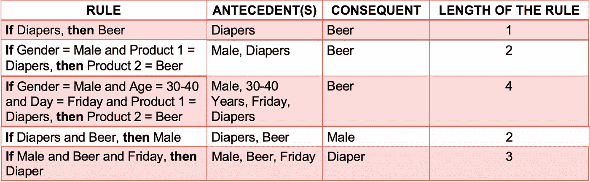

分析上面的图片 2 分钟

ARM 仅寻找数据集的特征(列)之间的共现(或关联)。它既不意味着因果关系，也不相关。

X → Y 不代表 X 导致 Y。

与相关性不同，X → Y 可以不同于 Y → X。

比如啤酒→男人没有因果关系参与。如果啤酒也不行，那么男人就是如果男人，那么啤酒。这就导致了很多规则的可能性。

说到很多规则，有多少规则？如果项目的数量变得非常大。

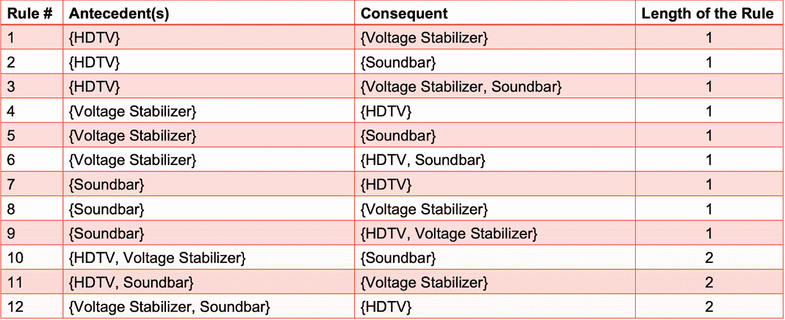

## 如果数据集很大，请记住一般公式:

## r = 3^d-2^d+1+1

1.  其中 R 是可能的关联规则的数量，d 是项目的数量。
2.  随着项目的增长，可能的关联规则的数量呈指数级增长。
3.  而像 HDTV →稳压器这样的规则，规则。
4.  但是稳压器→高清电视没有意义。
5.  作为一种无监督的方法，不需要建立模型，也不需要计算误差。我们如何评估这些规则并找到避免无意义或不相关规则的方法？

在实现关联规则挖掘之前，让我们看一些东西

## ARM 中的术语:

支持计数、频繁项目集和关联规则是需要理解的三个关键概念。

1.**支持计数**只是数据项出现频率的另一种说法。

2.两项数据集被称为**关联规则**。

3.一个**频繁项** **集合**是一个支持大于或等于阈值的集合。

有几种方法可以计算这种联系，但以下是前 3 种方法:

## 支持:

→正如我们在上面的支持计数中看到的，支持计数是一种表示数据项出现频率的方式，简单地说就是我们可以计算某个特定项目在进行交易时出现的频率

## 支持(A=>B) = P(A U B)

*分析上述数据集，以了解支持*

## 让我们来评估这个规则:如果 CCAvg 是中等，那么 loan = accept”

1.  支持度是项目集出现的事务的分数，即前提和结果同时出现的事务。
2.  支持度，s( X → Y) = 3/13 = 23%。
3.  这意味着该规则适用于 23%的数据集。
4.  回想一下，这就像联合概率，即 P(X 和 Y)或 P(项目集)

## 自信:

→假设我们有四种产品。因为人脑很快就能识别出愚蠢的东西，所以我们给它起个蹩脚的名字吧。这就给我们留下了产品 A、产品 B、产品 C 和产品 D。现在，信心使我们能够确定产品 D 与产品 A 同时被收购的可能性有多大。本质上，信心使我们能够将可能被一起收购的两件东西联系起来。

## 让我们来评估这个规则:如果 CCAvg 是中等，那么 loan = accept”

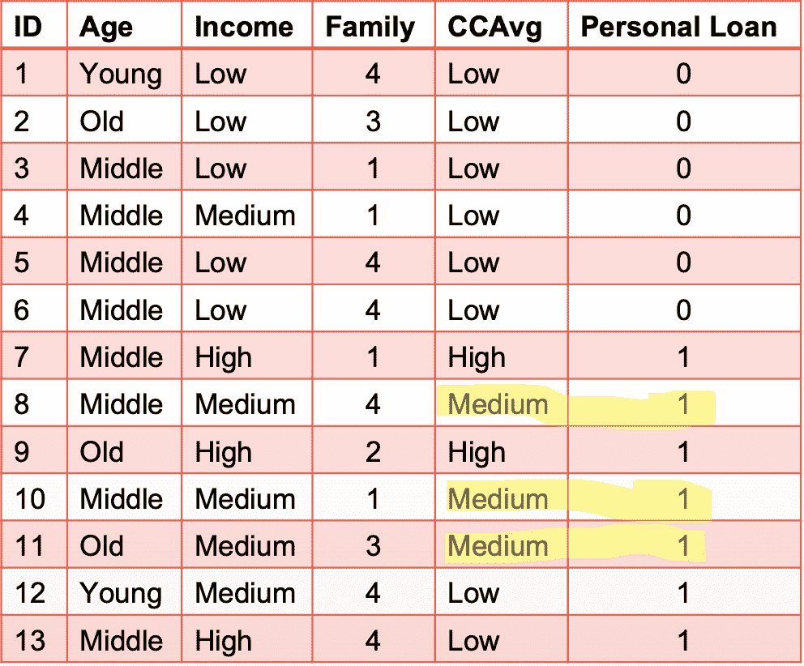

*再次分析相同的数据集:*

置信度是指只有在“购物车或购物篮”中已经存在先行项目的情况下，才会出现后续项目的交易比例。

1.  置信度，c(X 和 Y) = 3/3 = 100%，即每次 CCAvg 为中等时接受贷款。
2.  回想一下，这就像条件概率，即

P(X|Y)或 P(X 和 Y) / P(X)或 Support / P(先行词)

## 关联规则提升:

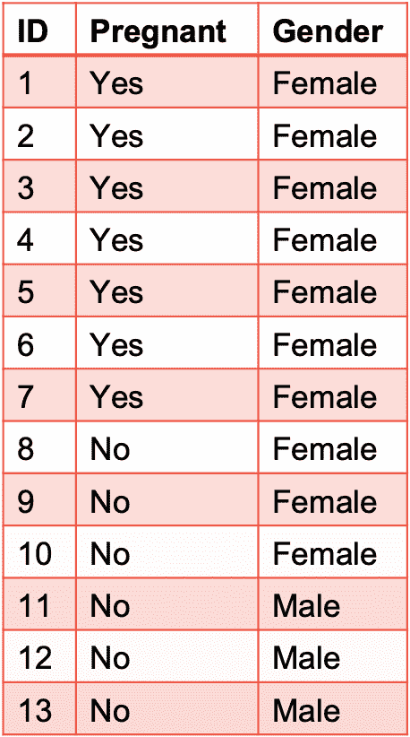

*分析该数据集的支持度和可信度*

## 让我们评价一下这条规则:如果怀孕，那么就是女性”

先说支持，试着评价一下上面的规则:

**→支持= s(怀孕→女性)= 7/13 = 54%**

Support 告诉我们总记录中有多少百分比的人既怀孕又是女性(科学上这听起来很愚蠢，但只是把它作为一个蹩脚的例子)。

说到自信，就像这样:

**→置信度= c(怀孕→女性)= 7/7 = 100%**

置信度告诉我们女性怀孕的后验概率，即 P(女性|怀孕)。

## 结论:

1.  现在，我们可以从上面的场景中注意到，与支持度相比，我们有很高的置信度，但是考虑一种情况，如果女性本身的先验概率非常高，即 P(女性)，会怎么样呢？
2.  那么上述规则并没有真正增加多少价值(科学上和现在统计上也是:D)
3.  但是我们有一种持续的好奇心，想知道与先前的知识相比，这个规则能带来多大的提升？

## 3.电梯:

## 考虑上面相同的数据集

因此，考虑到提升的想法和对改变的理解，让我们来评估一下规则:如果怀孕，那么是女性。

**LIFT，l(怀孕→女性)=置信度/ p(顺向)**

**= P(女|孕)/ P(女)**

**= 2013 年 7 月 7 日/ 10 月**

**= 1.3**

**也可以写成支持/ P(前因)* P(结果)**

这将等同于公式= P(X 和 Y) / P(X)*P(Y)

因此，这也可以解释为一个规则中所有项目一起出现的概率与它们之间没有关联时出现的概率之比。

回想一下可能性的独立性法则。

如果你想修改可能性的独立性原则:

## 概率的独立性规则；

从概率上来说，如果知道一个事件的发生对另一个事件发生的可能性没有影响，那么这两个事件就被认为是独立的。例如，一枚普通硬币在翻转后显示“正面”的可能性是 1/2，1/2，1/2

## 需要注意的一些电梯原理

**1。Lift = 1:** X 和 Y 是独立的，它们之间没有关联。

**2。举升> 1** :如果 X 和 Y 之间没有关联，那么它们一起出现的次数比预期的要多；即；它们是正相关的。

**3。如果 X 和 Y 之间没有关联，则它们一起出现的频率比预期的要低；即它们是负相关的。**

## APRIORI 算法→关联规则挖掘:

**生成关联规则:**

这是一个非常有趣且易于学习的概念，我们遵循两步过程来生成关联规则:

**1。频繁项目集生成:**查找满足最小时间阈值的所有项目集。

**2。规则生成:**从上述频繁项集中提取所有高可信度规则。

第一步的计算要求通常比第二步更昂贵。如果有“k”个项目，那么就有 2^k-1 个潜在的频繁项目集。

**例如:**

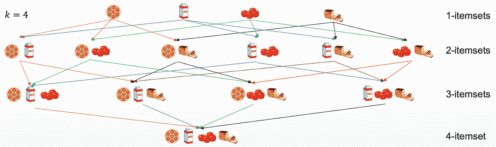

## 先验原则:

1.如果一个项目集是频繁的，那么它的所有子集也一定是频繁的。

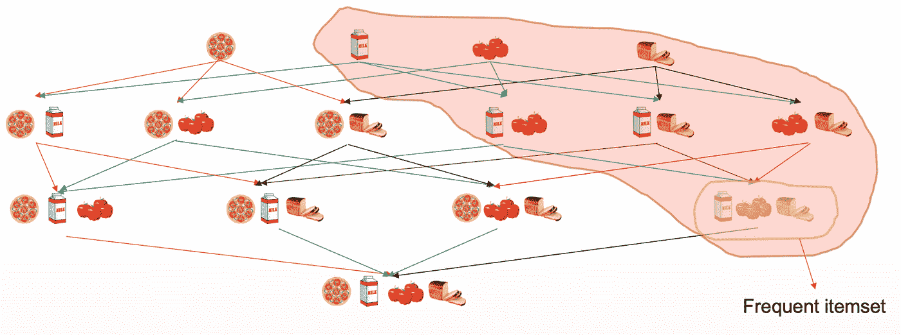

2.相反，如果一个项目集是频繁的，那么它的所有超集也一定是不频繁的。

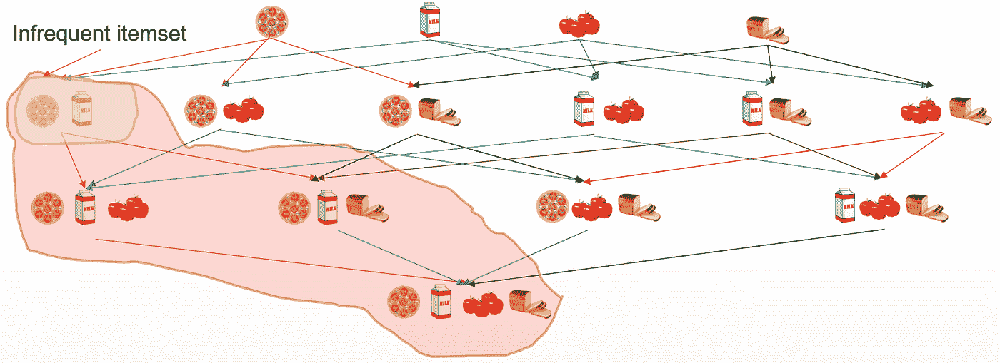

因此，如果{Pizza，Milk}是不频繁的，那么包含这两个项目的所有其他项目集也将是不频繁的，因为对一个项目集的支持永远不会超过对其子集的支持。

## 基于真实市场案例的 APRIORI 算法示例:

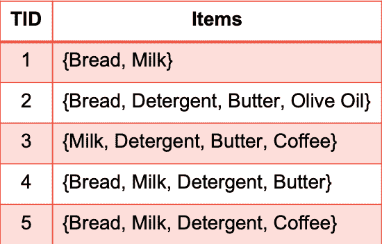

*基于网上购物市场的购物车交易*

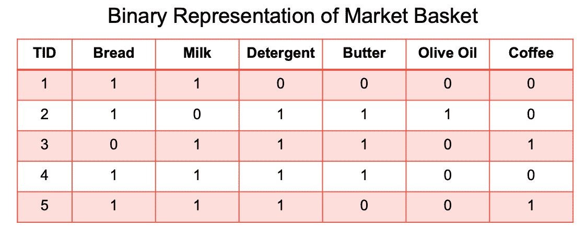

*上述基于市场的购物车交易的二进制表示*

让我们假设一个支持阈值，minsup 为 60%，即 5 个事务中的 3 个事务的最小支持计数。

该算法扫描数据库并列出候选 1-项集，C1。然后，它基于 minsup 过滤 C1 以识别频繁 1-项集 F1。

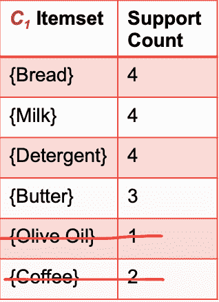

*淘汰不常用的产品*

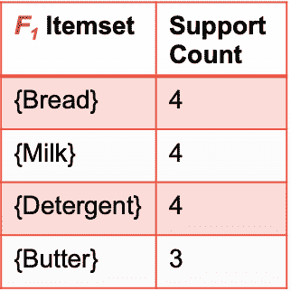

*频繁项目集一起购买的最终交易购物车*

## 当我们谈论算法时，总是有一些限制:

在机器学习算法领域，Apriori 算法异常强大、简单、优雅和强大。然而，伴随着巨大的权力而来的是巨大的责任，因此我们必须遵守以下某些限制:

1.需要大的存储空间来存储随着项目的增加而产生的指数增长的候选者。

2.多次扫描数据库，导致计算复杂。

## 频繁模式增长算法→关联规则挖掘:

到目前为止，我们看到 Apriori 算法使用生成和测试方法，但是在 FP-Growth 算法的情况下，它使用不同的方法来挖掘频繁数据集。

## 那么具体是什么方法呢？

1.**FP-Growth 算法**使用称为 FP-Tree 的紧凑数据结构对数据集进行编码，并直接从该树中提取频繁项集，而无需生成候选项集。

2.数据集只被扫描两次，一次是确定每个项目的支持计数，然后通过运行每个事务来构建 FP 树

## 让我们通过一个简单的例子来理解它:

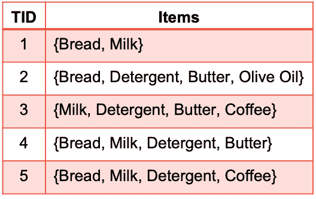

*要考虑的数据集*

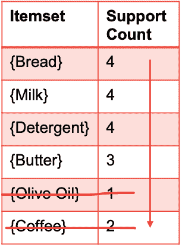

*排除出现频率较低的项目，因为最小支持计数= 3*

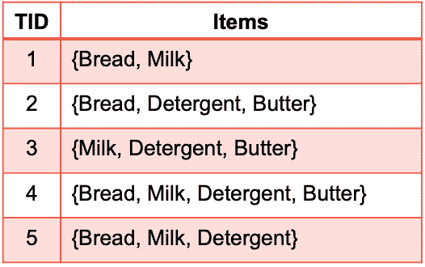

*对原始数据集进行剔除和排序后*

## FP-GROWTH 算法→限制:

1.FP 树构建起来更加麻烦和昂贵

2.对于非常大的数据集，FP 树可能不适合内存。

## 关联规则挖掘对网络安全有帮助吗？

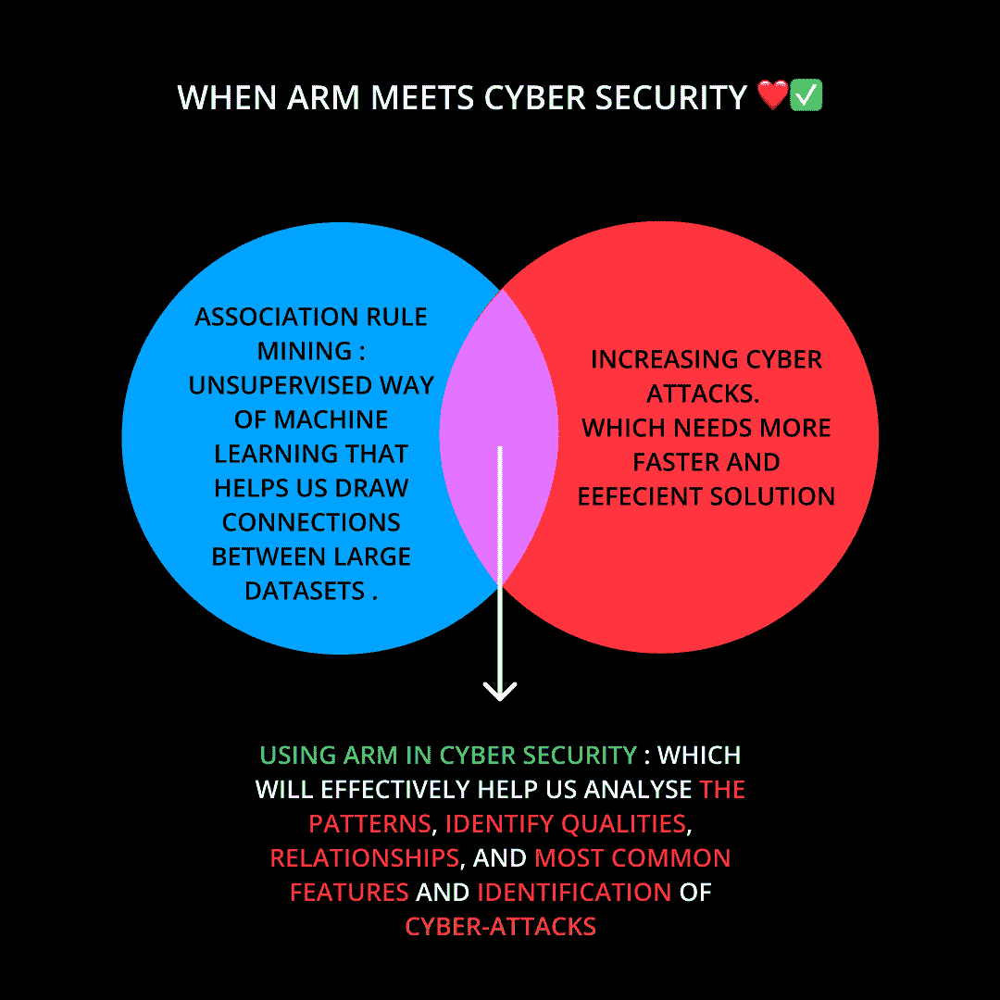

ARM 遇上网络安全

## 一个大大的是！

生活在我们快节奏的技术世界中，我们现在经常遇到网络犯罪，几乎很难完全避免它们。从好的方面来看，我们在技术领域已经发展了这么多，现在我们有许多专家在发现潜在的安全威胁、云计算平台中的渗透行为等方面拥有专业知识。但问题是，我们没有足够的全天候专业人员来帮助我们应对不断扩大的网络攻击，但我们确实有技术可以帮助我们实现我们从未梦想过的事情。

根据最近的研究，对手已经改进了他们进行网络攻击的战术、技术和程序(TTP ),使他们更难预测、更持久、更有创造性、资金更充足。许多组织已选择将网络威胁情报(CTI)纳入其安全态势，以正确确定网络攻击的属性。然而，为了恰当地利用 CTI 中的大量信息进行威胁归因，组织必须更加注重识别大量数据背后的特殊见解，以便成功识别网络攻击。

关联规则挖掘帮助我们开发一个关联规则集，用于 CTI 的插补程序。在 CTI 中，Apriori 算法用于在整个关联分析阶段创建连接规则集。为了量化算法的可扩展性、准确性和效率，使用了支持度(s)、置信度和提升度(l)等指标。根据研究结果，关联规则挖掘可以有效地识别 CTI 中网络攻击的性质、特征之间的关系以及识别级别组。这种分析有可能发展成为网络威胁搜索流程，从而形成更具预防性的网络安全文化。

## 参考上述研究论文研究:

[https://thesai.org/Publications/ViewPaper?Volume=12&Issue = 4&Code = ijassa&serial no = 18](https://thesai.org/Publications/ViewPaper?Volume=12&Issue=4&Code=IJACSA&SerialNo=18)

## GITHUB GIST :❤️

ARM 具体工作方式的实际实施要点

## 关注我们，享受学习数据科学博客和文章的乐趣:💙

**领英:**【https://www.linkedin.com/company/dsmcs/】T4

**insta gram:**https://www.instagram.com/datasciencemeetscybersecurity/?hl=en

**GITHUB:**[https://github.com/Vidhi1290](https://github.com/Vidhi1290)

**推特:**[https://twitter.com/VidhiWaghela](https://twitter.com/VidhiWaghela)

**中等:**[【https://medium.com/@datasciencemeetscybersecurity-】](https://medium.com/@datasciencemeetscybersecurity)

**网址:**【https://www.datasciencemeetscybersecurity.com/ 