# 攻击目录:TryHackMe 演练-第 1 部分

> 原文：<https://infosecwriteups.com/attacktive-directory-tryhackme-walkthrough-part-1-accfac4bf70f?source=collection_archive---------2----------------------->

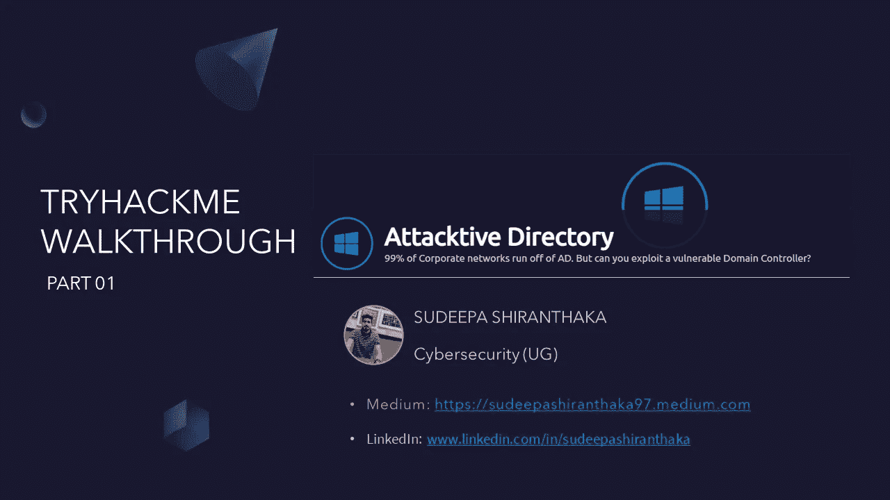

大家好，我是苏迪帕·白朗塔卡。今天，我们要谈谈 TryHackMe 上的攻击性目录室。这是一个基于 Windows 活动目录的房间。在这里，我们应该利用并访问易受攻击的域控制器。在这个房间里，我们有 8 项任务要完成。在本文中，我们将完成前 4 个任务，第 2 部分将涵盖其他任务。

任务 01:部署机器

任务 02:设置

任务 03:欢迎来到攻击目录

任务 04:通过 Kerberos 枚举用户

任务 05:滥用 Kerberos

任务 06:回到基础

任务 07:提升域内的权限

任务 08:标志提交面板

在进入任务列表之前，让我们先看看术语 AD(活动目录)。

**什么是 AD(活动目录)？**

Active Directory 支持多种功能，如身份验证、组和用户管理、策略管理等等。

AD 可以利用 Kerberos 和 LDAP 进行身份验证，这使它成为当今最常用的目录服务。单点登录(SSO)由 AD 提供，在 VPN 上使用时特别有效。公司选择安装认证管理软件的一个主要原因是 AD 和 Kerberos 不是跨平台的，这意味着它们必须在一个位置管理来自多个不同设备和平台的登录。AD 仍然可以是整个访问管理策略的一个组成部分，因为它支持 LDAP。

**任务 01:部署机器**

在任务 01 中，我们必须通过 OpenVPN 连接到 TryHackMe 并部署机器。如果你想知道如何通过 OpenVPN 连接，你可以参考下面的房间。

 [## TryHackMe | OpenVPN

### 使用 OpenVPN 连接到我们网络的指南。

tryhackme.com](https://tryhackme.com/room/openvpn) 

**任务 02:设置**

在任务 02 中，我们应该安装一些有助于进行活动目录枚举的工具。

安装这些工具时，请确保您的 Linux 机器是最新的和升级的。否则，您可能会遇到一些存储库错误。因此，在安装以下工具之前使用以下命令总是好的。

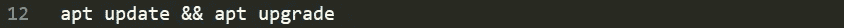

我们要安装的第一个工具是“ **Impacket** ”。有时候 impact 已经安装在你的 Linux 系统中了，你就不想再安装了。

**安装插件:**

我们将把下面的目录克隆到我们的/opt 目录中。我们的任务 02 中提到了所有必要的步骤。因此，我不打算在这里重复这些事情。简单地说，您可以给出下面的命令来安装 impacket。

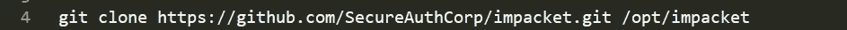

**安装 Bloodhound 和 Neo4j:**

Bloodhound 是我们在攻击攻击性目录时将使用的另一个工具。我们将在后面讨论该工具的具体特性，但是现在，我们需要用 Apt 安装两个包，分别是 bloodhound 和 neo4j。您可以使用以下命令安装它:

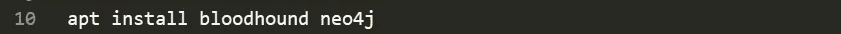

任务 03:欢迎来到攻击目录

在启动之前，机器会确保您的目标主机正在运行。

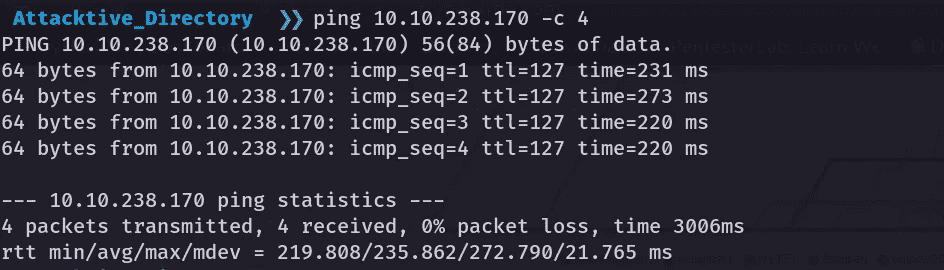

我们的主机运行良好，给出的 TTL 值为 127😉。TTL=128 = Windows 主机，同样，如果 TTL 为 127，则跳数为 1，并且是 Windows 机器。

我们从 nmap 扫描开始我们的初始枚举。如果想了解 nmap，可以参考下面的 TryHackMe 室。

 [## TryHackMe | Nmap

### 深入了解使用功能强大的网络扫描工具 Nmap 进行扫描。

tryhackme.com](https://tryhackme.com/room/furthernmap) 

*   -sV 用于启用版本检测
*   -sC 用于使用默认 NSE 脚本运行
*   -A 用于启用主动模式(启用操作系统检测、版本检测、跟踪路由、脚本扫描)
*   -T4，用于将扫描速度设置为模式 4
*   -打开以保存输出

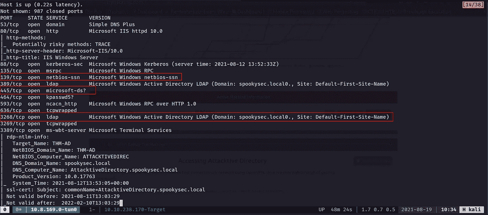

因此，我们为 139/tcp 和 445/tcp 开放了端口，这些是默认的 SMB 端口。

*   **端口 139** : SMB 最初使用端口 139 运行在 NetBIOS 之上。NetBIOS 是较早的传输层，它允许 Windows 计算机在同一网络上相互通信。
*   **端口 445:**SMB 的更高版本(Windows 2000 之后)开始在 TCP 栈上使用端口 445。使用 TCP 允许 SMB 在互联网上工作。

我们还在 389/tcp 和 3268/tcp 上使用 LDAP。

**轻量级目录访问协议(LDAP)**

LDAP(也称为轻量级目录访问技术)是一种开放的跨平台的目录服务认证协议。

LDAP 是目录服务和应用程序之间的主要通信方式。就用户帐户而言，目录服务维护诸如名称、密码和计算机帐户等信息，并将这些信息提供给其他网络实体。

继续任务 03，我们有三个问题要回答。

> *什么工具可以让我们列举端口 139/445？*

对于这个问题，我们可以使用谷歌的帮助🤗。因为谷歌是头号开源智能工具，而且完全免费。

**答案:** enum4linux

*Enum4linux 是一个从 Windows 和 Samba 系统枚举信息的工具。*

通过使用该工具，我们可以识别共享信息、用户和用户组信息、DNS 信息、识别远程操作系统、RID 循环、密码策略检索、NetBIOS 信息等。要安装这个工具，你可以使用下面的 Github 库。

 [## GitHub—CiscoCXSecurity/enum 4 linux:enum 4 Linux 是用于枚举的 enum.exe 的 Linux 替代方案…

### enum.exe 的 Linux 替代品，用于枚举来自 Windows 和 Samba 主机的数据。Enum4linux 是一个枚举工具…

github.com](https://github.com/CiscoCXSecurity/enum4linux) 

安装工具后，您可以简单地运行 python 脚本。

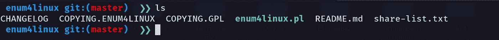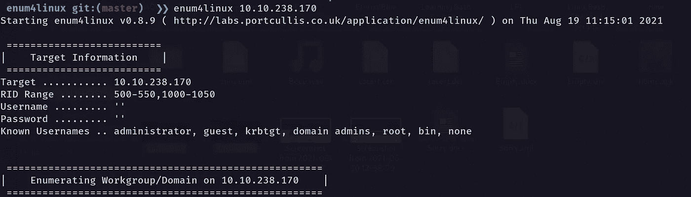

> *机器的 NetBIOS 域名是什么？*

enu4linux 输出给出了这个问题的答案。

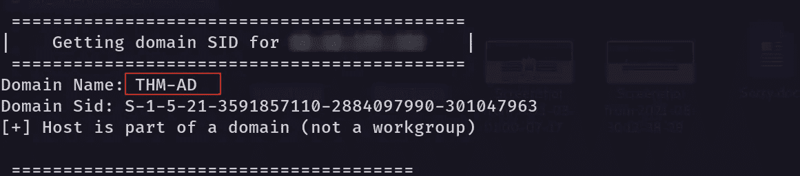

**回答:** THM-AD

> *人们通常将哪些无效 TLD 用于他们的活动目录域？*

在谷歌上简单搜索一下，就会给出我们这个问题的答案。

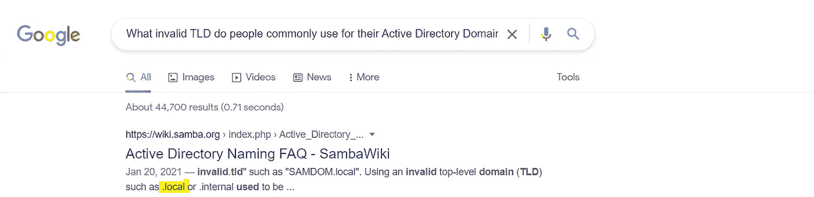

**回答:**。当地的

**任务 04:通过 Kerberos 枚举用户**

**简介:**

*一大堆其他服务正在运行，包括****Kerberos****。Kerberos 是 Active Directory 中的一项关键身份验证服务。打开这个端口，我们就可以使用一个名为*[*Kerbrute*](https://github.com/ropnop/kerbrute/releases)*(作者罗尼·弗拉瑟斯*[*@ ROP nop*](https://twitter.com/ropnop)*)的工具来蛮力发现用户、密码甚至密码喷！*

**在这一部分，我们将列举 Kerberos。为此，我们使用 Kerberos 工具来强制用户名和密码。**

** [## 发布 ropnop/kerbrute

### 一个执行 Kerberos 预授权强制的工具。通过在…上创建一个帐户，为 ropnop/kerbrute 开发做出贡献

github.com](https://github.com/ropnop/kerbrute/releases) 

但是从上面的 Git repo 安装并运行这个工具并没有给我输出。当我想出另一个 Git 回购方案后，我在网上搜索了一下自己。您可以下载该工具以及用于暴力攻击的用户列表和密码列表。

 [## GitHub-Sq00ky/attack active-directory-tools

### 在 GitHub 上创建一个帐户，为 Sq00ky/attack-active-directory-tools 的开发做出贡献。

github.com](https://github.com/Sq00ky/attacktive-directory-tools) 

下载完 kerbrute 工具后，我们应该给这个脚本可执行的权限。

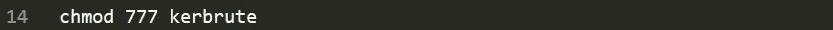

在这里，我使用了 777，这意味着我将最高权限(所有读、写、执行)授予任何用户组。

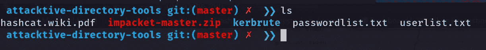

> Kerberos 中的什么命令允许我们枚举有效的用户名？

为此，我们通过给出*来运行 kerbrute。安装目录中的/kerbrute 命令。*

**回答:** userenum

> 发现什么值得注意的账户？(这些应该会引起你的注意)

在这里，我们应该运行 kerbrute 并找到用户名。在此之前，我将把目标域添加到我的/etc/hosts 中，这对于我来说很容易进行枚举。为此，您可以使用以下命令。在这里你应该有你的目标 IP 地址，而不是我的。

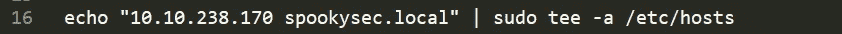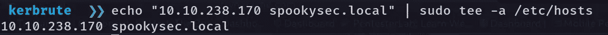

现在我将使用 userlist.txt 运行该脚本。我已经将目标域添加到我的主机，然后我可以使用域名，而不是键入 IP 地址。

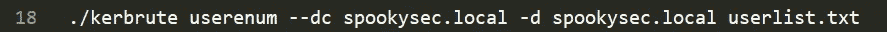

*   — dc 提供域控制器(KDC)目标的位置
*   -d 表示完整的域

这将给出一些有效用户帐户的输出。

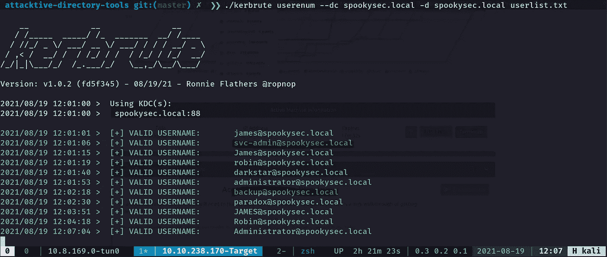

**答案:** svc-admin

> 另一个值得注意的发现是什么？(这些应该会引起你的注意)

**回答:**备份

所以，我想今天到此为止。我们已经完成了 TryHackMe 上攻击目录的任务 1 到任务 4，我们将讨论本文的第 2 部分。所以直到下一次，保持安全，再见👋。

你可以在上找到我😊：

领英:【www.linkedin.com/in/sudeepashiranthaka 

中:[https://sudeepashiranthaka97.medium.com/](https://sudeepashiranthaka97.medium.com/)

推特:[https://twitter.com/sudeepashiran97](https://twitter.com/sudeepashiran97)**