# 攻击目录:TryHackMe 演练-第 2 部分

> 原文：<https://infosecwriteups.com/attacktive-directory-tryhackme-walkthrough-part-2-3ab8f4d4a9bf?source=collection_archive---------0----------------------->

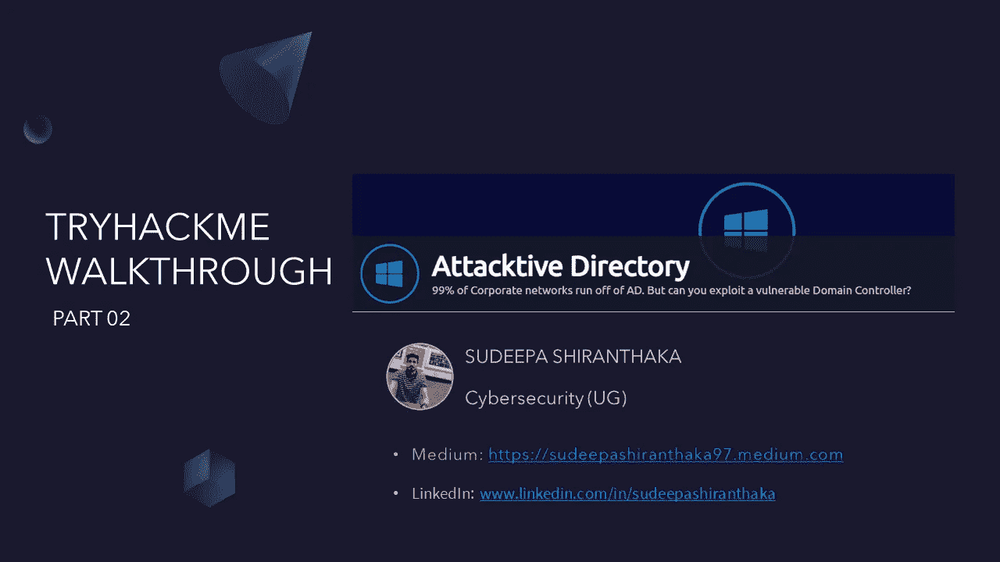

大家好，我是苏迪帕·白朗塔卡。今天，我们将完成 TryHackMe 上攻击性目录室的最后任务。如果您错过了第 1 部分，您可以通过下面的 URL 找到它。

 [## 攻击目录:TryHackMe 演练-第 1 部分

### 大家好，我是苏迪帕·白朗塔卡。今天，我们要谈谈 TryHackMe 上的攻击性目录室。所以…

infosecwriteups.com](/attacktive-directory-tryhackme-walkthrough-part-1-accfac4bf70f) 

任务 05:滥用 Kerberos

**简介 **

*在枚举完用户帐户后，我们可以尝试滥用 Kerberos 中的一个特性，使用一种叫做* ***的攻击方法进行重写。*** *当用户帐户具有“不需要预验证”权限设置时，会发生重新发布。这意味着帐户***在请求指定用户帐户上的 Kerberos 票据之前不需要提供有效的身份证明。**

****检索 Kerberos 票证****

*[*Impacket*](https://github.com/SecureAuthCorp/impacket)*有一个名为“GetNPUsers.py”的工具(位于 Impacket/examples/getnpusers . py 中)，它将允许我们从密钥分发中心查询作为可恢复帐户。查询帐户唯一需要的是一组有效的用户名，这是我们之前通过 Kerbrute 列举的。**

*通过谷歌搜索“检索 Kerberos 票证”，我发现了一个有趣的备忘单。你可以参考一下你的知识。*

*我们将使用“GetNPUsers.py”来获取用户的密码散列。首先，让我们检查一下脚本的位置。*

*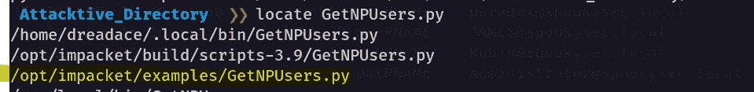*

*然后，您可以给出下面的命令来检索散列。*

*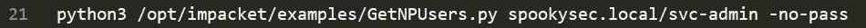*

*这将为您提供哈希，我不打算在这里显示它🙂。之后我们可以使用任何哈希破解工具(比如:hashcat，johntheripper)来破解我们的哈希。但是，在此之前，我们应该确定散列的模式。为此，您可以使用下面的 hashcat wiki 页面。*

 *[## example_hashes [hashcat wiki]

### 如果您在 hashcat 中得到一个“行长度异常”错误，这通常是因为您所请求的散列模式…

hashcat.net](https://hashcat.net/wiki/doku.php?id=example_hashes)* 

> *我们有两个用户帐户，我们可以从其中查询票证。您可以从哪个用户帐户查询票证而无需密码？*

*通过为我们的用户(svc-admin 和 backup)尝试所有可能的尝试，我发现我们可以只为 svc-admin 查询一个没有密码的票证*

***答案:** svc-admin*

> *查看 Hashcat 示例 Wiki 页面，我们从 KDC 中检索到了什么类型的 Kerberos 哈希？(指定全名)*

*在这里，您可以根据答案格式(答案空格上的***标记)对答案进行格式化😉)*

***回答:** Kerberos 5 AS-REP etype 23*

> *哈希是什么模式？*

**

***答案:** 18200*

> *现在用提供的修改过的密码列表破解哈希，用户账户密码是什么？*

*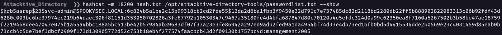*

***答:**管理 2005*

*如果你想了解更多关于 hashcat 和其他密码破解工具的知识，可以参考 TryHackMe 下面的房间。*

* [## 尝试破解杂凑

### 破解哈希挑战

tryhackme.com](https://tryhackme.com/room/crackthehash)  [## 网络安全培训

### TryHackMe 是一个免费的学习网络安全的在线平台，使用动手练习和实验室，通过您的…

tryhackme.com](https://tryhackme.com/room/johntheripper0) 

**任务 06:返璞归真**

***枚举:***

*有了用户的帐户凭证，我们现在在域内有了更多的访问权限。我们现在可以尝试枚举域控制器可能发出的任何共享。*

要完成此任务，我们应该枚举目标上的 SMB(服务器消息块)共享。

> 我们可以使用什么工具来映射远程 SMB 共享？

提示告诉我们使用 smbclient。那么，我们为什么不用它呢😉。

**回答** :smbclient

> 哪个选项将列出股份？

通过查看工具的手册页，我们可以得到这个问题的答案。

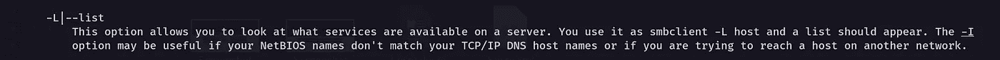

**答案:** -L

> 服务器列出了多少个远程共享？

对于这个问题，我们应该列举我们的目标上的 smb 份额。

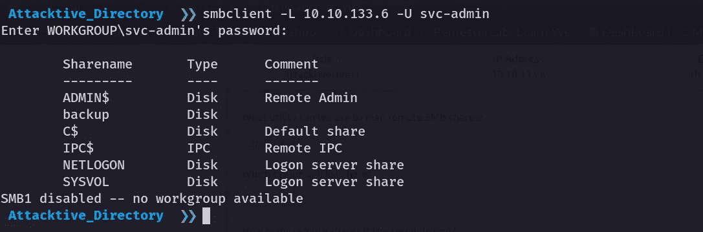

**答案:** 6

> 我们可以访问一个包含文本文件的特定共享。是哪一份？

通过查看股票，我找到了没有任何评论的股票。我试了一下，幸运的是这是我们问题的正确答案。

**回答:**备份

> 文件的内容是什么？

通过枚举备份共享，我们可以获得备份用户的凭据。

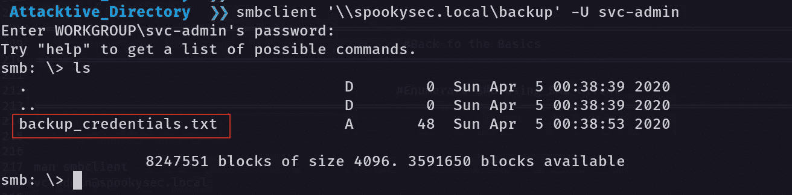

在这里代替域名(spookysec.local)，可以使用 IP 地址。要下载 smb 中可用的文件，我们可以使用 get 命令。

您可以参考下面的备忘单来提高您的知识。

 [## GitHub-irgoncalves/SMB client _ cheat sheet:使用 smbclient/nmap 的有用命令/技巧…

### 这是使用 smbclient、enum4linux 和 nmap smb 脚本的有用命令/技巧列表——在测试中非常有用…

github.com](https://github.com/irgoncalves/smbclient_cheatsheet) 

通过查看下载文件，您可以获得内容。

**答案:**YmFja * * * * * * * * * * * * * * * * * * * * * * * * * * * * * * * * * * * * * w %

> 解码文件的内容，完整的内容是什么？

通过查看完整的内容，我们可以简单地确定这是 base 64 编码格式。(我们有大写字母、简单字母、0-9 数字和%=)。如果你愿意，你也可以使用 **CyberChef** 。

 [## 网络咖啡馆

### 网络瑞士军刀-一个用于加密、编码、压缩和数据分析的网络应用程序

gchq.github.io](https://gchq.github.io/CyberChef/) 

通过解码编码内容你可以得到答案。

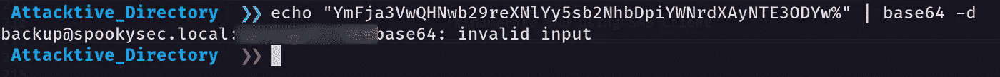

**答案:**backup @ spooky sec . local:b * * * * * * * * * * * 60

**任务 07:** **提升域内权限**

*我们可以使用 Impacket 中的另一个工具“secretsdump.py”。这将允许我们检索该用户帐户(与域控制器同步)必须提供的所有密码哈希。利用这一点，我们将有效地完全控制广告领域。*

提示将告诉我们“读取 secretsdump 输出！”

> 是什么方法让我们甩掉了 NTDS？DIT？

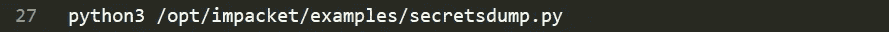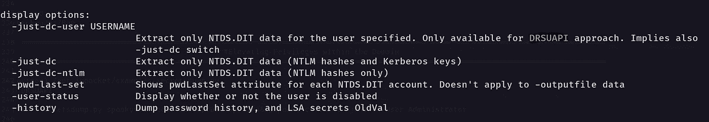

**回答:** DRSUAPI

> 管理员的 NTLM 散列是什么？

为了获得管理 NTLM 散列，我尝试了域控制器的-dc-ip (IP 地址。如果允许，使用目标参数中指定的域部分(FQDN)

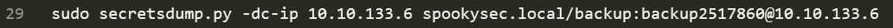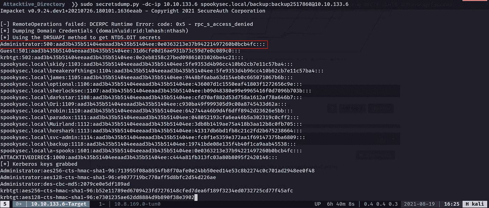

**答案:**0e 0363213 e 37 b 94221497260 b 0 BC B4 fc

> 哪种攻击方法可以让我们在没有密码的情况下验证用户身份？

通过在互联网上搜索，我发现我们可以使用“传递哈希”的方法来验证用户没有密码。

**回答:**传递哈希

> 使用一个叫做 Evil-WinRM 的工具，哪个选项允许我们使用散列？

对于这一部分，我们将使用 evil-winrm 工具。

*WinRM (Windows 远程管理)是微软实现的 WS-Management 协议。一种基于 SOAP 的标准协议，允许不同供应商的硬件和操作系统进行互操作。微软将它包含在他们的操作系统中，以使系统管理员的工作更容易。*

 [## GitHub - Hackplayers/evil-winrm:黑客/测试的终极 WinRM shell

### 用于黑客攻击/测试的终极 WinRM 外壳这个外壳是用于黑客攻击/测试的终极 WinRM 外壳。WinRM…

github.com](https://github.com/Hackplayers/evil-winrm) 

要安装 evil-winrm，您可以使用“gem install evil-winrm”命令。

安装后，我们将命令和控制我们的域控制器。

**答案:** -H

通过使用管理员 NTLM 哈希运行 evil-winrm，我们将获得对目标机器的命令和控制。

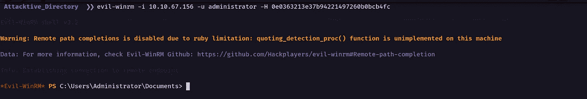

**任务 08:旗帜提交面板**

我们在房间的最后一部分。通过导航特定的用户，桌面会给我们相关的标志。

获取 svc-admin:

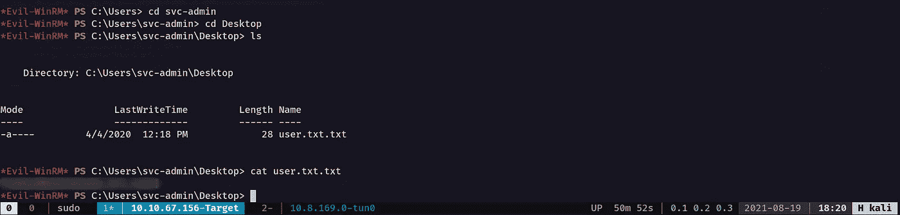

获取备份:

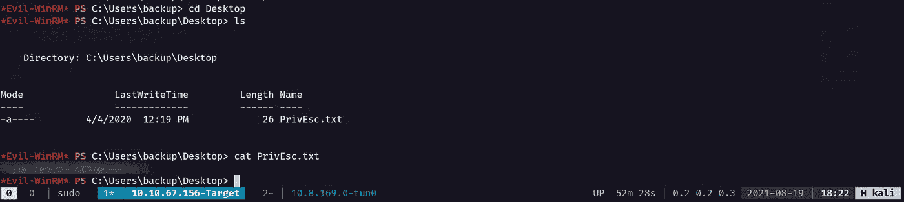

获取管理员

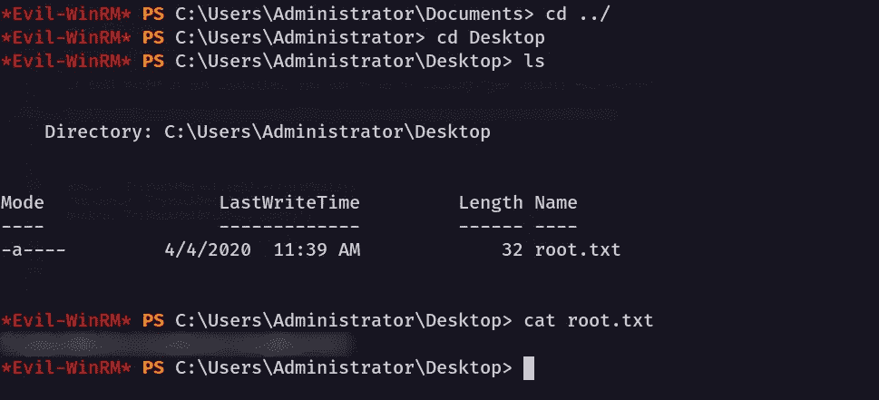

今天就到这里，希望你能从这篇文章中学到一些东西。下次再见，注意安全，再见👋。

你可以在上找到我😊：

领英:[www.linkedin.com/in/sudeepashiranthaka](http://www.linkedin.com/in/sudeepashiranthaka)

中:[https://sudeepashiranthaka97.medium.com/](https://sudeepashiranthaka97.medium.com/)

推特:[https://twitter.com/sudeepashiran97](https://twitter.com/sudeepashiran97)*