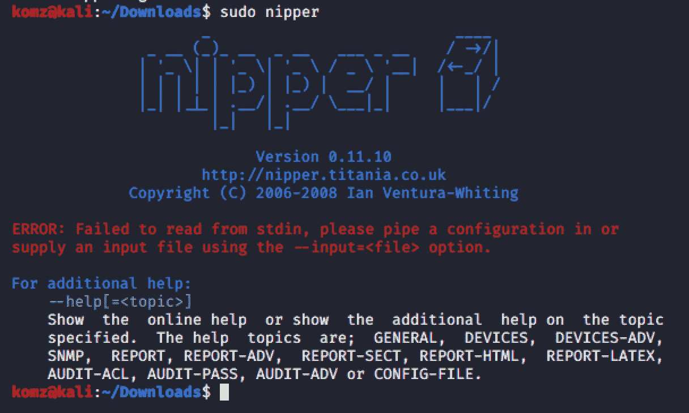
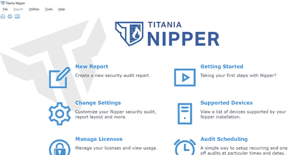
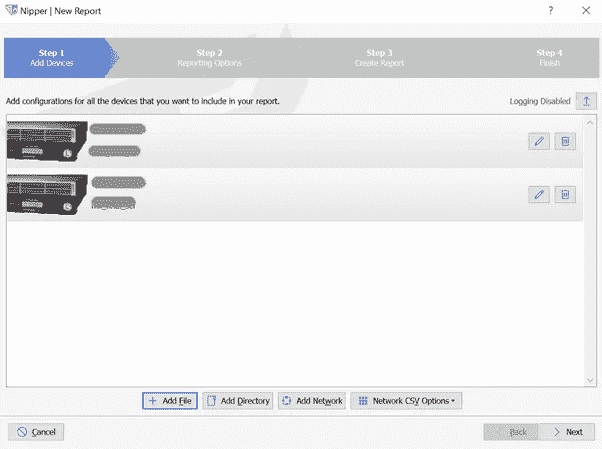
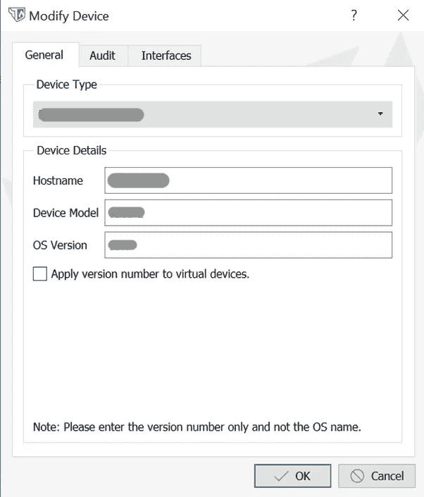
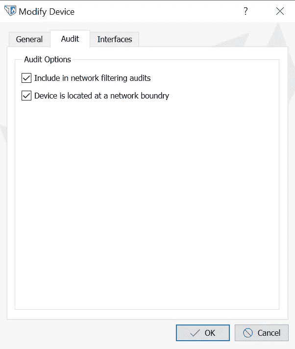
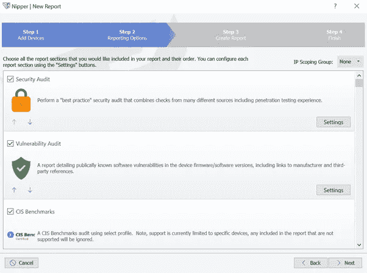
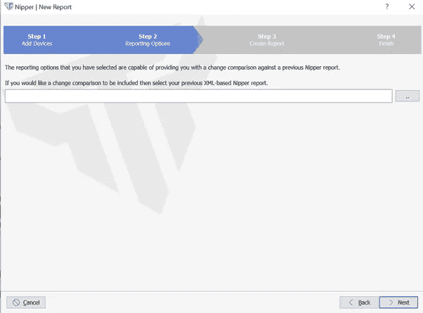
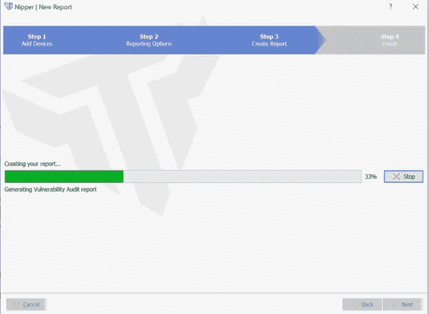
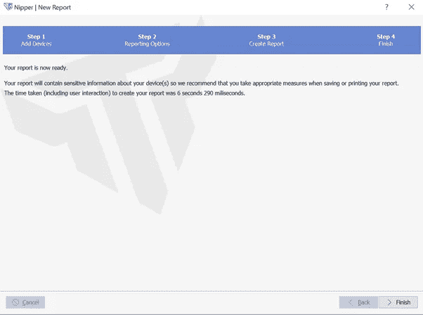
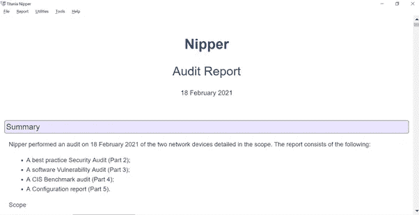

# 使用 Nipper 审计网络设备

> 原文：<https://infosecwriteups.com/auditing-the-network-devices-using-nipper-ebb3217c6670?source=collection_archive---------1----------------------->

## SecTools

[Nipper Tool](https://www.titania.com) 是一款商业软件，提供防火墙、交换机、路由器等网络设备的配置审计审查。这种网络基础设施评估也是您整体[基线安全检查](/baseline-security-check-i-61ce01cfcaf9)的一部分。

**Kali** Tools 提供免费开源的 nipper 工具[**Nipper-ng**](https://tools.kali.org/reporting-tools/nipper-ng)**这是一个命令行工具。**

****

**在这篇文章中，我将谈论公司使用的商业软件。**

**公司可以通过注册 [30 天免费试用](https://www.titania.com/register/trial/nipper/) &下载并安装 Nipper 来开始使用这个软件。**

**下面的快照是 Nipper 主页。一旦 Nipper 启动并运行，首先为网络设备安全审计报告创建**新报告**。**

****

**点击**新建报告后，**您现在需要**添加您想要审计的设备离线配置的文件**。评估将包括:确定设备配置设置、查找漏洞、合规性检查和安全审计。**

****

**点击每个器件旁边**笔**符号，编辑并提供每个器件的更多信息，以获得更好的结果。**

********

**点击**确定**和**下一步**。在步骤 2 中，选择要执行的审计类型。我的推荐将是以下打勾的。**

****

**该应用程序还允许您包含您之前的**基于 XML 的 Nipper 报告**，您希望将其与**变更比较**进行比较。**

****

**最后，创建报告并生成各种支持的格式的审计报告，您可以在保存报告时选择这些格式。**

************

**那都是乡亲们！**

**请参阅我以前的文章，其中讨论了组织的基本安全需求。**

** [## 基线安全检查 I

### 安全构建审查

infosecwriteups.com](/baseline-security-check-i-61ce01cfcaf9)** 

## **来自 Infosec 的报道:Infosec 每天都有很多内容，很难跟上。[加入我们的每周简讯](https://weekly.infosecwriteups.com/)以 5 篇文章、4 个线程、3 个视频、2 个 GitHub Repos 和工具以及 1 个工作提醒的形式免费获取所有最新的 Infosec 趋势！**