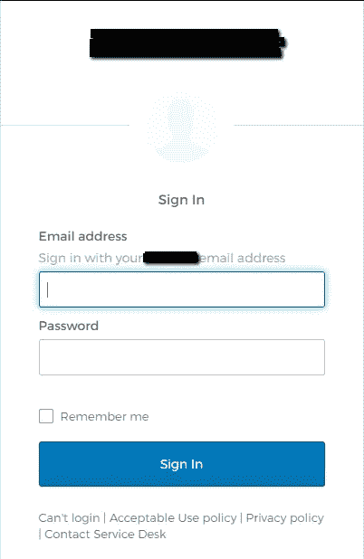
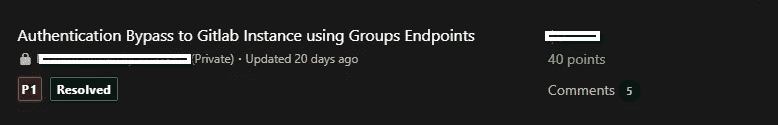

# 认证旁路| 10 分钟内轻松完成 P1

> 原文：<https://infosecwriteups.com/authentication-bypass-easy-p1-in-10-minutes-54d5a2093e54?source=collection_archive---------1----------------------->

# 侦察总是赢

大家好，我是来自印度的阿尼鲁德·马卡尔。这是我的第一篇文章，希望你们会喜欢。在这篇文章中，我将解释侦查和谷歌呆子的力量。别担心，我会让它简短明了的。

这是一个 Bugcrowd 私人项目，所以不能透露名称。就说 redacted.com 吧。所以* .redacted.com 是一个范围，这意味着我有一个相当大的搜索范围。

我开始使用 [assetfinder](https://github.com/tomnomnom/assetfinder) 、 [subfinder](https://github.com/projectdiscovery/subfinder) 和 [httpx](https://github.com/projectdiscovery/httpx) 进行子域枚举和探测。

一个域名引起了我的注意，那就是 https://git.infotech.redacted.com。我在浏览器中打开那个子域，看到它是一个 Gitlab 实例，它将我重定向到由 Okta Login 支持的 SAML 登录页面。因此，只允许内部用户使用他们公司的电子邮件地址(email@redacted.com)登录 GitLab 实例。我尝试了一些默认凭证，但没有运气！

Okta 登录页面

我没有放弃，跳到谷歌上寻找一些有趣的东西。我试过许多谷歌呆子，但只有没有任何敏感的东西。经过几次尝试，我使用了“site:git . infotech . redated . com ext:env ”,并找到了 GitLab 实例的一些用户名和组名。

我立即尝试了[https://git.infotech.redacted.com/username](https://git.infotech.redacted.com/username)和[https://git.infotech.redacted.com/groupname](https://git.infotech.redacted.com/username)，我能够绕过认证流程，直接访问那里的源代码。我在那里发现了很多敏感数据，比如 SQL 凭证和 LDAP 凭证。

> 非常感谢所有以各种可能的方式帮助和支持我的人。

以下是你从这篇文章中得到的信息:

1.  侦察总是有帮助的。
2.  如果你被困在某个地方，就谷歌一下。
3.  不断学习。

# 黑客快乐！

可以关注我: [Twitter](https://twitter.com/anirudhmakkar) ， [LinkedIn](https://www.linkedin.com/in/anirudh-makkar-293548118/) ， [Instagram](https://www.instagram.com/anirudh.makkar/) 了解更多 bug 赏金小技巧。