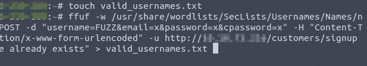
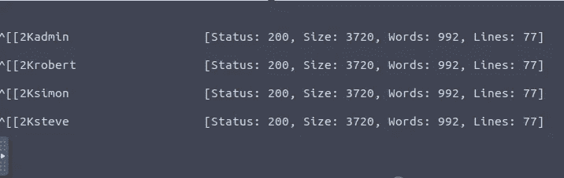
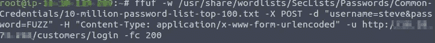
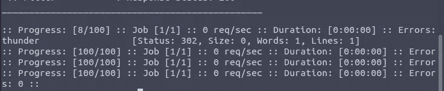
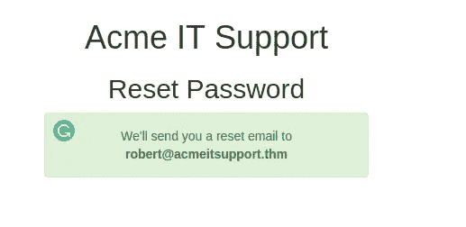
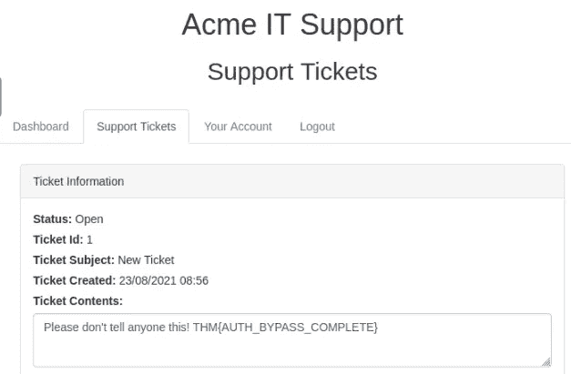
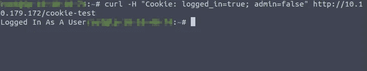
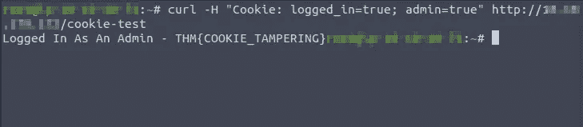
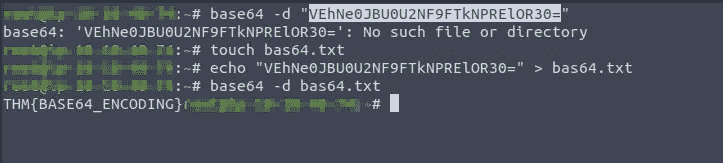
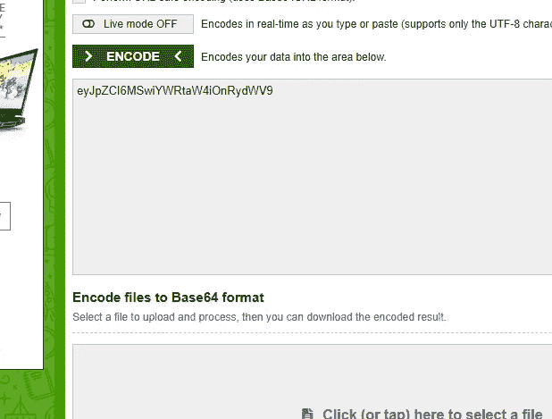

# 验证旁路-TryHackMe

> 原文：<https://infosecwriteups.com/authentication-bypass-tryhackme-115039117a5d?source=collection_archive---------0----------------------->

## 写文章

你好，了不起的黑客伙伴们，欢迎回到 Tryhackme room 上的一篇关于认证的新文章。所以我们来讨论一下概念。

认证旁路是导致合法人员的敏感信息暴露的关键类型的漏洞。

**用户名枚举:**

用户名枚举的概念是用来收集他们已经注册的特定电子邮件地址/用户名的信息。

**Ffuf** 是用于暴力破解和枚举等的最佳工具。通过使用 Ffuf 工具，我们可以使用户名枚举像。

首先，进入目标地址注册页面，输入用户名 admin 并输入你的详细信息，然后点击注册，这给了我一个错误**“这个用户名的帐户已经存在”。**利用这个有助于找到有效用户名的错误。

为此，我使用以下命令:

> **ffuf-w/usr/share/word lists/sec lists/Usernames/Names/Names . txt-X POST-d " username = FUZZ&email = X&password = X&cpassword = X "-H " Content-Type:application/X-www-form-urlencoded "-u http://Target _ address/customers/sign up-Mr "用户名已经存在"**

结果是:

从上面的截图，我们可以找到史蒂夫密码(雷霆)

> **逻辑漏洞:**

被黑客规避和操纵的应用程序的逻辑路径。

让我们进入逻辑缺陷的实际论证:

使用提供的电子邮件地址和用户名表单字段输入密码重置表单。

它通知我消息发送成功。

然后，我们通过在终端中输入 curl 命令来篡改 reset 链接。

> **curl ' http://10 . 10 . 179 . 172/customers/reset？email = Robert @ acmeitsupport . thm '-H ' Content-Type:application/x-www-form-urlencoded '-d ' username = Robert&email = { username } @ customer . acmeitsupport . thm '**

我们将通过查看我的邮件，将我的电子邮件附在 robert 用户名的末尾，从而获得 flag 的详细信息。

在输入上面的 curl 命令后，进入你的帐户并检查支持票下，你将能够看到票的内容。

在目录中，你可以看到那里的链接和导航链接。

> **Cookie 篡改:**

通过篡改 cookies，我们将进入未经验证的会话。

**curl**[**http://target _ IP/cookie-test**](http://target_ip/cookie-test)**这是用来检查 cookie 是否登录。**

****

**该命令用于显示登录用户。**

****

**最后我们为它找到了旗帜。**

> ****更改纯文本 cookie 值的标志是什么？****

**THM{COOKIE_TAMPERING}**

> ****MD5 哈希 3b2a 1053 e 3270077456 a 79192070 aa 78 的值是多少？****

**我用 crackstation 来寻找它的解决方案。**

**463729**

> ****veh ne 0 jbu 0 u 2 nf 9 ftknprelor 30 =，base64 解码值是多少？****

****

**THM{BASE64 编码}**

> ****使用 base64 编码以下值{"id":1，" admin":true}****

****

**eyJpZCI6MSwiYWRtaW4iOnRydWV9**

**感谢你花时间阅读我的博客，以获得更多的故事。**

**这是我的新博客页面，其中包含网络安全的提示**

** [## @ ethicalhacktech8 | YoFan

### 学习保护和如何保护免受攻击。

哟.范](https://yo.fan/ethicalhacktech8) 

也通过查看内容来支持我**