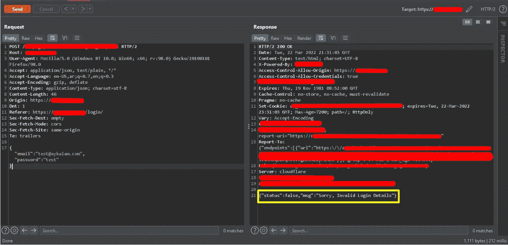
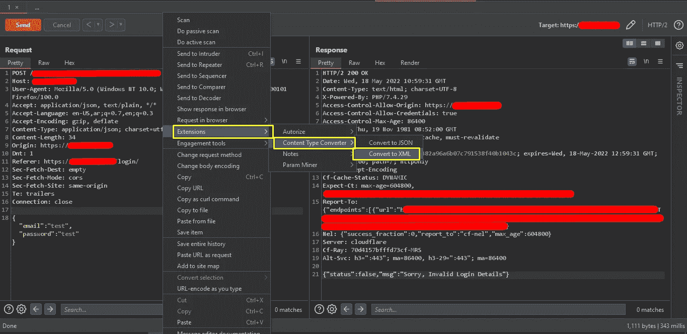
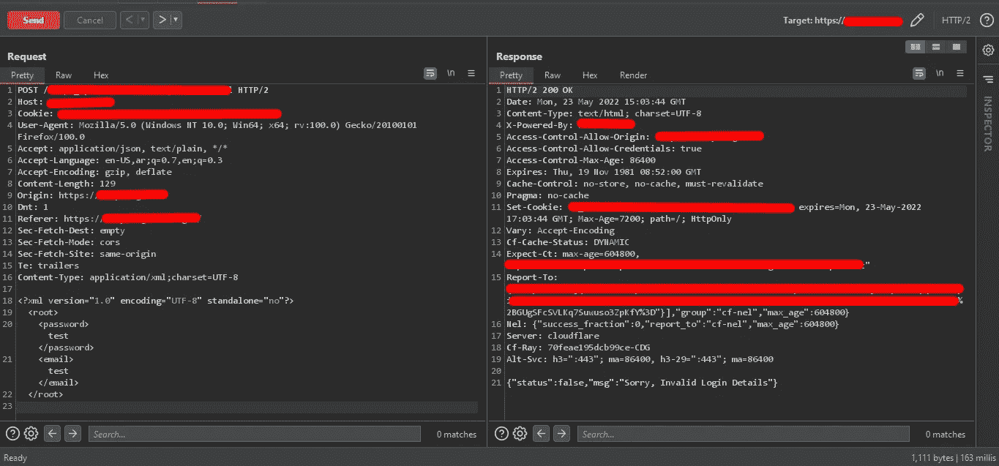
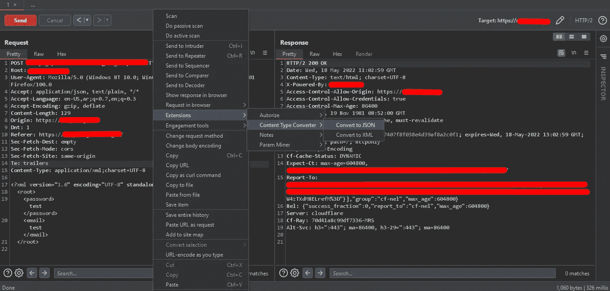
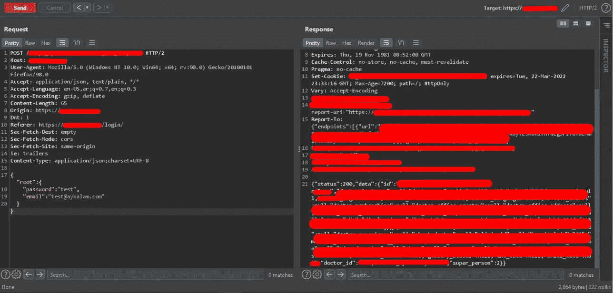
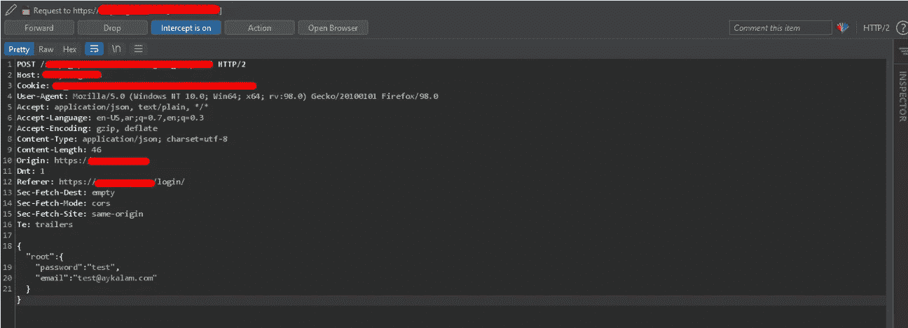
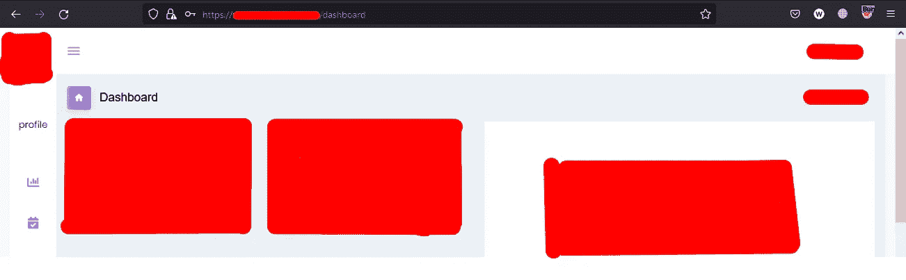
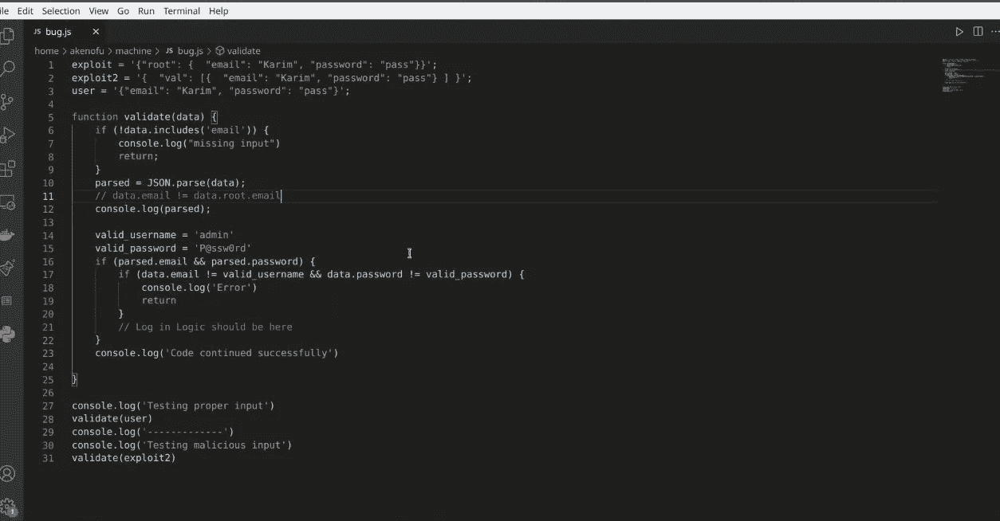
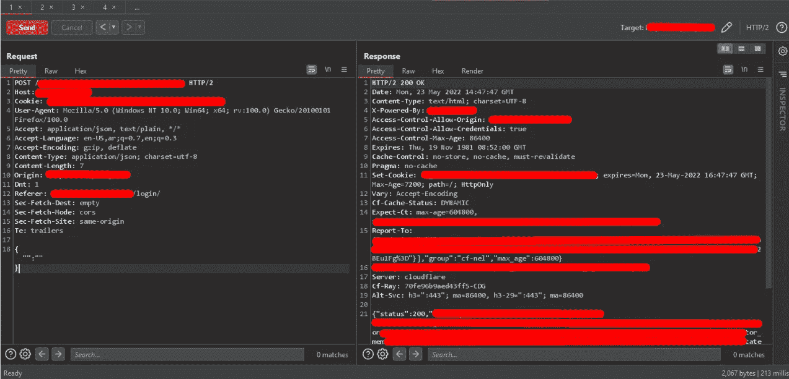

# 使用根对象或空数组绕过身份验证。

> 原文：<https://infosecwriteups.com/authentication-bypass-using-root-array-4a179242b9f7?source=collection_archive---------0----------------------->

> 最后更新:2022 年 5 月 23 日
> 
> 添加了包含更多详细信息的分析部分

嘿猎人们！今天我们有一篇关于我在一个 pentesting 客户那里的一个发现的新报道。我们以前绕过的方法比较棘手，想分享给社区，那就开始吧。


## 概观

客户端通过发送您的凭证来执行他的登录过程，并接收 JSON 数据中的响应。诀窍是把你的凭证放在`root`对象中，如果后端有一个同名的对象，它就能工作。

请注意，目标使用 Cloudflare 作为服务器，因此很难专注于注入。

## 复制的步骤

1.尝试使用假凭证登录，以检查请求和响应。



您会注意到凭证是以 JSON 数据的形式发送的，响应也是以 JSON 的形式。至此，我已经尝试了多种技巧，比如:

```
**Change false to true** → Failed
**Change the message to** “Success” → Failed
**Delete the whole msg** → Failed
**Delete the status** → Failed
```

2.该是处理请求 JSON 数据的时候了，让我们试着把它转换成 XML 来测试 XXE，但是运气不好，没有返回响应。



3.好了，让我们使用相同的扩展将它返回给 JSON，并再次发送请求。



在使用扩展转换之后，找出发生的变化，这就是为什么响应返回与默认用户相关的数据。

4.尝试拦截登录请求，并像我们之前尝试的那样更改 JSON 数据，然后转发请求。

```
Change the data from 
**{"email":"test@aykalam.com","password":"test"}**to be like that
**{"root": {
  "password": "test",
  "email": "test@aykalam.com"
}}**
```



4.您会发现自己以管理员身份登录。



## 分析

经过多方尝试和深挖，随着[](https://twitter.com/LiveOverflow)**和我的队友 [**艾哈迈德**](https://twitter.com/justAhmed96)**[**【卡里姆·阿尼】**](https://twitter.com/akenofu) **和** [**穆罕默德**](https://twitter.com/MohamedSaleh428) 我们发现了这个问题。****

****目标使用自定义框架和处理登录过程的自定义函数的默认情况。我会给你一个简单的例子来清除弱点，这只是 JS 代码，而不是确切使用的。****

****如果你检查下面的代码。****

********

****由卡里姆·阿尼编码****

****您会注意到，所使用的 if 语句没有配置好，如果 IF 语句的条件为 false，则流程不会终止，而是会继续。这个问题可以让您绕过身份验证。****

****所以，如果你试图把登录帖子的数据替换为空，它会得到同样的结果****

```
**Replace the following 
**{"email":"test@aykalam.com","password":"test"}**With 
**{"":""}****
```

********

****感谢阅读，并希望你得到它好❤****

## ****由于****

******现场溢出，艾哈迈德·希沙姆，卡里姆·阿尼**和**穆罕默德·萨利赫******

## ****保持联系****

****[LinkedIn](https://www.linkedin.com/in/eslam3kl/)|[GitHub](https://github.com/eslam3kl)|[Twitter](https://twitter.com/eslam3kll)****