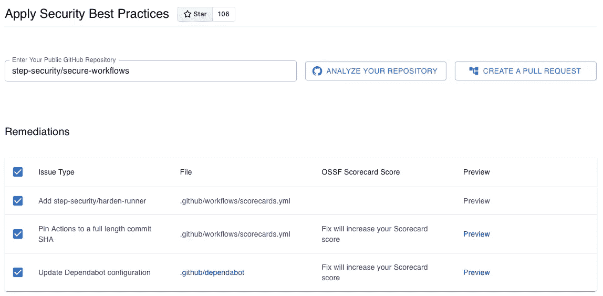
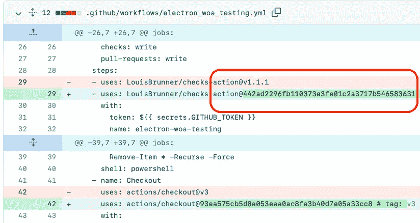
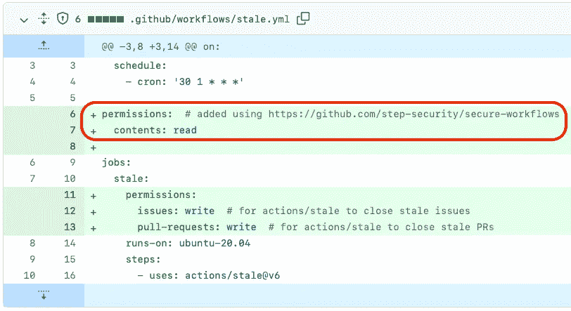
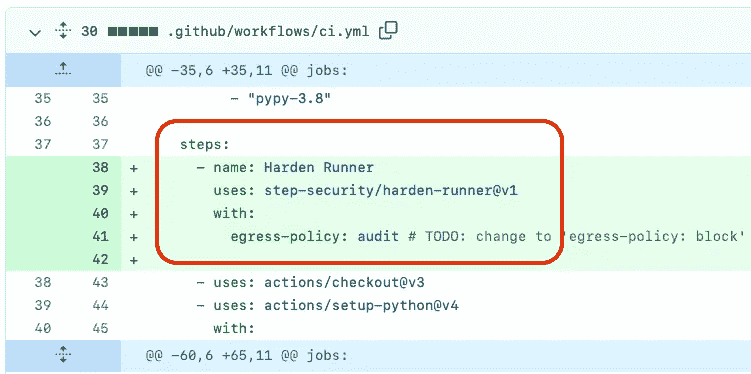

# 自动化 GitHub 操作安全最佳实践

> 原文：<https://infosecwriteups.com/automate-github-actions-security-best-practices-f5f178001291?source=collection_archive---------2----------------------->

## 在保护您的 GitHub 操作工作流程方面节省时间和精力


Pawel Czerwinski 在 [Unsplash](https://unsplash.com?utm_source=medium&utm_medium=referral) 上的照片

# **什么是 GitHub 动作？**

GitHub Actions 是一个持续集成和持续交付(CI/CD)平台。通过 GitHub Actions，开发人员可以定义一组在他们将代码推送到 GitHub 时运行的任务。GitHub Actions 对公共存储库中 GitHub 托管的跑步者是免费的。GitHub Actions 也很灵活，允许开发人员定制他们的工作流来满足他们的需求。因此，GitHub Actions 已经成为开发人员提高生产力的流行工具。

# **为什么保护您的 GitHub 动作工作流程至关重要？**

用于连续部署的 GitHub 操作工作流具有特权凭据。此外，在每个工作流运行开始时，GitHub 会为您的工作流运行创建一个唯一的 GITHUB_TOKEN。如果这些凭证遭到破坏，攻击者就可以篡改存储库内容、版本和包。这可能导致软件供应链攻击和生产系统受损。

# **GitHub Actions 安全最佳实践有哪些？**

**1。** **设置最小 GITHUB_TOKEN 权限**

GITHUB_TOKEN 可供每个作业向 GitHub API 进行身份验证。为了在这个令牌受损的情况下减少损失，请根据作业的需要为 GITHUB_TOKEN 设置最低权限。

**2。将动作固定到全长提交 SHA**

GitHub 动作标签是可变的，这带来了安全风险。如果标签改变了，在它被使用之前，你将没有机会检查它。为了降低这种风险，请考虑将操作固定到完整长度的提交 SHA。

**3。** **保持 GitHub 动作最新**

像其他依赖项一样，GitHub 动作接收安全更新。配置一个依赖项更新工具，比如 Dependabot，将 GitHub 动作更新到最新版本。

**4。** **哈登 GitHub 动作跑者**

在管道运行期间，会下载几个依赖项和构建工具。如果这些依赖关系中有一个是恶意的，它可以从运行者那里泄漏凭证或者篡改发布版本。为了减轻这种风险，使用 [Harden-Runner GitHub 动作](https://github.com/step-security/harden-runner)。Harden-Runner GitHub 操作允许设置策略，将出站网络呼叫限制在允许的列表中。它还可以检测编译过程中对源代码的篡改。

**5。** **使用 OpenID Connect (OIDC)访问云资源**

一些云提供商，如 AWS、GCP 和 Azure，支持 OpenID Connect (OIDC)。要部署到支持 OIDC 的云提供商，您可以将工作流配置为直接向云提供商进行身份验证。OIDC 消除了将长期云凭证存储为 GitHub 机密的需要。

# **如何自动化 GitHub Actions 安全最佳实践？**

虽然您可以手动应用这些最佳实践，但这可能会很麻烦、耗时且容易出错。

[安全工作流程](https://github.com/step-security/secure-workflows)开源项目自动化了应用这些最佳实践的步骤。它将一个工作流(YAML 文件)作为输入，并将其转换为使用 GitHub Actions 安全最佳实践。


GitHub 上的安全工作流开源项目

您可以在[https://app.stepsecurity.io/securerepo.](https://app.stepsecurity.io/securerepo)为公共存储库使用托管实例。这样，您可以创建一个 pull 请求，将最佳实践应用于您的公共 GitHub 存储库中的所有工作流。不需要安装任何 GitHub App 就可以使用。

1.  您指定一个公共的 GitHub 存储库 URL 并点击`Analyze`。
2.  SecureWorkflows 会获取存储库的所有工作流文件，对其进行分析，并显示修正列表。
3.  选择所需的补救措施，然后单击`Create a pull request`。根据安全最佳实践创建一个拉取请求。



app.stepsecurity.io/securepo 截图

# 来自流行项目的拉请求示例

以下是三个来自流行的开源项目的例子，它们使用 SecureWorkflows 应用了 GitHub Actions 安全最佳实践:

1.  **Electron** : Electron 用于构建带有 JavaScript、HTML 和 CSS 的桌面应用

[https://github.com/electron/electron/pull/36343](https://github.com/electron/electron/pull/36343)

在这个使用 SecureWorkflows 创建的 pull 请求中，工作流文件将 GitHub Actions 标记自动固定到它们的全长提交 SHA。



GitHub 动作标签是自动固定的

**2。Kubernetes-Ingress**:Kubernetes 的 NGINX 入口控制器

https://github.com/nginxinc/kubernetes-ingress/pull/3134

在这个 pull 请求中，自动为 GITHUB_TOKEN 设置最小权限



GITHUB_TOKEN 的最小权限是自动设置的

**3。Attrs** : Attrs 支持编写 Python 类

[https://github.com/python-attrs/attrs/pull/1034](https://github.com/python-attrs/attrs/pull/1034)

这个 pull 请求将 Harden Runner GitHub 操作添加到工作流文件中。



工作流程中添加了强化 Runner GitHub 操作

# **总结**

成千上万的开源项目使用 GitHub 动作。保护 GitHub Actions 工作流以防止软件供应链攻击至关重要。遵循 GitHub 操作工作流的安全最佳实践可能会非常麻烦和耗时。许多开源项目通过使用[安全工作流](https://github.com/step-security/secure-workflows)节省了时间和精力。要将 GitHub Actions 安全最佳实践应用到您的公共存储库中，请使用位于[https://app.stepsecurity.io/securerepo](https://app.stepsecurity.io/securerepo)的托管实例。

```
**Want to secure GitHub Actions workflows in your public repository quickly?** 
Use SecureWorkflows at [https://app.stepsecurity.io/securerepo](https://app.stepsecurity.io/securerepo) 
```

# 资源

[1]了解 GitHub 操作

[https://docs . github . com/en/actions/learn-github-actions/understanding-github-actions](https://docs.github.com/en/actions/learn-github-actions/understanding-github-actions)

[2]使用限制、计费和管理

[https://docs . github . com/en/actions/learn-github-actions/usage-limits-billing-and-administration](https://docs.github.com/en/actions/learn-github-actions/usage-limits-billing-and-administration)

[3]自动令牌认证

[](https://docs.github.com/en/actions/security-guides/automatic-token-authentication) [## 自动令牌认证- GitHub 文档

### 在每次工作流运行开始时，GitHub 会自动创建一个唯一的 GITHUB_TOKEN secret，用于您的工作流…

docs.github.com](https://docs.github.com/en/actions/security-guides/automatic-token-authentication) 

[4]GitHub 动作的安全强化

[](https://docs.github.com/en/actions/security-guides/security-hardening-for-github-actions) [## GitHub 操作的安全强化- GitHub 文档

### 本指南解释了如何为某些 GitHub 动作特性配置安全强化。如果 GitHub 采取行动…

docs.github.com](https://docs.github.com/en/actions/security-guides/security-hardening-for-github-actions) 

[5] Harden Runner GitHub 动作

[https://github.com/step-security/harden-runner](https://github.com/step-security/harden-runner)

[6] StepSecurity 安全工作流项目

[https://github.com/step-security/secure-workflows](https://github.com/step-security/secure-workflows)

[7]公共存储库的安全工作流项目的托管实例

[https://app.stepsecurity.io/securerepo](https://app.stepsecurity.io/securerepo)

## 来自 Infosec 的报道:Infosec 每天都有很多内容，很难跟上。[加入我们的每周简讯](https://weekly.infosecwriteups.com/)以 5 篇文章、4 个线程、3 个视频、2 个 GitHub Repos 和工具以及 1 个工作提醒的形式免费获取所有最新的 Infosec 趋势！