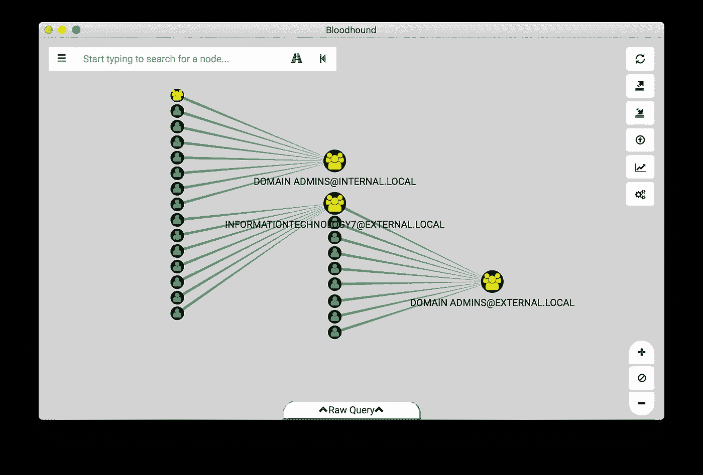
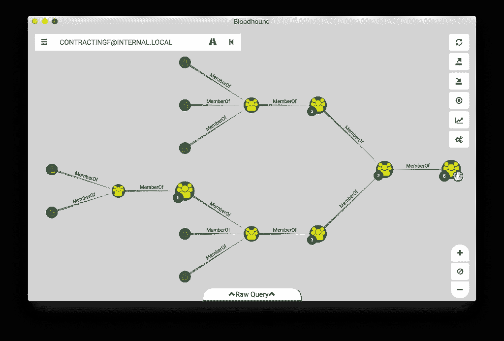
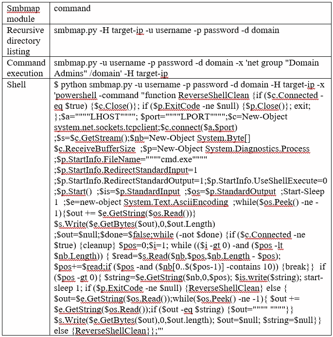

# 自动化 AD 枚举

> 原文：<https://infosecwriteups.com/automating-ad-enumeration-with-frameworks-f8c7449563be?source=collection_archive---------0----------------------->

手动做所有事情很酷，但是我们如何节省时间和金钱呢？很多时候，大部分枚举工作都可以自动化。但是要知道，自动化任何任务都需要很多知识。我们大多数人认为，自动化结果/报告必须手动审查/分析，以确保准确、精确和受控的测试。受控？是的，还记得阿米蒂奇，钴和类似的工具吗？我们不想在游戏早期就被 IDS/IPS/WAF 赶上。

因此，这里开始了 Active Directory 特定信息的自动枚举。这些工具被分类为在某些情况下使用的 ***本地和远程枚举*** 工具。

> **本地广告枚举工具**

在各种技术的帮助下，如果攻击者控制了远程命令执行或获得了用户/管理员外壳，攻击者可以选择 **Bloodhound** 和 **Powerup** 工具进行帐户/资源/网络/打印机/错误配置等的本地枚举。

一)*警犬*

[Bloodhound](https://github.com/BloodHoundAD/BloodHound/releases) 是一个非常有用的工具，基于 [PowerView](https://github.com/PowerShellMafia/PowerSploit/blob/master/Recon/PowerView.ps1) ，它将帮助绘制整个网络中的活动目录关系。在 pentest 中，这一点至关重要，因为在初始访问(用户或管理员)之后，它会让您了解接下来要攻击什么。在大型基础设施中，拥有关于域/林/信任关系和基础设施的信息对于有针对性的利用是至关重要的。Bloodhound 的常见用法和包括的步骤:

> 1.一旦你有了初步的立足点，[下载](https://github.com/BloodHoundAD/BloodHound/releases) Bloodhound 并在某个地方提取它。点击。请在 Bloodhound 的根目录下运行。在攻击者机器浏览器中打开 bolt://localhost:7687，使用用户名和密码登录。
> 
> 2.浏览到某处\猎犬\变种人和复制 Sharphound.exe。假设您有 Meterpreter 或任何其他 shell 来上传目标上的 Sharphound.exe，那么您可以上传. exe
> 
> 3.对目标执行 Sharphound.exe。
> 
> 4.这将创建几个 CSV 文件。主要枚举用户/组成员、本地用户/组成员和会话。
> 
> 5.将 CSV 文件从目标机器下载到攻击者机器上。
> 
> 6.将这些 CSV 文件上传到 bloodhound 并进行探索。
> 
> 7.这可以提供大量关于目标系统的各种基础设施、信任和成员资格的信息。

图 Bloodhoud 域枚举报告的一个非常典型的例子。引用自[https://wald0.com/?p=68](https://wald0.com/?p=68)展示了警犬在大型基础设施上的能力。

图 Bloodhound 枚举的用户映射。引用自 https://wald0.com/?p=68[的](https://wald0.com/?p=68)，用于展示警犬在大型基础设施上的能力。

b) *Powersploit 通电*

根据我的观察和经验， [linenum](https://github.com/rebootuser/LinEnum) 对于 linux 来说可能更好。PowerUp 旨在成为基于错误配置的常见 Windows 权限提升途径的信息交换所。显然，加电在权限提升中是有用的，但它是通过检查错误配置和缺失的安全控制/补丁来实现的。

一旦有了本地远程执行，加载 Powershell 并执行以下命令:

> powershell.exe-nop-exec 旁路

然后导入加电模块

> 导入模块 PowerUp.ps1

现在，您可以访问所有 PowerUp cmdlets。执行所有的检查运行

> 调用-all checks | Out-File-Encoding ASCII checks . txt

获取攻击者机器上的文件并分析有趣的信息。下面是一个示例报告:

> 运行 Invoke-AllChecks
> 检查未引用的服务路径…
> [+]未引用的服务路径:CustomSVC—C:\ Users \ Adam \ Documents \ Visual Studio 2008 \ Projects \ Service \ Service \ bin \ Release \ Service . exe
> 检查服务可执行文件权限…
> [+]易受攻击的服务可执行文件:CustomSVC—C:\ Users \ Adam \ Documents \ Visual Studio 2008 \ Projects \ Service \ Service \ bin \ Release \ Service . exe
> 检查服务权限….dll 位置…
> 检查 AlwaysInstallElevated 注册表项…
> [+]该计算机已启用 AlwaysInstallElevated！
> 正在注册表中检查自动登录凭证…

> 远程 AD 枚举工具

1.*应答者*

响应器是一个强大的工具，适用于 Pentester 应该拥有的所有 Windows 或 Active Directory 环境。如果域/Windows 系统无法通过 DNS 解析名称，它将回退到通过 LLMNR(在 Windows Vista 中引入)和 NetBIOS 进行名称解析。通过运行 Responder，我们可以将攻击者的机器伪装成所有 LLMNR 和 NetBIOS 请求的目标机器。要执行 responder，请运行

> 响应者-i <your ip="">-wrf</your>

2. *Enum4linux*

[Enum4linux](https://github.com/portcullislabs/enum4linux) 是一个从 Windows 和 Samba 系统枚举信息的工具。主要特点:

> RID 循环(当 RestrictAnonymous 在 Windows 2000 上设置为 1 时)
> 
> 用户列表(当 RestrictAnonymous 在 Windows 2000 上设置为 0 时)
> 
> 群组成员信息列表
> 
> 共享枚举
> 
> 检测主机是在工作组还是在域中
> 
> 识别远程操作系统
> 
> 密码策略检索(使用 polenum)来源: [https://labs。portcullis.co.uk/tools/enum4linux](https://labs.portcullis.co.uk/tools/enum4linux)

要从攻击者机器上执行 enum4linux，请使用以下命令:

使用以下命令执行 enum4linux 并分析结果:

> enum 4 Linux-用于空会话的 target-ip #
> 
> enum 4 Linux-u administrator-p password-A target-IP #用于已知的凭证

*3。Smbmap*

Smbmap 是一个非常有用的工具，它是 crackmapexec 的一个子集，我们很快就会讨论它。使用正确的凭据，可以使用 smbmap 完成 SMB 共享枚举、所有 SMB 共享的递归目录列表、命令执行、上传/下载/删除、反向外壳等操作。smbmap 的大部分选项汇总在下表中:

SMBmap 模块和命令参考。

4. *CrackMapExec*

[CrackMapExec](https://github.com/byt3bl33d3r/CrackMapExec) (又名 CME)是一款开发后工具，有助于自动评估大型活动目录网络的安全性。CME 在构建时就考虑到了隐蔽性，它滥用内置的活动目录功能/协议来实现其功能，并允许它规避大多数端点保护/IDS/IPS 解决方案。

在各个 pentest 阶段，CME 可以做很多事情，如下所述:

> Cme <target>网络枚举</target>
> 
> Cme smb <target>-u 用户名-p 密码-local-auth-x whoami #命令执行</target>
> 
> CME<target>-u username-p password—Lu users #列出已登录的用户</target>
> 
> CME<target>-u username-p password-local-auth–sam #转储本地 Sam 哈希</target>
> 
> CME SMB<target>-u username-H ' lm hash:n hash '—local-auth #传递散列</target>
> 
> cme <protocol><target>-u 用户名. file -p 密码. file #密码 brutefoce</target></protocol>

CME 支持 Empire、Metasploit 和 Mimikatz 集成，这使它成为活动目录测试的瑞士军刀。

**大声喊出来:**

Bloodhound 投稿人: [@_wald0](https://www.twitter.com/_wald0) ， [@CptJesus](https://twitter.com/CptJesus) ， [@harmj0y](http://twitter.com/harmj0y)

CME 投稿人: [@byt3bl33d3r](http://twitter.com/byt3bl33d3r)

[https://www . ivoid warranties . tech/posts/pentesting-tuts/CME/crackmapexec/](https://www.ivoidwarranties.tech/posts/pentesting-tuts/cme/crackmapexec/)