# 自动化打嗝套件-1 |通过宏捕获 CSRF 令牌

> 原文：<https://infosecwriteups.com/automating-burpsuite-1-capturing-csrf-token-via-macro-ef2f85565f75?source=collection_archive---------0----------------------->

# 使用带有反 CSRF 令牌的 Burp 会话处理规则

Burp suite 允许 pentesters 设置会话管理规则。可以通过**宏**设置会话管理规则。在这里，我们将尝试创建一个**宏**来自动化捕获 CSRF 令牌的过程。然后，我们将尝试通过中继器和浏览器选项卡来验证它。

反 CSRF 令牌是随机生成的令牌，与用户的当前会话相关联。它们包含在与敏感的服务器端操作相关联的 HTML 表单和链接中。当用户执行敏感操作(如银行转账)时，请求中应包含反 CSRF 令牌。在处理请求之前，服务器应该验证该令牌的存在性和真实性。如果令牌丢失或不正确，请求将被拒绝。

我们将使用这种方法来自动化 DVWA 中的**登录认证**，DVWA 在 POST 登录请求**中使用 **CSRF 令牌**。**

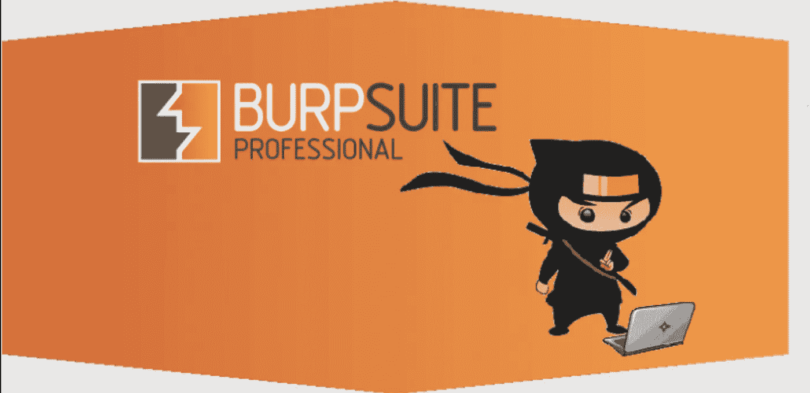

参考图像

## 如何做:

1.  本地主机上的默认 DVWA 登录页面，设置通过以下方式完成:

`[docker run — — rm -it -p 80:80 vulnerable/web-dvwa](https://github.com/digininja/DVWA)`

2.在 Burp suite 范围内添加 localhost。

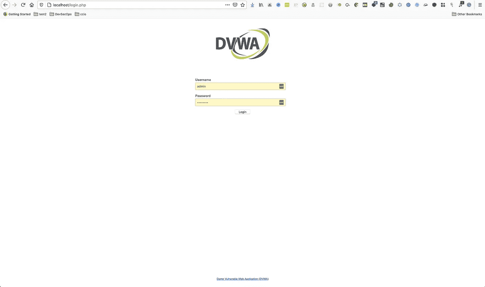

DVWA 默认登录

3.登出后当应用程序重定向到[*http://localhost/log in . PHP*](http://localhost/login.php)时，令牌出现在响应体中。

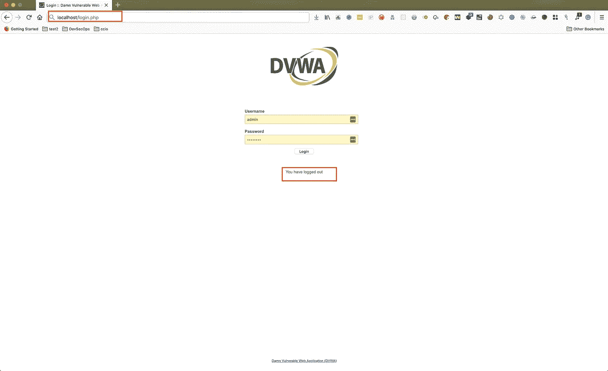

注销后的页面

4.切换到 proxy history 选项卡，确定响应中包含 CSRF 令牌的请求。

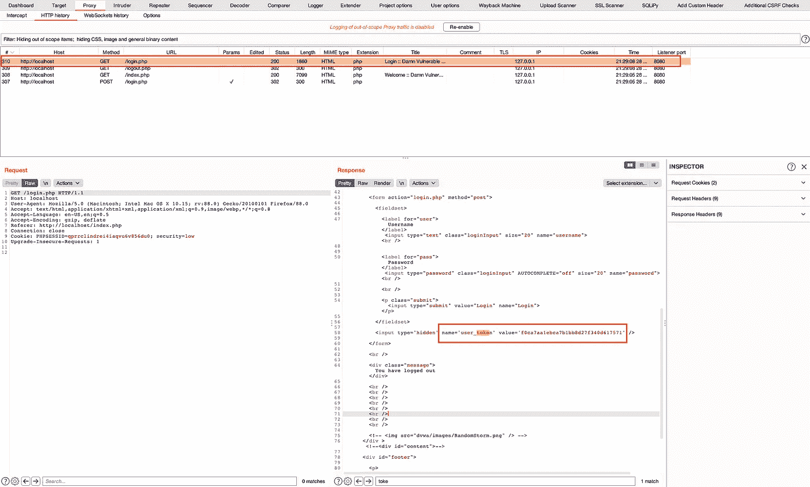

使用 user_token 注销后的登录页面

5.访问项目选项选项卡>然后访问会话选项卡。

6.在会话处理规则中，点击添加(*忽略预先创建的规则*)。)

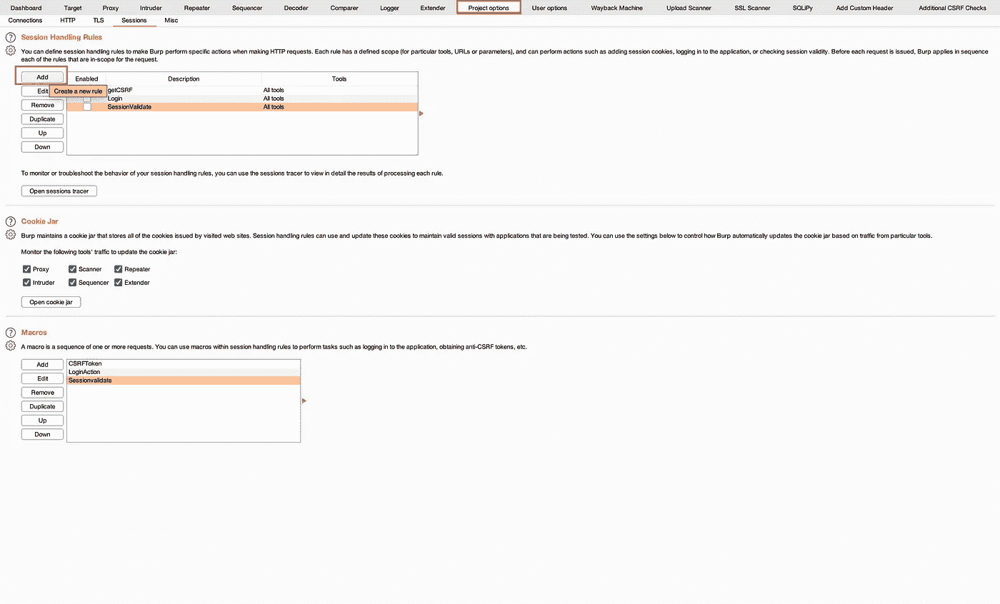

Burp 套件中的项目选项

7.然后在规则操作中更改规则描述和。选择运行宏。

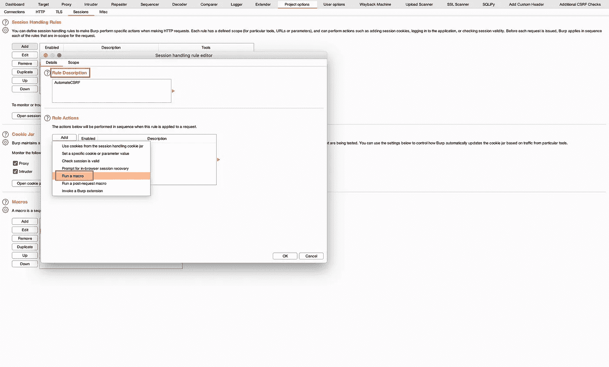

通过宏进行会话处理

8.打开宏记录器，选择长度为 1860 字节的[http://localhost/log in . PHP](http://localhost/login.php)请求。单击确定。

> 该页面在用户注销后出现。点击注销按钮，用户被重定向到 login.php，其中包含 CSRF 令牌。这将在步骤 3 中描述。

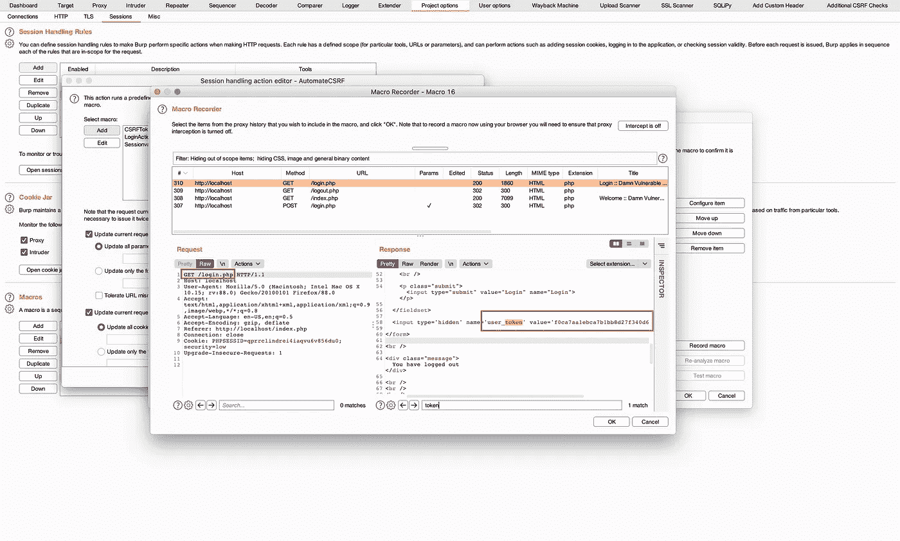

宏记录器中的 User_token

9.在宏编辑器中，输入`**Macro Description**`并点击`**Configure Item**` **。**

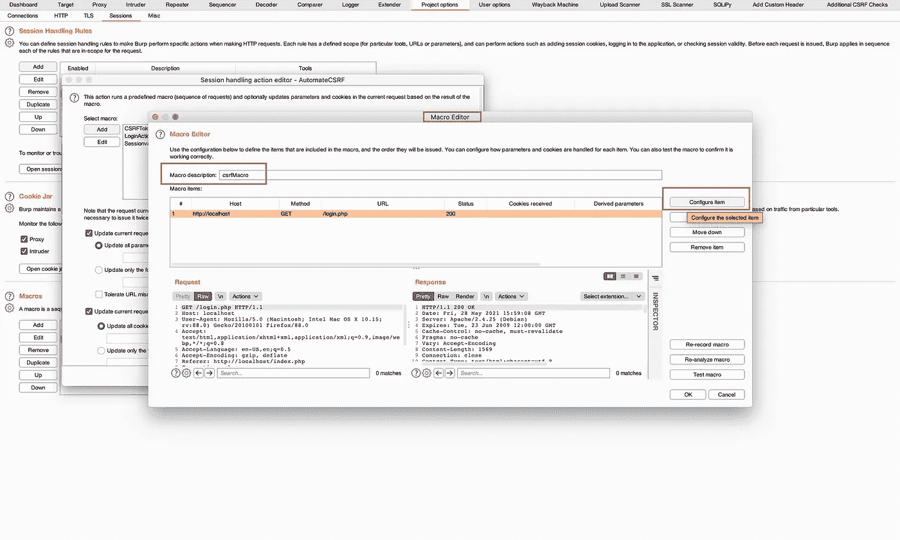

宏编辑器

10.在配置宏项目中，单击添加。

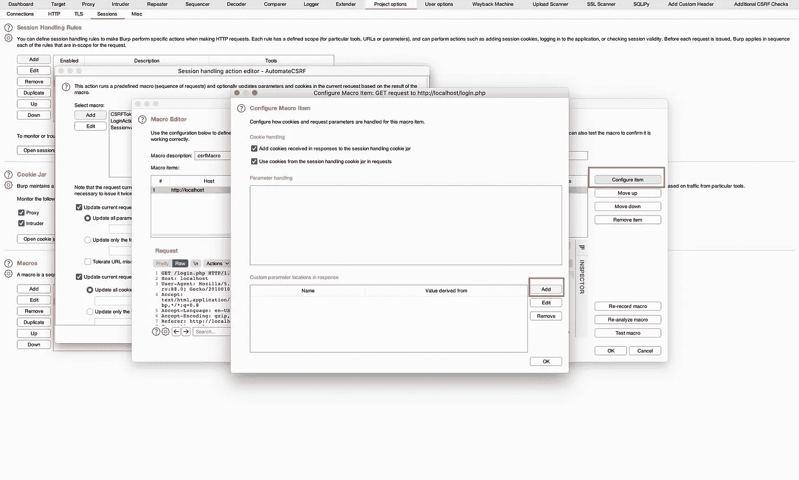

配置宏项目

11.我们知道用于 CSRF 的**用户令牌**中使用的参数。让我们通过代理历史快速验证一下。

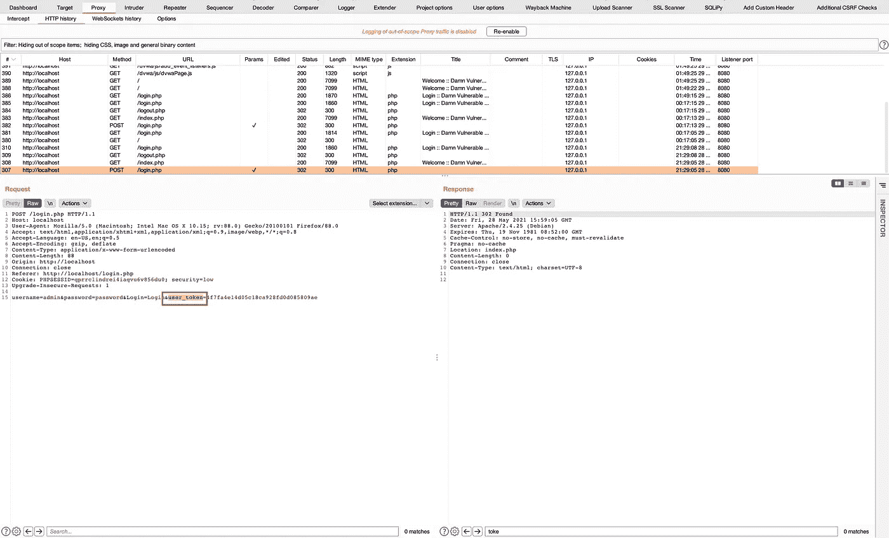

验证 user_token 参数

12.从*第 10 步*，选择`user_token`的参数值，该参数值在打嗝套件中自动选择。

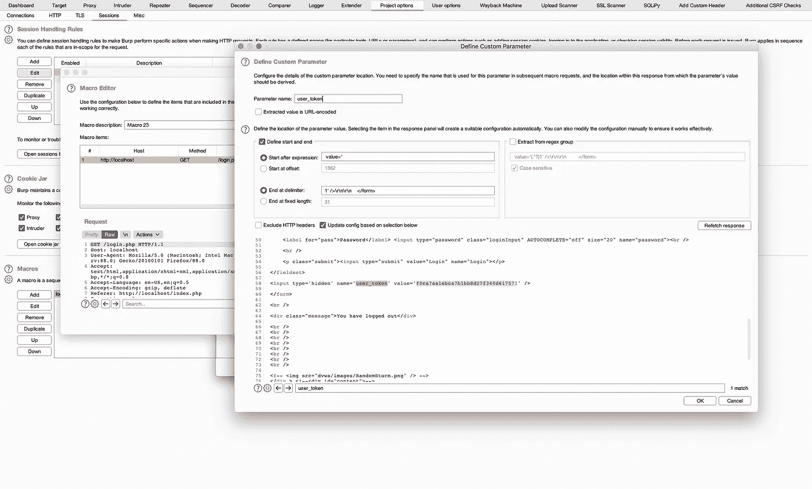

定义自定义参数

13.现在单击确定并保存它。将会打开宏编辑器窗口。

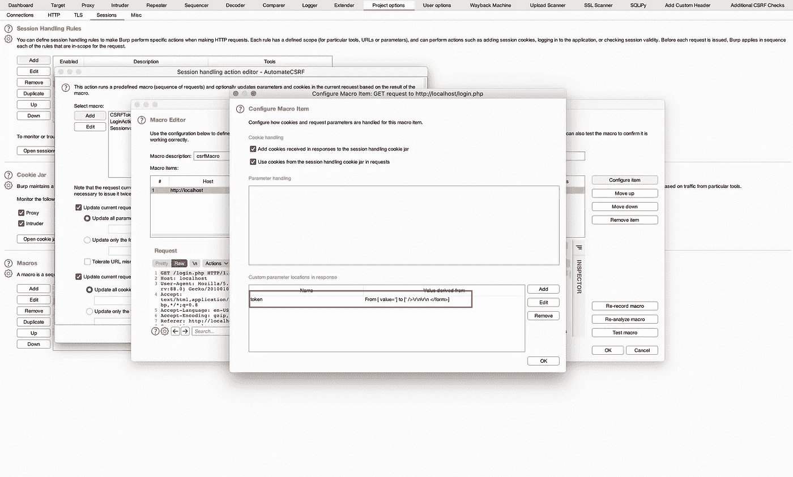

捕获用户令牌的值

14.在宏编辑器中，添加`**Macro Description**`，然后选择确定。

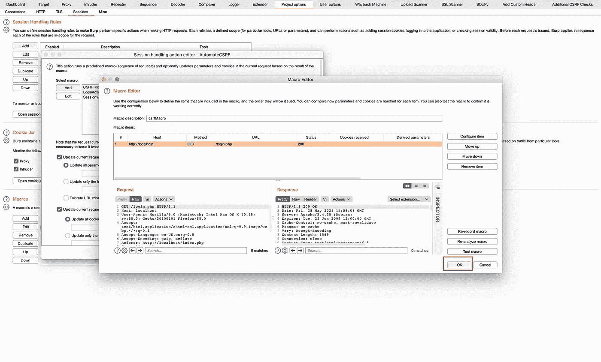

宏编辑器

15.然后在**会话处理规则编辑器**中，将选项卡更改为**范围**。相应地选择范围和 URL 范围。

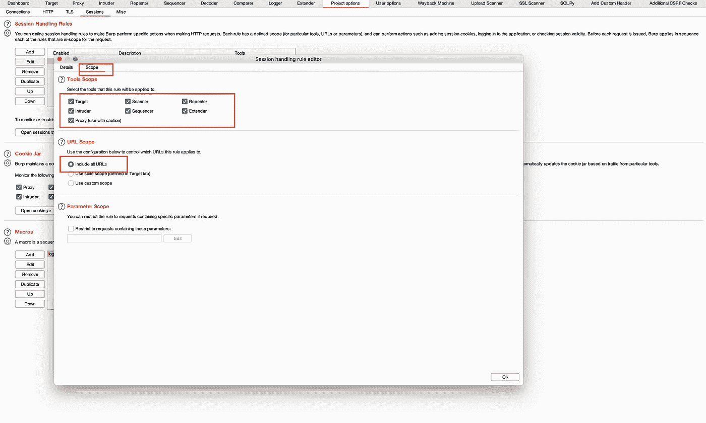

范围

17.**用于 CSRF 处理的宏**已创建。保存 ok，我们来测试一下这个**宏**。

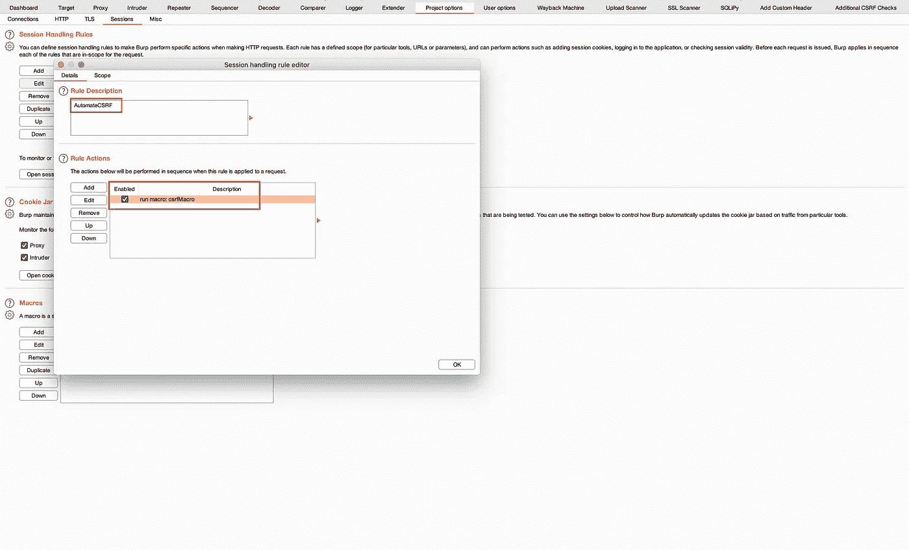

宏描述

18.向中继器发送[login.php](http://localhost/login.php)请求，并检查**用户令牌**值。

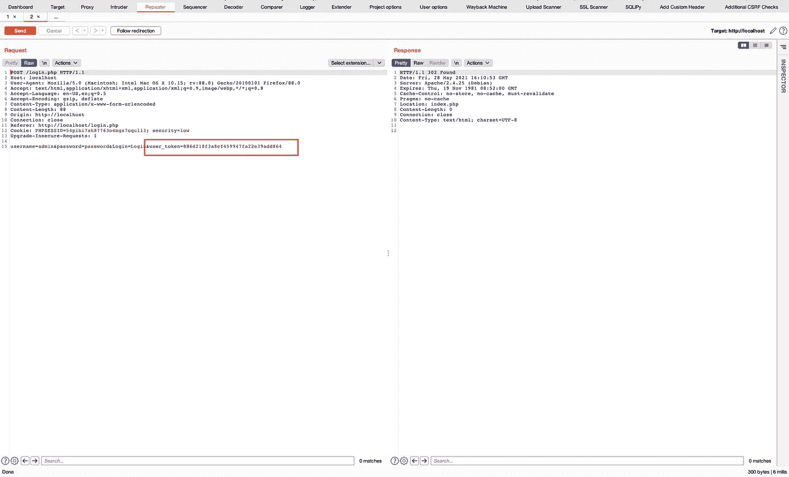

中继器中的用户令牌

19.现在重新发送请求，并比较前一个请求的值。这两个值是不同的。

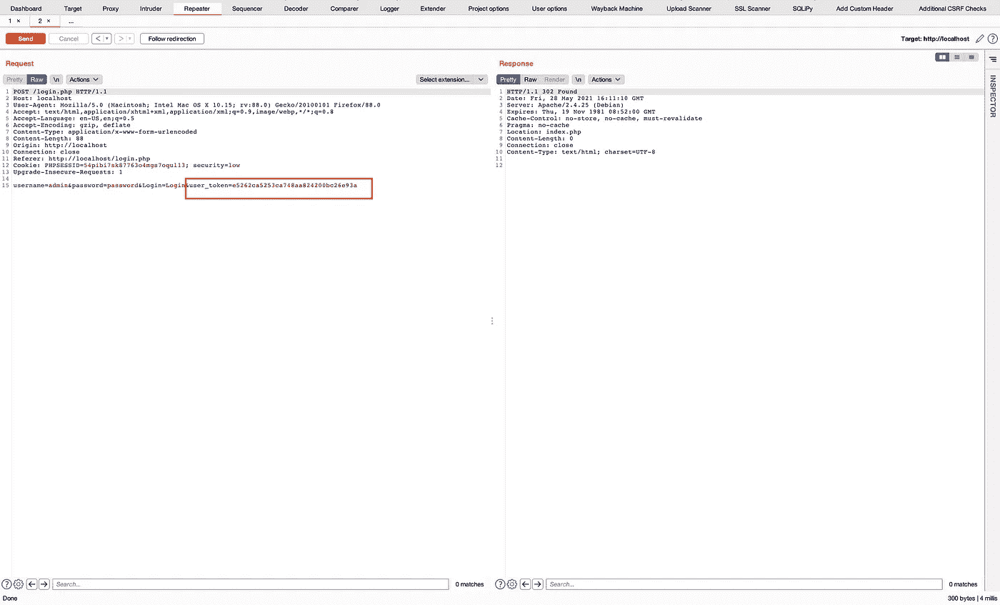

用户令牌

这验证了宏运行良好，我们可以在下一个教程中使用它。

## 工作原理:

这里，通过在中继器中重放请求，将**反 csrf** 令牌改变为不同的值。这允许自动绕过 **CSRF** 令牌机制，并在通过 Burp 套件自动扫描的同时提供灵活性。

它的工作方式是捕获 user_token 值，然后运行宏，用捕获的新值替换旧的 CSRF 令牌。

**参考:**

1.  [https://www.youtube.com/watch?v=LsMZnpUIFZI&list = pldlltt 2 o 4 uzcrwiwx4cezk 8d 7 yhcafx4t&index = 10](https://www.youtube.com/watch?v=LsMZnpUIFZI&list=PLDlltT2o4UZCrWiWx4cEzk8D7YhCAFX4T&index=10)
2.  [https://ports wigger . net/support/using-burp-suites-session-handling-rules-with-anti-csrf-tokens](https://portswigger.net/support/using-burp-suites-session-handling-rules-with-anti-csrf-tokens)
3.  [https://www . packtpub . com/product/burp-suite-cookbook/9781789531732](https://www.packtpub.com/product/burp-suite-cookbook/9781789531732)

> *下一个 Burp Suite 宏教程将指导您完成* [*自动化登录过程*](https://justm0rph3u5.medium.com/automating-burp-suite-2-automated-authenticated-login-and-scanning-via-macro-5189c88cc795) *。*

