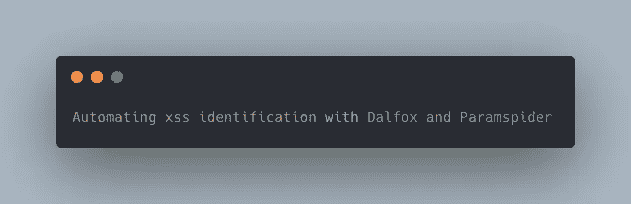
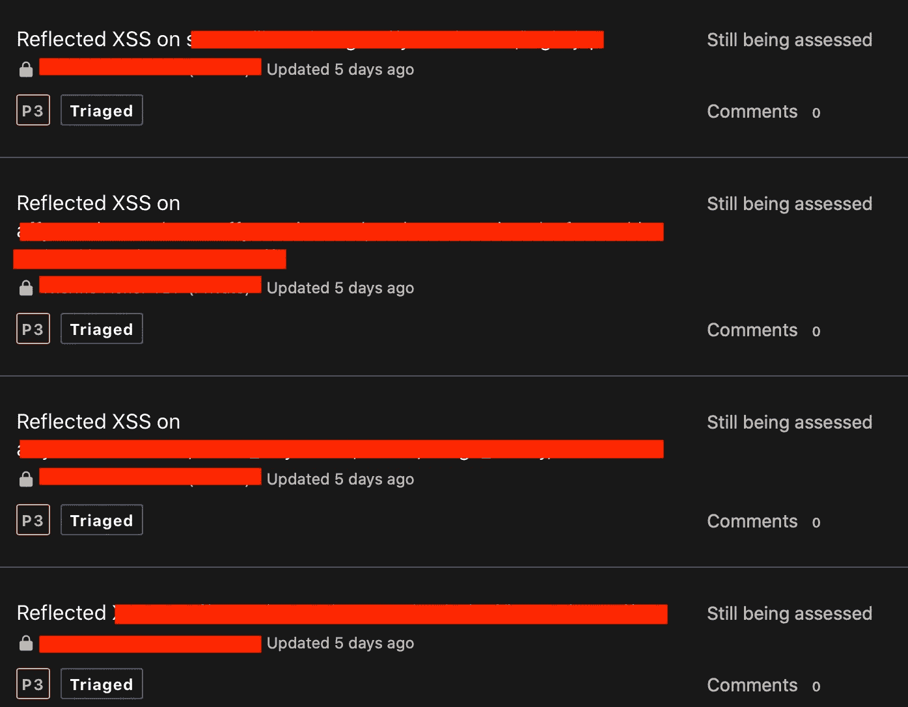

# 使用 Dalfox 和 Paramspider 自动识别 xss

> 原文：<https://infosecwriteups.com/automating-xss-identification-with-dalfox-paramspider-e14283bb7916?source=collection_archive---------0----------------------->



跨站点脚本允许攻击者通过一些参数在 web 应用程序中注入恶意的 javascript 代码，并且可以进一步升级以执行攻击，例如 cookie 窃取、会话劫持等。

**XSS 的种类**:

*   反映了 XSS
*   存储的 XSS
*   基于 DOM 的 XSS

**这一切是如何开始的？**

我最近在 BugCrowd 上收到了一个私人程序的邀请，我立即浏览了详细信息，发现所有的子域都在范围内。

因此，我更进一步，开始使用各种工具枚举子域

amass，sublist3r，subfinder，find domain-Linux，crt.sh，assetfinder，将每个工具的结果保存在 txt 文件中。

```
amass enum -d target.com -o /filepath/subdomains.txt
```

然后在得到一个巨大的子域名集合后，用 httprobe 对它们进行唯一的排序和解析。

```
 sort -u subdomains.txt | httprobe > /filepath/uniq.txt
```

现在对我来说，通过在浏览器中手动打开 50 多个子域变得非常困难。

决定用目击者截图每个子域回复。

```
eyewitness --web -f uniq.txt -d /path_to_save_screenshots
```

这花了几分钟的时间，然后我写了一个简单的脚本，将这些 png 截图嵌入到 html 中，这样我就可以直接在浏览器中查看它们了。

```
for I in $(ls); do 
        echo "$I" >> index.html;
        echo "<br>" >> index.html;
done
```

在所有这些之后，我找到了一个子域，我决定从这个子域开始进行测试。

我使用 paramspider 提取那个子域的参数

```
paramspider -d target.com > /filepath/param.txt
```

将参数保存在文件中后，用 dalfox 将其自动化

```
dalfox -b hahwul.xss.ht file param.txt
```

经过几分钟的耐心，我执行了 10 个 xs。



【http://twitter.com/parasarora06】推特 : [推特](http://twitter.com/parasarora06)

**领英**:[http://linkedin.com/in/parasarora06](http://linkedin.com/in/parasarora06)