# 尸检演练 Tryhackme

> 原文：<https://infosecwriteups.com/autopsy-walkthrough-tryhackme-f8107c449742?source=collection_archive---------0----------------------->

Q1)操作系统版本的全称是什么？

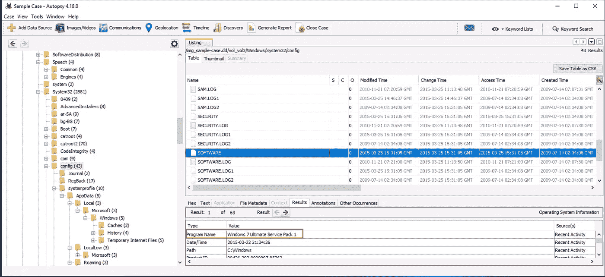

答:windows 7 旗舰版服务包 1

Q2)文档在驱动器中占多大比例？在你的答案中包括%。

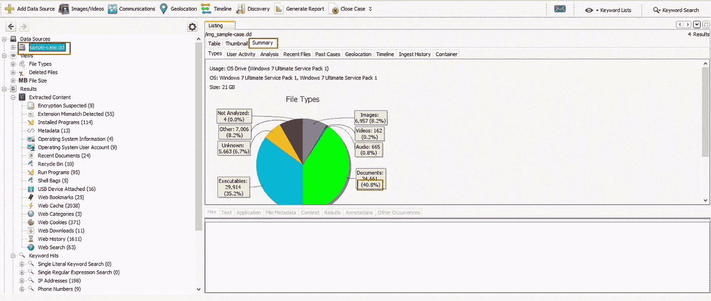

答:40.8%

Q3)大多数文件事件发生在哪个日期？(年月日)

ANS 提示:检查安装程序和运行程序的日期/时间

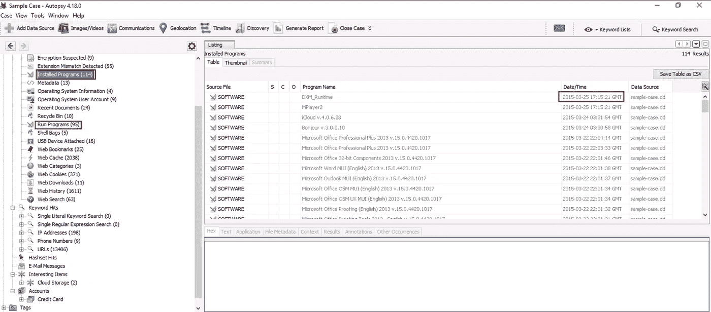

答案:2015 年 3 月 25 日

Q4)版本号为 6.2.0.2962 的已安装程序的名称是什么？

ANS 提示:转到已安装的程序并找到版本为 6.2.0.2962 的已安装程序

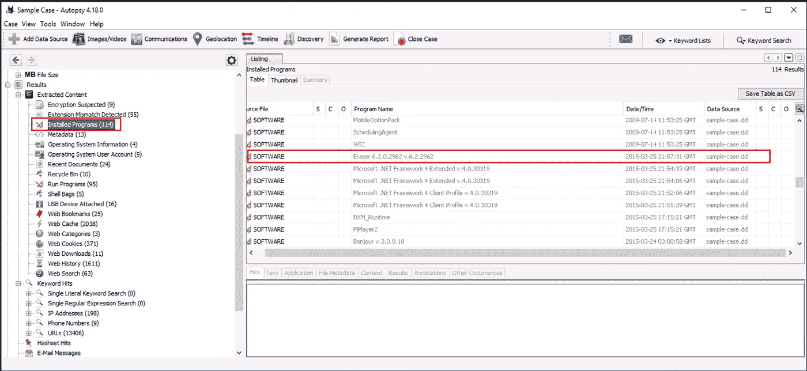

答案:橡皮擦

Q5)用户有密码提示。价值是什么？

ANS 提示:打开操作系统用户帐户，检查帐户是否包含任何类型的密码提示

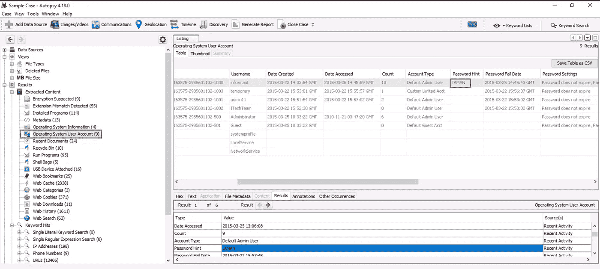

答:我是男的

许多秘密文件从网络驱动器被访问。IP 地址是什么？

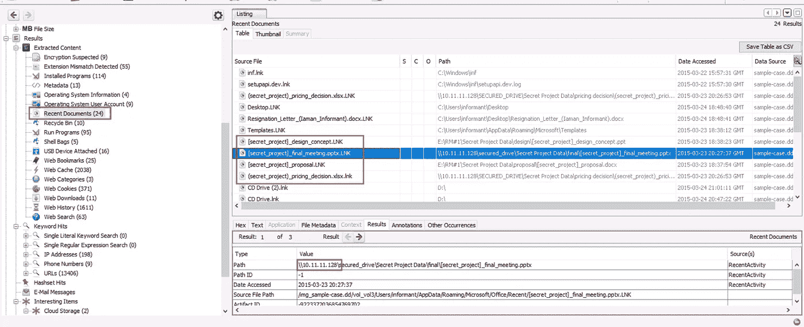

答复:10.11.11.128

Q7)哪个网络搜索词的条目最多？

ANS 提示:这里我们可以看到嫌疑人正在互联网上搜索关于信息泄露的案例

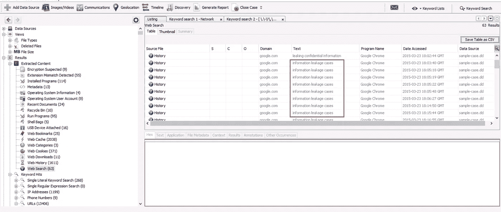

答:信息泄露案例

Q8)在 2015 年 3 月 25 日 21:46:44 进行的网络搜索是什么？

回答提示:查看网络搜索部分，找到包含 2015 年 3 月 25 日 21:46:44 的网络搜索

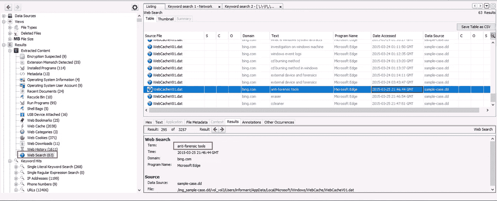

答:反取证工具

Q9)什么二进制文件被列为有趣的文件？

ANS 提示:打开有趣的项目->云存储->有趣的文件

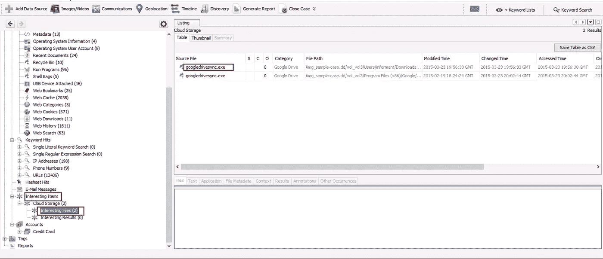

答:googledrivesync.exe

问题 10)“线人”在便利贴上为自己写了什么自我保证的信息？(无空格)

ANS 提示:首先，我搜索已安装的程序并运行程序。但是我能找到任何东西。当时我只是查看检测到的扩展不匹配。这里我们可以看到不同种类的扩展文件。我找到了一个 snt 扩展文件。此扩展由 Microsoft 便笺使用。我打开它。

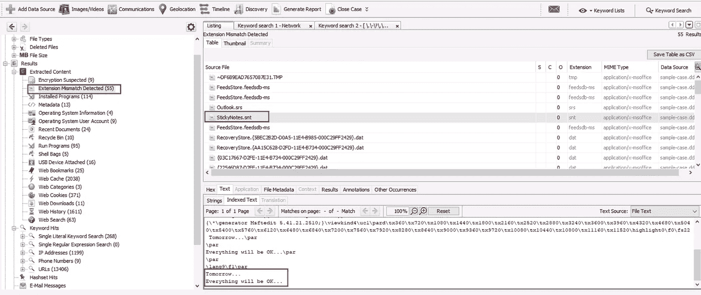

答案:明天…一切都会好的…

Q11)根据时间表，2015 年 1 月 12 日有多少结果？

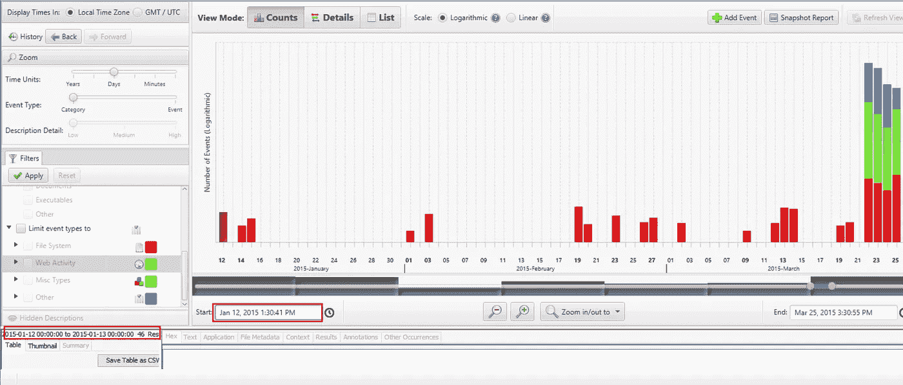

答:46

感谢您的阅读和支持