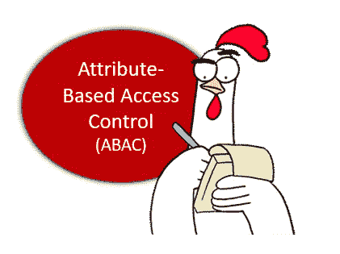
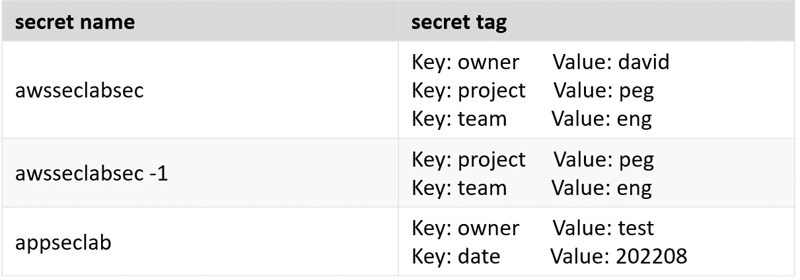
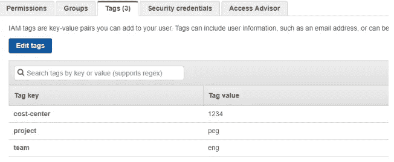
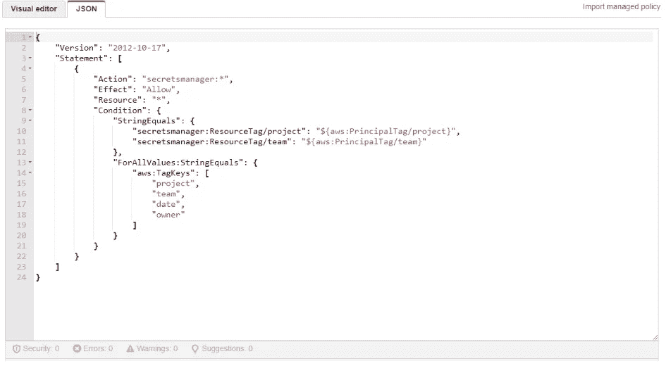
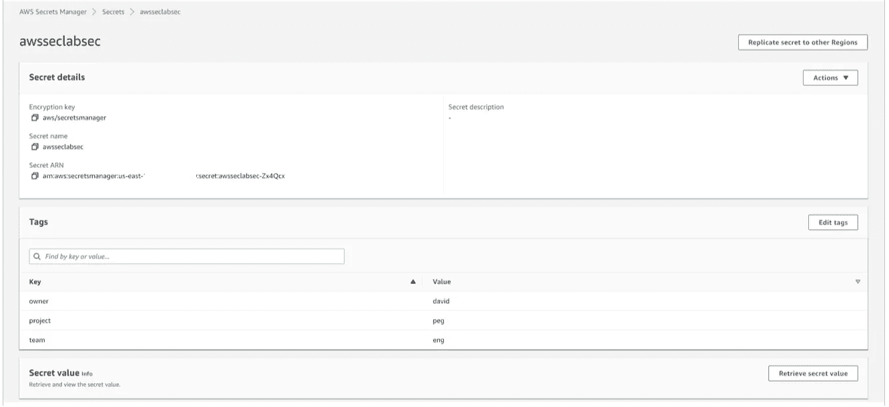
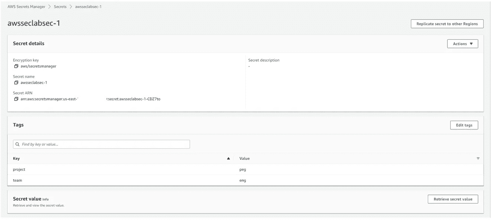
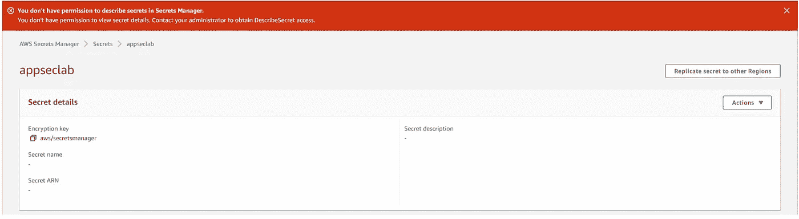
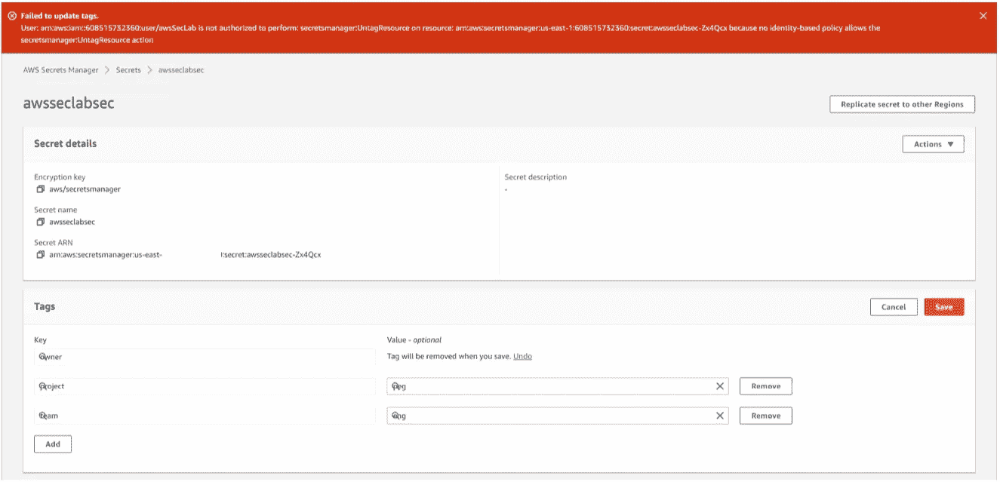

# 带标签的基于属性的访问控制(ABAC)

> 原文：<https://infosecwriteups.com/aws-attribute-based-access-control-abac-with-tags-f4340385011e?source=collection_archive---------3----------------------->

基于属性的访问控制(ABAC)是一种授权策略，用于管理对 AWS 资源的访问和权限。您或 AWS 可以将自定义属性标签分配给 AWS 资源。每个标记由两部分组成:标记键和标记值。两者都区分大小写。标签可用于按所有者、环境或其他标准对资源进行分类。通过使用将不同属性结合在一起的 ABAC 策略，标记还允许有条件地访问 AWS 资源。

这篇博文向您展示了如何在 AWS secrets manager 中使用标签来限制对机密的访问，以及如何限制用户使用允许的属性来标记/取消标记机密，因此希望您能够更好地了解如何使用标签来扩展对 ABAC 域中所有 AWS 资源的授权。

# 方案

AWS 秘密管理器中有 3 个秘密。作为一名经验丰富的 IAM 管理员，您希望限制 IAM 用户在 secrets manager 中访问他们自己的机密，IAM 用户只能添加或删除他们机密上的“date”标记。为了实现这一点，您决定使用 ABAC 策略，允许带有 principal 标记的 IAM 用户访问带有匹配标记的 secret。

# ABAC 实施

从 AWS secrets manager 开始，为这三个秘密添加标签。awsseclabsec 和 awsseclabsec-1 与项目 **peg** 和团队 **eng** 相关联。

下面列出了这三个带有附加标签的秘密:

一个名为 awsSecLab 的 IAM 用户在拥有项目 **peg** 的团队 **eng** 中，他需要访问 awsseclabsec 和 awsseclabsec-1 机密。因此，您将以下标记附加到 IAM 用户:

现在是时候制定 ABAC 政策了。要了解哪些标记条件键可以在策略中用于每个服务的操作和资源，请参见[AWS 服务的操作、资源和条件键](https://docs.aws.amazon.com/IAM/latest/UserGuide/reference_policies_actions-resources-contextkeys.html)。导航至机密管理器部分以获取更多详细信息。

为了确保 IAM 用户 awsSecLab 遵循您制定的秘密访问规则，您可以向 IAM 用户添加以下策略。

在创建策略中的条件部分时，您会发现对于像 DescribeSecret 这样的一些操作，在下面的条件键列中有**secrets manager:resource tag**/tag-key 和**AWS:resource tag**/$ { TagKey}。您可能会对这两个条件键之间的区别感到困惑，AWS 对它们的解释也很模糊。在实践中，我们发现，只要 AWS 支持指定的操作，它们就可以互换。

关于 aws:TagKeys 条件键，它只对 CreateSecret、TagResource 和 UntagResource 三个动作有效，不影响上面提到的 DescribeSecret 之类的其他动作。

# 验证 ABAC 战略

在将上述策略应用到 IAM 用户 AWS clab 之后，您让 IAM 用户 AWS clab 尝试一下。

**测试 1 —尝试在机密管理器中访问三个机密**

首先，IAM 用户访问他自己的秘密:awsseclabsec 和 awsseclabsec-1，一切都很好，因为这两个秘密都有匹配的标记:project=peg 和 team=eng 用于 DescribeSecret 操作。

但是当他试图访问 appseclab 时，由于不匹配的标记，尝试失败了。

错误消息“您没有权限在机密管理器中描述机密。您没有权限查看机密详细信息。请与您的管理员联系以获得 DescribeSecret 访问权限。出现在秘密的图形用户界面上。

**测试 2 —尝试更改 awsseclabsec 和 awsseclabsec-1 的标签**

IAM 用户希望从 awsseclabsec 中删除 owner 标记，但更新失败，因为策略不允许他标记 Resource/UntagResource，除非标记在标记关键字列表中:“project”、“team”、“date”。

他导航到 awsseclabsec-1 并试图将“date”标记添加到秘密中。操作成功，因为它符合权限策略。

# 摘要

现在你已经学会了如何使用标签来实现 ABAC。你对你的本金和资源实施了 ACAB 策略。如果你认为这篇博文有帮助，请点击拍手👏按钮下面几下，以示支持！

*来自 Infosec 的报道:Infosec 上每天都有很多事情发生，很难跟上。* [***加入我们的每周简讯***](https://weekly.infosecwriteups.com/) *以 5 篇文章、4 个线程、3 个视频、2 个 Github Repos 和工具以及 1 个工作提醒的形式免费获取所有最新的 Infosec 趋势！*