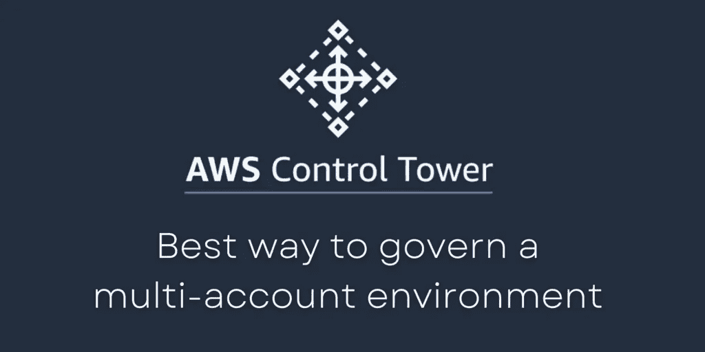
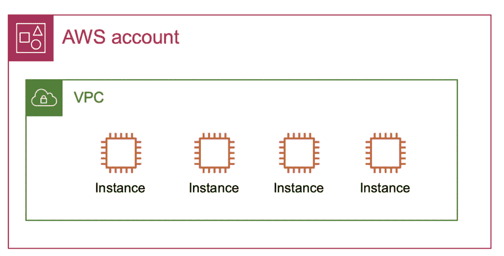
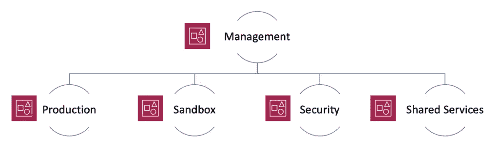
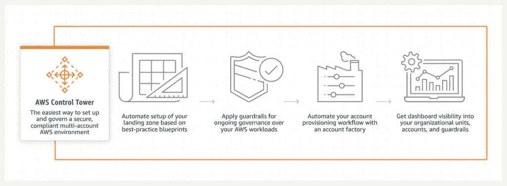
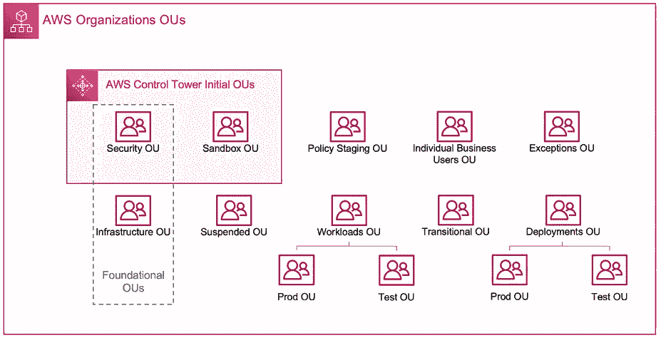
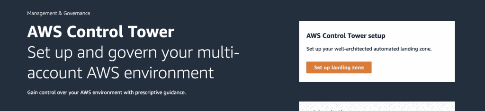
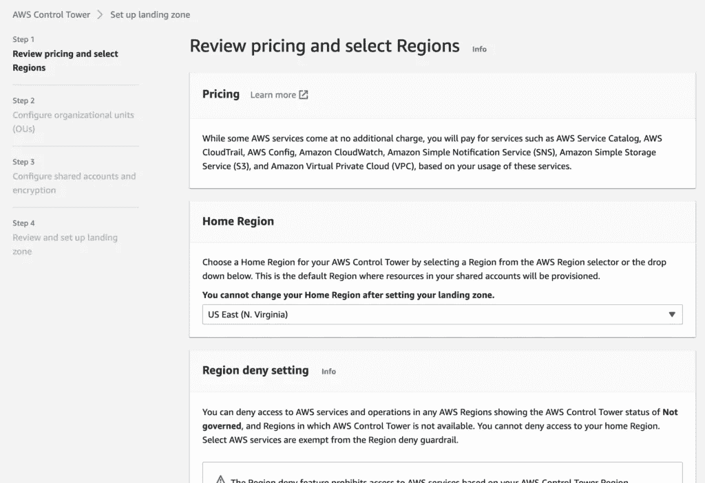
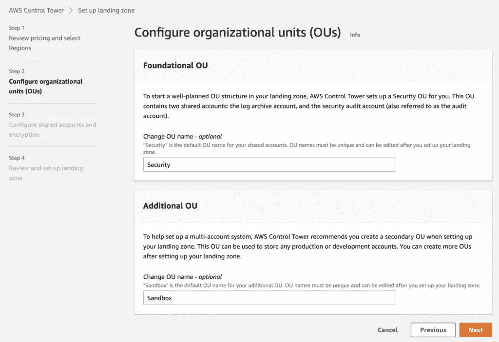
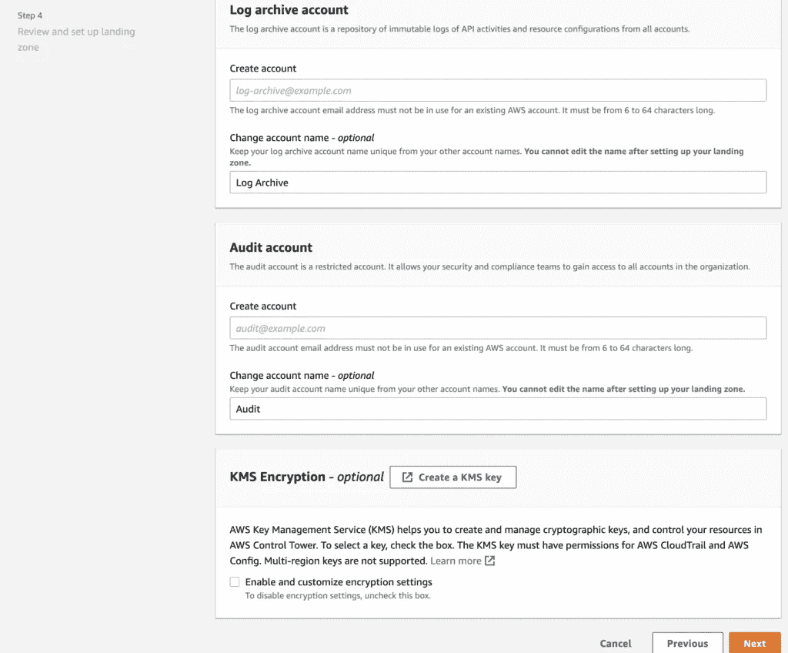
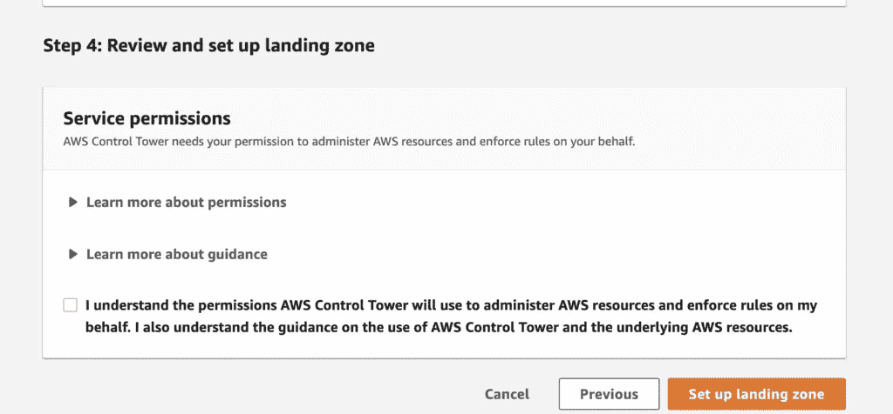

# AWS 控制塔—管理多帐户环境的最佳方式

> 原文：<https://infosecwriteups.com/aws-control-tower-the-best-way-to-govern-multi-account-environments-27a727a529dd?source=collection_archive---------1----------------------->

任何在云中工作过的人都知道，随着越来越多的工作负载被迁移，这种环境的复杂性会增加得多快。公司通常从小型非关键系统开始，但是一旦他们看到云的成本效益和威力，他们很快就想迁移其他业务系统。这对于必须实施控制来保护和管理多个 AWS 帐户的安全团队来说是一个挑战。值得庆幸的是，AWS 多年来一直是市场领导者，定期为其客户发布新的安全服务，AWS 控制塔就是最近的一个。

作为 AWS 控制塔以及它如何真正简化[云治理](https://www.youtube.com/watch?v=90Xsa6dzsWM&t=272s)的忠实粉丝，它认为深入了解这一产品的细节将是一个好主意。

# 多账户环境是如何诞生的

AWS 帐户就像是客户资源的边界或容器，允许他们在云中隔离工作负载并简化计费。默认情况下，AWS 帐户中的资源不能访问边界之外的资源，这种隔离在内部是不可能的。

客户通常从一个 AWS 帐户开始他们的云之旅，但随着更多系统的迁移，他们会快速创建更多帐户。遵循标准最佳实践，公司可以创建以下帐户进行集中治理:

*   一个管理帐户，用于管理所有其他帐户并整合计费和其他服务
*   容纳所有主要生产系统的生产帐户
*   一个沙盒帐户，开发者可以在这里玩和试验 AWS 服务
*   用于网络安全团队的安全帐户，对日志和其他安全服务具有只读访问权限。
*   一个共享服务帐户，遵循跨帐户使用的服务的中心辐射模型，例如日志存储、网络等。

可以想象，管理和保护这种多帐户设置的复杂性很快就成为团队管理的一件苦差事。安全团队希望确保治理控制或防护栏存在并集中管理，例如允许开发人员在沙盒帐户中进行管理访问，但在另一个帐户中进行只读访问。

以前的 [AWS 组织](https://aws.amazon.com/organizations/)是实现这一点的一个很好的方式，客户可以创建组织单位(ou)来按其特定功能对 AWS 帐户进行分组，并对其应用规则(类似于 Active Directory 的工作方式)。虽然 AWS 组织过去(现在)令人惊叹，但它仍然需要大量的手动工作来完成，这就是 AWS 控制塔的用武之地。

# AWS 控制塔前来救援！

**什么是控制塔？简单来说:**

AWS 控制塔是一种安全产品，它简化并自动化了许多之前讨论过的活动，并提供了一个按照安全最佳实践配置的*现成的多帐户 AWS 环境。*

如上所述，AWS 控制塔是设置和保护多帐户 AWS 环境(称为着陆区)的最快和最简单的方法。。它在幕后使用 AWS 组织，但自动化了许多流程并隐藏了复杂性。它是由 AWS 根据他们在云中保护成千上万客户的经验构建的，只需在控制台上点击几下就可以进行配置！

如果您是保护多个 AWS 帐户的新手，那么 Control Tower 绝对是一个很好的起点，因为您会安心，因为您知道环境从第一天起就符合最佳实践

# **自动气象站控制塔的特点和优点**

当您选择启用 AWS 控制塔时；您会得到以下内容:

着陆区:控制塔将创建一个符合最佳实践的预先配置的多账户环境。

**Guardrails** :关注安全性和合规性的自动化策略控制。预防性护栏将停止部署不符合策略的资源(例如，“在所有帐户中启用 AWS CloudTrail”)。检测护栏(例如，“检测是否允许对亚马逊 S3 存储桶的公共读取访问”)将警告不合规情况

**组织单元**:用于对账户进行分组治理。ou 上实施护栏(类似于活动目录策略)

**帐户工厂**:用于创建新帐户或注册您现有的 AWS 帐户

**单点登录(SSO)目录:**SSO 目录已设置，因此您可以使用一个身份登录多个 AWS 帐户，而不是使用多个 AWS 用户

最后，您将获得一个管理控制面板，以查看您的帐户遵守已安装的防护栏的情况。所有这一切只需点击一个按钮！

# 发射控制塔:

当您部署 AWS 控制塔时，它会创建三个帐户:管理帐户、审核帐户和日志归档帐户。

*   管理帐户—顾名思义，这是一个共享帐户，用于计费、通过帐户工厂提供帐户以及管理 ou 和 guardrails。
*   具有两个共享帐户的安全性 OU
*   审核帐户—根据 AWS *“审核帐户是一个受限帐户，旨在为您的安全和合规团队提供对您登录区内所有帐户的读写权限。从审计帐户，您可以通过编程访问审查帐户*
*   日志归档帐户—根据 AWS *“此帐户作为存储库，存储登录区中所有帐户的 API 活动和资源配置的日志”*
*   沙盒 OU —这将用于启动您的工作负载和使用 AWS 服务

因此，您的 AWS 帐户结构大致如下所示:

一旦启动并提供了上述内容，大多数组织将创建更多 AWS 帐户以实现更好的治理，使用 AWS 帐户工厂变得非常容易。您可能会得到如下所示的结构:

# 如何发射控制塔

部署非常简单，只需在控制台搜索中键入 if Control Tower，这将带您进入服务页面，然后单击设置着陆区:

您通常可以使用默认部分，然后单击下一步:

同下一页。

如果您愿意，可以更改安全和沙盒 ou 的名称，但我不建议这样做

在步骤 4 中，为您的日志归档和审计帐户选择电子邮件

(通常这是安全团队的电子邮件，并且必须是唯一的)

单击最后一个屏幕上的复选框，表示您了解 AWS 控制塔将执行的操作:

单击“确定”后，AWS 将开始部署 AWS 控制塔。通常需要大约 30 分钟的时间来准备好一切，并留意管理、日志存档和审计帐户上的电子邮件。您还会收到注册 AWS 单点登录的电子邮件。

要记住的一点是，AWS 控制塔是免费的，但它部署的服务不是如 AWS 配置，CloudTrail，S3，简单通知服务(SNS)等。您将根据您使用的内容付费，您可以在这里查看[。](https://aws.amazon.com/controltower/pricing/)

# AWS 控制塔是正确的选择

到现在为止，我希望你明白为什么我这么喜欢 AWS 控制塔，以及它提供的实际好处。如果您是一家大型企业，打算大规模使用 AWS，那么 Control Tower 是确保您的环境从第一天起就有一个安全基础的绝佳方式。

它还为业务团队提供了一种从 Account Factory 快速配置新 AWS 帐户的简单方法，同时安全团队可以放心，因为他们知道帐户将预先配置有安全最佳实践。

正如我多次提到的，安全自动化是云的主要优势之一，AWS 控制塔是实现这一点的最佳服务之一。

祝你的 AWS 控制塔之旅好运！

> *Taimur Ijlal 是一位* ***多次获奖的信息安全领导者*** *，在金融科技行业的网络安全和 IT 风险管理方面拥有 20 多年的国际经验。可以在*[*LinkedIn*](https://www.linkedin.com/in/taimurijlal/)*上或者在他的* [*博客*](https://cloudsec-guy.com/) *上连接 Taimur。他还有一个 YouTube 频道“* [*”云安全专家*](https://www.youtube.com/c/CloudSecurityGuy) *”，他定期在上面发布关于云安全、人工智能和一般网络安全职业建议的帖子。*
> 
> **如果你喜欢读这篇文章，那么考虑支持我，使用这个** [**链接**](https://taimurcloud123.medium.com/membership) 成为一个中等会员

## 来自 Infosec 的报道:Infosec 每天都有很多内容，很难跟上。[加入我们的每周简讯](https://weekly.infosecwriteups.com/)以 5 篇文章、4 个线程、3 个视频、2 个 GitHub Repos 和工具以及 1 个工作提醒的形式免费获取所有最新的 Infosec 趋势！